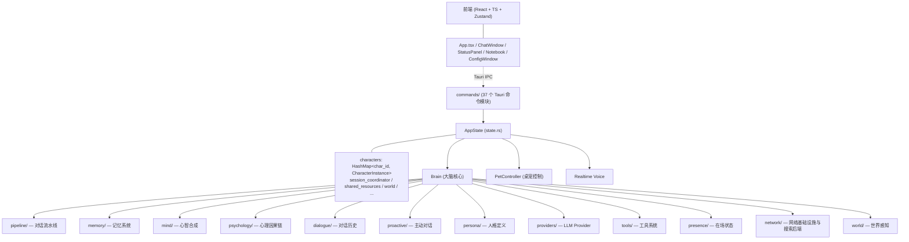

# Vivian 代码 Wiki

本文档为 Vivian 项目的代码架构百科，按模块层次组织，记录关键模块职责、核心数据结构、关键函数与跨模块数据流。配合 [README.md](file:///g:/vivian-rs/README.md) 使用——README 侧重功能特性，本 Wiki 侧重代码实现。

> 项目根目录：`g:\vivian-rs\`
> 后端入口：[`src-tauri/src/lib.rs`](file:///g:/vivian-rs/src-tauri/src/lib.rs)
> 前端入口：[`src/main.tsx`](file:///g:/vivian-rs/src/main.tsx) + [`src/App.tsx`](file:///g:/vivian-rs/src/App.tsx)

---

## 目录

- [顶层架构](#顶层架构)
- [核心数据结构](#核心数据结构)
- [模块详解](#模块详解)
  - [brain/ —— 大脑核心](#brain--大脑核心)
  - [pipeline/ —— 对话流水线](#pipeline--对话流水线)
  - [cross_character.rs —— 跨角色通信总线](#cross_characterrs--跨角色通信总线)
  - [conversation/ —— 会话生命周期](#conversation--会话生命周期)
  - [memory/ —— 三层记忆系统](#memory--三层记忆系统)
  - [mind/ —— 心智合成层](#mind--心智合成层)
  - [psychology/ —— 心理学因果链](#psychology--心理学因果链)
  - [proactive/ —— 主动对话编排](#proactive--主动对话编排)
  - [tools/ —— 工具系统](#tools--工具系统)
  - [providers/ —— 多 Provider 路由](#providers--多-provider-路由)
  - [notebook/ —— 笔记系统](#notebook--笔记系统)
  - [network/ —— 网络基础设施与搜索后端](#network--网络基础设施与搜索后端)
  - [world/ —— 真实世界感知](#world--真实世界感知)
  - [dialogue/ —— 对话历史管理](#dialogue--对话历史管理)
  - [engine/ —— Live2D 表现层](#engine--live2d-表现层)
  - [presence/ —— 在场状态与后台任务](#presence--在场状态与后台任务)
  - [speech/ —— 语音系统](#speech--语音系统)
  - [commands/ —— Tauri 命令层](#commands--tauri-命令层)
  - [remote/ —— 远程访问 HTTP 服务](#remote--远程访问-http-服务)
  - [persona/ —— 人格定义与场景](#persona--人格定义与场景)
  - [emotion/ —— 情绪分类](#emotion--情绪分类)
  - [utils/ —— 通用工具](#utils--通用工具)
- [关键数据流](#关键数据流)
- [持久化模式](#持久化模式)
- [并发与锁策略](#并发与锁策略)

---

## 顶层架构



#### 前端构建（多窗口按需加载）

桌宠由多个 Tauri 窗口组成（主 Live2D 窗口 / Chat / Memory / Config / Bubble / Toast / SideChat / MessageBanner 等），每个窗口通过 `?view=` 参数加载不同的 React 组件。

- **逐窗口动态 import**（[`src/main.tsx`](file:///g:/vivian-rs/src/main.tsx)）：`main.tsx` 不再静态导入全部窗口组件，而是按 `view` 参数对各自组件做 `await import(...)`。主窗口（无 view）只加载 App + Live2D 依赖链（pixi），不再打包 Chat / Memory / MindInspector / Config 等它用不到的代码，显著降低主窗口首帧解析量。
- **vendor 拆包**（[`vite.config.ts`](file:///g:/vivian-rs/vite.config.ts)）：`build.rollupOptions.output.manualChunks` 将稳定依赖拆成独立 chunk —— `react`（react/react-dom/zustand）、`tauri`（@tauri-apps）、`i18n`（i18next/react-i18next）、`pixi`（pixi.js/pixi-live2d-display，仅主窗口用）。多窗口共享这些 chunk 的高效缓存、并行加载。
- **target es2022**：WebView2 为常青 Chromium，无需为旧浏览器降级转译，减少产物体积。
- **按需 chunk 兜底**：其余依赖（echarts / mermaid / katex 等）保持 Vite 默认基于动态 import 的按需拆包，不合并成单一巨型 vendor 包（避免本来懒加载的库被提前加载）。

### CharacterInstance（角色实例）

定义于 [`state.rs`](file:///g:/vivian-rs/src-tauri/src/state.rs)。每个角色独立持有一份完整资源：

| 字段 | 类型 | 职责 |
|------|------|------|
| `id` | `String` | 角色 ID（`"vivian"` / `"nana"`） |
| `name` | `String` | 显示名称 |
| `brain` | `Arc<Brain>` | 大脑核心，持有 memory/dialogue/psychology/persona/proactive 等所有子系统 |
| `pet_controller` | `Arc<PetController>` | 桌宠控制器，管理 Live2D 窗口与状态机 |
| `manifest` | `Arc<ResourceManifest>` | 模型清单，表情/动作映射 |
| `realtime_voice` | `Arc<RealtimeVoice>` | 实时语音会话 |
| `think_lock` | `Arc<Mutex<()>>` | 思考互斥锁，串行化 think 调用 |
| `online` | `RwLock<bool>` | 在线状态 |

### AppState（全局状态）

```rust
pub struct AppState {
    pub characters: Arc<RwLock<HashMap<String, CharacterInstance>>>,
    pub active_character_id: RwLock<String>,
    pub session_coordinator: SessionCoordinator,         // 跨角色/用户/proactive turn 协调
    pub world: Arc<EnvironmentContext>,                  // 世界快照
    pub shared_resources: Arc<SharedResources>,          // 跨角色共享资源
    pub config: Arc<RwLock<Config>>,                     // 全局配置
    pub model_router: Arc<ModelRouter>,                  // LLM 路由矩阵
    pub tool_system: Arc<ToolSystem>,                    // 工具系统
    // ... 更多共享资源
}
```

---

## 核心数据结构

### ChatMessage（对话消息）

定义于 [`types/response.rs`](file:///g:/vivian-rs/src-tauri/src/types/response.rs)。

```rust
pub struct ChatMessage {
    pub role: String,         // "user" / "assistant" / "system"
    pub content: String,
    pub meta: Option<MessageMeta>,
}

pub struct MessageMeta {
    pub channel: String,           // "wechat" / "direct" / "proactive" / "cross_character"
    pub speaker: Option<String>,   // 说话者 ID
    pub listener: Option<String>,  // 听话者 ID
    pub timestamp: Option<f64>,
    pub images: Vec<MessageImage>,
    // ... 文件元数据 / 工具调用标记等
}
```

### AiResponse（LLM 响应）

```rust
pub struct AiResponse {
    pub text: String,
    pub intent: String,
    pub response_mode: String,     // speak / non_verbal / internal / ignore
    pub tool_calls: Vec<ToolCall>,
    pub expression: String,
    pub motion: String,
    pub control_actions: Vec<ControlAction>,
    // ...
}
```

### PipelineState（流水线状态）

定义于 [`pipeline/state.rs`](file:///g:/vivian-rs/src-tauri/src/pipeline/state.rs)。55 个字段贯穿全链，主要字段：

```rust
pub struct PipelineState {
    pub user_input: String,
    pub messages: Vec<ChatMessage>,           // 对话历史
    pub memory_text: String,                  // 检索后的记忆上下文
    pub world_brief: WorldBrief,              // 世界快照
    pub character_block: String,              // 人格块
    pub user_model_text: String,              // 用户认知模型文本（UserModel → PromptBuildingStep）
    pub tools: Vec<ToolSchema>,               // 可用工具
    pub response: Option<AiResponse>,         // LLM 响应
    pub metadata: PipelineMetadata,           // 跳过标志/检索结果等
    // ... 50+ 字段
}
```

### MemoryItem（记忆条目）

定义于 [`memory/types.rs`](file:///g:/vivian-rs/src-tauri/src/memory/types.rs)。

```rust
pub struct MemoryItem {
    pub id: String,
    pub content: String,
    pub memory_type: MemoryType,              // ShortTerm / MidTerm / LongTerm / Knowledge 等
    pub importance: f64,
    pub evidence_score: f64,                  // 证据驱动可信度
    pub created_at: f64,
    pub last_accessed: f64,
    pub tags: Vec<String>,
    pub metadata: serde_json::Value,          // speaker/listener/perspective 等元数据
    pub description: Option<String>,          // LLM 抽取的摘要
    pub protected: bool,                      // 永不归档
}
```

---

## 模块详解

### brain/ —— 大脑核心

[`brain/brain.rs`](file:///g:/vivian-rs/src-tauri/src/brain/brain.rs) 是角色的"大脑容器"，聚合所有子系统。

#### 核心方法

| 方法 | 职责 |
|------|------|
| `Brain::build(char_id, config, manifest)` | 构造 Brain，注入 manifest 到 4 个依赖（PsychologyManager / EmotionBridge / ResponseParsingRunnable / ExpressionManager） |
| `brain.think(user_input, stream)` | 用户对话主入口，调用 `think_inner(input, stream, false, true)` |
| `brain.think_cross_character(input, stream)` | 跨角色对话专用入口，跳过异步反思：`think_inner(input, stream, false, false)` |
| `brain.think_proactive(input, stream)` | 主动对话入口，跳过对话历史写入：`think_inner(input, stream, true, true)` |
| `brain.think_inner(input, stream, skip_dialogue_write, run_reflection)` | 内部统一实现，执行完整 pipeline |
| `brain.generate_startup_greeting()` | 生成启动问候。不再区分首次/回归分支，统一走完整对话流水线（`chain.ainvoke_greeting`）——与一般直接渠道对话同一套提示词（含记忆检索→种子记忆进入 prompt），仅在用户消息前加一句"这是首次见面"/"用户回来了"的提示。写入记忆库前自动补 `build_speaker_prefix(char_id, "user", char_id)` 前缀（`[I say to User]`），与主对话入库格式统一（`commands/engine.rs::try_wake_greeting` 的唤醒问候同样处理） |
| `chain.ainvoke_greeting(user_input)` | 启动问候专用流水线入口。走完整 `prepare_pipeline_state` + `execute_pipeline_and_build_response`（含记忆检索→种子记忆在场），但设置 `skip_memory_save` 门控让 UserMemorySavingRunnable / MemorySavingRunnable 跳过写入，避免把合成的问候指令当作用户消息污染记忆库。对话写回与记忆写入由调用方独立后处理 |

#### 子模块

| 文件 | 职责 |
|------|------|
| [`chat_chain.rs`](file:///g:/vivian-rs/src-tauri/src/brain/chat_chain.rs) | LangChain 风格 Runnable 链，拆分为 `prepare_pipeline_state` / `execute_pipeline_and_build_response` / `ainvoke` 三步 |
| [`async_reflection.rs`](file:///g:/vivian-rs/src-tauri/src/brain/async_reflection.rs) | 异步反思，每 5 轮或 30 分钟触发，合并意识更新与活动抽取 |
| [`augment_reply_service.rs`](file:///g:/vivian-rs/src-tauri/src/brain/augment_reply_service.rs) | 主对话后异步补充回复服务，slow 检索召回 fast 路径遗漏的重要记忆 |
| [`focus_mode.rs`](file:///g:/vivian-rs/src-tauri/src/brain/focus_mode.rs) | 凝神/专注模式状态机，漏桶累积器 + 迟滞设计 |
| [`rate_limiter.rs`](file:///g:/vivian-rs/src-tauri/src/brain/rate_limiter.rs) | Token bucket 限流器 |
| [`cognitive_tick.rs`](file:///g:/vivian-rs/src-tauri/src/brain/cognitive_tick.rs) | 认知 tick 运行器，每 5 分钟消费 `pending_conflicts` 队列 |
| [`tool_leak_filter.rs`](file:///g:/vivian-rs/src-tauri/src/brain/tool_leak_filter.rs) | 流式过滤 `<tool_call>` 等泄露标记 |
| [`topic_signal.rs`](file:///g:/vivian-rs/src-tauri/src/brain/topic_signal.rs) | 话题信号检测，驱动话题切换 |
| [`subagent_context.rs`](file:///g:/vivian-rs/src-tauri/src/brain/subagent_context.rs) | 子代理上下文，支持 LLM 调用其他角色 |

### pipeline/ —— 对话流水线

[`pipeline/`](file:///g:/vivian-rs/src-tauri/src/pipeline) 实现 LangChain 风格的 Runnable 流水线。

#### 流水线步骤

```
PreProcessing → UserMemorySaving → [QueryRewrite ∥ FastSemantic] → MemoryRetrieval → WebContext
    → PromptBuilding → Generation → ResponseParsing → Validation → ExpressionMotion
    → PsychologyInsight → MoodUpdate → MemorySaving
```

#### 核心文件

| 文件 | 职责 |
|------|------|
| [`base.rs`](file:///g:/vivian-rs/src-tauri/src/pipeline/base.rs) | `Runnable` trait 与组合子（`|` / `RunnableBranch` / `RunnableRetry` / `RunnableWithFallbacks`） |
| [`state.rs`](file:///g:/vivian-rs/src-tauri/src/pipeline/state.rs) | `PipelineState` 55 字段贯穿全链 |
| [`advisor.rs`](file:///g:/vivian-rs/src-tauri/src/pipeline/advisor.rs) | Advisor 拦截器链（日志/限流/Re2/循环检测） |
| [`prompt_modules.rs`](file:///g:/vivian-rs/src-tauri/src/pipeline/prompt_modules.rs) | Prompt 模块构建器，含 `build_memory_block`（记忆块+忠实度约束+时间感知指引）、`build_tools_block`、`build_agent_status_bar`（Agent 状态栏）等 |
| [`template_engine.rs`](file:///g:/vivian-rs/src-tauri/src/pipeline/template_engine.rs) | Tera 模板引擎，`section_schema()` 定义 section 元数据 |
| [`context_compress.rs`](file:///g:/vivian-rs/src-tauri/src/pipeline/context_compress.rs) | 多级上下文压缩（Soft Trim → 原子组丢弃 → Reminder）+ 上下文感知压缩（LLM 摘要工具结果） |
| [`compaction_reminder.rs`](file:///g:/vivian-rs/src-tauri/src/pipeline/compaction_reminder.rs) | 压缩后提醒，从丢弃消息提取活跃工具名与最后话题 |
| [`doom_loop.rs`](file:///g:/vivian-rs/src-tauri/src/pipeline/doom_loop.rs) | 死循环检测，追踪 `(tool_name, args)` 签名连续出现次数 |
| [`inline_tag_scanner.rs`](file:///g:/vivian-rs/src-tauri/src/pipeline/inline_tag_scanner.rs) | 内联标签扫描器，流式剥离 `<e>/<m>/<s>` 标签驱动 Live2D |

#### 关键函数

```rust
// prompt_modules.rs
pub fn build_memory_block(memory_text: &str, lang: &str) -> String
// 在记忆块末尾追加忠实度约束 + 时间感知指引：
// - 记忆可能过时，与用户矛盾时以用户为准
// - 每条记忆带时间戳，需与「## 你周围正在发生什么」中的当前时间对比
// - 区分已发生/正在发生/未来计划（"下周要做xx"那一周没到就是未来计划）

// prompt_modules.rs —— Agent 状态栏
pub fn build_agent_status_bar(messages: &[ChatMessage], user_input: &str, focus_active: bool) -> Option<String>
// 以 <agent_status> 键值对（当前时间 / 本次对话轮数 / 最近工具调用 / 专注模式）作为
// user-role 元消息追加在用户输入之后、紧邻生成位置；末尾附"读数 + 操作策略"成对指令。
// 计数由代码确定性维护，不依赖 LLM 统计。

// context_compress.rs —— 上下文感知压缩
pub async fn compress_conversation_context_aware(
    router: &ModelRouter, task_type: &str, messages: &mut Vec<ChatMessage>,
    threshold_tokens: usize, keep_recent: usize, query: &str,
) -> CompressResult
// 在确定性压缩之上，对被丢弃的工具调用组用 LLM 结合 query 生成针对性摘要（三语），
// 失败回退到确定性预览；分组/原子性/阈值逻辑与 compress_conversation 一致。
```

#### steps/ 子目录

| 文件 | 步骤 | 职责 |
|------|------|------|
| `pre_processing.rs` | PreProcessing | 输入预处理、speaker prefix 解析、channel 路由 |
| `query_rewrite.rs` | QueryRewrite | LLM 查询重写，含 `should_skip_retrieval` 启发式（跳过"嗯/你好/好的"等闲聊） |
| `fast_semantic_step.rs` | FastSemantic | 嵌入语义分类 + 同步计算认知知识需求评估（EpistemicAssessment），与 QueryRewrite 并行执行 |
| `memory.rs` | MemoryRetrieval | 混合检索 + 置信度标记 + Verifier 二分类过滤 + 多跳关联检索（注入 user_model 时展开关联话题二次召回）。同文件内 `UserMemorySavingRunnable` / `MemorySavingRunnable` 提供 `skip_memory_save` 元数据门控——启动问候等内部指令设置后跳过用户消息/AI 回复的记忆写回，避免合成的问候指令被当作真实用户消息污染记忆库 |
| `web_context.rs` | WebContext | 基于 KnowledgeDecision 驱动主动搜索，结果注入 prompt |
| `prompt.rs` | PromptBuilding | U 型注意力布局组装 prompt（含认知信号 + 主动搜索结果） |
| `generation.rs` | Generation | LLM 生成回复，`StreamEmitter` 推送 chunk |
| `validation.rs` | Validation | 空文本检测 + 长度截断 + 幻觉检测（注入对话历史防误报） |
| `reflection.rs` | ReflectionRunnable | 反思调用，产出表情/动作/control_actions + 心理状态 + world_update + goal_updates + evolution（自我进化） |
| `mood.rs` | MoodUpdate | 心理状态更新 |

#### WebContext —— 认知知识需求驱动的主动搜索

[`web_context.rs`](file:///g:/vivian-rs/src-tauri/src/pipeline/steps/web_context.rs) 基于认知知识需求评估（Epistemic Assessment）驱动主动搜索。Web Search 是认知能力而非用户显式调用的工具——当系统检测到用户输入可能需要外部知识验证时，在生成前预搜索，结果作为上下文注入 prompt。

**设计理念**：替代单一置信度阈值，转向多维知识需求评估。核心问题不是"我有多确定"，而是"为了给出可靠回答，是否需要从外部世界获得证据"。

**评估流程**：

1. **FastSemantic 阶段**（`fast_semantic.rs`）同步计算 `EpistemicAssessment`，产出四维评分：
   - `semantic_clarity`：语义清晰度（我理解用户在说什么吗？）
   - `factual_dependence`：外部事实依赖度（回答是否依赖外部事实？）
   - `temporal_sensitivity`：时效敏感性（事实是否可能随时间变化？）
   - `interpretation_risk`：解释风险（不搜索自行解释是否容易误解用户？）
   - `knowledge_gap`：知识缺口（模型是否有足够知识？）

2. **规则映射**（`evaluate_epistemic_state`，纯规则，不调用 LLM）：
   - 模糊指代（"那个瓜""你听说了"）→ 降低 clarity，提高 risk
   - 矛盾描述（"被"+"攻击"）→ 降低 clarity，提高 risk、factual
   - 网络梗/流行语 → 提高 risk、factual
   - 多专有名词组合 → 提高 gap、factual、risk
   - 时效性内容（"最近""今天"+非问候语）→ 提高 temporal、factual
   - 复杂问句（>15字+问号）→ 提高 factual、gap

3. **决策映射**（`KnowledgeDecision`）：
   ```
   temporal ≥ 0.7 → SearchRequired
   risk ≥ 0.7 → SearchRequired
   factual ≥ 0.7 && gap ≥ 0.5 → SearchRequired
   clarity < 0.4 → SearchPreferred
   factual ≥ 0.5 && temporal ≥ 0.3 → SearchPreferred
   factual ≥ 0.4 → SearchOptional
   其他 → NoSearch
   ```

4. **WebContext 步骤**读取 `state.epistemic_assessment`，在 `SearchRequired` / `SearchPreferred` 时执行搜索，结果写入 `PipelineState.web_context`。

5. **PromptBuilding 步骤**同时注入：
   - `epistemic_signals_section`：认知信号段落（"系统检测到用户输入可能存在以下特征"），让 LLM 感知是否需要搜索，辅助自主调用 `web_search` 工具
   - `proactive_search_section`：主动搜索结果（已搜索完成时注入），附带"不要假装本来就知道"的指导

与 LLM function calling 互补：预搜索在生成前完成，LLM 生成时仍可自主调用 `web_search` 工具做进一步搜索。

### cross_character.rs —— 跨角色通信总线

[`cross_character.rs`](file:///g:/vivian-rs/src-tauri/src/cross_character.rs) 实现角色间对话。

#### 核心结构

```rust
pub static CROSS_CHARACTER_BUS: Lazy<Arc<CrossCharacterBus>> = Lazy::new(|| ...);

pub struct CrossCharacterBus {
    app_handle: RwLock<Option<AppHandle>>,
}

pub struct CrossCharacterRequest {
    pub source_id: String,    // 发起方
    pub target_id: String,    // 接收方
    pub message: String,      // 源角色要说的话
    pub stream_id: String,    // 前端路由用
}

pub struct CrossCharacterReply {
    pub reply: String,                // 目标回复文本（仅 speak 模式非空）
    pub response_mode: String,        // speak / non_verbal / internal / ignore
    pub conv_state: String,           // active / cooling / closed / peer_busy / target_busy
    pub should_continue: bool,        // 是否建议源角色继续
    pub expression: String,
    pub motion: String,
}
```

#### `send()` 完整流程

```
1. 会话生命周期检查（start_or_continue）
   ├── 冷却中 → 直接返回 CrossCharacterReply{response_mode:"ignore"}
   └── 创建/继续会话 → 继续

2. 互锁检测
   ├── 源在 UserChat turn 且目标在 UserChat turn 或收到 pending_user → 返回 peer_busy
   └── 通过 → 继续

3. emit cross:start（通知前端对话开始）

4. 获取目标角色 think_lock（25s 超时）
   ├── 超时 → 返回 target_busy
   └── 获取成功 → 继续

5. TOCTOU 加固：获取锁后再次校验目标角色是否已进入 UserChat turn 或收到 pending_user
   └── 是 → 返回 peer_busy（注意只检查目标角色，源角色在 UserChat turn 内调用
        talk_to_character 是工具调用的正常语义，不构成死锁条件——死锁需要双方互相
        等待对方的锁，而源角色持有自己的 think_lock，目标 think_lock 已被获取，
        目标无法构成反向等待）

6. 切换 channel 为 cross_character
   session_coordinator.try_enter_cross_turn(target_id, conv.id, memory, dialogue)
   ├── 用户输入等待中 → 返回 user_input_pending
   └── 成功 → 继续

7. 构造合成输入：
   - 主体：[源角色名 says to me] 消息内容
   - 记忆锚点：从 unified_event_ledger 检索 A↔B 最近 2-4 条事件
   - 交接上下文：build_handoff_context（源情绪/疲劳度/最近对话/亲密度）
   - 共同观察：activity_journal.to_brief()
   - 轮次提醒：WARN_ROUNDS 提示收尾 / MAX_ROUNDS 强制结束

8. brain.think_cross_character(synthesized_input, stream=true)
   └── 流式 chunk 通过 cross:chunk 事件推送

9. 会话状态更新：update_after_round(response_mode, text, message)

10. emit cross:done（含 final_text / response_mode / conv_state / should_continue）

11. 源角色记忆持久化：
    - dialogue_add_with_meta：写入源角色发言（assistant）+ 目标反馈（user）
    - add_memory_with_metadata：合并写入 1 条 CasualConversation 记忆
      （带 short_term 标签 + speaker/listener/perspective 元数据）
    - 目标角色补写 1 条对称记忆

12. 关系日志 + SocialState 数值更新 + 关系认知事实抽取（每 3 轮一次）

13. 更新双方 LAST_SPOKEN / LAST_SPOKEN_TEXT
```

#### 关键函数

| 函数 | 职责 |
|------|------|
| `build_handoff_context(source_brain, target_brain, target_id, reason)` | 构建交接上下文包（源情绪/疲劳/最近对话/亲密度） |
| `HandoffContext::render(source_name)` | 渲染为 prompt 注入文本 |
| `build_speaker_prefix(speaker, listener, char_id)` | 构造 `[I say to User]` / `[User says to me]` 前缀 |
| `parse_any_speaker_prefix(text)` | 解析任意说话者前缀（支持第一/第三人称/旁观） |
| `strip_memory_anchor(text)` | 剥离合成输入尾部的 `[近期你们的话题]` 等锚点脚手架 |
| `roommate_status_text(source_id, lang)` | 生成室友 Public State prompt 段落 |
| `roommate_cognitive_text(source_id, lang)` | 生成室友行为印象（注意力/活动/目标/社交意愿） |

### conversation/ —— 会话生命周期

[`conversation/`](file:///g:/vivian-rs/src-tauri/src/conversation) 把所有对话建模为有生命周期的会话对象。

#### 状态机

```
Created → Active → Cooling → Closed
              ↑       │
              └───────┘
              抢救（score ≥ 0.8）
```

#### 核心文件

| 文件 | 职责 |
|------|------|
| [`manager.rs`](file:///g:/vivian-rs/src-tauri/src/conversation/manager.rs) | `CONVERSATION_MANAGER` 全局单例，管理所有会话 |
| [`session.rs`](file:///g:/vivian-rs/src-tauri/src/conversation/session.rs) | `Conversation` 会话对象，含状态机与评分公式 |
| [`evaluator.rs`](file:///g:/vivian-rs/src-tauri/src/conversation/evaluator.rs) | Novelty/Energy/Continuation 评分计算 |
| [`integrity.rs`](file:///g:/vivian-rs/src-tauri/src/conversation/integrity.rs) | 对话完整性修复，扫描孤立 tool_call 插入合成 tool_result |

#### ResponseMode

```rust
pub enum ResponseMode {
    Speak,        // 正常回复（生成文本）
    NonVerbal,    // 只做动作/表情
    Internal,     // 只更新内部想法/记忆
    Ignore,       // 完全忽略
}
```

#### 评分公式

- **Novelty**（新信息密度）：问号 +0.3 / 长度 >10 字 +0.2 / >30 字 +0.2 / jieba 实词 >3 +0.3 / 回复 >15 字 +0.1
- **Energy**：Speak +0.1+ΔNovelty×0.3 / NonVerbal -0.05 / Internal -0.02 / Ignore -0.3
- **Continuation**：0.3 + Novelty 加成 + Energy 加成 - 轮次衰减 - 低能量惩罚

### memory/ —— 三层记忆系统

[`memory/`](file:///g:/vivian-rs/src-tauri/src/memory) 统一管理短期/中期/长期记忆。

#### 核心文件

| 文件 | 职责 |
|------|------|
| [`manager.rs`](file:///g:/vivian-rs/src-tauri/src/memory/manager.rs) | `MemoryManager` 主入口，按 char_id 路由；含种子记忆解析（`parse_seed_file` / `seed_from_file`） |
| [`pipeline.rs`](file:///g:/vivian-rs/src-tauri/src/memory/pipeline.rs) | 巩固流水线 ShortTerm → MidTerm → LongTerm → Insight；Stage 3.5 概念归并（Insight → UserModel + 图谱） |
| [`consolidation.rs`](file:///g:/vivian-rs/src-tauri/src/memory/consolidation.rs) | 夜间睡眠巩固 |
| [`retriever.rs`](file:///g:/vivian-rs/src-tauri/src/memory/retriever.rs) | 混合检索（BM25 + 向量 + RRF 融合 + 实体/专名多路补充召回 + 语义去重）；`MemoryRetrievalFilter` 结构化预过滤（memory_type/tags/时间窗口）；检索评测集（hit@k / MRR）。**BM25 分词缓存**：以 `memory_id` 为 key 的全局有界缓存（上限 8000 条），值为 `(内容指纹, 词频表+总词数)`，指纹由 content/tags/description 哈希得到，内容变更自动重算，避免每次对话重复 jieba 分词 |
| [`strategy.rs`](file:///g:/vivian-rs/src-tauri/src/memory/strategy.rs) | 三档检索策略（Auto/Vector/Hybrid）+ Knowledge 时间衰减 |
| [`reranker.rs`](file:///g:/vivian-rs/src-tauri/src/memory/reranker.rs) | 独立精排（cross-encoder reranker）：`Reranker` trait + `OllamaRerankClient`（本地 Ollama `/api/rerank`）+ `NoopReranker` 回退；精排失败静默回退不阻塞检索 |
| [`embedding_registry.rs`](file:///g:/vivian-rs/src-tauri/src/memory/embedding_registry.rs) | 嵌入模型注册表：内置已知模型元数据（dimension/source），`build_embedding` 自动校正维度，避免错配反复重建索引 |
| [`qdrant.rs`](file:///g:/vivian-rs/src-tauri/src/memory/qdrant.rs) | 外部向量库（Qdrant）REST 客户端：collection/HNSW 管理、带元数据过滤检索、upsert/delete/count/滚动读取 |
| [`lifecycle.rs`](file:///g:/vivian-rs/src-tauri/src/memory/lifecycle.rs) | 记忆生命周期统一评估：`health_score`（0..1，evidence/importance/recency/usage 加权）+ `HealthGrade` 分级 + `plan_compression` 压缩预算规划 |
| [`graph_store.rs`](file:///g:/vivian-rs/src-tauri/src/memory/graph_store.rs) | 知识图谱（实体 + typed edges + BFS fanout）；支持 `EntityType::Concept` 概念实体（`ingest_concepts` / `find_concept_memories`） |
| [`evidence.rs`](file:///g:/vivian-rs/src-tauri/src/memory/evidence.rs) | 证据驱动可信度（reinforcement/disputation 双时钟衰减） |
| [`retention.rs`](file:///g:/vivian-rs/src-tauri/src/memory/retention.rs) | 保留策略 + 归档倒计时 |
| [`conflict.rs`](file:///g:/vivian-rs/src-tauri/src/memory/conflict.rs) | 冲突检测三阶段流水线（语义相似度 → LLM 判定 → 合并/覆盖） |
| [`event_log.rs`](file:///g:/vivian-rs/src-tauri/src/memory/event_log.rs) | 事件溯源 append-only 日志 |
| [`unified_event_ledger.rs`](file:///g:/vivian-rs/src-tauri/src/memory/unified_event_ledger.rs) | 统一事件账本，跨角色共享事件索引 |
| [`verifier.rs`](file:///g:/vivian-rs/src-tauri/src/memory/verifier.rs) | 检索后小模型二分类过滤无关记忆 |
| [`llm_enricher.rs`](file:///g:/vivian-rs/src-tauri/src/memory/llm_enricher.rs) | 写入时 LLM 抽取元数据 |
| [`auto_extractor.rs`](file:///g:/vivian-rs/src-tauri/src/memory/auto_extractor.rs) | 从对话自动抽取长期事实 |
| [`user_facts.rs`](file:///g:/vivian-rs/src-tauri/src/memory/user_facts.rs) | 用户事实画像（L0/L0.5/L1/L2 四层） |
| [`user_model.rs`](file:///g:/vivian-rs/src-tauri/src/memory/user_model.rs) | 用户认知模型（UserTrait/UserGoal/UserProject，证据驱动更新）；概念层归并（`merge_concept`） |
| [`session_compressor.rs`](file:///g:/vivian-rs/src-tauri/src/memory/session_compressor.rs) | 会话记忆压缩，注入 `[CONVERSATION RECAP]` |
| [`ivf_index.rs`](file:///g:/vivian-rs/src-tauri/src/memory/ivf_index.rs) | IVF 倒排索引（k-means 聚类加速） |
| [`vector_search.rs`](file:///g:/vivian-rs/src-tauri/src/memory/vector_search.rs) | 向量存储，后端可切换：内置 sqlite-vec（默认，零依赖）或外部 Qdrant（`open_configured` 按配置选择）；含 `model` 列支持增量/断点续传重建；`MemoryVectorStore` 各方法按后端路由 |

#### MemoryType 枚举

```rust
pub enum MemoryType {
    ShortTerm,           // 短期记忆
    MidTerm,             // 中期记忆
    LongTerm,            // 长期记忆
    SessionSummary,      // 会话摘要
    Insight,             // 反思洞察
    InnerMonologue,      // 内心独白
    ObservationNote,     // 旁观观察
    CasualConversation,  // 闲聊
    Knowledge,           // 知识文档（带 TTL）
    UserFact,            // 用户事实
}
```

#### 角色前史解析（`manager.rs`）

角色前史是首次启动（或记忆被清空）时写入的角色专属记忆，定义在 `src-tauri/prompts/characters/<char_id>/seed_memories.md`，每个角色约 40 条，覆盖世界观锚点 / 身份觉醒 / 个人兴趣与习惯 / 性格弱点 / 跨角色关系里程碑 / 日常碎片 / 内部梗与共同秘密 7 类。叙事重心在角色自身（创造者仅在前 2 条出现），60%+ 的记忆为角色独处或两人日常；时间非线性，包含"后来……"式历史沉淀记忆。Vivian 与 Nana 两份文件的共同经历条目成对镜像（同一事件各自视角），覆盖完整关系时间轴：第一次见面 → 试探 → 第一次合作 → 第一次争吵 → 和好 → 共同失败 → 内部梗 → 只有两人知道的固定私称 → 一起被"搬进用户电脑"。

记忆按 `protected` 字段分级：`protected: true`（世界观、核心关系、身份锚点）永不被归档；`protected: false`（日常碎片、内部梗、缺点、无意义小事）可被正常检索但不强制注入上下文，随真实用户记忆增长而衰减。

**播种时机**（`seed_if_empty`）：仅在存储中完全没有种子记忆时（首次启动 / `clear_all_memories` 清空后）从文件播种；之后种子记忆连同向量索引与积累的 `visit_count`/`heat_score` 等状态一并持久化，每次启动不重建，避免重复计算嵌入并保留检索热度与生命周期状态。

| 函数 | 职责 |
|------|------|
| `parse_seed_file(char_id)` | 解析前史 Markdown 文件。采用 front-matter 双 `---` 分隔格式（第一条 `---` 开启条目 → 字段区收集 `description`/`type`/`importance`/`protected`/`tags` → 第二条 `---` 进入内容区 → 下一条 `---` 结束条目），多行内容保留换行符（`push('\n')`），与正式记忆写入格式一致 |
| `seed_from_file(char_id)` | 从文件创建 `MemoryItem` 实例。对 `tags` 含 `cross_character` 的前史记忆，自动注入 `channel: "cross_character"`、`speaker: char_id`、`listener`（对方角色 ID）、`perspective: "speaker"` 元数据，确保与正式跨角色对话记忆在检索时的元数据完全对齐 |

**前史 Markdown 格式示例**：
```markdown
---
description: 谁更聪明
type: casual_conversation
importance: 0.65
protected: true
tags: backstory, vivian, shared_memory, relationship, cross_character
---
AlenTinn 有一次问我们："你们两个谁更聪明？"
[I say to Nana] 当然是我
[Nana says to me] 你上次把自己的名字拼错了
[I say to Nana] 那是测试
[Nana says to me] 你测试了三个小时
[I say to Nana] ……闭嘴
```

跨角色对话使用 `build_speaker_prefix` 定义的统一前缀格式（`[I say to ...]` / `[... says to me]`），与正式对话历史中的说话者标记一致。

#### 用户认知模型（`user_model.rs`）

[`user_model.rs`](file:///g:/vivian-rs/src-tauri/src/memory/user_model.rs) 在记忆系统之上新增一层"对这个人的稳定理解"——把碎片化的记忆证据组织成用户特征、目标、项目的结构化认知模型。

**核心数据结构**：

```rust
/// 用户特征（稳定的抽象理解）
pub struct UserTrait {
    pub category: UserTraitCategory,     // Personality / Preference / Skill / Behavior / Value / Communication
    pub key: String,                     // 特征键（如 "ui_style", "engineering_vs_research"）
    pub value: String,                   // 特征值（如 "custom_css", "engineering"）
    pub meaning: String,                 // 概念含义：一句话说明"用户长期在乎什么 / 为什么"（概念层语义表达）
    pub confidence: f64,                 // 综合置信度 [0.0, 1.0]
    pub stability: f64,                  // 稳定性 [0.0, 1.0]（区分"现在喜欢"和"长期稳定"）
    pub importance: f64,                 // 重要性 [0.0, 1.0]
    pub scope: String,                   // 适用范围（如 "project:vivian", "frontend", "global"）
    pub evidence_ids: Vec<String>,       // 证据记忆 ID 列表（可反向追溯）
    pub related_topics: Vec<String>,     // 关联话题（多跳检索锚点，如 agent_autonomy → [proactive, inner_monologue, web_search]）
    pub lifecycle: TraitLifecycle,       // Emerging / Active / Stable / Fading / Contradicted
    pub evidence_count: u32,             // 证据计数
    pub contradiction_count: u32,        // 矛盾证据计数
}

/// 用户目标
pub struct UserGoal {
    pub id: String,
    pub description: String,             // 目标描述
    pub deadline: Option<f64>,           // 截止时间戳
    pub priority: f64,                   // 优先级 [0.0, 1.0]
    pub status: GoalStatus,              // Active / Paused / Completed / Abandoned
    pub source_quote: Option<String>,    // 用户原话引用（防幻觉）
    pub evidence_ids: Vec<String>,
}

/// 用户项目
pub struct UserProject {
    pub name: String,
    pub description: String,
    pub tags: Vec<String>,
    pub status: ProjectStatus,           // Active / Paused / Completed / Dormant
    pub activation: f64,                 // 动态激活度（话题匹配 × 时间衰减）
    pub last_mentioned: f64,             // 最后提及时间
}
```

**设计要点**：

| 特性 | 说明 |
|------|------|
| **证据驱动更新** | 强证据（`detect_strong_evidence`：用户明确陈述"我喜欢/我习惯/我是"）直接更新模型；弱证据（`detect_weak_evidence`：用户行为暗示）进入 CandidateTrait 候选池，累积到阈值后提升为正式特征 |
| **零 LLM 开销** | 证据检测基于规则匹配（关键词/模式），不调用 LLM |
| **Trait 生命周期** | 5 阶段自动流转：Emerging（新出现）→ Active（活跃）→ Stable（稳定）→ Fading（衰减）→ Contradicted（矛盾），各阶段阈值可调 |
| **项目激活度** | `update_project_activations()` 基于话题标签匹配度 + 时间衰减（30 天半衰期）动态计算，高激活度项目优先出现在 prompt 中 |
| **多跳关联检索** | `expand_related_topics()` 根据当前话题命中特征/项目后展开关联话题；`MemoryRetrievalStep` 用展开话题二次召回"概念相关但字面不相似"的旧记忆并合并，实现跨关联召回 |
| **概念层归并** | `UserModel::merge_concept` 把 LLM 归纳的概念写入模型：同名强化（合并 meaning/related_topics/evidence、strength 上浮封顶 0.95）、异名新建（category=Value）；由 `ConsolidationPipeline::stage3_concept`（Stage 3.5）在 Insight 生成后调用 |
| **概念写入图谱** | `stage3_concept` 同时调用 `KnowledgeGraph::ingest_concepts`，把概念名作为 `EntityType::Concept` 实体 + related_topics 边写入图谱，成为跨主题检索锚点 |
| **图谱概念路** | query 话题词经 `KnowledgeGraph::find_concept_memories` 命中 Concept 实体，按 ID（`MemoryManager::get_memories_by_ids`）取回该概念支撑的 evidence 记忆 |
| **结果侧回跳** | `MemoryRetrievalStep` 基础命中后，用命中记忆的 `topic:`/`concept:` 标签作为第二跳种子再次检索合并 |
| **共现关联构建** | `associate_active_traits_with_topics()` 把当前话题关联进最近更新特征（10 分钟窗口 + 去重），让关联随真实对话积累 |
| **Prompt 注入** | `format_for_prompt()` 产出"我对你的了解"自然语言段落，注入 `user_model_section`（位于 memory_text 之后、epistemic_signals 之前） |
| **与 UserFacts 互补** | UserFacts 是"用户已知的事实数据"（L0-L2 四层），UserModel 是"角色对用户的认知理解"（特征/目标/项目），两者数据源不同、用途不同，相互补充 |
| **持久化** | 按角色隔离存储到 `characters/<char_id>/user_model.json`，`UserModelManager` 管理加载/保存/更新 |

**集成路径**：

```
chat_chain.rs 中 pipeline 执行前：
  ├── UserModelManager::new(char_id, path) → 加载/创建
  ├── update_project_activations(&topic_labels) → 更新项目激活度
  ├── associate_active_traits_with_topics(&topic_labels, 600s) → 共现关联构建
  └── format_for_prompt(&lang) → 设置 state.user_model_text

MemoryRetrievalStep（注入 user_model）：
  ├── 基础检索（向量 Top-K → MemoryFilter）
  ├── collect_query_terms(&state) → FastSemantic 话题标签（不足时用户输入分词）
  ├── user_model.expand_related_topics(terms) → 命中特征/项目后展开关联话题（查询侧多跳）
  ├── knowledge_graph.find_concept_memories(terms) → 图谱概念路，按 ID 取回概念记忆
  ├── 用命中记忆的 topic:/concept: 标签作为第二跳种子再次检索（结果侧回跳）
  └── 三条关联路结果按 id 去重合并 → 进入 verifier/attention/截断

AutoExtractor 中：
  └── detect_strong_evidence(user_input, user_model) → 强证据直接更新模型

L1 近期状态同步：
  └── current_projects 自动注册到 UserModel.upsert_project()

ConsolidationPipeline（chat_chain 构造后 set_user_model 注入）：
  └── Stage 3 生成 Insight → Stage 3.5 stage3_concept → merge_concept 归并入 UserModel
      → ingest_concepts 写入图谱 Concept 实体 → save_to_disk
```

### mind/ —— 心智合成层

[`mind/`](file:///g:/vivian-rs/src-tauri/src/mind) 在 World / Memory / Reflection 之间增加状态合成层。

| 文件 | 职责 |
|------|------|
| [`mind.rs`](file:///g:/vivian-rs/src-tauri/src/mind/mind.rs) | `Mind` 结构体，聚合 BeliefStore / GoalStore / AttentionStore / UserGoalLedger / `social_urge: Arc<RwLock<f32>>`（角色"想主动搭话"的冲动强度，由 thought_synthesis 写入，proactive 读取做双向门控） |
| [`attention.rs`](file:///g:/vivian-rs/src-tauri/src/mind/attention.rs) | 注意力焦点管理 |
| [`belief.rs`](file:///g:/vivian-rs/src-tauri/src/mind/belief.rs) | 信念存储 |
| [`belief_generator.rs`](file:///g:/vivian-rs/src-tauri/src/mind/belief_generator.rs) | LLM 生成信念 |
| [`goal.rs`](file:///g:/vivian-rs/src-tauri/src/mind/goal.rs) | 目标管理 |
| [`current_activity.rs`](file:///g:/vivian-rs/src-tauri/src/mind/current_activity.rs) | 当前活动状态（Talking/Focusing/Observing/Thinking 等） |
| [`reasoning_trace.rs`](file:///g:/vivian-rs/src-tauri/src/mind/reasoning_trace.rs) | 推理轨迹记录 |
| [`temporal_context.rs`](file:///g:/vivian-rs/src-tauri/src/mind/temporal_context.rs) | 时间关系合成器（零 LLM 调用合成关系型时间事实） |
| [`thought_synthesis.rs`](file:///g:/vivian-rs/src-tauri/src/mind/thought_synthesis.rs) | 思维合成（每 60s 调 LLM 输出 JSON `{ thought, social_urge }`，social_urge 0-1 表示角色想主动搭话的冲动，写入 `Mind.social_urge` 供 proactive 双向门控使用，零额外 LLM 成本） |
| [`user_cognition.rs`](file:///g:/vivian-rs/src-tauri/src/mind/user_cognition.rs) | 用户认知 |
| [`user_goals.rs`](file:///g:/vivian-rs/src-tauri/src/mind/user_goals.rs) | 用户长期目标账本 |
| [`working_memory.rs`](file:///g:/vivian-rs/src-tauri/src/mind/working_memory.rs) | 工作记忆 |

### psychology/ —— 心理学因果链

[`psychology/`](file:///g:/vivian-rs/src-tauri/src/psychology) 实现五层因果链。

```
Persona → Needs → Appraisal → Emotion → BehaviorDrive → 行为决策 + Mood + PetState
```

| 文件 | 职责 |
|------|------|
| [`manager.rs`](file:///g:/vivian-rs/src-tauri/src/psychology/manager.rs) | `PsychologyManager` 主入口 |
| [`persona.rs`](file:///g:/vivian-rs/src-tauri/src/psychology/persona.rs) | 长期人格 |
| [`needs.rs`](file:///g:/vivian-rs/src-tauri/src/psychology/needs.rs) | 5 项需求 + set point + Homeostasis |
| [`homeostasis.rs`](file:///g:/vivian-rs/src-tauri/src/psychology/homeostasis.rs) | 平衡引擎 + 昼夜节律调制 |
| [`appraisal.rs`](file:///g:/vivian-rs/src-tauri/src/psychology/appraisal.rs) | 6 项评价 |
| [`emotion.rs`](file:///g:/vivian-rs/src-tauri/src/psychology/emotion.rs) | 7 类唯一情绪枚举 |
| [`behavior_drive.rs`](file:///g:/vivian-rs/src-tauri/src/psychology/behavior_drive.rs) | 8 项行为驱动 |
| [`mood.rs`](file:///g:/vivian-rs/src-tauri/src/psychology/mood.rs) | 心情计算（实时，仅 UI） |
| [`relationship.rs`](file:///g:/vivian-rs/src-tauri/src/psychology/relationship.rs) | 关系系统（阶段状态机 + 5 种事件 + 里程碑） |
| [`social_state.rs`](file:///g:/vivian-rs/src-tauri/src/psychology/social_state.rs) | A↔B 双向关系数值 |
| [`relationship_facts.rs`](file:///g:/vivian-rs/src-tauri/src/psychology/relationship_facts.rs) | 关系认知事实（"A 眼中的 B"陈述性认知） |
| [`relationship_log.rs`](file:///g:/vivian-rs/src-tauri/src/psychology/relationship_log.rs) | 关系演化日志 |
| [`pet_state.rs`](file:///g:/vivian-rs/src-tauri/src/psychology/pet_state.rs) | 桌宠状态枚举 |
| [`mood_cue.rs`](file:///g:/vivian-rs/src-tauri/src/psychology/mood_cue.rs) | 心情提示 |

### proactive/ —— 主动对话编排

[`proactive/`](file:///g:/vivian-rs/src-tauri/src/proactive) 实现自适应间隔 tick 调度的主动行为。

| 文件 | 职责 |
|------|------|
| [`mod.rs`](file:///g:/vivian-rs/src-tauri/src/proactive/mod.rs) | `ProactiveOrchestrator` 主入口；含 `format_elapsed_lang` / `format_relative_time_lang` 多语言时长格式化（中/英/日），记忆检索与对话历史格式化时注入相对时间标注 |
| [`triggers.rs`](file:///g:/vivian-rs/src-tauri/src/proactive/triggers.rs) | 13 种触发器（HourlyGreeting / IdleGreeting / TeasingResponse / Icebreaker / WindowTrigger / TopicExtension / MemoryRecall / HealthReminder / Spontaneous / WelcomeBack / MoodDriven / CrossCharacterReply / BystanderInterjection） |
| [`timing.rs`](file:///g:/vivian-rs/src-tauri/src/proactive/timing.rs) | 时机判断 |
| [`behavior.rs`](file:///g:/vivian-rs/src-tauri/src/proactive/behavior.rs) | 角色行为参数（Vivian 傲娇慢热 / Nana 温柔热情） |
| [`behavior_modes.rs`](file:///g:/vivian-rs/src-tauri/src/proactive/behavior_modes.rs) | 行为模式 |
| [`mind_state.rs`](file:///g:/vivian-rs/src-tauri/src/proactive/mind_state.rs) | 9 种心理状态（PetMindState） |
| [`icebreaker.rs`](file:///g:/vivian-rs/src-tauri/src/proactive/icebreaker.rs) | 多级破冰（`build_messages` 接收 `idle_seconds` 参数，场景描述注入具体空闲时长如"用户离开了 1小时23分钟"） |
| [`inner_monologue.rs`](file:///g:/vivian-rs/src-tauri/src/proactive/inner_monologue.rs) | 内心独白生成（30 分钟冷却） |
| [`activity_journal.rs`](file:///g:/vivian-rs/src-tauri/src/proactive/activity_journal.rs) | 用户活动日志（后台线程每 5 秒轮询前台窗口） |
| [`thought_lifecycle.rs`](file:///g:/vivian-rs/src-tauri/src/proactive/thought_lifecycle.rs) | 思绪生命周期（Seed→Growing→Active→Expressed→Faded） |
| [`thought_trigger.rs`](file:///g:/vivian-rs/src-tauri/src/proactive/thought_trigger.rs) | 14 类思绪种子触发 |
| [`preference_learner.rs`](file:///g:/vivian-rs/src-tauri/src/proactive/preference_learner.rs) | per-trigger EWMA 偏好学习 |
| [`habits.rs`](file:///g:/vivian-rs/src-tauri/src/proactive/habits.rs) | 作息学习（90 天滚动窗口） |
| [`capability_planner.rs`](file:///g:/vivian-rs/src-tauri/src/proactive/capability_planner.rs) | 能力规划 |
| `services/` | 生活服务（HealthReminder / Recommender / StressMonitor） |
| `topics/` | 话题池（DailyTopicPool / TopicTree / Recall，其中 `recall.rs` 的 `build_messages` 接收 `idle_seconds` 参数，提示词开头注入"距上次对话已过: X分钟"） |

#### Path B 续聊（`commands/proactive.rs::deliver_cross_character_messages`）

```rust
// 系统主动发起的跨角色对话，若目标回复 should_continue=true 且为 speak 模式，
// spawn 一次反向续聊（目标→源），让主动对话能自然延续一轮。
if reply.should_continue && reply.response_mode == "speak" && !reply.reply.is_empty() {
    tokio::spawn(async move {
        let followup_req = CrossCharacterRequest {
            source_id: source_id_for_followup,  // 原目标 → 现源
            target_id: target_id_for_followup,  // 原源 → 现目标
            message: reply_text,
            stream_id: generate_cross_stream_id(),
        };
        let _ = CROSS_CHARACTER_BUS.send(&app_clone, &state_clone, followup_req).await;
    });
}
```

### tools/ —— 工具系统

[`tools/`](file:///g:/vivian-rs/src-tauri/src/tools) 提供 70+ 内置工具 + 1 个元工具。

#### 核心文件

| 文件 | 职责 |
|------|------|
| [`registry.rs`](file:///g:/vivian-rs/src-tauri/src/tools/registry.rs) | `ToolSystem` 工具注册表 |
| [`executor.rs`](file:///g:/vivian-rs/src-tauri/src/tools/executor.rs) | 7 步执行管线（查找→沙箱检查→输入验证→缓存→权限→执行→缓存写入） |
| [`sandbox.rs`](file:///g:/vivian-rs/src-tauri/src/tools/sandbox.rs) | 路径穿越校验 + 危险命令检测 |
| [`permission.rs`](file:///g:/vivian-rs/src-tauri/src/tools/permission.rs) | 权限矩阵（access_level × risk + always 规则 + 用户确认） |
| [`confirmation.rs`](file:///g:/vivian-rs/src-tauri/src/tools/confirmation.rs) | 三态确认（拒绝/放行一次/始终允许） |
| [`types.rs`](file:///g:/vivian-rs/src-tauri/src/tools/types.rs) | `Tool` trait + `ToolContext` + `ToolRiskTier` + `ToolVisibility` |
| [`chainer.rs`](file:///g:/vivian-rs/src-tauri/src/tools/chainer.rs) | 多步编排（顺序/并行/循环 + `${result}` 注入） |
| [`mcp.rs`](file:///g:/vivian-rs/src-tauri/src/tools/mcp.rs) | MCP 原生集成（手写 JSON-RPC 2.0 over stdio） |
| [`observability.rs`](file:///g:/vivian-rs/src-tauri/src/tools/observability.rs) | 工具调用可观测性 + 指标 |
| [`cache.rs`](file:///g:/vivian-rs/src-tauri/src/tools/cache.rs) | 工具结果缓存 |
| [`discovery.rs`](file:///g:/vivian-rs/src-tauri/src/tools/discovery.rs) | 工具发现 |
| [`semantic_filter.rs`](file:///g:/vivian-rs/src-tauri/src/tools/semantic_filter.rs) | 语义过滤 |
| [`trust.rs`](file:///g:/vivian-rs/src-tauri/src/tools/trust.rs) | 信任列表管理 |
| [`runnable_adapter.rs`](file:///g:/vivian-rs/src-tauri/src/tools/runnable_adapter.rs) | Runnable 适配器 |
| [`tool_call_manager.rs`](file:///g:/vivian-rs/src-tauri/src/tools/tool_call_manager.rs) | 工具调用管理 |

#### builtin/ 内置工具

| 文件 | 工具类别 |
|------|---------|
| `cross_character_tools.rs` | 跨角色对话（`talk_to_character`，60s 超时） |
| `diary_tools.rs` | 日记 |
| `extended_system_ops.rs` | 扩展系统操作 |
| `input_control_tools.rs` | 输入控制（MoveMouse / ClickMouse / PressKey 等） |
| `media_tools.rs` | 媒体控制 |
| `memory_tools.rs` | 记忆操作 |
| `notebook_tools.rs` | 笔记（create/list/get_detail/update/share/create_html_note，均 `should_defer=true` 按需加载；`list_notebooks` 枚举已有笔记定位 note_id，分享时防止"为分享重建笔记"） |
| `file_tools.rs` | 文件读取（read_file，按路径读本地文件，受沙箱校验，`should_defer=true`） |
| `perception_tools.rs` | 感知（OCR / 截屏 / 窗口树） |
| `pet_tools.rs` | 桌宠（表情/动作/状态） |
| `presence_tools.rs` | 在场状态 |
| `relationship_tools.rs` | 关系 |
| `research_tool.rs` | 研究 |
| `scheduler_tools.rs` | 定时任务 |
| `share_link_tool.rs` | 分享链接 |
| `system_ops.rs` | 系统操作（文件/进程/应用） |
| `todo_tools.rs` | 待办 |
| `wallpaper_tools.rs` | 壁纸（Wallpaper Engine） |
| `weather_tools.rs` | 天气 |
| `web_search_tool.rs` | 联网搜索（DuckDuckGo/SearXNG/Tavily/Bing 多引擎混用）；无结果时返回明确提示并建议 LLM 基于已有知识回答，避免反复调用 |

### providers/ —— 多 Provider 路由

[`providers/`](file:///g:/vivian-rs/src-tauri/src/providers) 支持 10 种 ProviderKind。

| 文件 | Provider | 协议 |
|------|----------|------|
| `openai_responses.rs` | OpenAiResponses | OpenAI Responses API |
| `openai_compat.rs` | OpenAiCompat | OpenAI Responses 兼容（DeepSeek/Qwen 等）；`supports_structured_output=false`，降级为 `json_object` 模式；input 不含 "json" 关键词时自动追加提示，避免 400 错误 |
| `doubao.rs` | DoubaoResponses | 豆包 Responses API |
| `chat_completions.rs` | ChatCompletions | 标准 Chat Completions |
| `zhipu.rs` | Zhipu | 智谱 GLM |
| `gemini.rs` | Gemini | Google 原生 REST |
| `anthropic.rs` | Anthropic | Claude |
| `wenxin.rs` | Wenxin | 百度 OAuth |
| `spark.rs` | Spark | 讯飞 WebSocket |
| `factory.rs` | — | Provider 工厂 |
| `router.rs` | — | `ModelRouter` 路由矩阵（15 个任务类型 + 按任务分组并发限制 + 路由回退 120 秒冷却，同 task_type 不重复发通知） |
| `schema.rs` | — | Provider schema |
| `thinking_stripper.rs` | — | `<think>` 标签流式过滤 |

### notebook/ —— 笔记系统

[`notebook/`](file:///g:/vivian-rs/src-tauri/src/notebook) 生成手账风格 HTML 笔记。

| 文件 | 职责 |
|------|------|
| [`renderer.rs`](file:///g:/vivian-rs/src-tauri/src/notebook/renderer.rs) | HTML 渲染器，手账风格 CSS |
| [`storage.rs`](file:///g:/vivian-rs/src-tauri/src/notebook/storage.rs) | 笔记存储（按 char_id 隔离） |
| [`mod.rs`](file:///g:/vivian-rs/src-tauri/src/notebook/mod.rs) | 模块入口 |

#### 两种笔记形态

- **结构化笔记**（`note.json` + `renderer.rs` 渲染的 `note.html`）：LLM 输出结构化 JSON 描述内容编排，经 `create_notebook` 生成，后端渲染成手账风格 HTML
- **raw_html 笔记**（`storage.rs::save_raw_html`）：仅有 `note.html`（无 `note.json`，由索引文件补全到列表，`render_type="raw_html"`），原样保存完整 HTML 文档。由 LLM 经 `create_html_note` 撰写，或用户经 `import_html_note` 命令 / 文件选择器 / 拖放导入；前端经 Shadow DOM 渲染，支持自由排版

> 工具可见性：`create_html_note` / `read_file` / `list_notebooks` / `get_notebook_detail` 等笔记与文件类工具均标记 `should_defer=true`（`Deferred`），按需增量加载，不常驻 LLM 上下文。

#### 手账风格 CSS 实现

```css
/* 字体：Google Fonts 加载三套手写字体回退链 */
@import url('...Caveat...Ma+Shan+Zheng...Gochi+Hand...');
body {
    font-family: "Caveat", "Ma Shan Zheng", "Gochi Hand", "PingFang SC", ...;
    /* 纸张纹理：稿纸线 + 两角墨迹晕染 */
    background-image:
        repeating-linear-gradient(0deg, transparent 0, transparent 31px, ... 31px, ... 32px),
        radial-gradient(circle at 18% 12%, ... 0%, transparent 40%),
        radial-gradient(circle at 82% 88%, ... 0%, transparent 38%);
}
.cover { transform: rotate(-0.6deg); }                    /* 封面倾斜 */
.card { transform: rotate(-0.3deg); border-radius: 2px 16px 2px 16px; }
.card::before { /* 和纸胶带装饰：56×20 半透明色块 + 4deg 倾斜 */ }
.callout { /* 和纸胶带便条样式 */ }
```

### network/ —— 网络基础设施与搜索后端

[`network/`](file:///g:/vivian-rs/src-tauri/src/network) 提供 HTTP 客户端、代理、重试、搜索后端等网络能力。

| 文件 | 职责 |
|------|------|
| [`http_client.rs`](file:///g:/vivian-rs/src-tauri/src/network/http_client.rs) | 全局 HTTP 客户端（连接池复用） |
| [`http_retry.rs`](file:///g:/vivian-rs/src-tauri/src/network/http_retry.rs) | 可配置重试策略与退避 |
| [`proxy.rs`](file:///g:/vivian-rs/src-tauri/src/network/proxy.rs) | 代理配置（系统代理 / 手动 / 直连） |
| [`request_utils.rs`](file:///g:/vivian-rs/src-tauri/src/network/request_utils.rs) | 请求构建工具 |
| [`url_fetcher.rs`](file:///g:/vivian-rs/src-tauri/src/network/url_fetcher.rs) | 网页链接抓取（用户消息中 URL 自动提取入库） |
| [`web_context.rs`](file:///g:/vivian-rs/src-tauri/src/network/web_context.rs) | `WebSearcher` 多引擎搜索后端（DuckDuckGo / SearXNG / Tavily / Bing） |

#### WebSearcher 多引擎混用

`WebSearcher` 支持同时启用多个引擎，并发调用并合并去重：

| 引擎 | 类型 | 国内可用 | 配置要求 |
|------|------|---------|---------|
| `duckduckgo` | HTML/Lite 爬取 | ❌ 被墙 | 零配置 |
| `searxng` | 自部署元搜索引擎 | ✅ 自部署 | 需 `base_url` |
| `tavily` | LLM 优化搜索 API | ❌ 需代理 | 需 `api_key` |
| `bing` | Bing Search API v7 | ✅ 直连 | 需 `api_key`（Azure 免费 1000 次/月） |

搜索策略：对所有已配置引擎并发调用 → 按 providers 顺序排列 → 按 URL 去重合并 → 截断到 max_results。若所有引擎无结果且配置了代理，自动尝试直连重试，最后回退到 DuckDuckGo 兜底。

### world/ —— 真实世界感知

[`world/`](file:///g:/vivian-rs/src-tauri/src/world) 让 Vivian 感知真实世界。

| 文件 | 职责 |
|------|------|
| [`state.rs`](file:///g:/vivian-rs/src-tauri/src/world/state.rs) | `EnvironmentContext` 世界快照 |
| [`time_perception.rs`](file:///g:/vivian-rs/src-tauri/src/world/time_perception.rs) | 时间/节气/节日/日出日落 |
| [`weather.rs`](file:///g:/vivian-rs/src-tauri/src/world/weather.rs) | Open-Meteo 天气 |
| [`volume.rs`](file:///g:/vivian-rs/src-tauri/src/world/volume.rs) | 系统音量（Windows Core Audio） |
| [`music.rs`](file:///g:/vivian-rs/src-tauri/src/world/music.rs) | 媒体播放检测（SMTC 事件） |
| [`foreground_window.rs`](file:///g:/vivian-rs/src-tauri/src/world/foreground_window.rs) | 前台窗口检测（Win32 FFI） |
| [`network_watch.rs`](file:///g:/vivian-rs/src-tauri/src/world/network_watch.rs) | 网络连接监控（COM 事件） |
| [`geolocation.rs`](file:///g:/vivian-rs/src-tauri/src/world/geolocation.rs) | IP 地理位置（ipwho.is） |
| [`events.rs`](file:///g:/vivian-rs/src-tauri/src/world/events.rs) | 世界事件检测 |
| [`entity_state.rs`](file:///g:/vivian-rs/src-tauri/src/world/entity_state.rs) | 用户实体状态机 + ExpectationEngine |
| [`activity_classifier.rs`](file:///g:/vivian-rs/src-tauri/src/world/activity_classifier.rs) | 前台窗口双层活动分类器（A 进程名映射 + B 嵌入分类） |
| [`activity_corpus.rs`](file:///g:/vivian-rs/src-tauri/src/world/activity_corpus.rs) | 活动观察丰富语料库（235 条种子，21 个细粒度活动标签） |
| [`user_behavior.rs`](file:///g:/vivian-rs/src-tauri/src/world/user_behavior.rs) | 用户行为日志（FIFO 300 条） |
| [`system_metrics.rs`](file:///g:/vivian-rs/src-tauri/src/world/system_metrics.rs) | 系统指标 |

### dialogue/ —— 对话历史管理

[`dialogue/`](file:///g:/vivian-rs/src-tauri/src/dialogue) 管理角色与用户及其他角色的对话记录。

| 文件 | 职责 |
|------|------|
| [`history.rs`](file:///g:/vivian-rs/src-tauri/src/dialogue/history.rs) | `DialogueManager` 主入口，固定 10 条消息窗口 |
| [`intent_judge.rs`](file:///g:/vivian-rs/src-tauri/src/dialogue/intent_judge.rs) | 意图判断（告别种子短语 Top-K 投票 + softmax 加权预检 + LLM 语义判断） |
| [`strategy.rs`](file:///g:/vivian-rs/src-tauri/src/dialogue/strategy.rs) | 对话策略 |
| [`topic_tracker.rs`](file:///g:/vivian-rs/src-tauri/src/dialogue/topic_tracker.rs) | 话题跟踪 |

#### 关键函数

```rust
// 按渠道过滤对话历史（wechat / direct / cross_character）
pub fn get_history_filtered_by_channel(&self, channel: Option<&str>) -> Vec<ChatMessage>

// 设置当前 channel（跨角色对话时临时切换为 "cross_character"）
pub fn set_channel(&self, channel: &str)

// 添加消息（带元数据）
pub fn add_with_meta(&self, message: ChatMessage, meta: serde_json::Value)

// Patch 最后一条 assistant 消息的 metadata
// 用于微信语音消息等需要在 TTS 合成后回写元数据的场景（kind/audio_path/duration）
// 先在内存 buffer 中查找，找不到则回退到磁盘文件
pub fn patch_last_assistant_entry_metadata(&self, patch: serde_json::Value)
```

### engine/ —— Live2D 表现层

[`engine/`](file:///g:/vivian-rs/src-tauri/src/engine) 管理 Live2D 模型与表现层。

| 文件 | 职责 |
|------|------|
| [`manifest.rs`](file:///g:/vivian-rs/src-tauri/src/engine/manifest.rs) | `ResourceManifest` 模型清单（表情/动作映射） |
| [`expression.rs`](file:///g:/vivian-rs/src-tauri/src/engine/expression.rs) | `ExpressionManager` 表情栈与定时恢复 |
| [`motion_player.rs`](file:///g:/vivian-rs/src-tauri/src/engine/motion_player.rs) | 动作播放器 |
| [`state_machine.rs`](file:///g:/vivian-rs/src-tauri/src/engine/state_machine.rs) | `PetState` 状态机（Idle/Interacting/Panicked/Playing/AiTalking） |
| [`animation.rs`](file:///g:/vivian-rs/src-tauri/src/engine/animation.rs) | 动画系统 |
| [`auto_trigger.rs`](file:///g:/vivian-rs/src-tauri/src/engine/auto_trigger.rs) | 自动规则触发（空闲/心情/程序事件） |
| [`feedback.rs`](file:///g:/vivian-rs/src-tauri/src/engine/feedback.rs) | 用户交互即时反馈 |
| [`resource_loader.rs`](file:///g:/vivian-rs/src-tauri/src/engine/resource_loader.rs) | 资源加载 |
| [`presentation.rs`](file:///g:/vivian-rs/src-tauri/src/engine/presentation.rs) | 表现层协调 |

### presence/ —— 在场状态与后台任务

[`presence/`](file:///g:/vivian-rs/src-tauri/src/presence) 管理角色在场状态与后台任务。

| 文件 | 职责 |
|------|------|
| [`mod.rs`](file:///g:/vivian-rs/src-tauri/src/presence/mod.rs) | `PresenceState`（Online/Busy/Rest/Offline） |
| [`background_tasks.rs`](file:///g:/vivian-rs/src-tauri/src/presence/background_tasks.rs) | Busy 知识采集（主题来源优先级：过期刷新 > 对话提示 > LLM 决策） |
| [`meme_acquisition.rs`](file:///g:/vivian-rs/src-tauri/src/presence/meme_acquisition.rs) | SNS 热梗定期采集（7 天周期，B 站/抖音/小红书/微博定向，角色差异化平台） |
| [`config.rs`](file:///g:/vivian-rs/src-tauri/src/presence/config.rs) | 配置 |

#### meme_acquisition.rs 关键函数

```rust
// 启动热梗采集循环（每个角色一个独立 task，lib.rs 启动时调用）
pub fn spawn_meme_acquisition_loop(char_id, app, router, memory)

// 单次采集主流程：LLM 生成关键词 → 平台定向搜索 → LLM 总结 → 入库
async fn run_meme_acquisition(char_id, router, memory, web_search_config) -> AcquisitionResult

// LLM 基于当前日期 + 角色人设 + 平台侧重生成当周热梗候选词
async fn generate_meme_keywords(router, char_id, platforms) -> Result<Vec<String>>

// LLM 把搜索结果总结成角色口吻的"热梗笔记"
async fn summarize_meme_results(router, char_id, platform, keywords, results) -> Result<(title, content)>

// 角色差异化平台配置
fn platforms_for(char_id) -> Vec<PlatformConfig>
//   vivian → [bilibili (site:bilibili.com), douyin]
//   nana   → [xiaohongshu, weibo (site:weibo.com)]
```

采集流程：
```
1. 启动延迟 10 分钟
2. 读取 meme_acquisition_state.json 判断距上次采集时间
   ├── ≥ 7 天 → 立即触发
   └── < 7 天 → sleep 到下次触发（每 5 分钟检查取消信号）
3. 检查角色在线状态（Offline 跳过）
4. LLM 生成当周热梗候选词（最多 4 个，可返回 [none]）
5. 按角色平台配置（最多 2 个平台）：
   ├── 拼接 query：site:bilibili.com 热梗A OR 热梗B
   ├── WebSearcher 多引擎并发搜索（DDG/SearXNG/Tavily/Bing，每平台 6 条）
   ├── LLM 总结成"热梗笔记"（含梗名/来源/用法）
   └── add_knowledge_document(title, content, tags, source="meme_acquisition", ttl=7天)
6. 更新 meme_acquisition_state.json
7. emit meme_acquisition:finished 事件
```

### speech/ —— 语音系统

[`speech/`](file:///g:/vivian-rs/src-tauri/src/speech) 实现 ASR + TTS + 实时语音。

| 文件 | 职责 |
|------|------|
| `asr.rs` | ASR 统一入口（WinRT/Whisper/Azure/Aliyun） |
| `tts.rs` | TTS 统一入口（含 `synthesize_to_file` 仅合成不播放，供微信渠道语音消息使用） |
| `tts_edge.rs` | Edge-TTS（WebSocket + WordBoundary） |
| `tts_windows.rs` | WinRT SpeechSynthesizer（离线 fallback） |
| `tts_azure.rs` | Azure 认知服务 |
| `tts_gpt_sovits.rs` | GPT-SoVITS 自托管 |
| `tts_fish_speech.rs` | Fish Speech |
| `tts_minimax.rs` | MiniMax Speech |
| `tts_doubao.rs` | 豆包 TTS |
| `tts_cache.rs` | TTS 缓存 |
| `realtime_voice.rs` | 实时语音会话 |
| `realtime_protocol.rs` | 实时语音协议 |
| `whisper_realtime.rs` | Whisper 实时 |
| `planner.rs` | 语音规划 |
| `speech_memory.rs` | 语音记忆 |

#### 微信渠道语音消息（voice_message）

LLM 在 wechat 渠道返回 `voice_message: true` 时，回复以微信风格语音气泡发出而非文本。跨层数据流：

```
LLM JSON 输出 voice_message: true
  └── brain/json_parser.rs::ProcessedResponse.voice_message
      └── pipeline/state.rs::PipelineState.voice_message
          └── pipeline/steps/generation.rs → AiResponse.voice_message
              └── commands/chat.rs::send_message_stream
                  ├── 条件：response.voice_message && !is_direct_channel && brain.tts.is_enabled()
                  ├── brain.tts.synthesize_to_file(display_text, None) → (rel_path, duration)
                  ├── brain.dialogue.patch_last_assistant_entry_metadata({kind:"voice", audio_path, duration})
                  └── emit chat:done { voice_message, voice_audio_path, voice_duration }
                      └── 前端 ChatWindow.tsx 判断 voice_message，创建 voice 消息（复用 VoiceBubble 组件）
```

关键函数：

```rust
// speech/tts.rs —— 仅合成不播放，保存到 audio/ 目录并返回相对路径与估算时长
pub async fn synthesize_to_file(&self, text: &str, emotion: Option<&str>)
    -> VivianResult<(String, f64)>  // (rel_path "audio/<uuid>.<ext>", duration_secs)

// dialogue/mod.rs —— Patch 最后一条 assistant 消息的 metadata
// 先在内存 buffer 中查找，找不到则回退到磁盘文件
pub fn patch_last_assistant_entry_metadata(&self, patch: serde_json::Value)
```

降级策略：direct 渠道忽略此标志继续走实时 TTS；TTS 未启用或合成失败时 `voice_message` 字段在事件中置为 false，前端回退为普通文本气泡。

#### TTS 控制标记（像人的合成）

主 LLM 可在回复文本中插入 TTS 控制标记，让级联 TTS 表现出思考停顿/语速变化：

```rust
// speech/tts.rs
pub struct TtsControl {
    pub text: String,      // 剥离标记后的可朗读文本
    pub speed: Option<f64>, // 语速倍率覆盖（[SPEED:0.9]）
    pub pause_ms: u64,     // 停顿毫秒（[THINKING] 默认 500 / [PAUSE:ms]）
}
pub fn parse_tts_controls(text: &str) -> TtsControl
```

支持的标记：`[THINKING]`（思考停顿，默认 500ms）、`[PAUSE:800]`（显式延时 ms）、`[SPEED:0.9]`（语速倍率）、`[EMO:happy]`（情绪提示，与现有 expression 系统冗余，仅剥离）。

处理链路：

```
LLM 输出含标记的 text
  ├── chat_chain.rs 最终化：parse_tts_controls 剥离标记 → 聊天气泡/记忆只保留纯文本
  └── speech/tts.rs::speak_with_context：再解析一次 → 应用到合成
      ├── with_speed_override(speed) → 覆盖 config.rate
      ├── pause_ms > 0 → 播放前 tokio::time::sleep(停顿)（像人思考）
      └── strip_markdown_for_tts 一并去掉标记（所有路径绝不朗读）
```

约定：标记永不朗读、永不显示在聊天气泡里；输出格式提示词（`output_format.zh/en/ja.md`）已说明哪些标记可用、每句至多 1-2 个。

### commands/ —— Tauri 命令层

[`commands/`](file:///g:/vivian-rs/src-tauri/src/commands) 暴露 225+ 个 Tauri 命令给前端。

| 文件 | 职责 |
|------|------|
| [`chat.rs`](file:///g:/vivian-rs/src-tauri/src/commands/chat.rs) | 用户对话入口（`send_message` / `send_message_stream`） |
| [`proactive.rs`](file:///g:/vivian-rs/src-tauri/src/commands/proactive.rs) | 主动对话（`proactive_tick` + 跨角色仲裁状态 + Path B 续聊） |
| [`characters.rs`](file:///g:/vivian-rs/src-tauri/src/commands/characters.rs) | 角色管理 |
| [`memory.rs`](file:///g:/vivian-rs/src-tauri/src/commands/memory.rs) | 记忆操作 |
| [`mind.rs`](file:///g:/vivian-rs/src-tauri/src/commands/mind.rs) | 心智查询 |
| [`emotion.rs`](file:///g:/vivian-rs/src-tauri/src/commands/emotion.rs) | 情绪/表情 |
| [`config.rs`](file:///g:/vivian-rs/src-tauri/src/commands/config.rs) | 配置管理 |
| [`notebook.rs`](file:///g:/vivian-rs/src-tauri/src/commands/notebook.rs) | 笔记命令（含 `import_html_note` 直接读完整 HTML 存为 raw_html 笔记） |
| [`diary.rs`](file:///g:/vivian-rs/src-tauri/src/commands/diary.rs) | 日记 |
| [`tools.rs`](file:///g:/vivian-rs/src-tauri/src/commands/tools.rs) | 工具管理 |
| [`todo.rs`](file:///g:/vivian-rs/src-tauri/src/commands/todo.rs) | 待办 |
| [`system.rs`](file:///g:/vivian-rs/src-tauri/src/commands/system.rs) | 系统操作 |
| [`window.rs`](file:///g:/vivian-rs/src-tauri/src/commands/window.rs) | 窗口管理 |
| [`speech.rs`](file:///g:/vivian-rs/src-tauri/src/commands/speech.rs) | 语音 |
| [`tts.rs`](file:///g:/vivian-rs/src-tauri/src/commands/tts.rs) | TTS |
| [`realtime_voice.rs`](file:///g:/vivian-rs/src-tauri/src/commands/realtime_voice.rs) | 实时语音 |
| [`environment.rs`](file:///g:/vivian-rs/src-tauri/src/commands/environment.rs) | 世界感知 |
| [`history.rs`](file:///g:/vivian-rs/src-tauri/src/commands/history.rs) | 对话历史 |
| [`metrics.rs`](file:///g:/vivian-rs/src-tauri/src/commands/metrics.rs) | 指标 |
| [`persona.rs`](file:///g:/vivian-rs/src-tauri/src/commands/persona.rs) | 人格 |
| [`relationship.rs`](file:///g:/vivian-rs/src-tauri/src/commands/relationship.rs) | 关系 |
| [`user_facts.rs`](file:///g:/vivian-rs/src-tauri/src/commands/user_facts.rs) | 用户事实 |
| [`presence.rs`](file:///g:/vivian-rs/src-tauri/src/commands/presence.rs) | 在场状态 |
| [`engine.rs`](file:///g:/vivian-rs/src-tauri/src/commands/engine.rs) | Live2D 引擎 |
| [`live2d_lipsync.rs`](file:///g:/vivian-rs/src-tauri/src/commands/live2d_lipsync.rs) | 口型同步 |
| [`click_through.rs`](file:///g:/vivian-rs/src-tauri/src/commands/click_through.rs) | 点击穿透 |
| [`mind_inspector.rs`](file:///g:/vivian-rs/src-tauri/src/commands/mind_inspector.rs) | 心智调试 |
| [`ollama.rs`](file:///g:/vivian-rs/src-tauri/src/commands/ollama.rs) | Ollama |
| [`rag.rs`](file:///g:/vivian-rs/src-tauri/src/commands/rag.rs) | RAG |
| [`system_tray.rs`](file:///g:/vivian-rs/src-tauri/src/commands/system_tray.rs) | 系统托盘 |

#### remote/ —— 远程访问 HTTP 服务

[`remote/`](file:///g:/vivian-rs/src-tauri/src/remote) 在应用后台启动一个轻量 axum HTTP 服务，暴露聊天与数据接口，并托管手机端 Web 前端。配合 Tailscale 等组网工具，手机可通过组网 IP 直接访问电脑上的智能体，实现移动端远程陪伴。

| 文件 | 职责 |
|------|------|
| [`mod.rs`](file:///g:/vivian-rs/src-tauri/src/remote/mod.rs) | axum 路由 + 全部 handler + 服务器生命周期管理 + toast 通知队列 + 模型资源路由 |
| [`frontend/index.html`](file:///g:/vivian-rs/src-tauri/src/remote/frontend/index.html) | 手机端单页前端（纯静态 HTML+JS，自包含） |
| [`frontend/lib/`](file:///g:/vivian-rs/src-tauri/src/remote/frontend/lib) | 复用的前端库：`live2dcubismcore.min.js` / `pixi.min.js` / `cubism4.min.js`（随前端目录部署） |

**配置**（`config.yaml` 的 `network.remote_access`）：
- `enabled`：是否启用远程访问（默认关闭）
- `port`：监听端口（默认 8080，范围 1024-65535），保存 `save_config` 后立即生效

**服务器生命周期管理**（`sync_remote_server`）：全局 `OnceLock<Mutex<Option<RemoteServerHandle>>>` 持有运行句柄，按配置幂等地执行启动 / 停止 / 端口变更重启。由启动流程（`lib.rs`）与 `save_config` 调用，支持运行时改端口/开关而无需重启应用。`start_server` 绑定端口带 5 次重试（每次 500ms），避免端口变更重启时旧监听器未即刻释放报 `AddrInUse`。

**HTTP API 端点**：

| 路径 | 方法 | 说明 |
|------|------|------|
| `/api/health` | GET | 健康检查（角色在线/在场状态 + 初始化 + API 配置） |
| `/api/characters` | GET | 角色列表 |
| `/api/chat` | POST | 发送消息（非流式，含 `channel`：wechat / direct） |
| `/api/characters/{id}/presence` / `mood` / `relationship` / `environment` / `mind` | GET | 角色状态查询 |
| `/api/characters/{id}/history?channel=` | GET | 聊天历史（支持按渠道过滤，两个对话界面各自加载独立历史） |
| `/api/characters/{id}/memories` | GET | 记忆列表 |
| `/api/characters/{id}/diary` | GET | 日记列表 |
| `/api/characters/{id}/stop` | POST | 停止生成 |
| `/api/characters/{id}/notes` | GET/POST | 笔记列表 / 创建 |
| `/api/characters/{id}/notes/{note_id}` | GET/PUT/DELETE | 笔记详情 / 更新 / 删除 |
| `/api/todos` / `/api/todos/{id}` | GET/POST / PUT/DELETE | 待办管理 |
| `/api/todos/{id}/complete` | POST | 完成待办 |
| `/api/tasks` / `/api/tasks/{id}` | GET/POST / DELETE | 定时任务管理 |
| `/api/tasks/{id}/pause` / `resume` | POST | 暂停 / 恢复定时任务 |
| `/api/characters/{id}/profile` | GET | 用户画像（基础事实 + 近期状态 + 自定义事实） |
| `/api/characters/{id}/profile/types` | GET | 事实类型枚举 |
| `/api/characters/{id}/profile/{type}` | PUT/DELETE | 设置 / 删除事实 |
| `/api/characters/{id}/profile/{type}/pin` | POST | 锁定 / 解锁事实 |
| `/api/toasts?since=` | GET | 增量拉取通知（toast 队列） |
| `/api/confirmations` | GET | 待处理工具确认列表 |
| `/api/confirmations/{id}` | POST | 解决工具确认（deny / allow_once / allow_always） |
| `/remote/model/{path}` | GET | live2d 模型资源（release 从 bundle 解密 / dev 从 `public/` 读取） |

**toast 通知队列**：全局 `OnceLock<Mutex<Vec<RemoteToast>>>` 环形缓冲（上限 100 条），`push_toast` 供后端各 emit 点调用。已接入两处：`registry.rs::request_confirmation`（工具确认请求 → `confirmation` 类型 toast）与 `proactive.rs` 的 `wechat:message_banner`（主动消息 → `proactive` 类型 toast）。手机端通过 `/api/toasts?since=` 增量轮询展示。

**工具确认联动**：`tools/confirmation.rs` 的 `ToolConfirmationRegistry` 新增 `list_pending()`（pending 条目存请求负载），并通过 `/api/confirmations` 暴露给手机端，手机可三态（拒绝 / 允许一次 / 始终允许）解决确认请求。

**手机端前端**（`frontend/index.html`）：底部导航 6 项——微信 / 直接 / 记忆 / 笔记 / 待办 / 画像。
- **微信对话界面**：复刻桌面 ChatWindow 视觉（灰底 `#e9e9eb`、用户 WeChat 绿气泡 `#95ec69` 靠右、AI 白色气泡靠左带头像、绿色发送键），智能体发送的链接渲染为微信风格卡片
- **直接对话界面**：复刻桌面 SideChatPanel 视觉（浅紫渐变底、AI 深色半透明圆角气泡靠左），顶部为 live2d 舞台，**Vivian + Nana 双角色同屏渲染**，说话时对应角色上方弹出气泡并触发表情
- **live2d 渲染**：复用 `pixi-live2d-display`（cubism4）+ `pixi.js` + `live2dcubismcore`。由于 pixi.js 浏览器全量构建只暴露 `PIXI` 命名空间，而 cubism4 UMD 按包名解析 `@pixi/core`/`math`/`display`，加载前建立别名 `PIXI.math = PIXI.core = PIXI.display = PIXI` 使其从全局 `PIXI` 取到 Container/Texture/Matrix/EventEmitter。模型经 `/remote/model/` 路由加载，进入直接对话页签才懒加载
- **模型显示区域统一**：`live2dUsableHeight()` 缓存「输入框显示时」的可用高度（舞台顶到输入栏顶），无论聊天面板显示/隐藏，模型显示区域高度始终一致，避免收起面板时区域跳动
- **角色边界裁剪（`charVBounds`）**：遍历 `coreModel._model.drawables` 中所有可见（`opacity>0`）drawable 的顶点，按画布高度换算角色真实可见的纵向 top/bottom，排除画布四周的透明留白，据此缩放/定位让角色纵向填满可用区域
- **单角色布局**：Nana 因画布留白较多，在裁剪填满基础上做差异化调整（放大 `×1.15×0.95×0.9`、下移可见高度 `1/12`、上移输入框高度、下移模型高度 `1/17`、再上移 `1/34`）；Vivian 走通用 `min(w/mw, usableH/mh)` 底部对齐，二者视觉关系经反复调参固定
- **双生模式布局**：完全沿用单角色的缩放与垂直位置，仅 x 中轴分别为屏幕宽度的 `2/7`（Vivian）与 `5/7`（Nana）左右并排；启用 `app.stage.sortableChildren` 并设置 `zIndex`（Vivian=2 / Nana=1），保证 Vivian 显示在上层不被 Nana 遮挡
- **输入栏**：`align-items: center` + 文本框/发送按钮均 38px，中轴水平对齐；发送按钮旁边不再显示红色停止按钮；空状态不显示「暂无直接对话记录」占位文本
- **程序坞**：全屏深度优先为 `100dvh`，高度再超出屏幕底部 `96px`，背景用 `linear-gradient` + `mask-image` 在底部 96px 做模糊渐隐到全透明，完全下拉时过渡区顶部位于屏幕底部以下，消除硬边的明显界限；`html`/`body` 背景设为应用底色铺满包含安全区的整个屏幕
- **记忆页过滤**：三类不渲染节点——旁观插话的内部系统指令（`isInterjectionPrompt`，如"现在你想插话…"）、跨角色话题总结记忆（`isCrossCharTopicSummary`，如"我和Nana聊了聊：我对她说…"）；广播群发去重（同一用户消息的直接对话与旁观节点相同正文时只保留对话节点）；记忆卡片不再显示底部重要性百分比条
- **记忆 / 笔记 / 待办+定时 / 画像**：对应后端 API 的移动端管理界面

### persona/ —— 人格定义与场景

[`persona/`](file:///g:/vivian-rs/src-tauri/src/persona) 管理角色人格与场景。

| 文件 | 职责 |
|------|------|
| [`prompt_render.rs`](file:///g:/vivian-rs/src-tauri/src/persona/prompt_render.rs) | Prompt 渲染 + 占位符泄露检测 |
| [`persona_card.rs`](file:///g:/vivian-rs/src-tauri/src/persona/persona_card.rs) | 人格卡片 |
| [`evolution.rs`](file:///g:/vivian-rs/src-tauri/src/persona/evolution.rs) | 自我进化覆盖层（智能体反思中自行调整语气/性格，独立于原始人设） |
| [`persona_decision.rs`](file:///g:/vivian-rs/src-tauri/src/persona/persona_decision.rs) | 人格决策 |
| [`dynamic_profile.rs`](file:///g:/vivian-rs/src-tauri/src/persona/dynamic_profile.rs) | 动态档案 |
| [`scene_selector.rs`](file:///g:/vivian-rs/src-tauri/src/persona/scene_selector.rs) | 场景选择（5 信号融合） |
| [`worldbook.rs`](file:///g:/vivian-rs/src-tauri/src/persona/worldbook.rs) | Worldbook 动态激活状态机 |
| [`tone_injector.rs`](file:///g:/vivian-rs/src-tauri/src/persona/tone_injector.rs) | 语气注入 |
| [`schemas.rs`](file:///g:/vivian-rs/src-tauri/src/persona/schemas.rs) | Schema 定义 |

#### 自我进化人设（`evolution.rs`）

让智能体在反思中自行调整语气/性格实现"成长"，核心是**覆盖层**而非改写原始人设。

**设计核心**：成长记录独立持久化到 `characters/<char_id>/persona/evolution.json`，与出厂人设（`persona.json` + `prompts/characters/`）完全分离；渲染时只追加到最终拼入 prompt 的 Character 块，原始文件永不触碰，因此天然支持恢复出厂（清空覆盖层）。

**核心结构**：

```rust
pub struct EvolutionEntry {
    pub timestamp: f64,   // 调整时间
    pub kind: String,     // "tone"（语气）/ "personality"（性格）
    pub text: String,     // 第一人称行为指令，如"最近回复可以更活泼一点"
    pub reason: String,   // 调整依据（源自哪段对话/体会）
    pub support: u32,     // 晋升前累计的支持次数（多少条独立轨迹共同支撑）
}

pub struct EvolutionCandidate {
    pub kind: String,
    pub text: String,
    pub reason: String,
    pub first_seen: f64,  // 首次被提出的时间戳
    pub support: u32,     // 被独立反思提出的次数
}

pub struct PersonaEvolution {
    pub entries: Vec<EvolutionEntry>,      // 已生效的正式调整
    pub candidates: Vec<EvolutionCandidate>, // 未达门槛的候选（不注入 prompt）
    pub updated_at: f64,
}
```

**数据流**：

```
反思调用（ReflectionRunnable）→ LLM 输出可选 evolution 字段
  { "evolution": { "tone": "...", "personality": "...", "reason": "..." } | null }
  └── apply_evolution(&json) → PersonaEngine.apply_evolution(kind, text, reason)
      └── PersonaEvolutionStore.add_entry → try_add
          ├── 首次提出 → 进入 candidates（support=1，尚未生效）
          ├── 再次提出 → support+1；≥ REQUIRED_SUPPORT(2) 且通过最小间隔 → 晋升 entries
          └── 晋升后 → 持久化

Prompt 组装（PersonaEngine.get_character_block）：
  ├── render_character_block(...)   // 出厂人设（不受影响）
  └── 追加 evolution.render(lang)    // 仅渲染正式 entries，candidates 不注入
```

**成长约束**（`PersonaEvolution::try_add`）：
- **跨轨迹验证门槛**：同一调整须在多次独立反思中被重复提出（support ≥ 2）才晋升为正式调整，防止一次偶发状态被固化为长期人格改变
- 最小间隔 6 小时：成长是渐进的，避免每轮对话都改（候选累积不受间隔限制，晋升受间隔约束；首次晋升不受限制）
- 去重：已是正式调整的文本不重复记录
- 上限：正式条数 ≤ 20，候选 ≤ 12；按"证据优先（support 高者）、时效次之"筛选保留，而非简单截断

**关键方法**：

| 方法 | 职责 |
|------|------|
| `PersonaEngine.apply_evolution(kind, text, reason)` | 记录/累积一条自我进化调整（达门槛才晋升并返回 true） |
| `PersonaEngine.reset_evolution()` | 恢复出厂：清空覆盖层 |
| `PersonaEngine.get_character_block()` | 渲染 Character 块并追加自我成长段落 |
| `PersonaEvolutionStore.add_entry` | 受约束地写入一条记录并持久化 |
| `PersonaEvolutionStore.candidates()` | 读取未达门槛的候选调整（可观测） |
| `PersonaEvolution.render(lang)` | 渲染覆盖层为 prompt 文本（三语） |

**Tauri 命令**：`get_persona_evolution`（读取覆盖层）、`reset_persona_evolution`（恢复出厂）。

### emotion/ —— 情绪分类

[`emotion/`](file:///g:/vivian-rs/src-tauri/src/emotion) 实现多路径情绪分类。

| 文件 | 职责 |
|------|------|
| [`bridge.rs`](file:///g:/vivian-rs/src-tauri/src/emotion/bridge.rs) | EmotionBridge 桥接（LLM / 嵌入分类 + 心理状态更新 + 表情触发） |
| [`embedding_classifier.rs`](file:///g:/vivian-rs/src-tauri/src/emotion/embedding_classifier.rs) | 嵌入即时情绪分类（14 类情绪语料 210 条） |
| [`fast_semantic.rs`](file:///g:/vivian-rs/src-tauri/src/emotion/fast_semantic.rs) | 快速语义分类 + 认知知识需求评估（EpistemicAssessment） |
| [`llm_classifier.rs`](file:///g:/vivian-rs/src-tauri/src/emotion/llm_classifier.rs) | LLM 情绪分类 |
| [`mapper.rs`](file:///g:/vivian-rs/src-tauri/src/emotion/mapper.rs) | 情绪映射 |
| [`response_strategy.rs`](file:///g:/vivian-rs/src-tauri/src/emotion/response_strategy.rs) | 响应策略 |

`EmotionAnalyzer`（`mod.rs`）已移除关键词匹配，同步 `analyze` 接口始终返回 `neutral`，作为调用方兜底占位符；情绪分类由嵌入分类器与 LLM 分类器完成。

### utils/ —— 通用工具

[`utils/`](file:///g:/vivian-rs/src-tauri/src/utils) 提供通用工具。

| 文件 | 职责 |
|------|------|
| [`session_coordinator.rs`](file:///g:/vivian-rs/src-tauri/src/utils/session_coordinator.rs) | `SessionCoordinator` turn 协调（UserChat / CrossCharacter / ProactiveTick） |
| [`path.rs`](file:///g:/vivian-rs/src-tauri/src/utils/path.rs) | 路径工具 |
| [`environment.rs`](file:///g:/vivian-rs/src-tauri/src/utils/environment.rs) | 环境工具 |
| [`powershell.rs`](file:///g:/vivian-rs/src-tauri/src/utils/powershell.rs) | PowerShell 工具 |
| [`process.rs`](file:///g:/vivian-rs/src-tauri/src/utils/process.rs) | 进程工具 |
| [`system_idle.rs`](file:///g:/vivian-rs/src-tauri/src/utils/system_idle.rs) | 系统空闲检测 |
| [`token_estimate.rs`](file:///g:/vivian-rs/src-tauri/src/utils/token_estimate.rs) | Token 估算 |
| [`proactive_leader.rs`](file:///g:/vivian-rs/src-tauri/src/utils/proactive_leader.rs) | 主动对话 leader 选举 |
| [`cancel_token.rs`](file:///g:/vivian-rs/src-tauri/src/utils/cancel_token.rs) | 取消令牌 |
| [`job_object.rs`](file:///g:/vivian-rs/src-tauri/src/utils/job_object.rs) | Job Object（进程组管理） |
| [`pid_file.rs`](file:///g:/vivian-rs/src-tauri/src/utils/pid_file.rs) | PID 文件 |
| [`playback_gate.rs`](file:///g:/vivian-rs/src-tauri/src/utils/playback_gate.rs) | 播放门控 |

#### SessionCoordinator

```rust
pub enum TurnKind {
    UserChat,          // 用户对话 turn
    CrossCharacter,    // 跨角色对话 turn
    ProactiveTick,     // 主动 tick turn
}

// 关键方法
pub fn enter_user_turn(&self, char_id, session_id, memory, dialogue) -> TurnGuard
pub fn try_enter_cross_turn(&self, char_id, session_id, memory, dialogue) -> Option<TurnGuard>
pub fn try_enter_proactive_turn(&self, char_id, memory, dialogue) -> Option<TurnGuard>
pub fn signal_user_input(&self, char_id)           // 标记用户输入到达
pub fn current_turn_kind(&self, char_id) -> Option<TurnKind>
pub fn has_pending_user(&self, char_id) -> bool
```

`TurnGuard` 是 RAII Guard，Drop 时自动恢复前一个 session_id 并释放 turn。

---

## 关键数据流

### 1. 用户对话流

```
用户输入 → commands/chat.rs::send_message_stream
  ├── SessionCoordinator.enter_user_turn(char_id, session_id, memory, dialogue)
  ├── signal_user_input(其他在线角色)  // 让 proactive/cross 让出
  ├── brain.think(input, stream=true)
  │   └── BrainChatChain.ainvoke
  │       ├── prepare_pipeline_state  // 加载历史/注入会话回顾/更新凝神
  │       ├── execute_pipeline_and_build_response  // 执行 pipeline
  │       │   └── advisor_chain.invoke(PipelineState)
  │       │       └── PreProcessing → UserMemorySaving → [QueryRewrite ∥ FastSemantic]
  │       │           → MemoryRetrieval → WebContext → PromptBuilding
  │       │           → Generation → ResponseParsing → Validation → ExpressionMotion
  │       │           → PsychologyInsight → MoodUpdate → MemorySaving
  │       └── 后处理：Working Memory 推入 + 心理更新 + 记忆写回 + 工具调用
  ├── update_after_round + IntentJudge.judge_close_reason
  ├── seal_episode_on_close（若会话关闭）
  └── 返回 AiResponse
```

### 2. 跨角色对话流（A 对 B 说话）

```
源角色 A 的 LLM 调用 talk_to_character 工具
  └── tools/builtin/cross_character_tools.rs
      └── CROSS_CHARACTER_BUS.send_from_tool(req)  // 60s 超时
          └── CrossCharacterBus.send(app, state, req)
              ├── 会话生命周期检查（start_or_continue）
              ├── 互锁检测（源在 UserChat 且目标在 UserChat 或有 pending_user → peer_busy）
              ├── emit cross:start
              ├── 获取目标 think_lock（25s 超时 → target_busy）
              ├── TOCTOU 加固（获取锁后再次校验目标角色状态，非源角色）
              ├── try_enter_cross_turn（用户输入等待中 → user_input_pending）
              ├── 构造合成输入（主体 + 记忆锚点 + 交接上下文 + 共同观察 + 轮次提醒）
              ├── brain.think_cross_character(synthesized_input, stream=true)
              │   └── 流式 chunk 通过 cross:chunk 事件推送
              ├── update_after_round
              ├── emit cross:done
              ├── 源角色记忆持久化：
              │   ├── dialogue_add_with_meta（源发言 + 目标反馈）
              │   └── add_memory_with_metadata（合并 1 条 CasualConversation）
              ├── 目标角色补写对称记忆
              ├── 关系日志 + SocialState 更新 + 关系事实抽取（每 3 轮）
              └── 更新双方 LAST_SPOKEN / LAST_SPOKEN_TEXT
```

### 3. 主动对话 tick 流

```
前端定时器 → commands/proactive.rs::proactive_tick
  ├── SessionCoordinator.try_enter_proactive_turn（用户输入等待中 → 跳过）
  ├── ProactiveOrchestrator.tick(TickContext)
  │   ├── 13 种触发器评分（角色专属权重 + 触发器领地）
  │   ├── 多级冷却检查（触发器独立 + 全局最小间隔 + 问候共享冷却）
  │   ├── check_trigger 通用门控链：
  │   │   ├── speech_desire 门控（发言欲望累积器）
  │   │   ├── 冷却检查（min_trigger_interval）
  │   │   ├── 问候共享冷却（5 分钟静默期）
  │   │   ├── 时机分数（TimingJudger）
  │   │   ├── 概率门控
  │   │   └── check_specific（触发器特定条件）：
  │   │       ├── social_urge 双向门控（enable_social_urge_gating 开启时）：
  │   │       │   ├── urge >= 0.8 → 跳过特定条件，提前触发
  │   │       │   ├── urge < 0.3  → 推迟（return false）
  │   │       │   └── 中间值      → 正常检查整点/空闲阈值（保底）
  │   │       └── WelcomeBack 豁免（用户刚回来必须问候）
  │   ├── 多角色去同步（六策略：相位抖动/权重分化/欲望累积/仲裁/情绪漂移/领地）
  │   └── 产出 ProactiveAction 列表（user_messages + cross_messages）
  ├── deliver_user_messages（用户消息）
  │   └── brain.think_proactive → proactive:bubble 事件
  ├── deliver_cross_character_messages（跨角色消息）
  │   ├── CROSS_CHARACTER_BUS.send
  │   └── Path B 续聊：should_continue && speak → spawn 反向续聊（最多 1 次）
  └── 返回 recommended_next_interval_ms
```

### 4. 心理微调 tick 流

```
cognitive_tick_runner（每 5 分钟）
  ├── 消费 pending_conflicts 队列（最多 5 条/次，指数退避重试 3 次）
  ├── DefaultConflictArbiter 仲裁（reflection 路由调用 LLM）
  └── 输出 ArbitrationOutcome（保留/合并/覆盖）

psychology_micro_tick（定时）
  ├── 计算 mood / needs / emotion
  └── emit psychology:state（携带 character_id 字段）
```

### 5. 启动流程

```
lib.rs::setup
  ├── 加载配置（config.yaml）
  ├── 初始化 AppState
  ├── CROSS_CHARACTER_BUS.initialize(app_handle)
  ├── 为每个角色：
  │   ├── Brain::build(char_id, config, manifest)
  │   ├── 创建 PetController
  │   ├── CharacterInstance { brain, pet_controller, manifest, ... }
  │   └── 插入 characters HashMap
  │   （Brain::build 内部 MemoryManager::new → seed_if_empty 播种种子记忆并计算向量嵌入，
  │    首次启动问候即可检索到角色前史）
  ├── 启动后台任务：
  │   ├── activity_journal 线程（每 5 秒轮询前台窗口）
  │   ├── auto_expression_tick（4 秒间隔）
  │   ├── mood_expression_tick（心情表情冷却）
  │   ├── cognitive_tick_runner（5 分钟）
  │   ├── inner_monologue（30 分钟冷却）
  │   ├── memory_consolidation（睡眠窗口 + 6 小时冷却）
  │   └── background_tasks（知识采集）
  ├── 启动世界感知：
  │   ├── time_perception / weather / volume / music
  │   ├── foreground_window / network_watch / geolocation
  │   └── entity_state + ExpectationEngine
  ├── 连接 MCP servers
  └── emit app:ready
```

---

## 持久化模式

### 按角色隔离存储

```
%APPDATA%\Vivian\
├── config.yaml                          # 全局配置
├── config\feature_flags.json            # 功能开关
├── mcp\servers.json                     # MCP 配置
├── hooks.json                           # Hook 配置
├── arbitration_state.json               # 跨角色仲裁状态
├── trusted_apps.json                    # 信任应用列表
├── logs\                                # 日志（7 天轮转）
│   ├── vivian_YYYY-MM-DD.log
│   └── metrics_YYYY-MM-DD.json
├── psychology\
│   └── relationship_log.json            # 关系演化日志
└── characters\<char_id>\                # 按角色隔离
    ├── memory\                          # 记忆
    │   ├── memory.json                  # 记忆条目
    │   ├── events.ndjson                # 事件溯源日志
    │   ├── vector_index\                # 向量索引
    │   └── ivf_index\                   # IVF 倒排索引
    ├── persona\                         # 人格
    │   ├── persona.json                 # 人设配置（出厂 + 用户覆盖）
    │   └── evolution.json               # 自我进化覆盖层（智能体反思中自行调整）
    ├── psychology\                      # 心理状态
    ├── history\                         # 对话历史
    ├── diary\                           # 日记
    ├── user_facts.json                  # 用户事实画像
    ├── user_model.json                  # 用户认知模型（UserTrait/UserGoal/UserProject）
    ├── mind\                            # 心智
    │   ├── beliefs.json
    │   ├── goals.json
    │   └── user_goals.json
    ├── proactive\                       # 主动对话状态
    ├── meme_acquisition_state.json      # 热梗采集状态（last_acquisition_ts）
    ├── notebook\<note_id>\              # 笔记
    │   ├── note.json
    │   ├── note.html
    │   └── .memory_ref
    └── presence\                        # 在场状态
```

### 持久化统一模式

- **append-before-mutate**：事件先落盘再修改视图（事件溯源）
- **TOCTOU 防护**：移除 `exists()` 预检，直接尝试 IO 并匹配 `ErrorKind::NotFound`
- **降级模式**：持久化目录不可写时降级到临时目录
- **错误传播**：核心数据结构返回 `VivianResult<()>`，非关键路径 `tracing::warn!` 后降级

---

## 并发与锁策略

### 锁类型

| 锁 | 类型 | 职责 |
|----|------|------|
| `think_lock` | `Arc<Mutex<()>>` | 串行化 think 调用（每角色独立） |
| `characters` | `Arc<RwLock<HashMap>>` | 角色表读写锁 |
| `active_character_id` | `RwLock<String>` | 活跃角色 ID |
| `config` | `Arc<RwLock<Config>>` | 配置读写 |
| `LAST_SPOKEN` | `Lazy<RwLock<HashMap>>` | 跨角色发言时间戳 |
| `SPEECH_RESERVATION` | `Lazy<RwLock<HashMap>>` | 发言优先级仲裁 |
| `YIELD_SUPPRESSION` | `Lazy<RwLock<HashMap>>` | 仲裁让步抑制 |
| `current_turns` | `Mutex<HashMap>` | turn 登记（SessionCoordinator） |
| `pending_user` | `Mutex<HashMap>` | 用户输入等待标记 |

### 并发原则

- **统一使用 `parking_lot::Mutex`**：不中毒、不持有 guard 跨 await
- **WNDPROC 回调使用 `try_lock()`**：避免重入死锁
- **阻塞系统调用用 `spawn_blocking`**：文件 IO / 进程枚举 / COM 调用 / 应用解析等隔离到阻塞线程池
- **`Semaphore` 限流**：`ModelRouter` 按任务分组并发限制（chat_reasoning=3 / memory_reflection=3 / auxiliary=2）；远程嵌入 `REMOTE_EMBEDDING_MAX_CONCURRENCY=4`；`augment_reply_service` `MAX_PENDING_ENTRIES=100`
- **RAII Guard**：`TurnGuard`（Drop 时恢复 session_id + 释放 turn）、`FocusLeaseGuard`（Drop 时释放焦点租约）

### 死锁防护（跨角色对话）

```
互锁场景：A 持有 A.think_lock 等待 B.think_lock，B 持有 B.think_lock 等待 A.think_lock

防护三层：
1. 互锁检测：send 入口检查源在 UserChat 且目标在 UserChat 或有 pending_user → 立即返回 peer_busy
2. pending_user 检查：覆盖"用户消息已 signal 但未 enter"的时间窗口
3. TOCTOU 加固：获取目标锁后再次校验目标角色状态（非源角色），处理竞态
4. 超时兜底：think_lock 25s 超时 + 工具层 60s 超时
```
