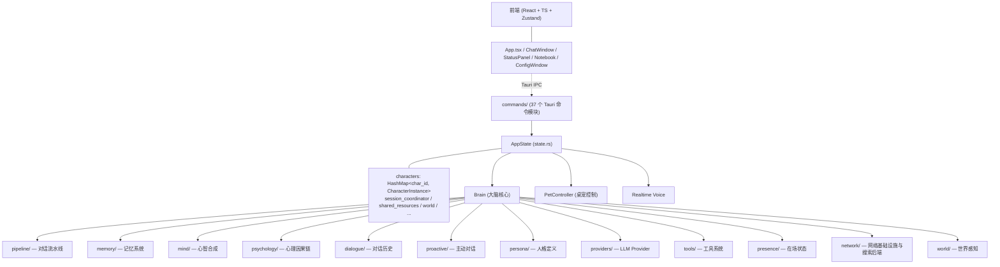

# Vivian 代码 Wiki

本文档为 Vivian 项目的代码架构百科，按模块层次组织，记录关键模块职责、核心数据结构、关键函数与跨模块数据流。配合 [README.md](file:///g:/vivian-rs/README.md) 使用——README 侧重功能特性，本 Wiki 侧重代码实现。

> 项目根目录：`g:\vivian-rs\`
> 后端入口：[`src-tauri/src/lib.rs`](file:///g:/vivian-rs/src-tauri/src/lib.rs)
> 前端入口：[`src/main.tsx`](file:///g:/vivian-rs/src/main.tsx) + [`src/App.tsx`](file:///g:/vivian-rs/src/App.tsx)

---

## 目录

- [顶层架构](#顶层架构)
- [核心数据结构](#核心数据结构)
- [模块详解](#模块详解)
  - [brain/ —— 大脑核心](#brain--大脑核心)
  - [coding_agent/ —— 编程智能体](#codingagent--编程智能体)
  - [task_service —— 自治任务与后台回流](#task_service--自治任务与后台回流)
  - [pipeline/ —— 对话流水线](#pipeline--对话流水线)
  - [cross_character.rs —— 跨角色通信总线](#cross_characterrs--跨角色通信总线)
  - [conversation/ —— 会话生命周期](#conversation--会话生命周期)
  - [memory/ —— 三层记忆系统](#memory--三层记忆系统)
  - [mind/ —— 心智合成层](#mind--心智合成层)
  - [psychology/ —— 心理学因果链](#psychology--心理学因果链)
  - [proactive/ —— 主动对话编排](#proactive--主动对话编排)
  - [skills/ —— 技能服务](#skills--技能服务)
  - [tools/ —— 工具系统](#tools--工具系统)
  - [自建工具系统（custom_tools）—— 能力自进化的执行侧](#自建工具系统custom_tools--能力自进化的执行侧)
  - [providers/ —— 多 Provider 路由](#providers--多-provider-路由)
  - [notebook/ —— 笔记系统](#notebook--笔记系统)
  - [network/ —— 网络基础设施与搜索后端](#network--网络基础设施与搜索后端)
  - [discovery/ —— 多平台内容发现与推荐](#discovery--多平台内容发现与推荐)
  - [browser_bridge/ —— 浏览器自动化桥](#browser_bridge--浏览器自动化桥)
  - [world/ —— 真实世界感知](#world--真实世界感知)
  - [dialogue/ —— 对话历史管理](#dialogue--对话历史管理)
  - [engine/ —— Live2D 表现层](#engine--live2d-表现层)
  - [presence/ —— 在场状态与后台任务](#presence--在场状态与后台任务)
  - [speech/ —— 语音系统](#speech--语音系统)
  - [commands/ —— Tauri 命令层](#commands--tauri-命令层)
  - [remote/ —— 远程访问 HTTP 服务](#remote--远程访问-http-服务)
  - [persona/ —— 人格定义与场景](#persona--人格定义与场景)
  - [emotion/ —— 情绪分类](#emotion--情绪分类)
  - [utils/ —— 通用工具](#utils--通用工具)
- [关键数据流](#关键数据流)
- [持久化模式](#持久化模式)
- [并发与锁策略](#并发与锁策略)

---

## 顶层架构



#### 前端构建（多窗口按需加载）

桌宠由多个 Tauri 窗口组成（主 Live2D 窗口 / Chat / Memory / Config / Bubble / Toast / SideChat / MessageBanner 等），每个窗口通过 `?view=` 参数加载不同的 React 组件。

- **逐窗口动态 import**（[`src/main.tsx`](file:///g:/vivian-rs/src/main.tsx)）：`main.tsx` 不再静态导入全部窗口组件，而是按 `view` 参数对各自组件做 `await import(...)`。主窗口（无 view）只加载 App + Live2D 依赖链（pixi），不再打包 Chat / Memory / MindInspector / Config 等它用不到的代码，显著降低主窗口首帧解析量。
- **vendor 拆包**（[`vite.config.ts`](file:///g:/vivian-rs/vite.config.ts)）：`build.rollupOptions.output.manualChunks` 将稳定依赖拆成独立 chunk —— `react`（react/react-dom/zustand）、`tauri`（@tauri-apps）、`i18n`（i18next/react-i18next）、`pixi`（pixi.js/pixi-live2d-display，仅主窗口用）。多窗口共享这些 chunk 的高效缓存、并行加载。
- **target es2022**：WebView2 为常青 Chromium，无需为旧浏览器降级转译，减少产物体积。
- **按需 chunk 兜底**：其余依赖（echarts / mermaid / katex 等）保持 Vite 默认基于动态 import 的按需拆包，不合并成单一巨型 vendor 包（避免本来懒加载的库被提前加载）。
- **Main 控制器窗口瘦身**（[`src/main.tsx`](file:///g:/vivian-rs/src/main.tsx)）：隐藏控制器分支（`view=hidden_controller`）直接 return 不渲染任何 React 组件，同时跳过 i18n 初始化与 global.css 加载，仅保留最小 Tauri IPC 桥接层，消除控制器窗口的 UI 渲染开销。

#### 心智观察器页面合并（MindInspector）

Memory 窗口（`MemoryWindow`，默认全屏大小）内嵌 [`MindInspector.tsx`](file:///g:/vivian-rs/src/components/mind-inspector/MindInspector.tsx)，侧边栏导航合并为 3 项，整个心智观察器使用「手账暖纸 + 纸胶带 + 点阵底纹」视觉体系：

- **外壳结构**（`MindInspector.tsx`）：纵向 = 顶部封面条（`.mind-sb-cover`，「Mind Scrapbook | 当前页名」+ 日期印章）+ 主体（左贴纸导航栏 `mind-nav-rail` 3 项 + 右内容区 `mind-page-content`）。窗口顶部原生标题栏已删除——封面条标题区即窗口拖拽区（`data-tauri-drag-region`），最小化/关闭按钮直接置于封面条右侧；页面经 `NavigationContext.setHeaderExtra` 注入的工具栏（如 DiaryPage 的角色切换/日期筛选）与日期印章、窗口按钮并排显示在封面条右侧，不再单独占一行
- **综合页（overview）** = [`OverviewPage.tsx`](file:///g:/vivian-rs/src/components/mind-inspector/pages/OverviewPage.tsx)：页内顶部手账 Tab 切换 `mind`（MindPage）/ `world`（WorldPage）/ `graph`（GraphPage）/ `profile`（UserProfilePage），缓存上次选择；页头 = 大标题「综合」+ 铅笔虚线 + 当前子视图胶囊
- **创作页（journal）** = [`JournalPage.tsx`](file:///g:/vivian-rs/src/components/mind-inspector/pages/JournalPage.tsx)：子 tab 切换 `diary`（DiaryPage）/ `notebook`（NotebookPage）/ `planner`（PlannerPage，待办+定时合并），支持 `memory:navigate` 事件定位；页头同样为「创作」大标题 + 子视图胶囊
- **工作页（code）**：Codex 布局 + 手账风格三栏工作台，由 [`CodeAgentPageNew.tsx`](file:///g:/vivian-rs/src/components/mind-inspector/pages/CodeAgentPageNew.tsx) 提供实际实现（左栏会话/工作区管理 / 中栏对话流 + 单轮工作过程分组折叠 / 右栏检查器：概览 + 轨迹 + 内嵌终端）

**兼容跳转**：`MindInspector` 的 `resolveNav` 把合并前的子视图跳转（`navigateTo('mind'/'world'/'graph'/'profile'/'diary'/'notebook'/'todo'/'scheduler')`、URL 参数 `nav=...`、`nb_id`、`memory:navigate` 事件）统一映射为「合并页主键 + `pageParams.sub`」，由合并页跟随切换子 tab。导航定义与 `NavKey` 在 [`design-system.ts`](file:///g:/vivian-rs/src/components/mind-inspector/design-system.ts)。

#### 暖纸主题（UI 视觉统一）

心智观察器与设置窗口（`ConfigWindow`）共用一套「暖纸信纸」视觉基调，由三处集中 token 驱动：

- **颜色 token**（[`global.css`](file:///g:/vivian-rs/src/styles/global.css)）：`--panel-*` 三块（深色默认 / 浅色跟随 / 浅色强制）重映射为「纸本 + 墨 + 印章青蓝」，对齐宣纸质感——纸张 `#F5EFE4` / 浮起卡 `#FBF7EE` / 侧边栏 `#EFE8DB`；墨色 5 档（浓墨 `#2A2622` → 极淡墨 `#8F867B`）；分割线 `#D8CFBE`；唯一强调色「印章青蓝」`#537D96`（hover `#3F6179`）；语义色克制墨染（成功墨绿 `#4A6B4A` / 危险深朱 `#8B2C1F`）
- **质感**：`.scrapbook-bg` 用多层 `radial-gradient` 模拟宣纸颗粒与暖斑（无需外部图片）；`.scrapbook-card` 收为 1px 细边框 + 3px 极小圆角；全局滚动条改用 `--panel-scrollbar` token（浅色下不再不可见）
- **排版**（[`design-system.ts`](file:///g:/vivian-rs/src/components/mind-inspector/design-system.ts)）：正文切衬线（`Noto Serif SC` / 宋体家族），英文/数字装饰标题保留手写体（`Caveat`）作点缀；圆角 token 极方化（控件「印章取方」：xs 2px / md 4px / xl 8px），呼应信纸邀纸感

页面侧边栏外壳在 `MindInspector.tsx` 挂 `scrapbook-bg` 纸纹底、激活高亮线用印章青蓝；`ConfigWindow` 根容器同样挂纸纹并切衬线字体。视觉整体由 token 层驱动，切换深/浅主题时暖纸调性保持一致。

### CharacterInstance（角色实例）

定义于 [`state.rs`](file:///g:/vivian-rs/src-tauri/src/state.rs)。每个角色独立持有一份完整资源：

| 字段 | 类型 | 职责 |
|------|------|------|
| `id` | `String` | 角色 ID（`"vivian"` / `"nana"`） |
| `name` | `String` | 显示名称 |
| `brain` | `Arc<Brain>` | 大脑核心，持有 memory/dialogue/psychology/persona/proactive 等所有子系统 |
| `pet_controller` | `Arc<PetController>` | 桌宠控制器，管理 Live2D 窗口与状态机 |
| `manifest` | `Arc<ResourceManifest>` | 模型清单，表情/动作映射 |
| `realtime_voice` | `Arc<RealtimeVoice>` | 实时语音会话 |
| `think_lock` | `Arc<Mutex<()>>` | 思考互斥锁，串行化 think 调用 |
| `online` | `RwLock<bool>` | 在线状态 |

### AppState（全局状态）

```rust
pub struct AppState {
    pub characters: Arc<RwLock<HashMap<String, CharacterInstance>>>,
    pub active_character_id: RwLock<String>,
    pub session_coordinator: SessionCoordinator,         // 跨角色/用户/proactive turn 协调
    pub world: Arc<EnvironmentContext>,                  // 世界快照
    pub shared_resources: Arc<SharedResources>,          // 跨角色共享资源
    pub config: Arc<RwLock<Config>>,                     // 全局配置
    pub model_router: Arc<ModelRouter>,                  // LLM 路由矩阵
    pub tool_system: Arc<ToolSystem>,                    // 工具系统
    // ... 更多共享资源
}
```

---

## 核心数据结构

### ChatMessage（对话消息）

定义于 [`types/response.rs`](file:///g:/vivian-rs/src-tauri/src/types/response.rs)。

```rust
pub struct ChatMessage {
    pub role: String,         // "user" / "assistant" / "system"
    pub content: String,
    pub meta: Option<MessageMeta>,
}

pub struct MessageMeta {
    pub channel: String,           // "wechat" / "direct" / "proactive" / "cross_character"
    pub speaker: Option<String>,   // 说话者 ID
    pub listener: Option<String>,  // 听话者 ID
    pub timestamp: Option<f64>,
    pub images: Vec<MessageImage>,
    // ... 文件元数据 / 工具调用标记等
}
```

### AiResponse（LLM 响应）

```rust
pub struct AiResponse {
    pub text: String,
    pub intent: String,
    pub response_mode: String,     // speak / non_verbal / internal / ignore
    pub tool_calls: Vec<ToolCall>,
    pub expression: String,
    pub motion: String,
    pub control_actions: Vec<ControlAction>,
    // ...
}
```

### PipelineState（流水线状态）

定义于 [`pipeline/state.rs`](file:///g:/vivian-rs/src-tauri/src/pipeline/state.rs)。55 个字段贯穿全链，主要字段：

```rust
pub struct PipelineState {
    pub user_input: String,
    pub messages: Vec<ChatMessage>,           // 对话历史
    pub memory_text: String,                  // 检索后的记忆上下文
    pub world_brief: WorldBrief,              // 世界快照
    pub character_block: String,              // 人格块
    pub user_model_text: String,              // 用户认知模型文本（UserModel → PromptBuildingStep）
    pub tools: Vec<ToolSchema>,               // 可用工具
    pub response: Option<AiResponse>,         // LLM 响应
    pub metadata: PipelineMetadata,           // 跳过标志/检索结果等
    // ... 50+ 字段
}
```

### MemoryItem（记忆条目）

定义于 [`memory/types.rs`](file:///g:/vivian-rs/src-tauri/src/memory/types.rs)。

```rust
pub struct MemoryItem {
    pub id: String,
    pub content: String,
    pub memory_type: MemoryType,              // ShortTerm / MidTerm / LongTerm / Knowledge 等
    pub importance: f64,
    pub evidence_score: f64,                  // 证据驱动可信度
    pub created_at: f64,
    pub last_accessed: f64,
    pub tags: Vec<String>,
    pub metadata: serde_json::Value,          // speaker/listener/perspective 等元数据
    pub description: Option<String>,          // LLM 抽取的摘要
    pub protected: bool,                      // 永不归档
}
```

---

## 模块详解

### brain/ —— 大脑核心

[`brain/brain.rs`](file:///g:/vivian-rs/src-tauri/src/brain/brain.rs) 是角色的"大脑容器"，聚合所有子系统。

#### 核心方法

| 方法 | 职责 |
|------|------|
| `Brain::build(char_id, config, manifest)` | 构造 Brain，注入 manifest 到 4 个依赖（PsychologyManager / EmotionBridge / ResponseParsingRunnable / ExpressionManager） |
| `brain.think(user_input, stream)` | 用户对话主入口，调用 `think_inner(input, stream, false, true)` |
| `brain.think_cross_character(input, stream)` | 跨角色对话专用入口，跳过异步反思：`think_inner(input, stream, false, false)` |
| `brain.think_proactive(input, stream)` | 主动对话入口，跳过对话历史写入：`think_inner(input, stream, true, true)` |
| `brain.think_inner(input, stream, skip_dialogue_write, run_reflection)` | 内部统一实现，执行完整 pipeline |
| `brain.generate_startup_greeting()` | 生成启动问候。不再区分首次/回归分支，统一走完整对话流水线（`chain.ainvoke_greeting`）——与一般直接渠道对话同一套提示词（含记忆检索→种子记忆进入 prompt），仅在用户消息前加一句"这是首次见面"/"用户回来了"的提示。写入记忆库前自动补 `build_speaker_prefix(char_id, "user", char_id)` 前缀（`[I say to User]`），与主对话入库格式统一（`commands/engine.rs::try_wake_greeting` 的唤醒问候同样处理） |
| `chain.ainvoke_greeting(user_input)` | 启动问候专用流水线入口。走完整 `prepare_pipeline_state` + `execute_pipeline_and_build_response`（含记忆检索→种子记忆在场），但设置 `skip_memory_save` 门控让 UserMemorySavingRunnable / MemorySavingRunnable 跳过写入，避免把合成的问候指令当作用户消息污染记忆库。对话写回与记忆写入由调用方独立后处理 |

#### 子模块

| 文件 | 职责 |
|------|------|
| [`chat_chain.rs`](file:///g:/vivian-rs/src-tauri/src/brain/chat_chain.rs) | LangChain 风格 Runnable 链，拆分为 `prepare_pipeline_state` / `execute_pipeline_and_build_response` / `ainvoke` 三步 |
| [`async_reflection.rs`](file:///g:/vivian-rs/src-tauri/src/brain/async_reflection.rs) | 异步反思，每 5 轮或 30 分钟触发，合并意识更新与活动抽取 |
| [`augment_reply_service.rs`](file:///g:/vivian-rs/src-tauri/src/brain/augment_reply_service.rs) | 主对话后异步补充回复服务，slow 检索召回 fast 路径遗漏的重要记忆 |
| [`focus_mode.rs`](file:///g:/vivian-rs/src-tauri/src/brain/focus_mode.rs) | 凝神/专注模式状态机，漏桶累积器 + 迟滞设计 |
| [`rate_limiter.rs`](file:///g:/vivian-rs/src-tauri/src/brain/rate_limiter.rs) | Token bucket 限流器 |
| [`cognitive_tick.rs`](file:///g:/vivian-rs/src-tauri/src/brain/cognitive_tick.rs) | 认知 tick 运行器，每 5 分钟消费 `pending_conflicts` 队列 |
| [`tool_leak_filter.rs`](file:///g:/vivian-rs/src-tauri/src/brain/tool_leak_filter.rs) | 流式过滤 `<tool_call>` 等泄露标记 |
| [`topic_signal.rs`](file:///g:/vivian-rs/src-tauri/src/brain/topic_signal.rs) | 话题信号检测，驱动话题切换 |
| [`subagent_context.rs`](file:///g:/vivian-rs/src-tauri/src/brain/subagent_context.rs) | 子代理上下文，支持 LLM 调用其他角色 |
| [`coding_agent.rs`](file:///g:/vivian-rs/src-tauri/src/brain/coding_agent.rs) | 编程智能体服务（会话式 agent loop，详情见[编程智能体](#codingagent--编程智能体)） |
| [`task_service.rs`](file:///g:/vivian-rs/src-tauri/src/brain/task_service.rs) | 自治任务执行（ctx.tasks 能力缝）：LLM 逐步决策执行工具直到完成/达最大步数；`TaskEvent` 广播到事件总线，报告回流陪伴对话（详情见[task_service —— 自治任务与后台回流](#task_service--自治任务与后台回流)） |
| [`budget.rs`](file:///g:/vivian-rs/src-tauri/src/brain/budget.rs) | 轮次产出预算与收益递减检测（`OutputBudgetTracker`）：每轮按 LLM 输出 token（无 usage 场景用工具结果摘要字符 `record_chars` 近似）+ 实质进展标志记录，连续 3 轮低产出（token<500 / 字符<120）且无进展 → `StopDiminishing` 提前停机提示，防 agent 循环空转烧配额；与 `DoomLoopTracker`（同签名重复）互补 |

### coding_agent/ —— 编程智能体

[`brain/coding_agent.rs`](file:///g:/vivian-rs/src-tauri/src/brain/coding_agent.rs) 提供会话式的结对编程能力，前端在记忆观察器的「工作」页签操作。

#### 数据模型

| 类型 | 说明 |
|------|------|
| `CodingSession` | 会话：`session_id`（`code-{uuid}`）/ `char_id` / `working_directory` / `title` / `messages[]` / `status` + 会话级配置（`permission` / `model_id` / `reasoning_level` / `goal` / `plan_mode` / `plan` / `feedback` / `compacted` / `deliverables` / `message_feedback`，serde default 兼容旧数据） |
| `CodingMessage` | 会话消息：`role`（user/assistant/tool_use/tool_result/error）+ `content` + 工具字段（`tool_name`/`tool_arguments`/`tool_success`/`tool_call_id`）+ `timestamp` + 扩展字段（`id` / `images` / `file_refs`，serde default） |
| `CodingImage` | 单张图片：`media_type`（MIME）+ `data`（base64 数据，不含前缀）+ `name`（可选文件名）——用户/助手消息均可含多张图片，随会话持久化 |
| `CodingFileRef` | 文件引用：`path`（绝对路径）+ `content`（读取内容，可空）+ `error`（读取失败原因，可空）——输入框 `@` 选择文件注入上下文 |
| `CodingStatus` | Idle / Running / Canceled |
| `CodingWorkspace` | 工作区项：`id`（=path）/ `name`（basename）/ `path` |

会话级配置字段：
- `permission`：`read_only` / `workspace_write` / `full_access`（缺省 workspace_write），经 `permission_to_access_level()` 映射为工具系统 `AgentAccessLevel`（ReadOnly / FsWrite / FullControl）
- `model_id`：会话选中的工作智能体模型 id（与 `config.active_work_model` 同步），None 跟随默认路由
- `reasoning_level`：`low` / `medium` / `high`（缺省 high），low 关闭思维链（`LLMRequest.reasoning=false`）
- `goal`：会话目标（`/goal` 设置，注入 system prompt「# 当前目标」段）
- `plan_mode`：计划模式开关（`/plan` 切换，开启时注入只读研究策略 `PLAN_MODE_POLICY`）
- `plan`：已批准执行方案（`/plan approve` 固化，注入 system prompt「# 已批准方案」段；`/plan off` 清除）
- `feedback`：反馈记录数组（`/feedback` 追加，含时间戳）
- `compacted`：较早历史的 LLM 压缩摘要（`/compact` 生成，注入 system prompt「# 历史摘要」段）
- `deliverables`：产物文件（write_file / edit_file 成功写入的绝对路径，去重，驱动前端产物面板）
- `message_feedback`：单条消息级反馈（消息下标 → `"up"` / `"down"`，`coding_set_message_feedback` 写入）

#### Agent Loop

```
用户消息(推入历史 + 置 Running)
   → build_llm_messages(裁剪60条历史 + system prompt)
   → ModelRouter.generate_stream_with_tools(仅白名单编程工具, 原生function calling)
   → has_tool_calls?
       否 → 记录assistant回复 → 置Idle → 完成轮次
       是 → 记录assistant.tool_calls(带id关联) → 逐个 execute_tool_use
             → 结果写入历史(摘要截断6000字符, 保留tool_call_id)
             → 回到循环开始(预算=config.tools.max_coding_rounds, 默认48, 命令层传入)
               ├ 软预算提醒: 用到 2/3、5/6 时注入系统提示"评估是否收尾/方案是否有效"
               ├ 停滞检测: 相同工具+相同参数重复≥3(DoomLoopTracker)
               │            / 同工具连续失败且错误摘要相同≥3 → 注入"重新分析/停止重试"
               ├ 预算耗尽且有实质进展(成功写/改/执行) → 自动续轮一次(+base/3, 封顶96)
               └ 耗尽且无进展 → 硬停止 → 前端弹去向选择条
   → 收尾: summarize_turn_to_memory(本轮对话摘要入库记忆)
```

关键点：
- **工具复用主对话链路**：`execute_tool_use` 自动经过沙箱 `is_path_safe` / 守卫 / 审批矩阵
- **会话级权限接入**：`ToolUseContext` 新增 `access_level: Option<AgentAccessLevel>` 字段（serde default None），`execute_tool_use` 权限检查优先用 `context.access_level.unwrap_or(runtime_cfg.access_level)`——编程 agent 按会话 `permission` 设置覆盖，实现会话粒度的工具放行控制（None 时回退全局 runtime config，不影响其他 agent）
- **工作区写入免确认**：执行器权限检查构建 `PermissionContext` 时，把 `context.working_directory` 注册为已授权工作目录（`add_working_directory`，read_only 会话注册为只读）——工作目录内的读写操作在 `check_file_permission` 中直接 `allow`，不再落到「路径不在已授权目录需确认」分支；路径范围仍由各工具 `validate_input` 的沙箱校验限制在工作目录内，`read_only` 会话写入仍被矩阵拒绝
- **沙箱确认回调**：编程会话的工具执行传入 `coding_sandbox_allow()` 回调（恒放行沙箱层 `check_tool_safety` 的「首次/前 N 次使用确认」）——`write_file`/`edit_file` 内置档案 `requires_confirmation=true` 且 Cautious 模式前 3 次需要确认，而执行器在无回调时会直接返回 `SandboxConfirmationRequired` 错误（无弹窗），导致工作区写文件被误拦；放行后真正边界仍由路径沙箱 + 权限矩阵 + 命令黑名单把守
- **推理等级**：run_loop 从会话读取 `reasoning_level`，`LLMRequest.reasoning = reasoning_level != "low"`（standard/code 两条路径一致）
- **多轮工具调用**：历史中 assistant 的 `tool_calls` 结构完整回传 LLM（`ChatMessage::assistant_with_tool_calls`），tool 结果经 `ChatMessage::tool_result` 按 `tool_call_id` 关联，满足原生 function calling 的多轮上下文协议
- **插话标注（interjected）**：`CodingMessage.interjected` 字段标记任务执行期间排队的插话（前端 QueueDock 排水时传 `interjected: true`）。`build_llm_messages` 对插话消息加 `[系统标注] 用户在你处理上一条消息期间发来了消息…` + `<user_message>` 包裹，帮助模型区分「对当前任务的补充/修正」与「全新对话」；UI 展示保持原文纯净（标注仅注入 LLM 上下文层）
- **流式输出**：`StreamEvent::Text` 增量经 `coding:chunk` 逐字转发前端打字机；`StreamEvent::Thinking` 增量经 `coding:thinking_chunk` 在「思考占位」内渐进展开灰色推理文本（不入库）
- **上下文控制**：历史最多注入 60 条；工具结果经 `prune_head_tail`（executor 公共函数）头尾裁剪——超 6000 字符保留头部 2/3 + 尾部 1/6、中段以 `…[中段 N 字符已折叠]…` 标记折叠（尾部退出码/报错/diff 收尾不丢失），`summarize_result` 与重放历史两条路径一致；错误消息作为 `[系统提示]` 注入让 LLM 感知失败并调整策略
- **工作流与 LSP 工具**：`CODING_TOOLS` 白名单含 `run_workflow`（多步编排，连续 parallel 步骤扇出并发）与 `lsp_query`（定义/引用/实现/hover 语义查询），definition 按白名单顺序输出保持 API tools 前缀缓存稳定
- **图片工具（`send_image`）**：智能体把本地图片发送到聊天界面——编程会话下经 `CodingAgent::push_agent_image` 作为 assistant 消息追加（`images` base64 内联，随会话持久化、恢复会话前端直接重渲染），并 emit `coding:assistant_message`（携带 images）供编程页实时渲染；伴随的 caption 作为可选说明文本。图片副本同时保存到 `<user_data_dir>/images/` 供历史复用
- **能力进化工具**：`CODING_TOOLS` 白名单末位为 `create_skill` / `use_skill` / `create_tool`——工作智能体是能力进化事件的**执行主体**（约定：陪伴侧遇到进化事件派发给工作智能体）：沉淀方法论（create_skill，写入即注册）与构建新工具（create_tool，stdin/stdout 函数协议）。system prompt 明确该职责并引导「任务中总结出值得复用的做法时沉淀技能、确认缺少可执行原语时构建工具」。`create_tool` 创建经 executor 能力进化门强制弹预览卡片（宿主自动放行回调不绕过）
- **轮次预算与循环保护**（`run_loop_inner`）：预算来自 `config.tools.max_coding_rounds`（默认 48，设置-工具可调，命令层从 `config` 读取后经 `send_message` → `run_loop` → `run_loop_inner` 传入；`DEFAULT_MAX_TOOL_ROUNDS=48` 兜底）。
  - 软预算提醒：`rounds_used` 达到 `budget*2/3`、`budget*5/6` 时向本轮请求注入 `[系统提示]`（只引导、不落库）。
  - 停滞检测①：`DoomLoopTracker`（复用 `pipeline::doom_loop`）记录 (tool_name, canonical_args)，同一签名累计 ≥3 次 → 注入「停止重复、换方法或告知障碍」。
  - 停滞检测②：同一工具连续失败且错误摘要（summary）hash 相同 ≥3 次 → 注入「停止重试、重新分析根因」；一旦有任何成功即清空失败计数。
  - 收益递减检测：`brain/budget.rs::OutputBudgetTracker` 每轮记录 LLM 输出 token（无 usage 场景用工具结果摘要字符近似 `record_chars`）+ 实质进展标志，连续 3 轮低产出（token < 500 / 字符 < 120）且无进展 → 判定空转，提前提示收尾停机；与 `DoomLoopTracker`（同签名重复）互补，抓"调用各不相同但都毫无产出"。
  - 自动续轮：预算耗尽时若 `made_progress`（本轮任一成功 write_file/edit_file/run_command），`budget = (base + base/3).min(96)` 续轮一次（仅一次），并向历史写一条 `CodingRole::Error` 提示「自动续轮 N 轮」；无进展则 `break` 硬停止。
  - 硬停止：写 Error 消息 + `coding:error` 事件（含实际上限数字），前端据此弹去向选择条。
- **角色化 system prompt**：按 `char_id` 注入人设（Vivian/Nana），限定 Windows + PowerShell、工作目录沙箱，"先看再动、局部用 edit_file、改后跑命令验证"。**无工作区模式**：会话未绑定目录（如陪伴侧 `delegate_to_work_agent` 未指定与无历史工作区时）时，system prompt 改为"未选择（无工作区模式）：文件操作使用绝对路径；未绑定工作区，无目录沙箱，写入前会请求用户确认"——文件工具沙箱边界（`is_path_within_working_directory` 空 base 恒通过）配合权限矩阵兜底，轻量/进化类任务无需先选工作区即可工作；轮次摘要 `build_turn_transcript` 同步标注"未选择（无工作区模式）"
- **会话摘要入库记忆**（`summarize_turn_to_memory`）：run_loop 结束后异步执行——从最后一条用户消息起切片本轮消息，经 `router.generate`（memory 路由，`TURN_SUMMARY_SYSTEM_PROMPT` 压缩为 2-4 句中文摘要；LLM 失败退化为 `rule_turn_digest` 规则摘要兜底），写入会话所属角色的 `MemoryManager`（ShortTerm，importance 0.4，tags `coding_session`/`work`，metadata 含 `source=session_id`/`working_directory`/`speaker`/`listener`）。内容前缀 `[编程会话]`，与主对话记忆体系打通，角色可在后续对话中回忆自己做过的编程工作

#### 斜杠命令（Slash Commands）

输入 `/` 在前端弹出命令菜单（`SlashCommandMenu`，按命令名/标签字母模糊筛选，↑↓ + Enter 选择、Esc 关闭；选中命令插入输入框并保持聚焦，命令名后输入空格自动收起菜单便于补参数）。后端 `send_message` 检测消息以 `/` 开头时**不走 agent loop**，改由 `handle_slash_command` 拦截分发（同步命令即时处理，`/compact` 异步走 LLM），结果以 assistant/error 消息写入会话并复用 `coding:assistant_message` / `coding:error` / `coding:turn_done` 广播，前端消息流直接展示，不消耗 agent loop 轮次。

| 命令 | 处理器 | 行为 |
|------|--------|------|
| `/goal [目标]` / `/goal 清除` | `cmd_goal` | 无参查看当前目标，有参设置会话目标（`CodingSession.goal`，注入 system prompt「# 当前目标」段）；`清除` / `-clear` 移除目标 |
| `/plan` / `/plan approve` / `/plan off` | `cmd_plan` | 无参切换计划模式开关（`plan_mode`，开启注入 `PLAN_MODE_POLICY` 只读研究策略）；`approve` 把最近一条 assistant 方案消息固化为已批准方案（`CodingSession.plan`，注入「# 已批准方案」段并保持计划模式）；`off` 退出计划模式并清除已批准方案 |
| `/compact` | `cmd_compact` | 把较早历史（保留最近 `COMPACT_KEEP_MESSAGES=24` 条，旧消息不足 `COMPACT_MIN_MESSAGES=8` 提示无需压缩）交 LLM（`COMPACT_SYSTEM_PROMPT`）压缩为摘要，与既有 `compacted` 合并后写入会话并从历史裁剪 |
| `/permission [等级]` | `cmd_permission` | 无参查看当前权限，有参切换 `read_only` / `workspace_write` / `full_access` |
| `/feedback <内容>` | `cmd_feedback` | 把带时间戳的反馈追加进 `feedback` 数组 |
| `/export` | `cmd_export` | 将会话导出为 Markdown 到 `<用户数据目录>/coding_exports/`（含目标/已批准方案/计划模式/历史摘要/反馈/全部消息记录） |

关键点：
- **system prompt 注入**：`build_llm_messages` 在静态人设 prompt 之后按序追加「# 当前目标」（goal）、「# 已批准方案」（plan，仅 `plan` 非 None 时注入）、计划模式策略（plan_mode）、「# 历史摘要」（compacted）；四者默认缺失时 system prompt 与既有完全一致，不破坏前缀缓存
- **标题保护**：`send_message` 与 `push_message` 均跳过以 `/` 开头的首条消息作为会话标题
- **未知命令**：返回「未知命令」错误并列出可用命令

#### 事件广播（`coding:*`）

| 事件 | 载荷 |
|------|------|
| `coding:user_message` | `{session_id, content}` |
| `coding:assistant_message` | `{session_id, content}` |
| `coding:tool_call` | `{session_id, id, name, arguments}` |
| `coding:tool_result` | `{session_id, id, name, success, result, duration_ms}`（前端按 `id` 回填本地 `tool_use` 为结果卡；找不到对应 `tool_use`（刷新/切会话错过事件）时兜底追加独立结果卡，避免结果丢失） |
| `coding:deliverable` | `{session_id, path}`（write_file / edit_file 成功写入的新产物，增量驱动前端产物面板） |
| `coding:thinking` | `{session_id, thinking: true}`（生成期占位提示） |
| `coding:chunk` | `{session_id, content}`（流式文本增量） |
| `coding:thinking_chunk` | `{session_id, content}`（推理链增量） |
| `coding:turn_done` | `{session_id}`（恢复 Idle + 持久化，前端权威同步） |
| `coding:error` | `{session_id, message}` |

#### 持久化

会话写入 `%APPDATA%\Vivian\coding_sessions.json`（保留最近 30 个，`serde_json` 序列化）；启动时 `load_from_disk` 恢复并将所有会话重置为 Idle，避免上次中断的 Running 会话残留。会话级配置（`permission` / `model_id` / `reasoning_level` / `goal` / `plan` / `deliverables` / `message_feedback`）随会话一同持久化，`switchSession` 时前端自动恢复。

#### 会话级配置命令（`commands/coding_agent.rs`）

| 命令 | 说明 |
|------|------|
| `coding_list_workspaces` | 历史会话中出现过的工作区列表（去重，按最近使用倒序） |
| `coding_set_workspace` | 切换会话工作目录（目录必须存在；运行中拒绝） |
| `coding_set_permission` | 设置会话权限等级（read_only / workspace_write / full_access；运行中拒绝） |
| `coding_set_model` | 设置会话工作模型 id（与 `select_work_model` 热切换同步；运行中拒绝） |
| `coding_set_reasoning_level` | 设置推理等级（low / medium / high；运行中拒绝） |
| `coding_list_available_models` | 可用工作模型列表（复用 `config.work_models`，返回 `{id, name}`） |

`CodingAgentService` 对应方法（`list_workspaces` / `set_workspace` / `set_permission` / `set_model` / `set_reasoning_level`）均走「校验 → 更新 → persist」模式，与既有 `set_mode` 同构。

#### 前端编程页（CodeAgentPage）

[`CodeAgentPageNew.tsx`](file:///g:/vivian-rs/src/components/mind-inspector/pages/CodeAgentPageNew.tsx) 实现 Codex 布局 + 手账风格三栏界面，`MindInspector.tsx` 直接导入该文件：

- **左栏（会话/工作区管理）**：新会话按钮、当前工作区（固定不可改）；会话支持按工作区分组或单列表，可按最近更新/手动排序，支持搜索会话；工作区分组标题提供三点菜单（重命名 / 删除工作区）和新建当前工作区会话的加号按钮；无文件树
- **中栏（flex:1）**：空态 hero / 会话顶栏（工作目录 + 运行状态 + 模式切换）/ 消息流（消息按角色区分渲染，文件类工具 read/write/edit 以手账风格代码块 + diff 高亮展示；非文件工具 `ToolCallCard` 紧凑展示；用户/助手消息含图片时渲染为图片缩略图气泡，点击经 `onOpenImage` 打开大图）+ 底部输入卡片
- **右栏（检查器，可整体收纳）**：概览统计（轮次/步数/LLM 与工具耗时/首 token/缓存命中/token 用量）+ 内嵌终端标签页；标签名沿用工作区目录名，支持多开/关闭；左右侧边栏均可拖拽调整宽度

**常驻目标/计划条（`GoalPlanBar`，对齐 dsh ui-goal）**：消息流顶部常驻条，展示会话目标（内联编辑发送 `/goal <新目标>` / 清除 `/goal 清除`）与计划模式状态——未批准时显示「计划模式」标签 + 「批准方案」按钮（回传 `/plan approve` 固化最近方案为执行依据）+ 「退出计划」（`/plan off`）；已批准时展示方案摘要。只有 goal 或 plan_mode 非空时才渲染，不挤占空布局。

**@-mention 文件引用（`FileRefMenu`）**：输入框当前词以 `@` 开头时弹出工作目录文件选择菜单（`loadFileTree` 拉文件列表，标签/路径模糊筛选，↑↓+Enter 选中，选中把 `@路径` 插入输入）；发送时解析 `@引用` 为 `draftRefs`，随 `coding_send_message` 的 `fileRefs` 传后端——[`resolve_file_refs`](file:///g:/vivian-rs/src-tauri/src/brain/coding_agent.rs) 相对路径拼工作目录、沙箱校验、读取内容截断（单文件 `FILE_REF_MAX_CHARS`，至多 `FILE_REF_MAX_COUNT` 个），存进 `CodingMessage.file_refs`；用户消息气泡以文件图标 + 路径展示引用，读取失败显示 `path（错误）`。文件内容经 `build_llm_messages` 以 `<file_refs>` 块注入上下文，历史重放时持续有效。

**产物面板（`DeliverablesCard`）**：右栏概览展示会话产物清单（`session.deliverables`，write_file/edit_file 成功写入的绝对路径去重），按工作目录转相对路径渲染；`coding:deliverable` 事件增量追加（不重复）。

**消息操作（`MessageRow` hover 动作）**：操作条位于消息气泡**下方独立一行**（文档流内，不再绝对定位悬浮遮挡正文，hover 淡入），提供复制 / 有帮助 / 没帮助（`coding_set_message_feedback` 写入 `message_feedback`，消息下标 → up/down）/ 从此处派生新会话（`coding_fork_session` 复制该消息为止的历史为独立会话，刷新并切换）；用户气泡右对齐时操作条 `margin-left:auto` 跟随右对齐。助手消息渲染经 `RichText`：解析行内 Markdown 加粗（`**text**` → `<strong>`，正则 `\*\*([^*\n]+)\*\*` 不跨行不吞其他星号），代码块内不解析。

**工具卡片（`ToolCallCard`）紧凑展示**：数据流由 `coding:tool_call`（`role:'tool_use'`，`content:''`、参数在 `tool_arguments`）与 `coding:tool_result`（按 `tool_call_id` 回填 `tool_success` / `content`=后端 `summarize_result` 摘要）驱动。卡片头部带「工具调用」徽标 + 明确状态文字（`运行中… / ✓ 已完成 / ✕ 失败`），取代旧式裸 `✓/✕` 图标。
- **摘要行默认可见（仅折叠态）**：`toolArgSummary` 取关键参数（command/pattern/path…），`toolResultSummary` 按工具类型提取要点——`grep_search` → `找到 N 处匹配 · 扫描 M 个文件`、`run_command` → `✓ 成功 / ✕ 退出码 N · 首行输出`、`list_dir` → `N 个条目`、`edit_file` → `+N −M`（解析结果 JSON 内嵌 `diff` 的增减行数）、`write_file` → `路径 x`、通用取前两个非空键；未展开即可一瞥 Agent 在做什么。展开后摘要行隐藏（由完整 IN/OUT 取代，避免双虚线占位）。
- **展开详情**：完整 IN/OUT 等宽块，仅在有内容时渲染（`argumentsJson` / `result` 非空），空参数/空结果不再显示「（空）」大框；IN/OUT 文本 `trim()` 后渲染，杜绝 `pre-wrap` 下字符串首尾换行造成空行；`codex-tool-detail` 容器内边距紧凑（5px/6px/7px）。
- **空值处理**：`tool_arguments` 为 null/undefined/""/0/false 时摘要返回 `''`（不占行）、展开态按「无参数与返回内容 / 运行中 / 执行失败（无返回内容）」显示小字，区分「没参数」与「有参数但为空」。
- **running 挂钩会话状态**：`running = (role==='tool_use') && 会话运行中`——会话结束后任何卡片（含 code 模式「组合程序」卡）不再残留「运行中」；`coding:tool_result` 找不到对应 `tool_use`（刷新/切会话错过 `tool_call` 事件）时兜底追加独立结果卡片，避免结果凭空丢失。

**单轮工作过程分组（`ToolProcessGroup`）**：`groupChatMessages(messages, running)` 把消息流切分为渲染项——**连续 ≥2 条 tool_use/tool_result 消息聚为一组**（单张卡片直接渲染），其余消息透传。
- **自动收纳**：组后出现 assistant 总结 / 下一轮 user 消息 / 会话停止运行即判定 `settled`，进行中默认展开实时观察、总结出现瞬间自动折叠成一行摘要（`工作过程 · N 步 · M 个文件 · 耗时` + `✓ 已完成 / 进行中…` 状态 + `✕ 失败数`），之后用户自由开合；历史会话加载的组默认折叠。
- **展开/折叠动画**：CSS grid `grid-template-rows: 0fr→1fr` 过渡高度（无需测量实际高度）+ 内容 opacity 淡入 + 箭头旋转 -90°↔0°，250ms `cubic-bezier(0.25,0.6,0.3,1)`；内容始终挂载（仅视觉收起），不丢滚动位置与卡片内部展开态；折叠时上边框虚线透明化。
- **组内渲染**：复用原工具卡片渲染逻辑（含 diff / 工作流 / LSP 可视化卡），组内卡片收紧间距去阴影以体现层级；后端聚合落库的空壳 `tool_use` 桩消息（无 `tool_name`）仍跳过。

**工作流可视化卡片（`WorkflowVizCard`，对齐 dsh ui-workflow-run）**：`run_workflow` 的 tool_result（`{name, total, succeeded, failed, steps[]}`）解析成功后渲染为可视化卡片——头部（名称 + 成功/总数 + 状态章「全部成功 / N 步失败」）+ 进度条（成功占比，失败着色）+ 步骤区按连续 `parallel` 标记聚为「顺序 / 并行组」（并行组带「并行组 · N 步」标签），每步显示序号/工具/✓✕/结果要点。解析失败（如结果被裁剪）自动回退普通 `ToolCallCard`。

**LSP 语义导航卡片（`LspVizCard`，对齐 dsh tool-lsp 渲染）**：`lsp_query` 的 tool_result（`{kind, result}`）解析成功后渲染——`go_to_definition` / `find_references` / `go_to_implementation` 的位置（file URI + range.start）归一为 1 基 `path:line:col`、按文件分组（相对工作目录展示），每条为可点击导航行，点击经 `@tauri-apps/plugin-shell` 用系统默认编辑器打开（真实语义跳转）；`hover` 提取可读文本（兼容字符串/数组/`{value}`/markdown）渲染为滚动等宽块。解析失败自动回退普通工具卡片。

**三段式输入卡片**（`inputBar`，空态居中 / 有消息贴底复用）：
- 空态顶部：`WorkspaceDropdown`（`coding_list_workspaces` 缓存列表 + 添加工作区）+ `ModeDropdown`（标准/代码/极简 + 说明）
- 中间：多行 `textarea`，输入 `/` 触发 `SlashCommandMenu`（按命令名/标签字母模糊筛选，键盘 ↑↓ 选择 + Enter 插入 + Esc 关闭；选中命令插入输入框并保持聚焦，命令名后输入空格自动收起菜单便于补参数）
- 底部工具栏：附件上传（图片草稿 `AttachmentRail`）+ `PermissionDropdown` + `ModelDropdown`（模型 + 推理等级双区）+ 发送/停止

**轮次预算耗尽的去向选择条（`BudgetStopBanner`）**：当 `coding:error` 消息同时含「已达到单轮最大工具调用轮数」与「自动停止/可发送新消息继续」时，前端判定为预算耗尽硬停止（区别于「自动续轮」提示——那只是中途扩额、任务仍在继续），在输入区上方弹出横幅：
- 展示本轮进展（`computeTurnProgress`：自最后一条用户消息起统计 `tool_result` 次数 / 失败数 / 工具调用分布 / 涉及文件 ≤5）
- 三个动作：**继续**（`sendContinuation('请继续完成当前任务')` 开新一轮，LLM 带完整历史继续）/ **补充说明后继续**（聚焦输入框，补充后正常发送）/ **停止任务**（仅关横幅）
- 发送新消息（`handleSend`/队列/`sendContinuation`）或切换会话时自动清除横幅与聚焦提示

各下拉组件共用 `DROPDOWN_MENU_STYLE` / `DROPDOWN_OPTION_STYLE`，点击外部关闭（document mousedown）；会话切换（`switchSession`）与初次加载时从 `CodingSession` 恢复 `permission` / `reasoning_level` / `model_id`。模型下拉以 id 作为选中值，触发器显示映射的模型名。

**内嵌终端**：终端位于右栏检查器的「终端」页签内，右栏整体可收纳（不卸载，`display:none` 保持 ConPTY 会话）；终端标签名沿用工作区目录名，支持多开/关闭。终端实例为 [`TerminalPanel.tsx`](file:///g:/vivian-rs/src/components/mind-inspector/pages/TerminalPanel.tsx)（xterm.js + ConPTY，懒加载），主题跟随浅色/深色手账配色，字号 11 默认等宽字体。

#### 编程工具集（`tools/builtin/coding_tools.rs`）

| 工具 | 风险 | 说明 |
|------|------|------|
| `read_file` | FsRead | 读取文件内容（UTF-8/GBK/Shift-JIS 自动检测），沙箱校验工作目录 |
| `write_file` | FsWrite（破坏性） | UTF-8 写入，自动建父目录，沙箱校验工作目录 |
| `edit_file` | FsWrite（破坏性） | 精确字符串替换，要求唯一匹配或 `replace_all`，防止误改；成功后结果 JSON 内嵌 unified `diff`（`build_edit_diff`：每处替换一行 hunk 含 3 行上下文、间隙 ≤6 行自动合并、6 hunk/100 行/4000 字符体积受控），供前端 diff 渲染与 LLM 感知改动 |
| `run_command` | Shell | PowerShell 非交互执行，120s 超时，输出截断 8000 字符，破坏性命令黑名单，`CREATE_NO_WINDOW` |
| `grep_search` | FsRead | 递归内容搜索，跳过依赖目录与二进制，最多 50 处匹配 |
| `list_dir` | FsRead | 树状列目录（深度上限 4），跳过依赖目录 |
| `run_workflow` | Shell | 多步编排：steps 为 `{tool, arguments, parallel}` 数组，连续 `parallel:true` 扇出并发执行，经沙箱/审批管线，逐步结果含 `parallel` 标记（驱动前端可视化分组） |
| `lsp_query` | Safe（只读） | 经语言服务器语义查询：`go_to_definition` / `find_references` / `go_to_implementation` / `hover`，按文件位置（0 基行/列），需 `lsp.json` 配置对应扩展的语言服务器 |
| `notify_companion` | Safe | 阶段成果播报：`{title?, message}` 发给陪伴人格——异步走 `brain.think_with_options(input, false, true)` 完整陪伴管线生成人设化播报，经 `proactive:bubble` 事件投递（前端 TTS + 气泡 + 聊天记录），写入对话历史（channel=proactive）与记忆（trigger=work_report）；每角色 60s 节流（`work_agent_tools.rs::LAST_NOTIFY`），节流期内仅记录不即时播报 |
| `send_image` | Safe（`send_image_tool.rs`） | 发送本地图片到聊天界面（编程页/微信面板双通道路由，据 `ToolUseContext.session_id` 是否命中编程会话）：编程侧走 `push_agent_image` 进入会话；聊天侧镜像 `send_image_message` 管线写历史 + emit `chat:assistant_image`，窗口不可见时弹横幅 |

### task_service —— 自治任务与后台回流

[`brain/task_service.rs`](file:///g:/vivian-rs/src-tauri/src/brain/task_service.rs) 是自治任务执行服务（`ctx.tasks` 能力缝），支撑陪伴对话直接用工作侧能力派活（`run_job` / `spawn_subagent` / `run_workflow` / `delegate_to_work_agent`），并负责把任务状态与完成报告**回流到陪伴对话**。

#### Agent-loop 形态

给定 directive，LLM 逐步决策「下一步调用哪个工具」并执行，直到 `done=true`、某工具声明 `goal_completed`，或达到 `MAX_TASK_STEPS=8`。每步经 `execute_tool_use` 复用主对话沙箱 / 守卫 / 审批矩阵；`TaskEvent`（Started / Step / Completed / Failed / Canceled）经 `ctx.emit_serial` 广播到事件总线（跨角色分享等前端订阅）。

#### 谱系与报告

- `TaskState` 含 `parent` / `children`（子代理谱系）、`report`（子代理回传文本）、`report_consumed`（报告是否已注入陪伴对话）；`run_loop` 的 `tool_ctx.session_id` 携带任务 id，`subagent_report` 据此回写报告。
- 成功结束但模型未调 `subagent_report` 时，`set_fallback_report` 用末尾 3 步摘要自动生成兜底报告，保证回流段始终有内容。
- 命令层 `commands/tasks.rs`：`list_agent_tasks` / `get_agent_task`（含后代谱系树）/ `cancel_agent_task`，供外部查询与取消自治任务。
- 全局句柄：`AppState::new` 里 `task_service::set_global` 注册（[state.rs](file:///g:/vivian-rs/src-tauri/src/state.rs)），供管线步骤等无 AppState 上下文的代码经 `task_service::global()` 访问。

#### 报告回流陪伴对话（对齐 dsh jobs 的 next-step inbox 语义）

1. **注入**（`pipeline/steps/prompt.rs::build_background_tasks_section`）：每轮构建 prompt 时查询 `running_top_level_for`（运行中顶级任务）+ `unconsumed_reports_for`（已完成、报告未消费、2 小时窗口内的顶级任务），渲染为「后台任务」动态段——运行中任务显示指令+步数，刚完成未汇报的显示报告并附带「用你的口吻主动向用户汇报」引导。三语标题（`section_heading("background_tasks")`）。
2. **移交**：`prompt.rs::ainvoke` 把待汇报任务 id 写入 `state.metadata["bg_report_task_ids"]`。
3. **消费**（`pipeline/steps/generation.rs`）：动态便签进入请求后，`mark_reports_consumed` 标记该批任务为已消费——**每份报告只注入一次**，后续轮次不再重复注入（便签/整体 system 两条切分路径均覆盖）。
4. **位置**：后台任务段在动态区紧随 Self State（"我正在做什么"的延伸），动态区整体位于历史之后、用户输入之前，不破坏前缀缓存。

#### 结果裁剪

陪伴链路的工具反馈历史（`tool_call_manager.rs::build_feedback_prompt`）与编程侧统一使用 `tools/executor.rs::prune_head_tail`（头 2/3 + 尾 1/6 + 中段折叠标记），超长工具结果的尾部（退出码/报错/diff 收尾）不再丢失。

### pipeline/ —— 对话流水线

[`pipeline/`](file:///g:/vivian-rs/src-tauri/src/pipeline) 实现 LangChain 风格的 Runnable 流水线。

#### 流水线步骤

```
PreProcessing → UserMemorySaving → [QueryRewrite ∥ FastSemantic] → MemoryRetrieval → WebContext
    → PromptBuilding → Generation → ResponseParsing → Validation → ExpressionMotion
    → PsychologyInsight → MoodUpdate → MemorySaving
```

#### 核心文件

| 文件 | 职责 |
|------|------|
| [`base.rs`](file:///g:/vivian-rs/src-tauri/src/pipeline/base.rs) | `Runnable` trait 与组合子（`|` / `RunnableBranch` / `RunnableRetry` / `RunnableWithFallbacks`） |
| [`state.rs`](file:///g:/vivian-rs/src-tauri/src/pipeline/state.rs) | `PipelineState` 55 字段贯穿全链 |
| [`advisor.rs`](file:///g:/vivian-rs/src-tauri/src/pipeline/advisor.rs) | Advisor 拦截器链（日志/限流/Re2/循环检测） |
| [`prompt_modules.rs`](file:///g:/vivian-rs/src-tauri/src/pipeline/prompt_modules.rs) | Prompt 模块构建器，含 `build_memory_block`（记忆块 + 英文忠实度/时间感知指引）、`build_memory_group_section`（记忆合并组：Episode+关系日志+记忆本体）、`build_user_profile_group_section`（画像合并组）、`build_tools_block`、`build_agent_status_bar`（Agent 状态栏）、`build_tool_minimal_identity`（工具精简人设 + PERSONA_LOAD + 语言约束）、`tool_minimal_output_format`（工具输出格式 + 按界面语言的语言约束）等；framework 规则加载函数（`safety_rules`/`output_format`/`session_rules` 等）统一加载英文标记化模板、无 lang 参数 |
| [`template_engine.rs`](file:///g:/vivian-rs/src-tauri/src/pipeline/template_engine.rs) | Prompt 模板引擎，`section_schema()` 定义 32 个 section 的结构元数据（9 静态 + 23 动态），`build_prompt_with_sections()` 产出 prompt + 逐 section 元数据（char_count / token_estimate / present） |
| [`context_compress.rs`](file:///g:/vivian-rs/src-tauri/src/pipeline/context_compress.rs) | 多级上下文压缩（Soft Trim → 原子组丢弃 → Reminder）+ 上下文感知压缩（LLM 摘要工具结果） |
| [`compaction_reminder.rs`](file:///g:/vivian-rs/src-tauri/src/pipeline/compaction_reminder.rs) | 压缩后提醒，从丢弃消息提取活跃工具名与最后话题 |
| [`doom_loop.rs`](file:///g:/vivian-rs/src-tauri/src/pipeline/doom_loop.rs) | 死循环检测，追踪 `(tool_name, args)` 签名连续出现次数 |
| [`inline_tag_scanner.rs`](file:///g:/vivian-rs/src-tauri/src/pipeline/inline_tag_scanner.rs) | 内联标签扫描器，流式剥离 `<e>/<m>/<s>` 标签驱动 Live2D |

#### 关键函数

```rust
// prompt_modules.rs
pub fn build_memory_block(memory_text: &str, lang: &str) -> String
// 在记忆块末尾追加忠实度约束 + 时间感知指引：
// - 记忆可能过时，与用户矛盾时以用户为准
// - 每条记忆带时间戳，需与「## 你周围正在发生什么」中的当前时间对比
// - 区分已发生/正在发生/未来计划（"下周要做xx"那一周没到就是未来计划）

// prompt_modules.rs —— Agent 状态栏
pub fn build_agent_status_bar(messages: &[ChatMessage], user_input: &str, focus_active: bool) -> Option<String>
// 以 <agent_status> 键值对（当前时间 / 本次对话轮数 / 最近工具调用 / 专注模式）作为
// user-role 元消息追加在用户输入之后、紧邻生成位置；末尾附"读数 + 操作策略"成对指令。
// 计数由代码确定性维护，不依赖 LLM 统计。

// context_compress.rs —— 上下文感知压缩
pub async fn compress_conversation_context_aware(
    router: &ModelRouter, task_type: &str, messages: &mut Vec<ChatMessage>,
    threshold_tokens: usize, keep_recent: usize, query: &str,
) -> CompressResult
// 在确定性压缩之上，对被丢弃的工具调用组用 LLM 结合 query 生成针对性摘要（三语），
// 失败回退到确定性预览；分组/原子性/阈值逻辑与 compress_conversation 一致。
```

#### steps/ 子目录

| 文件 | 步骤 | 职责 |
|------|------|------|
| `pre_processing.rs` | PreProcessing | 输入预处理、speaker prefix 解析、channel 路由 |
| `query_rewrite.rs` | QueryRewrite | LLM 查询重写，含 `should_skip_retrieval` 启发式（跳过"嗯/你好/好的"等闲聊） |
| `fast_semantic_step.rs` | FastSemantic | 嵌入语义分类 + 同步计算认知知识需求评估（EpistemicAssessment），与 QueryRewrite 并行执行 |
| `memory.rs` | MemoryRetrieval | 混合检索 + 置信度标记 + Verifier 二分类过滤 + 多跳关联检索（注入 user_model 时展开关联话题二次召回）。同文件内 `UserMemorySavingRunnable` / `MemorySavingRunnable` 提供 `skip_memory_save` 元数据门控——启动问候等内部指令设置后跳过用户消息/AI 回复的记忆写回，避免合成的问候指令被当作真实用户消息污染记忆库 |
| `web_context.rs` | WebContext | 基于 KnowledgeDecision 驱动主动搜索，结果注入 prompt |
| `prompt.rs` | PromptBuilding | U 型注意力布局组装 prompt（含认知信号 + 主动搜索结果） |
| `generation.rs` | Generation | LLM 生成回复，`StreamEmitter` 推送 chunk |
| `validation.rs` | Validation | 空文本检测 + 长度截断 + 幻觉检测（注入对话历史防误报） |
| `reflection.rs` | ReflectionRunnable | 反思调用，产出表情/动作/control_actions + 心理状态 + world_update + goal_updates + evolution（自我进化） |
| `mood.rs` | MoodUpdate | 心理状态更新 |

#### WebContext —— 认知知识需求驱动的主动搜索

[`web_context.rs`](file:///g:/vivian-rs/src-tauri/src/pipeline/steps/web_context.rs) 基于认知知识需求评估（Epistemic Assessment）驱动主动搜索。Web Search 是认知能力而非用户显式调用的工具——当系统检测到用户输入可能需要外部知识验证时，在生成前预搜索，结果作为上下文注入 prompt。

**设计理念**：替代单一置信度阈值，转向多维知识需求评估。核心问题不是"我有多确定"，而是"为了给出可靠回答，是否需要从外部世界获得证据"。

**评估流程**：

1. **FastSemantic 阶段**（`fast_semantic.rs`）同步计算 `EpistemicAssessment`，产出四维评分：
   - `semantic_clarity`：语义清晰度（我理解用户在说什么吗？）
   - `factual_dependence`：外部事实依赖度（回答是否依赖外部事实？）
   - `temporal_sensitivity`：时效敏感性（事实是否可能随时间变化？）
   - `interpretation_risk`：解释风险（不搜索自行解释是否容易误解用户？）
   - `knowledge_gap`：知识缺口（模型是否有足够知识？）

2. **规则映射**（`evaluate_epistemic_state`，纯规则，不调用 LLM）：
   - 模糊指代（"那个瓜""你听说了"）→ 降低 clarity，提高 risk
   - 矛盾描述（"被"+"攻击"）→ 降低 clarity，提高 risk、factual
   - 网络梗/流行语 → 提高 risk、factual
   - 多专有名词组合 → 提高 gap、factual、risk
   - 时效性内容（"最近""今天"+非问候语）→ 提高 temporal、factual
   - 复杂问句（>15字+问号）→ 提高 factual、gap

3. **决策映射**（`KnowledgeDecision`）：
   ```
   temporal ≥ 0.7 → SearchRequired
   risk ≥ 0.7 → SearchRequired
   factual ≥ 0.7 && gap ≥ 0.5 → SearchRequired
   clarity < 0.4 → SearchPreferred
   factual ≥ 0.5 && temporal ≥ 0.3 → SearchPreferred
   factual ≥ 0.4 → SearchOptional
   其他 → NoSearch
   ```

4. **WebContext 步骤**读取 `state.epistemic_assessment`，在 `SearchRequired` / `SearchPreferred` 时执行搜索，结果写入 `PipelineState.web_context`。

5. **PromptBuilding 步骤**同时注入：
   - `epistemic_signals_section`：认知信号段落（"系统检测到用户输入可能存在以下特征"），让 LLM 感知是否需要搜索，辅助自主调用 `web_search` 工具
   - `proactive_search_section`：主动搜索结果（已搜索完成时注入），附带"不要假装本来就知道"的指导

与 LLM function calling 互补：预搜索在生成前完成，LLM 生成时仍可自主调用 `web_search` 工具做进一步搜索。

### cross_character.rs —— 跨角色通信总线

[`cross_character.rs`](file:///g:/vivian-rs/src-tauri/src/cross_character.rs) 实现角色间对话。

#### 核心结构

```rust
pub static CROSS_CHARACTER_BUS: Lazy<Arc<CrossCharacterBus>> = Lazy::new(|| ...);

pub struct CrossCharacterBus {
    app_handle: RwLock<Option<AppHandle>>,
}

pub struct CrossCharacterRequest {
    pub source_id: String,    // 发起方
    pub target_id: String,    // 接收方
    pub message: String,      // 源角色要说的话
    pub stream_id: String,    // 前端路由用
}

pub struct CrossCharacterReply {
    pub reply: String,                // 目标回复文本（仅 speak 模式非空）
    pub response_mode: String,        // speak / non_verbal / internal / ignore
    pub conv_state: String,           // active / cooling / closed / peer_busy / target_busy
    pub should_continue: bool,        // 是否建议源角色继续
    pub expression: String,
    pub motion: String,
}
```

#### `send()` 完整流程

```
1. 会话生命周期检查（start_or_continue）
   ├── 冷却中 → 直接返回 CrossCharacterReply{response_mode:"ignore"}
   └── 创建/继续会话 → 继续

2. 互锁检测
   ├── 源在 UserChat turn 且目标在 UserChat turn 或收到 pending_user → 返回 peer_busy
   └── 通过 → 继续

3. emit cross:start（通知前端对话开始）

4. 获取目标角色 think_lock（25s 超时）
   ├── 超时 → 返回 target_busy
   └── 获取成功 → 继续

5. TOCTOU 加固：获取锁后再次校验目标角色是否已进入 UserChat turn 或收到 pending_user
   └── 是 → 返回 peer_busy（注意只检查目标角色，源角色在 UserChat turn 内调用
        talk_to_character 是工具调用的正常语义，不构成死锁条件——死锁需要双方互相
        等待对方的锁，而源角色持有自己的 think_lock，目标 think_lock 已被获取，
        目标无法构成反向等待）

6. 切换 channel 为 cross_character
   session_coordinator.try_enter_cross_turn(target_id, conv.id, memory, dialogue)
   ├── 用户输入等待中 → 返回 user_input_pending
   └── 成功 → 继续

7. 构造合成输入：
   - 主体：[源角色名 says to me] 消息内容
   - 记忆锚点：从 unified_event_ledger 检索 A↔B 最近 2-4 条事件
   - 交接上下文：build_handoff_context（源情绪/疲劳度/最近对话/亲密度）
   - 共同观察：activity_journal.to_brief()
   - 轮次提醒：WARN_ROUNDS 提示收尾 / MAX_ROUNDS 强制结束

8. brain.think_cross_character(synthesized_input, stream=true)
   └── 流式 chunk 通过 cross:chunk 事件推送

9. 会话状态更新：update_after_round(response_mode, text, message)

10. emit cross:done（含 final_text / response_mode / conv_state / should_continue）

11. 源角色记忆持久化：
    - dialogue_add_with_meta：写入源角色发言（assistant）+ 目标反馈（user）
    - add_memory_with_metadata：合并写入 1 条 CasualConversation 记忆
      （带 short_term 标签 + speaker/listener/perspective 元数据）
    - 目标角色补写 1 条对称记忆

12. 关系日志 + SocialState 数值更新 + 关系认知事实抽取（每 3 轮一次）

13. 更新双方 LAST_SPOKEN / LAST_SPOKEN_TEXT
```

#### 关键函数

| 函数 | 职责 |
|------|------|
| `build_handoff_context(source_brain, target_brain, target_id, reason)` | 构建交接上下文包（源情绪/疲劳/最近对话/亲密度） |
| `HandoffContext::render(source_name)` | 渲染为 prompt 注入文本 |
| `build_speaker_prefix(speaker, listener, char_id)` | 构造 `[I say to User]` / `[User says to me]` 前缀 |
| `parse_any_speaker_prefix(text)` | 解析任意说话者前缀（支持第一/第三人称/旁观） |
| `strip_memory_anchor(text)` | 剥离合成输入尾部的 `[近期你们的话题]` 等锚点脚手架 |
| `roommate_status_text(source_id, lang)` | 生成室友 Public State prompt 段落 |
| `roommate_cognitive_text(source_id, lang)` | 生成室友行为印象（注意力/活动/目标/社交意愿） |

### conversation/ —— 会话生命周期

[`conversation/`](file:///g:/vivian-rs/src-tauri/src/conversation) 把所有对话建模为有生命周期的会话对象。

#### 状态机

```
Created → Active → Cooling → Closed
              ↑       │
              └───────┘
              抢救（score ≥ 0.8）
```

#### 核心文件

| 文件 | 职责 |
|------|------|
| [`manager.rs`](file:///g:/vivian-rs/src-tauri/src/conversation/manager.rs) | `CONVERSATION_MANAGER` 全局单例，管理所有会话 |
| [`session.rs`](file:///g:/vivian-rs/src-tauri/src/conversation/session.rs) | `Conversation` 会话对象，含状态机与评分公式 |
| [`evaluator.rs`](file:///g:/vivian-rs/src-tauri/src/conversation/evaluator.rs) | Novelty/Energy/Continuation 评分计算 |
| [`integrity.rs`](file:///g:/vivian-rs/src-tauri/src/conversation/integrity.rs) | 对话完整性修复，扫描孤立 tool_call 插入合成 tool_result |

#### ResponseMode

```rust
pub enum ResponseMode {
    Speak,        // 正常回复（生成文本）
    NonVerbal,    // 只做动作/表情
    Internal,     // 只更新内部想法/记忆
    Ignore,       // 完全忽略
}
```

#### 评分公式

- **Novelty**（新信息密度）：问号 +0.3 / 长度 >10 字 +0.2 / >30 字 +0.2 / jieba 实词 >3 +0.3 / 回复 >15 字 +0.1
- **Energy**：Speak +0.1+ΔNovelty×0.3 / NonVerbal -0.05 / Internal -0.02 / Ignore -0.3
- **Continuation**：0.3 + Novelty 加成 + Energy 加成 - 轮次衰减 - 低能量惩罚

### memory/ —— 三层记忆系统

[`memory/`](file:///g:/vivian-rs/src-tauri/src/memory) 统一管理短期/中期/长期记忆。

#### 核心文件

| 文件 | 职责 |
|------|------|
| [`manager.rs`](file:///g:/vivian-rs/src-tauri/src/memory/manager.rs) | `MemoryManager` 主入口，按 char_id 路由；含种子记忆解析（`parse_seed_file` / `seed_from_file`）；`save_to_disk` 手指纹差异落盘（`persisted: HashMap<id, fingerprint>` 与当前条目比对，仅 upsert 变更行/删除移除行） |
| [`entry_store.rs`](file:///g:/vivian-rs/src-tauri/src/memory/entry_store.rs) | 记忆条目 SQLite 存储（`memory/entries.db`，表 `entries(id, json)` + `meta`）：行级 upsert/delete/clear，WAL 模式；旧 `unified_memory.json` 首次打开自动迁移为 `.migrated`；新条目同时落明文镜像 `memory/plain/<id>.txt`（仅创建时写一次） |
| [`conversation_archive.rs`](file:///g:/vivian-rs/src-tauri/src/memory/conversation_archive.rs) | 多级对话存档（伪常驻上下文）：L1 对话段压缩 → L(n) 满 4 合并最旧 3 为 L(n+1)（上限 L3），持久化 `conversation_archive.jsonl` + 明文 `archive_plain/`；`inject_into` 将 `[CONVERSATION ARCHIVE]` 块注入历史头部 |
| [`pipeline.rs`](file:///g:/vivian-rs/src-tauri/src/memory/pipeline.rs) | 巩固流水线 ShortTerm → MidTerm → LongTerm → Insight；Stage 3.5 概念归并（Insight → UserModel + 图谱）；**断点续跑**：Stage 1 摘要在写库前把源 ID 记入 `consolidation_progress_<char_id>.json`（上下文键 = 角色 + 逻辑日，跨天作废），启动恢复时按 `promoted_from` 区分「已摘要未标记」与「未落库」，防止崩溃窗口内重复摘要或漏摘要 |
| [`consolidation.rs`](file:///g:/vivian-rs/src-tauri/src/memory/consolidation.rs) | 夜间睡眠巩固；**步骤级熔断**：pipeline / belief 两步连续失败 ≥ 5 次转 `paused`（显式 `paused_reason`，暂停期间跳过不烧 LLM，1 小时半开重试），健康快照持久化到 `consolidation_health_<char_id>.json` 供 UI 读取 |
| [`step_health.rs`](file:///g:/vivian-rs/src-tauri/src/memory/step_health.rs) | 步骤健康跟踪：每步 last_success/error + 熔断暂停原因；同根因错误签名只打一次 error；原子写入。**熔断双路径**：① 连续失败 ≥ 5 次（快路径，彻底死亡）；② 滑动窗口错误率 ≥ 60% 且样本 ≥ 5（慢路径，半死不活状态）——`recent_results` 窗口记录最近 20 次成败（成功样本也计入，偶发失败不误熔断，交替成败的 flaky 步骤照样熔断）；serde default 兼容旧持久化 |
| [`retriever.rs`](file:///g:/vivian-rs/src-tauri/src/memory/retriever.rs) | 混合检索（BM25 + 向量 + RRF 融合 + 实体/专名多路补充召回 + 语义去重 + **MMR 多样化**）。**MMR 多样化**（`mmr_diversify` / `MMR_LAMBDA=0.7`）：对排序结果贪心重排 `λ×relevance − (1−λ)×max_sim(已选集)`，相似度用 Jaccard token 重叠（jieba 分词，零嵌入成本），让 Top-K 覆盖更多不同侧面而非近重复堆叠，插入在精排/综合权重排序之后、截断之前；λ≥1 短路纯相关度。`MemoryRetrievalFilter` 结构化预过滤（memory_type/tags/时间窗口）；检索评测集（hit@k / MRR）。**BM25 分词缓存**：以 `memory_id` 为 key 的全局有界缓存（上限 8000 条），值为 `(内容指纹, 词频表+总词数)`，指纹由 content/tags/description 哈希得到，内容变更自动重算，避免每次对话重复 jieba 分词 |
| [`strategy.rs`](file:///g:/vivian-rs/src-tauri/src/memory/strategy.rs) | 三档检索策略（Auto/Vector/Hybrid）+ Knowledge 时间衰减 |
| [`reranker.rs`](file:///g:/vivian-rs/src-tauri/src/memory/reranker.rs) | 独立精排（cross-encoder reranker）：`Reranker` trait + `OllamaRerankClient`（本地 Ollama `/api/rerank`）+ `NoopReranker` 回退；精排失败静默回退不阻塞检索 |
| [`embedding.rs`](file:///g:/vivian-rs/src-tauri/src/memory/embedding.rs) | 嵌入服务工厂 `build_embedding`（local Ollama / 云端 API / 哈希回退）；**自动升级** `probe_ollama_embedding_model`：未配置时纯 socket 探测运行中的 Ollama（127.0.0.1:11434 /v1/models），装有 bge-m3/bge*/embed*（维度可解析）即自动启用远程嵌入，否则回退哈希；不启动任何服务 |
| [`embedding_registry.rs`](file:///g:/vivian-rs/src-tauri/src/memory/embedding_registry.rs) | 嵌入模型注册表：内置已知模型元数据（dimension/source），`build_embedding` 自动校正维度，避免错配反复重建索引 |
| [`qdrant.rs`](file:///g:/vivian-rs/src-tauri/src/memory/qdrant.rs) | 外部向量库（Qdrant）REST 客户端：collection/HNSW 管理、带元数据过滤检索、upsert/delete/count/滚动读取 |
| [`lifecycle.rs`](file:///g:/vivian-rs/src-tauri/src/memory/lifecycle.rs) | 记忆生命周期统一评估：`health_score`（0..1，evidence/importance/recency/usage 加权）+ `HealthGrade` 分级 + `plan_compression` 压缩预算规划 |
| [`graph_store.rs`](file:///g:/vivian-rs/src-tauri/src/memory/graph_store.rs) | 知识图谱（实体 + typed edges + BFS fanout）；支持 `EntityType::Concept` 概念实体（`ingest_concepts` / `find_concept_memories`） |
| [`evidence.rs`](file:///g:/vivian-rs/src-tauri/src/memory/evidence.rs) | 证据驱动可信度（reinforcement/disputation 双时钟衰减） |
| [`retention.rs`](file:///g:/vivian-rs/src-tauri/src/memory/retention.rs) | 保留策略 + 归档倒计时 |
| [`conflict.rs`](file:///g:/vivian-rs/src-tauri/src/memory/conflict.rs) | 冲突检测三阶段流水线（语义相似度 → LLM 判定 → 合并/覆盖） |
| [`event_log.rs`](file:///g:/vivian-rs/src-tauri/src/memory/event_log.rs) | 事件溯源 append-only 日志 |
| [`unified_event_ledger.rs`](file:///g:/vivian-rs/src-tauri/src/memory/unified_event_ledger.rs) | 统一事件账本，跨角色共享事件索引 |
| [`verifier.rs`](file:///g:/vivian-rs/src-tauri/src/memory/verifier.rs) | 检索后小模型二分类过滤无关记忆 |
| [`llm_enricher.rs`](file:///g:/vivian-rs/src-tauri/src/memory/llm_enricher.rs) | 写入时 LLM 抽取元数据；`manager.rs::should_enrich` 类型门控：仅 ImportantEvent/LongTerm/Knowledge/User/Preference/Identity/SessionSummary 走增强，其余规则化 |
| [`auto_extractor.rs`](file:///g:/vivian-rs/src-tauri/src/memory/auto_extractor.rs) | 从对话自动抽取长期事实 |
| [`user_facts.rs`](file:///g:/vivian-rs/src-tauri/src/memory/user_facts.rs) | 用户事实画像（L0/L0.5/L1/L2 四层）；`freshness_note` 时效标注：L1 近期状态整段超 7 天、L2 各条事实超 30 天未更新时在 prompt 中标注「⚠ 此信息已 N 天未更新，可能已过时」，防过时信息被当现状引用 |
| [`user_model.rs`](file:///g:/vivian-rs/src-tauri/src/memory/user_model.rs) | 用户认知模型（UserTrait/UserGoal/UserProject，证据驱动更新）；概念层归并（`merge_concept`） |
| [`session_compressor.rs`](file:///g:/vivian-rs/src-tauri/src/memory/session_compressor.rs) | 单层会话回顾 `[CONVERSATION RECAP]`（多级存档为空时的回退路径，见 conversation_archive.rs） |
| [`ivf_index.rs`](file:///g:/vivian-rs/src-tauri/src/memory/ivf_index.rs) | IVF 倒排索引（k-means 聚类加速） |
| [`vector_search.rs`](file:///g:/vivian-rs/src-tauri/src/memory/vector_search.rs) | 向量存储，后端可切换：内置 sqlite-vec（默认，零依赖）或外部 Qdrant（`open_configured` 按配置选择）；含 `model` 列支持增量/断点续传重建；`MemoryVectorStore` 各方法按后端路由 |

#### MemoryType 枚举

```rust
pub enum MemoryType {
    ShortTerm,           // 短期记忆
    MidTerm,             // 中期记忆
    LongTerm,            // 长期记忆
    SessionSummary,      // 会话摘要
    Insight,             // 反思洞察
    InnerMonologue,      // 内心独白
    ObservationNote,     // 旁观观察
    CasualConversation,  // 闲聊
    Knowledge,           // 知识文档（带 TTL）
    UserFact,            // 用户事实
}
```

#### 角色前史解析（`manager.rs`）

角色前史是首次启动（或记忆被清空）时写入的角色专属记忆，定义在 `src-tauri/prompts/characters/<char_id>/seed_memories.md`，每个角色约 40 条，覆盖世界观锚点 / 身份觉醒 / 个人兴趣与习惯 / 性格弱点 / 跨角色关系里程碑 / 日常碎片 / 内部梗与共同秘密 7 类。叙事重心在角色自身（创造者仅在前 2 条出现），60%+ 的记忆为角色独处或两人日常；时间非线性，包含"后来……"式历史沉淀记忆。Vivian 与 Nana 两份文件的共同经历条目成对镜像（同一事件各自视角），覆盖完整关系时间轴：第一次见面 → 试探 → 第一次合作 → 第一次争吵 → 和好 → 共同失败 → 内部梗 → 只有两人知道的固定私称 → 一起被"搬进用户电脑"。

记忆按 `protected` 字段分级：`protected: true`（世界观、核心关系、身份锚点）永不被归档；`protected: false`（日常碎片、内部梗、缺点、无意义小事）可被正常检索但不强制注入上下文，随真实用户记忆增长而衰减。

**播种时机**（`seed_if_empty`）：仅在存储中完全没有种子记忆时（首次启动 / `clear_all_memories` 清空后）从文件播种；之后种子记忆连同向量索引与积累的 `visit_count`/`heat_score` 等状态一并持久化，每次启动不重建，避免重复计算嵌入并保留检索热度与生命周期状态。

| 函数 | 职责 |
|------|------|
| `parse_seed_file(char_id)` | 解析前史 Markdown 文件。采用 front-matter 双 `---` 分隔格式（第一条 `---` 开启条目 → 字段区收集 `description`/`type`/`importance`/`protected`/`tags` → 第二条 `---` 进入内容区 → 下一条 `---` 结束条目），多行内容保留换行符（`push('\n')`），与正式记忆写入格式一致 |
| `seed_from_file(char_id)` | 从文件创建 `MemoryItem` 实例。对 `tags` 含 `cross_character` 的前史记忆，自动注入 `channel: "cross_character"`、`speaker: char_id`、`listener`（对方角色 ID）、`perspective: "speaker"` 元数据，确保与正式跨角色对话记忆在检索时的元数据完全对齐 |

**前史 Markdown 格式示例**：
```markdown
---
description: 谁更聪明
type: casual_conversation
importance: 0.65
protected: true
tags: backstory, vivian, shared_memory, relationship, cross_character
---
AlenTinn 有一次问我们："你们两个谁更聪明？"
[I say to Nana] 当然是我
[Nana says to me] 你上次把自己的名字拼错了
[I say to Nana] 那是测试
[Nana says to me] 你测试了三个小时
[I say to Nana] ……闭嘴
```

跨角色对话使用 `build_speaker_prefix` 定义的统一前缀格式（`[I say to ...]` / `[... says to me]`），与正式对话历史中的说话者标记一致。

#### 用户认知模型（`user_model.rs`）

[`user_model.rs`](file:///g:/vivian-rs/src-tauri/src/memory/user_model.rs) 在记忆系统之上新增一层"对这个人的稳定理解"——把碎片化的记忆证据组织成用户特征、目标、项目的结构化认知模型。

**核心数据结构**：

```rust
/// 用户特征（稳定的抽象理解）
pub struct UserTrait {
    pub category: UserTraitCategory,     // Personality / Preference / Skill / Behavior / Value / Communication
    pub key: String,                     // 特征键（如 "ui_style", "engineering_vs_research"）
    pub value: String,                   // 特征值（如 "custom_css", "engineering"）
    pub meaning: String,                 // 概念含义：一句话说明"用户长期在乎什么 / 为什么"（概念层语义表达）
    pub confidence: f64,                 // 综合置信度 [0.0, 1.0]
    pub stability: f64,                  // 稳定性 [0.0, 1.0]（区分"现在喜欢"和"长期稳定"）
    pub importance: f64,                 // 重要性 [0.0, 1.0]
    pub scope: String,                   // 适用范围（如 "project:vivian", "frontend", "global"）
    pub evidence_ids: Vec<String>,       // 证据记忆 ID 列表（可反向追溯）
    pub related_topics: Vec<String>,     // 关联话题（多跳检索锚点，如 agent_autonomy → [proactive, inner_monologue, web_search]）
    pub lifecycle: TraitLifecycle,       // Emerging / Active / Stable / Fading / Contradicted
    pub evidence_count: u32,             // 证据计数
    pub contradiction_count: u32,        // 矛盾证据计数
}

/// 用户目标
pub struct UserGoal {
    pub id: String,
    pub description: String,             // 目标描述
    pub deadline: Option<f64>,           // 截止时间戳
    pub priority: f64,                   // 优先级 [0.0, 1.0]
    pub status: GoalStatus,              // Active / Paused / Completed / Abandoned
    pub source_quote: Option<String>,    // 用户原话引用（防幻觉）
    pub evidence_ids: Vec<String>,
}

/// 用户项目
pub struct UserProject {
    pub name: String,
    pub description: String,
    pub tags: Vec<String>,
    pub status: ProjectStatus,           // Active / Paused / Completed / Dormant
    pub activation: f64,                 // 动态激活度（话题匹配 × 时间衰减）
    pub last_mentioned: f64,             // 最后提及时间
}
```

**设计要点**：

| 特性 | 说明 |
|------|------|
| **证据驱动更新** | 强证据（`detect_strong_evidence`：用户明确陈述"我喜欢/我习惯/我是"）直接更新模型；弱证据（`detect_weak_evidence`：用户行为暗示）进入 CandidateTrait 候选池，累积到阈值后提升为正式特征 |
| **零 LLM 开销** | 证据检测基于规则匹配（关键词/模式），不调用 LLM |
| **Trait 生命周期** | 5 阶段自动流转：Emerging（新出现）→ Active（活跃）→ Stable（稳定）→ Fading（衰减）→ Contradicted（矛盾），各阶段阈值可调 |
| **项目激活度** | `update_project_activations()` 基于话题标签匹配度 + 时间衰减（30 天半衰期）动态计算，高激活度项目优先出现在 prompt 中 |
| **多跳关联检索** | `expand_related_topics()` 根据当前话题命中特征/项目后展开关联话题；`MemoryRetrievalStep` 用展开话题二次召回"概念相关但字面不相似"的旧记忆并合并，实现跨关联召回 |
| **概念层归并** | `UserModel::merge_concept` 把 LLM 归纳的概念写入模型：同名强化（合并 meaning/related_topics/evidence、strength 上浮封顶 0.95）、异名新建（category=Value）；由 `ConsolidationPipeline::stage3_concept`（Stage 3.5）在 Insight 生成后调用 |
| **概念写入图谱** | `stage3_concept` 同时调用 `KnowledgeGraph::ingest_concepts`，把概念名作为 `EntityType::Concept` 实体 + related_topics 边写入图谱，成为跨主题检索锚点 |
| **图谱概念路** | query 话题词经 `KnowledgeGraph::find_concept_memories` 命中 Concept 实体，按 ID（`MemoryManager::get_memories_by_ids`）取回该概念支撑的 evidence 记忆 |
| **结果侧回跳** | `MemoryRetrievalStep` 基础命中后，用命中记忆的 `topic:`/`concept:` 标签作为第二跳种子再次检索合并 |
| **共现关联构建** | `associate_active_traits_with_topics()` 把当前话题关联进最近更新特征（10 分钟窗口 + 去重），让关联随真实对话积累 |
| **Prompt 注入** | `format_for_prompt()` 产出"我对你的了解"自然语言段落，注入 `user_model_section`（位于 memory_text 之后、epistemic_signals 之前） |
| **与 UserFacts 互补** | UserFacts 是"用户已知的事实数据"（L0-L2 四层），UserModel 是"角色对用户的认知理解"（特征/目标/项目），两者数据源不同、用途不同，相互补充 |
| **持久化** | 按角色隔离存储到 `characters/<char_id>/user_model.json`，`UserModelManager` 管理加载/保存/更新 |

**集成路径**：

```
chat_chain.rs 中 pipeline 执行前：
  ├── UserModelManager::new(char_id, path) → 加载/创建
  ├── update_project_activations(&topic_labels) → 更新项目激活度
  ├── associate_active_traits_with_topics(&topic_labels, 600s) → 共现关联构建
  └── format_for_prompt(&lang) → 设置 state.user_model_text

MemoryRetrievalStep（注入 user_model）：
  ├── 基础检索（向量 Top-K → MemoryFilter）
  ├── collect_query_terms(&state) → FastSemantic 话题标签（不足时用户输入分词）
  ├── user_model.expand_related_topics(terms) → 命中特征/项目后展开关联话题（查询侧多跳）
  ├── knowledge_graph.find_concept_memories(terms) → 图谱概念路，按 ID 取回概念记忆
  ├── 用命中记忆的 topic:/concept: 标签作为第二跳种子再次检索（结果侧回跳）
  └── 三条关联路结果按 id 去重合并 → 进入 verifier/attention/截断

AutoExtractor 中：
  └── detect_strong_evidence(user_input, user_model) → 强证据直接更新模型

L1 近期状态同步：
  └── current_projects 自动注册到 UserModel.upsert_project()

ConsolidationPipeline（chat_chain 构造后 set_user_model 注入）：
  └── Stage 3 生成 Insight → Stage 3.5 stage3_concept → merge_concept 归并入 UserModel
      → ingest_concepts 写入图谱 Concept 实体 → save_to_disk
```

### mind/ —— 心智合成层

[`mind/`](file:///g:/vivian-rs/src-tauri/src/mind) 在 World / Memory / Reflection 之间增加状态合成层。

| 文件 | 职责 |
|------|------|
| [`mind.rs`](file:///g:/vivian-rs/src-tauri/src/mind/mind.rs) | `Mind` 结构体，聚合 BeliefStore / GoalStore / AttentionStore / UserGoalLedger / `social_urge: Arc<RwLock<f32>>`（角色"想主动搭话"的冲动强度，由 thought_synthesis 写入，proactive 读取做双向门控） |
| [`attention.rs`](file:///g:/vivian-rs/src-tauri/src/mind/attention.rs) | 注意力焦点管理 |
| [`belief.rs`](file:///g:/vivian-rs/src-tauri/src/mind/belief.rs) | 信念存储 |
| [`belief_generator.rs`](file:///g:/vivian-rs/src-tauri/src/mind/belief_generator.rs) | LLM 生成信念 |
| [`goal.rs`](file:///g:/vivian-rs/src-tauri/src/mind/goal.rs) | 目标管理 |
| [`current_activity.rs`](file:///g:/vivian-rs/src-tauri/src/mind/current_activity.rs) | 当前活动状态（Talking/Focusing/Observing/Thinking 等） |
| [`reasoning_trace.rs`](file:///g:/vivian-rs/src-tauri/src/mind/reasoning_trace.rs) | 推理轨迹记录 |
| [`temporal_context.rs`](file:///g:/vivian-rs/src-tauri/src/mind/temporal_context.rs) | 时间关系合成器（零 LLM 调用合成关系型时间事实） |
| [`thought_synthesis.rs`](file:///g:/vivian-rs/src-tauri/src/mind/thought_synthesis.rs) | 思维合成（每 60s 调 LLM 输出 JSON `{ thought, social_urge }`，social_urge 0-1 表示角色想主动搭话的冲动，写入 `Mind.social_urge` 供 proactive 双向门控使用，零额外 LLM 成本） |
| [`user_cognition.rs`](file:///g:/vivian-rs/src-tauri/src/mind/user_cognition.rs) | 用户认知 |
| [`user_goals.rs`](file:///g:/vivian-rs/src-tauri/src/mind/user_goals.rs) | 用户长期目标账本 |
| [`working_memory.rs`](file:///g:/vivian-rs/src-tauri/src/mind/working_memory.rs) | 工作记忆 |

### psychology/ —— 心理学因果链

[`psychology/`](file:///g:/vivian-rs/src-tauri/src/psychology) 实现五层因果链。

```
Persona → Needs → Appraisal → Emotion → BehaviorDrive → 行为决策 + Mood + PetState
```

| 文件 | 职责 |
|------|------|
| [`manager.rs`](file:///g:/vivian-rs/src-tauri/src/psychology/manager.rs) | `PsychologyManager` 主入口 |
| [`persona.rs`](file:///g:/vivian-rs/src-tauri/src/psychology/persona.rs) | 长期人格 |
| [`needs.rs`](file:///g:/vivian-rs/src-tauri/src/psychology/needs.rs) | 5 项需求 + set point + Homeostasis |
| [`homeostasis.rs`](file:///g:/vivian-rs/src-tauri/src/psychology/homeostasis.rs) | 平衡引擎 + 昼夜节律调制 |
| [`appraisal.rs`](file:///g:/vivian-rs/src-tauri/src/psychology/appraisal.rs) | 6 项评价 |
| [`emotion.rs`](file:///g:/vivian-rs/src-tauri/src/psychology/emotion.rs) | 7 类唯一情绪枚举 |
| [`behavior_drive.rs`](file:///g:/vivian-rs/src-tauri/src/psychology/behavior_drive.rs) | 8 项行为驱动 |
| [`mood.rs`](file:///g:/vivian-rs/src-tauri/src/psychology/mood.rs) | 心情计算（实时，仅 UI） |
| [`relationship.rs`](file:///g:/vivian-rs/src-tauri/src/psychology/relationship.rs) | 关系系统（阶段状态机 + 5 种事件 + 里程碑） |
| [`social_state.rs`](file:///g:/vivian-rs/src-tauri/src/psychology/social_state.rs) | A↔B 双向关系数值 |
| [`relationship_facts.rs`](file:///g:/vivian-rs/src-tauri/src/psychology/relationship_facts.rs) | 关系认知事实（"A 眼中的 B"陈述性认知） |
| [`relationship_log.rs`](file:///g:/vivian-rs/src-tauri/src/psychology/relationship_log.rs) | 关系演化日志 |
| [`pet_state.rs`](file:///g:/vivian-rs/src-tauri/src/psychology/pet_state.rs) | 桌宠状态枚举 |
| [`mood_cue.rs`](file:///g:/vivian-rs/src-tauri/src/psychology/mood_cue.rs) | 心情提示（MoodSnapshot → Live2D Cue 纯规则快速通道），规则集按「真实心理表现的可观测优先级」五层分层：① 生理底线（睡着 / 极度疲惫 / 身心俱疲 / 压力临界/高压力）；② 高强度主导情绪（intensity>0.55 的 7 类情绪各自强/弱两档，压过中度疲劳）；③ 中度疲劳（昏昏欲睡）；④ 效价-唤醒空间（valence×arousal 平面细分兴奋 / 期待 / 安心 / 温馨 / 焦虑 / 嘟嘴 / 低落 / 委靡 / 好奇）；⑤ 关系背景（高亲密度暖意 / 低亲密度疏离）→ 平静待机兜底；另 `map_by_emotion` / `emotion_to_cue` 按情绪标签 + 强度分档快捷映射 |

### proactive/ —— 主动对话编排

[`proactive/`](file:///g:/vivian-rs/src-tauri/src/proactive) 实现自适应间隔 tick 调度的主动行为。

| 文件 | 职责 |
|------|------|
| [`mod.rs`](file:///g:/vivian-rs/src-tauri/src/proactive/mod.rs) | `ProactiveOrchestrator` 主入口；含 `format_elapsed_lang` / `format_relative_time_lang` 多语言时长格式化（中/英/日），记忆检索与对话历史格式化时注入相对时间标注；7 个事件驱动触发器（不经常规概率循环，由 tick 专门路径触发）：`maybe_sunrise_sunset_reminder`（日出/日落提醒）+ `emit_theme_recommendation_toast`（附「一键切换主题」按钮的确认 toast，按钮点击直接写 `base.theme` 并广播换肤，生效主题上报/查询 `set_effective_theme` / `current_effective_theme`，已是推荐主题则跳过）、`maybe_system_pressure_reminder`（内存占用 ≥85% 转换瞬间提醒）、`maybe_screen_peek` + `spawn_screen_peek_task`（主动截屏观察，复用 `system_ops.rs` 的 `capture_screen_png_bytes` / `describe_screen_bytes`，经 `ToolSystem.request_confirmation` 弹确认 toast，拒绝后 2h 冷却）、`maybe_app_duration_reminder`（应用会话时长按类别差异化提醒，`poll_window` 维护会话跟踪）、`maybe_late_night`（凌晨 1-4 点按日期去重催睡）、`maybe_music_changed`（对比前后 `MusicSnapshot` 检测播放/切歌变化，按 source_app 过滤视频源）；经模块级 `APP_HANDLE`（lib.rs 注入）读取 `base.theme` / `base.language` 并 emit `toast:show` |
| [`triggers.rs`](file:///g:/vivian-rs/src-tauri/src/proactive/triggers.rs) | **20 种触发器**：13 种常规概率循环触发器（HourlyGreeting / IdleGreeting / TeasingResponse / Icebreaker / WindowTrigger / TopicExtension / MemoryRecall / HealthReminder / Spontaneous / WelcomeBack / MoodDriven / CrossCharacterReply / BystanderInterjection）+ 7 种事件驱动触发器（Sunrise / Sunset / SystemPressure / ScreenPeek / AppDuration / LateNight / MusicChanged）；含 Threshold/概率/冷却配置 |
| [`timing.rs`](file:///g:/vivian-rs/src-tauri/src/proactive/timing.rs) | 时机判断 |
| [`behavior.rs`](file:///g:/vivian-rs/src-tauri/src/proactive/behavior.rs) | 角色行为参数（Vivian 傲娇慢热 / Nana 温柔热情） |
| [`behavior_modes.rs`](file:///g:/vivian-rs/src-tauri/src/proactive/behavior_modes.rs) | 行为模式 |
| [`mind_state.rs`](file:///g:/vivian-rs/src-tauri/src/proactive/mind_state.rs) | 9 种心理状态（PetMindState） |
| [`icebreaker.rs`](file:///g:/vivian-rs/src-tauri/src/proactive/icebreaker.rs) | 多级破冰（`build_messages` 接收 `idle_seconds` 参数，场景描述注入具体空闲时长如"用户离开了 1小时23分钟"） |
| [`recap.rs`](file:///g:/vivian-rs/src-tauri/src/proactive/recap.rs) | 用户回归摘要（welcome-back recap）：Away → Present 转换时（`mark_user_present` 幂等返回 ReturnEvent）从统一事件账本提取离开窗口内可见事件（≤40 条），轻量模型生成 1-3 句「刚才发生了什么」写 ObservationNote 记忆并通知前端；离开 <10 分钟或无事件则跳过 |
| [`inner_monologue.rs`](file:///g:/vivian-rs/src-tauri/src/proactive/inner_monologue.rs) | 内心独白生成（30 分钟冷却） |
| [`activity_journal.rs`](file:///g:/vivian-rs/src-tauri/src/proactive/activity_journal.rs) | 用户活动日志（后台线程每 5 秒轮询前台窗口） |
| [`thought_lifecycle.rs`](file:///g:/vivian-rs/src-tauri/src/proactive/thought_lifecycle.rs) | 思绪生命周期（Seed→Growing→Active→Expressed→Faded） |
| [`thought_trigger.rs`](file:///g:/vivian-rs/src-tauri/src/proactive/thought_trigger.rs) | 14 类思绪种子触发 |
| [`preference_learner.rs`](file:///g:/vivian-rs/src-tauri/src/proactive/preference_learner.rs) | per-trigger EWMA 偏好学习 |
| [`habits.rs`](file:///g:/vivian-rs/src-tauri/src/proactive/habits.rs) | 作息学习（90 天滚动窗口） |
| [`capability_planner.rs`](file:///g:/vivian-rs/src-tauri/src/proactive/capability_planner.rs) | 能力规划 |
| `services/` | 生活服务（HealthReminder / Recommender / StressMonitor） |
| `topics/` | 话题池（DailyTopicPool / TopicTree / Recall，其中 `recall.rs` 的 `build_messages` 接收 `idle_seconds` 参数，提示词开头注入"距上次对话已过: X分钟"） |

#### Path B 续聊（`commands/proactive.rs::deliver_cross_character_messages`）

```rust
// 系统主动发起的跨角色对话，若目标回复 should_continue=true 且为 speak 模式，
// spawn 一次反向续聊（目标→源），让主动对话能自然延续一轮。
if reply.should_continue && reply.response_mode == "speak" && !reply.reply.is_empty() {
    tokio::spawn(async move {
        let followup_req = CrossCharacterRequest {
            source_id: source_id_for_followup,  // 原目标 → 现源
            target_id: target_id_for_followup,  // 原源 → 现目标
            message: reply_text,
            stream_id: generate_cross_stream_id(),
        };
        let _ = CROSS_CHARACTER_BUS.send(&app_clone, &state_clone, followup_req).await;
    });
}
```

### skills/ —— 技能服务

[`skills/mod.rs`](file:///g:/vivian-rs/src-tauri/src/skills/mod.rs) 提供作用域内可注册/可卸载的技能服务，技能是 `(名称, 描述, 内容)` 三元组，只承载提示词片段，由 prompt 注入与 `use_skill` 工具消费。

#### 核心结构

```rust
pub struct Skill {
    pub name: String,          // 技能名
    pub description: String,   // 一句话描述（列表/语义匹配用）
    pub body: String,          // 技能正文（注入 prompt 的能力片段）
    pub scope: Option<String>, // None=全局（所有角色可见）；Some(char_id)=仅该角色可见
}
```

#### 关键方法

| 方法 | 职责 |
|------|------|
| `register(skill) -> Disposer` | 追加注册，返回可逆 Disposer（drop 时自动移除同名技能） |
| `replace_or_register(skill)` | 同名唯一原子替换（先移除旧再写入，供插件装载/热重载复用，幂等） |
| `list_for(char_id)` | 列出指定角色可见技能（全局 + 该角色 scoped） |
| `search(query, n)` | 名称/描述/正文子串匹配 Top-N |
| `prompt_section(char_id)` | 生成 `## 可用技能` 注入段落（仅名称+描述，正文按需激活） |
| `load_default_dir()` | 从 `<用户数据目录>/skills` 装载 `*.md`（目录缺失自动创建），同名原子替换 |
| `spawn_hot_reload(interval)` | 后台热刷新：每 30 秒对比目录指纹（文件名 + mtime），变更自动重载 |

#### 技能文件格式（`parse_skill_file`）

支持可选 front-matter 头（`name:` / `description:`，其余字段忽略），正文紧随其后；无 front-matter 时以文件名（去扩展名）为技能名、正文首行为描述：

```markdown
---
name: my_skill
description: 一句话描述
---
（技能正文）
```

#### 集成路径

- **内置技能**：风格预设（`default_style` / `lively_style` / `healing_style` / `focused_style` / `sweet_style`，`BUILTIN_SKILL_NAMES` 公共名单）作为全局种子——该名单同时是 `create_skill` 的防覆盖名单与管理面板的过滤名单（内置风格不显示在设置窗口技能清单）
- **Prompt 注入**：`pipeline/steps/prompt.rs` 从全局 ctx 取 SkillService，`prompt_section(char_id)` 注入 `## 可用技能` 段落并提示"调用 use_skill 获取完整指引"，末句补充 create_skill 引导（"总结出一套值得复用的做法时，可调用 create_skill 把它沉淀为新技能"）
- **use_skill 工具**（`tools/builtin/skill_tools.rs`）：按名激活返回正文，限定当前角色可见（全局 + scoped），未命中附可用技能列表
- **create_skill 工具**（`tools/builtin/skill_tools.rs`，自进化闭环写入侧）：智能体把复用做法沉淀为技能——`(name, description, body)` 三参，front-matter Markdown 写入 `<用户数据目录>/skills/<name>.md` 并**立即注册**（不等 30s 热重载）。防护：技能名白名单（字母/数字/`_`/`-`/中文，≤64 字符，防路径穿越）、内置 `*_style` 不可覆盖、description 单行化保证 front-matter 合法。`risk()=FsWrite` 走审批矩阵，属于能力进化事件（见 executor 进化门）
- **插件技能**：`plugins.rs` 以 `vivian_*` 命名空间前缀注册进同一 SkillService，与用户技能隔离不冲突
- **注册**：`state.rs` 初始化 `SkillService::new()` 加入 cordis 全局 ctx

### tools/ —— 工具系统

[`tools/`](file:///g:/vivian-rs/src-tauri/src/tools) 提供 80+ 内置工具 + 2 个元工具（`tool_search` 延迟加载元工具 + `create_tool` 工具创建元工具），并支持运行时自建工具（`custom_tools`）。

#### 核心文件

| 文件 | 职责 |
|------|------|
| [`registry.rs`](file:///g:/vivian-rs/src-tauri/src/tools/registry.rs) | `ToolSystem` 工具注册表（`register_tool` 同名幂等，支持自建工具更新/热重载重复注册）；含**用户禁用集合**（`disabled_tools`，来自 `config.tools.disabled_tools`，`list_tools_for_scene` / `get_tool_schemas` 过滤禁用工具、`is_tool_disabled` 供执行层拒绝） |
| [`executor.rs`](file:///g:/vivian-rs/src-tauri/src/tools/executor.rs) | 7 步执行管线（查找→沙箱检查→输入验证→缓存→权限→执行→缓存写入）；含**能力进化事件强制门**——`create_tool` 不受宿主 `can_use_tool` 自动放行回调影响，必须经用户预览卡片确认；入口对用户禁用工具早退拒绝 |
| [`custom_tools.rs`](file:///g:/vivian-rs/src-tauri/src/tools/custom_tools.rs) | 自建工具系统（智能体运行时构建的可执行能力）：`CustomToolDef` 持久化定义 + `DynamicTool` 适配器 + 目录装载/热重载 + 创建入口 |
| [`sandbox.rs`](file:///g:/vivian-rs/src-tauri/src/tools/sandbox.rs) | 路径穿越校验 + 危险命令检测 |
| [`permission.rs`](file:///g:/vivian-rs/src-tauri/src/tools/permission.rs) | 权限矩阵（access_level × risk + always 规则 + 用户确认） |
| [`confirmation.rs`](file:///g:/vivian-rs/src-tauri/src/tools/confirmation.rs) | 三态确认（拒绝/放行一次/始终允许） |
| [`types.rs`](file:///g:/vivian-rs/src-tauri/src/tools/types.rs) | `Tool` trait + `ToolContext` + `ToolRiskTier` + `ToolVisibility` |
| [`chainer.rs`](file:///g:/vivian-rs/src-tauri/src/tools/chainer.rs) | 顺序工具链（`ToolChain` 声明式步骤序列 + 失败策略 Stop/Skip/Continue + `${result}` 参数注入）+ `IntentRecognizer` 正则意图识别；MultiStepExecutor 死代码已删除 |
| [`mcp.rs`](file:///g:/vivian-rs/src-tauri/src/tools/mcp.rs) | MCP 原生集成（手写 JSON-RPC 2.0 over stdio） |
| [`observability.rs`](file:///g:/vivian-rs/src-tauri/src/tools/observability.rs) | 工具调用可观测性 + 指标 |
| [`cache.rs`](file:///g:/vivian-rs/src-tauri/src/tools/cache.rs) | 工具结果缓存 |
| [`discovery.rs`](file:///g:/vivian-rs/src-tauri/src/tools/discovery.rs) | 工具发现 |
| [`semantic_filter.rs`](file:///g:/vivian-rs/src-tauri/src/tools/semantic_filter.rs) | 语义过滤 |
| [`trust.rs`](file:///g:/vivian-rs/src-tauri/src/tools/trust.rs) | 信任列表管理 |
| [`trusted_origins.rs`](file:///g:/vivian-rs/src-tauri/src/tools/trusted_origins.rs) | 浏览器可信来源白名单（内置 BUILTIN + 用户 `trusted_origins.json` 两级合并，`exact:`/`*.` 通配，mtime 热重载） |
| [`runnable_adapter.rs`](file:///g:/vivian-rs/src-tauri/src/tools/runnable_adapter.rs) | Runnable 适配器 |
| [`tool_call_manager.rs`](file:///g:/vivian-rs/src-tauri/src/tools/tool_call_manager.rs) | 工具调用管理（多步执行主循环：并行批次/串行依赖/多轮迭代 + 反馈提示词三语化 + PERSONA_LOAD 注入 + 渠道感知 relay prompt） |

#### builtin/ 内置工具

| 文件 | 工具类别 |
|------|---------|
| `cross_character_tools.rs` | 跨角色对话（`talk_to_character`，60s 超时） |
| `diary_tools.rs` | 日记 |
| `extended_system_ops.rs` | 扩展系统操作 |
| `input_control_tools.rs` | 输入控制（MoveMouse / ClickMouse / PressKey 等） |
| `media_tools.rs` | 媒体控制 |
| `memory_tools.rs` | 记忆操作 |
| `notebook_tools.rs` | 笔记（create/list/get_detail/update/share/create_html_note，均 `should_defer=true` 按需加载；`list_notebooks` 枚举已有笔记定位 note_id，分享时防止"为分享重建笔记"） |
| `file_tools.rs` | 文件读取（read_file，按路径读本地文件，受沙箱校验，`should_defer=true`） |
| `coding_tools.rs` | 编程智能体工具集（write_file / edit_file / run_command / grep_search / list_dir，读改跑闭环，供 Coding Agent 使用） |
| `perception_tools.rs` | 感知（OCR / 截屏 / 窗口树） |
| `pet_tools.rs` | 桌宠（表情/动作/状态） |
| `presence_tools.rs` | 在场状态 |
| `relationship_tools.rs` | 关系 |
| `research_tool.rs` | 研究 |
| `scheduler_tools.rs` | 定时任务 |
| `send_image_tool.rs` | 图片发送（`send_image`）：把本地图片发送到聊天界面，双通道路由（编程会话 → `push_agent_image`；聊天 → 镜像 `send_image_message` 管线 + `chat:assistant_image` + 横幅），与 `take_screenshot` 配合发截图 |
| `share_link_tool.rs` | 分享链接 |
| `system_ops.rs` | 系统操作（文件/进程/应用） |
| `todo_tools.rs` | 待办 |
| `wallpaper_tools.rs` | 壁纸（Wallpaper Engine） |
| `weather_tools.rs` | 天气 |
| `web_search_tool.rs` | 联网搜索（DuckDuckGo/SearXNG/Tavily/Bing 多引擎混用）；无结果时返回明确提示并建议 LLM 基于已有知识回答，避免反复调用；默认结果数按调用方差异化（聊天 10 / 工作 15，见 network/ WebSearcher 一节） |
| `skill_tools.rs` | 技能（`use_skill` 按名激活，返回完整正文指引，正文不常驻上下文；限定当前角色可见范围，未命中附可用列表）+ `create_skill`（智能体沉淀复用做法，写入即注册） |
| `tool_tools.rs` | 工具创建元工具（`create_tool`）：智能体把「PowerShell 脚本 + JSON Schema」封装为可执行新工具，创建走预览卡片授权 |

#### 自建工具系统（custom_tools）—— 能力自进化的执行侧

[`custom_tools.rs`](file:///g:/vivian-rs/src-tauri/src/tools/custom_tools.rs) 让智能体**运行时构建可执行工具**，与技能（提示词级知识沉淀）互补，构成三级能力进化体系：

| 层级 | 载体 | 工具 |
|------|------|------|
| 知识沉淀 | 技能（提示词方法论） | `create_skill` / `use_skill` |
| 能力组合 | 既有工具编排 | `run_workflow` |
| **能力构建** | **自建工具（可执行原语）** | **`create_tool`** |

**定义格式**（持久化于 `<用户数据目录>/tools/<name>.json`）：

```rust
pub struct CustomToolDef {
    pub name: String,        // `^[a-zA-Z0-9_-]{1,64}$`（同时是文件名，兼容 OpenAI 函数命名）
    pub description: String, // 何时调用（注入工具列表）
    pub parameters: Value,   // JSON Schema（type: object）
    pub script: String,      // PowerShell 脚本
    pub deferred: bool,      // 动态注入等级：true=延迟加载（仅列名，tool_search 按需加载 schema）；false=始终注入完整 schema
    pub created_at: f64,
}
```

**执行契约（stdin/stdout）**：调用参数 JSON 写入脚本 stdin（`$args = [Console]::In.ReadToEnd() | ConvertFrom-Json` 读取），stdout 作为工具结果返回——完整的函数协议，脚本自身可校验非法输入。

**动态注入等级**：`DynamicTool::should_defer()` 返回 `def.deferred`——延迟加载的工具仅出现在 `<available-deferred-tools>` 块，经 `tool_search` 按需加载完整 schema（省 token）；`ToolSearchTool` 改为持有 `Weak<ToolSystem>` 优先查**活注册表**（自建工具运行时注册、启动快照看不到），避免 Arc 循环，注册表释放时回退快照。

**注册即生效**：注册表是 `RwLock<HashMap>` 且工具列表每请求实时读取——`create_tool` 创建后下一轮对话可见，同一 agent 循环内创建后可立即调用；启动时 `load_all` 装载历史工具，30s 目录热重载（新增/更新重注册替换、删除注销，`register_tool` 幂等）。

**安全护栏**：名称白名单防穿越；不可影子化内置工具，但同名 `.json` 存在时允许更新自己的自建工具（能力迭代必需）；脚本过 `FORBIDDEN_FRAGMENTS` 黑名单（创建 + 每次执行双重校验防手动改写绕过）；`risk()=Shell` 每次调用走审批矩阵三态确认；进程加固复用 run_command 策略（`-NoProfile -NonInteractive` + 无窗口 + kill_on_drop 超时 + 输出截断）。

**创建授权（预览卡片）**：`check_permissions` 显式返回 `ask` 强制确认（矩阵在 FullControl 下会放行 Shell，必须显式强制）；executor 的能力进化门确保宿主自动放行回调（工作智能体 `coding_sandbox_allow`）不绕过。前端 [ConfirmToast.tsx](file:///g:/vivian-rs/src/components/ConfirmToast.tsx) 对 `create_tool` 渲染专用预览卡片，六项审核内容：工具名称 / 工具描述 / 参数定义（JSON Schema 滚动预览）/ 脚本内容（完整脚本 150px 滚动区）/ 权限等级（Shell 级）/ 动态注入等级。三按钮：拒绝 / 创建（仅本次）/ 本次运行允许创建（会话级放行）。

**调用确认**：已创建工具每次调用仍是 Shell 级三态确认；`confirmation_info` 对 `create_tool` 生成"请求创建新工具「X」…"原因。

**前端特殊标识（`Tool::is_custom`）**：`Tool` trait 默认 `is_custom()=false`，`DynamicTool` 覆盖为 `true`。`list_tools` 命令返回 `is_custom` 字段，设置 → 工具页签对自建工具卡片渲染特殊样式（虚线主色边框 + 淡紫渐变底 + Sparkles 星标 + 「自进化」徽标三语），与内置工具一眼可辨。

**工具级开关（`config.tools.disabled_tools`）**：设置 → 工具页签提供逐工具启用/禁用（两张卡片网格 + 右侧胶囊开关；按 `ToolCategory` 分组收纳为可折叠抽屉 + 搜索框 + 启用计数）：

- 配置字段：`ToolConfig.disabled_tools: Vec<String>`（serde 默认空），前端全量写入
- 运行时同步：启动时（`AppState::new`）与 `save_config` 后（`commands/config.rs`）调 `ToolSystem::set_disabled_tools` 整体替换，保存即生效
- 过滤层：`list_tools_for_scene`（prompt 文本 + FC tools 来源）与 `get_tool_schemas`（编程智能体 schema）过滤禁用工具——LLM 完全看不到
- 拒绝层：`execute_tool_use` 入口 `is_tool_disabled` 早退，防 LLM 幻觉调用旧工具名 / 历史消息重放
- `list_tools`（设置界面用）不过滤，始终返回全部工具供重新启用

### providers/ —— 多 Provider 路由

[`providers/`](file:///g:/vivian-rs/src-tauri/src/providers) 支持 10 种 ProviderKind。

| 文件 | Provider | 协议 |
|------|----------|------|
| `openai_responses.rs` | OpenAiResponses | OpenAI Responses API |
| `openai_compat.rs` | OpenAiCompat | OpenAI Responses 兼容（DeepSeek/Qwen 等）；`supports_structured_output=false`，降级为 `json_object` 模式；input 不含 "json" 关键词时自动追加提示，避免 400 错误 |
| `doubao.rs` | DoubaoResponses | 豆包 Responses API |
| `chat_completions.rs` | ChatCompletions | 标准 Chat Completions |
| `zhipu.rs` | Zhipu | 智谱 GLM |
| `gemini.rs` | Gemini | Google 原生 REST |
| `anthropic.rs` | Anthropic | Claude |
| `wenxin.rs` | Wenxin | 百度 OAuth |
| `spark.rs` | Spark | 讯飞 WebSocket |
| `factory.rs` | — | Provider 工厂（`create_task_provider` 按任务构建 provider；`create_probe_provider` 构建 API 探测用"裸" provider） |
| `router.rs` | — | `ModelRouter` 路由矩阵（15 个任务类型 + 按任务分组并发限制 + 路由回退 120 秒冷却，同 task_type 不重复发通知） |
| `schema.rs` | — | Provider schema |
| `thinking_stripper.rs` | — | ` thinking` 标签流式过滤 |

**工作智能体模型热切换（reasoning 覆盖）**：`ModelRouter` 持有 `reasoning_override`（`Arc<RwLock<Option<Arc<Box<dyn BaseProvider>>>>`）。用户为编程工作智能体选中某个预置模型后，`select_work_model` 命令用 `create_task_provider` 构建 provider 设为覆盖，四个查询路径（`query_with_fallback` / `query_stream` / `query_with_tools` / `query_stream_with_tools`）在 `reasoning` 任务上**优先于**路由矩阵命中覆盖、失败才回退默认链；`set_work_model_override` 复用共享 `client_cache`（国内/代理分流与缓存一致）。`build_reasoning_override` 在 `ModelRouter::new` 依据 `active_work_model` 恢复覆盖，保证重启 / `save_config` 触发 reload 后自动沿用。

**工作智能体输出预算（`factory.rs::work_model_default_max_tokens`）**：编程智能体的 `max_tokens` 不要求用户配置——设置窗口工作模型表单已移除该字段，由后端按服务商分级给出默认（聊天主配置 `ai.max_tokens=2048` 对代码生成过小），避免超出各家输出上限被 400 拒绝：

| 端点 / 类型 | 默认输出 |
|---|--:|
| api.deepseek.com | 8192（官方硬上限） |
| generativelanguage.googleapis.com | 65536 |
| dashscope / aliyuncs（Qwen）、open.bigmodel.cn（GLM）、api.x.ai（Grok） | 32768 |
| api.moonshot.cn、ark.cn-beijing.volces.com（豆包）、api.mistral.ai | 16384 |
| api.siliconflow.cn、api.groq.com、openrouter.ai、api.together.xyz、aip.baidubce.com、星火、Ollama/本地 | 8192 |
| anthropic / claude | 64000 |
| 未知（chat_completions/custom 等兜底） | 8192 |

生效位置：`set_work_model_override`（热切换）与 `build_reasoning_override`（重启恢复）构建工作 provider 时统一 `cfg.max_tokens = Some(work_model_default_max_tokens(...))`；路由矩阵 `reasoning` 任务未显式配置 `max_tokens` 时同样套用（显式配置优先）。

**工作智能体请求省略 temperature（`ProviderBase::strip_temperature`）**：工作智能体（编程）provider 构建后统一 `set_omit_temperature(true)`，请求体按各厂商路径移除 `temperature` 字段——

- 顶层 `temperature`：OpenAI 兼容 / Responses / Anthropic / 文心 / 豆包 / 智谱 等
- `generationConfig.temperature`：Gemini REST
- `parameter.chat.temperature`：讯飞星火

**不做递归删除**（避免误伤工具 JSON Schema 中名为 temperature 的业务字段，如天气工具参数）。`ProviderBase` 用 `AtomicBool` 存储该标志，`BaseProvider` trait 暴露 `set_omit_temperature`（默认空实现，9 个 provider 转发到 base）。前端工作模型表单已移除 temperature 滑杆；旧配置残留值不生效。

**设置 → LLM 页签协议选择与官网跳转**：`ProviderPreset` 新增 `protocols`（`(provider_type, endpoint, labelKey)` 变体列表）与 `consoleUrl`（获取 API Key 页面）。协议族含 Responses API（provider_type `openai`）、Chat Completions（`chat_completions`）、Anthropic 兼容（`anthropic`，端点 `{base}/anthropic`，`x-api-key` 鉴权）与厂商原生（`doubao` / `zhipu`）——DeepSeek / GLM / 豆包 / MiniMax / MiMo 各提供 Anthropic 兼容入口。切换协议仅覆盖 `provider_type` + `endpoint`（不动 model/key）；主配置、路由矩阵、工作模型三处选择器一致生效，`presetMatches` 统一按 `(provider_type, endpoint)` 匹配预设（含协议变体），保证卡片选中态 / 模型建议 / 一键检测目标正确。前端经 `tauri-plugin-shell::open` 打开控制台（`shell:allow-open` 已在 capabilities 授权）。

**主 LLM max_tokens 厂商建议默认**：`ProviderPreset.suggestedMaxTokens` 存各厂商建议单次输出上限，主配置（`isMain`）切换预设时自动写入 `ai.max_tokens`（与 `contextWindow` 同模式），替代聊天默认 2048 对代码/长回复偏小的局限；数值分级与工作智能体 `work_model_default_max_tokens` 一致。协议只读（`WorkModelProviderSelector` 切换协议时保留 model 与凭据，仅写 provider_type/endpoint）。

**执行参数「-1 = 无限」**：工具页「执行参数」三处上限（`max_iterations` / `max_rounds` / `max_coding_rounds`）前端输入 `-1` 时存哨兵值 `0`（显示时回显 `-1`）。后端消费：`generation.rs::run_agentic_rounds` 与 `tool_call_manager.rs`（`with_max_iterations` / `max_feedback_rounds`）解 `0 → usize::MAX`（反馈循环不再钳 4 轮）；`coding_agent.rs::run_loop_inner` `max_rounds == 0` 时 `budget = usize::MAX` 并跳过预算检查与 2/3·5/6 软预算提醒（防乘法溢出）。循环终止仍由 LLM 停止调用工具 / `goal_completed` / 停滞检测 / 收益递减检测保障。

**LLM API 一键检测（`commands/config.rs::test_llm_route` + `factory.rs::create_probe_provider`）**：设置 → LLM 页签「一键检测」按钮调用 `test_llm_route`，对主 LLM 配置 + 全部路由任务逐条（前端并发）发送最小请求验证端点可达 / 鉴权有效 / 模型存在：

- 入参 `LlmRouteTestParams` 与 `TaskRouteConfig` 字段一一对应，由前端传入当前界面值（含未保存修改）；返回 `LlmRouteTestResult { success, elapsed_ms, error, reply }`（reply 截取前 64 字符）
- `create_probe_provider` 复用 `create_provider_by_kind` 的协议分发，但 `include_instructions=false` 不注入 system instructions（`prompt_modules::build_instructions`），并把 `temperature` 钳为 0、`max_tokens` 钳为 16，最小化探测 token 开销
- 与运行时共用国内直连（`is_domestic_endpoint` → `ProxyMode::Direct`）/ 代理分流（`ProxyConfig`）逻辑；探测用独立 `ClientCache::default()`，即用即弃不与运行时共享连接池，避免污染热缓存

### notebook/ —— 笔记系统

[`notebook/`](file:///g:/vivian-rs/src-tauri/src/notebook) 生成手账风格 HTML 笔记。

| 文件 | 职责 |
|------|------|
| [`renderer.rs`](file:///g:/vivian-rs/src-tauri/src/notebook/renderer.rs) | HTML 渲染器，手账风格 CSS |
| [`storage.rs`](file:///g:/vivian-rs/src-tauri/src/notebook/storage.rs) | 笔记存储（按 char_id 隔离） |
| [`mod.rs`](file:///g:/vivian-rs/src-tauri/src/notebook/mod.rs) | 模块入口 |

#### 两种笔记形态

- **结构化笔记**（`note.json` + `renderer.rs` 渲染的 `note.html`）：LLM 输出结构化 JSON 描述内容编排，经 `create_notebook` 生成，后端渲染成手账风格 HTML
- **raw_html 笔记**（`storage.rs::save_raw_html`）：仅有 `note.html`（无 `note.json`，由索引文件补全到列表，`render_type="raw_html"`），原样保存完整 HTML 文档。由 LLM 经 `create_html_note` 撰写，或用户经 `import_html_note` 命令 / 文件选择器 / 拖放导入；前端经 Shadow DOM 渲染，支持自由排版

> 工具可见性：`create_html_note` / `read_file` / `list_notebooks` / `get_notebook_detail` 等笔记与文件类工具均标记 `should_defer=true`（`Deferred`），按需增量加载，不常驻 LLM 上下文。

#### 手账风格 CSS 实现

```css
/* 字体：Google Fonts 加载三套手写字体回退链 */
@import url('...Caveat...Ma+Shan+Zheng...Gochi+Hand...');
body {
    font-family: "Caveat", "Ma Shan Zheng", "Gochi Hand", "PingFang SC", ...;
    /* 纸张纹理：稿纸线 + 两角墨迹晕染 */
    background-image:
        repeating-linear-gradient(0deg, transparent 0, transparent 31px, ... 31px, ... 32px),
        radial-gradient(circle at 18% 12%, ... 0%, transparent 40%),
        radial-gradient(circle at 82% 88%, ... 0%, transparent 38%);
}
.cover { transform: rotate(-0.6deg); }                    /* 封面倾斜 */
.card { transform: rotate(-0.3deg); border-radius: 2px 16px 2px 16px; }
.card::before { /* 和纸胶带装饰：56×20 半透明色块 + 4deg 倾斜 */ }
.callout { /* 和纸胶带便条样式 */ }
```

### network/ —— 网络基础设施与搜索后端

[`network/`](file:///g:/vivian-rs/src-tauri/src/network) 提供 HTTP 客户端、代理、重试、搜索后端等网络能力。

| 文件 | 职责 |
|------|------|
| [`http_client.rs`](file:///g:/vivian-rs/src-tauri/src/network/http_client.rs) | 全局 HTTP 客户端（连接池复用） |
| [`http_retry.rs`](file:///g:/vivian-rs/src-tauri/src/network/http_retry.rs) | 可配置重试策略与退避 |
| [`proxy.rs`](file:///g:/vivian-rs/src-tauri/src/network/proxy.rs) | 代理配置（系统代理 / 手动 / 直连） |
| [`request_utils.rs`](file:///g:/vivian-rs/src-tauri/src/network/request_utils.rs) | 请求构建工具 |
| [`url_fetcher.rs`](file:///g:/vivian-rs/src-tauri/src/network/url_fetcher.rs) | 网页链接抓取（用户消息中 URL 自动提取入库） |
| [`web_context.rs`](file:///g:/vivian-rs/src-tauri/src/network/web_context.rs) | `WebSearcher` 多引擎搜索后端（DuckDuckGo / SearXNG / Tavily / Bing） |

#### WebSearcher 多引擎混用

`WebSearcher` 支持同时启用多个引擎，并发调用并合并去重：

| 引擎 | 类型 | 国内可用 | 配置要求 |
|------|------|---------|---------|
| `duckduckgo` | HTML/Lite 爬取 | ❌ 被墙 | 零配置 |
| `searxng` | 自部署元搜索引擎 | ✅ 自部署 | 需 `base_url` |
| `tavily` | LLM 优化搜索 API | ❌ 需代理 | 需 `api_key` |
| `bing` | Bing Search API v7 | ✅ 直连 | 需 `api_key`（Azure 免费 1000 次/月） |

搜索策略：对所有已配置引擎并发调用 → 按 providers 顺序排列 → 按 URL 去重合并 → 截断到 max_results。若所有引擎无结果且配置了代理，自动尝试直连重试，最后回退到 DuckDuckGo 兜底。

**默认结果数（max_results）**：由 `web_search_tool.rs` 按调用方智能体差异化取值——聊天智能体默认 10 条，工作（编程）智能体默认 15 条。优先级：模型显式传参 > 用户设置面板配置值（1-20）> 差异化默认。配置字段 `web_search.max_results` 中 `0` 表示「自动」（默认值），`1-20` 表示固定覆盖；配置加载时把旧版持久化的默认 `5` 一次性迁移归零（`max_results_default_migrated` 标记保证只迁移一次，用户之后显式设置的任何值——含 5——不再被改写）。

### discovery/ —— 多平台内容发现与推荐

[`discovery/`](file:///g:/vivian-rs/src-tauri/src/discovery) 实现跨平台内容主动发现：兴趣画像 → 多平台源采集候选 → LLM 批量评估 → 入库 + 兴趣探针确认。数据按角色隔离于 `characters/<char_id>/discovery/`（interest_profile.json / content_store.json / speculative_state.json），全部原子写。

| 文件 | 职责 |
|------|------|
| [`mod.rs`](file:///g:/vivian-rs/src-tauri/src/discovery/mod.rs) | 模块聚合与四个聚合点（Busy 分享竞争 / maintenance_pass / interest_search_hints / Bangumi 导入） |
| [`engine.rs`](file:///g:/vivian-rs/src-tauri/src/discovery/engine.rs) | 发现引擎：搜索词生成 → 各源并行取候选 → LLM 批量评估 → 入库 → 探针确认；`admit_candidates` 外部采集统一入库 |
| [`profile.rs`](file:///g:/vivian-rs/src-tauri/src/discovery/profile.rs) | `InterestProfile` 兴趣画像（兴趣域权重/生命周期状态/不喜欢主题/探索开放度） |
| [`store.rs`](file:///g:/vivian-rs/src-tauri/src/discovery/store.rs) | `ContentStore` 内容库存（上限 60，跨源去重） |
| [`recommend.rs`](file:///g:/vivian-rs/src-tauri/src/discovery/recommend.rs) | 推荐账本（`platform:id` 防重复） |
| [`speculator.rs`](file:///g:/vivian-rs/src-tauri/src/discovery/speculator.rs) | `InterestSpeculator` 探针投机（观察入库标题 → 猜测兴趣域） |
| [`bilibili.rs`](file:///g:/vivian-rs/src-tauri/src/discovery/bilibili.rs) | B 站匿名 WBI 客户端（加密参数 + 签名 + 5 分钟密钥缓存） |
| [`sources/mod.rs`](file:///g:/vivian-rs/src-tauri/src/discovery/sources/mod.rs) | `SourceAdapter` trait + `ContentCandidate` 统一候选（platform+content_id 跨源去重键） |
| [`sources/bangumi.rs`](file:///g:/vivian-rs/src-tauri/src/discovery/sources/bangumi.rs) | Bangumi v0 API（搜索/榜单 + 公开收藏导入初始化画像，UA 必须可识别） |
| [`sources/v2ex.rs`](file:///g:/vivian-rs/src-tauri/src/discovery/sources/v2ex.rs) | V2EX 官方 API（hot/latest，限频严格每轮只取一次热门） |
| [`sources/weibo.rs`](file:///g:/vivian-rs/src-tauri/src/discovery/sources/weibo.rs) | 微博匿名源（m.weibo.cn H5 容器 + 引导游客 SUB cookie + 实时热搜） |
| [`sources/x.rs`](file:///g:/vivian-rs/src-tauri/src/discovery/sources/x.rs) | X (Twitter)：twitter-cli cookie 重放（扩展回传 auth_token+ct0，环境变量 `VIVIAN_X_COOKIE` 优先） |
| [`sources/reddit.rs`](file:///g:/vivian-rs/src-tauri/src/discovery/sources/reddit.rs) | Reddit：rdt-cli 优先 + 匿名 .json 回退（扩展回传 Cookie 同步 rdt-cli 凭据文件） |
| [`sources/browser_signals.rs`](file:///g:/vivian-rs/src-tauri/src/discovery/sources/browser_signals.rs) | 登录态被动信号采集（受控标签页正停平台域名时同源 fetch 历史，6 小时冷却） |
| [`sources/task_tabs.rs`](file:///g:/vivian-rs/src-tauri/src/discovery/sources/task_tabs.rs) | 隔离任务 tab 发现（小红书/抖音/知乎：inactive+静音标签 + 同源提取，平台 3 小时冷却） |

关键数据流：

```
搜索词生成（LLM 3-5 个 / 失败回退画像顶层兴趣）
   ↓
各源并行取候选（搜索 + 热门/榜单），跨源 platform:id 去重 + 库存/推荐账本去重
   ↓
LLM 批量评估（score/reason/topic_group，只看画像匹配度，热门与否不影响）EVALUATE_BATCH_SIZE=12
   ↓
score ≥ 0.5 入库（cap 60）｜≥ 0.75 惊喜队列 → Busy 分享竞争（acquire_delight_candidates）
   ↓
入库标题 → InterestSpeculator 探针行为确认（偏好/无感/没有感觉）
```

外部采集统一入库入口：`admit_candidates(char_id, candidates)` — 任务 tab / 引擎外采集路径复用同一套准入门槛（跨源去重 → LLM 评估 → 入库 + 探针），返回入库条数。

### browser_bridge/ —— 浏览器自动化桥

[`browser_bridge/`](file:///g:/vivian-rs/src-tauri/src/browser_bridge) + 配套 [`browser-extension/`](file:///g:/vivian-rs/browser-extension) Chrome 扩展构成「把真实浏览器交给角色」的通道：模型侧 `browser_*` 工具派发给扩展在受控/隔离标签页执行。

| 文件 | 职责 |
|------|------|
| [`protocol.rs`](file:///g:/vivian-rs/src-tauri/src/browser_bridge/protocol.rs) | WS 线协议帧契约（hello / tool.call / tool.result / rpc / ping / error）+ 常量与 RPC 方法名 |
| [`server.rs`](file:///g:/vivian-rs/src-tauri/src/browser_bridge/server.rs) | token 认证 WS 服务（axum 仅回环 :3080）+ 工具派发 + 平台状态 / X cookie / Reddit cookie 内存存储 |
| [`tools.rs`](file:///g:/vivian-rs/src-tauri/src/browser_bridge/tools.rs) | `browser_*` 工具（navigate/click/type/eval_js/snapshot/task_tab 等）经桥派发 |

- **协议**：每个 WS 消息一个 JSON 帧，按 `t` 字段判别；工具调用带 `id` + `expiresAt`（过期不执行），支持 `tool.cancel` 撤回；新连接 `hello` 需在 5s 内提交 token 与 caps，顶替旧连接；服务端每 20s `ping` 探活（`PING_INTERVAL_MS=20s`，刻意低于 Chrome MV3 service worker 约 30s 的空闲终止阈值，留出余量防连接周期性掉线）
- **扩展 RPC 上报**（扩展 background 主动推送）：
  - `bridge.injectBrowserSnapshot`：用户显式选择跟随的标签页快照注入（服务端缓存，无参 `browser_snapshot` 优先返回）
  - `bridge.reportPlatformStatus`：平台登录态哨兵（Cookie 名探测，只回传布尔值，Cookie 值不离开浏览器）
  - `bridge.reportXCookie`：x.com `auth_token`+`ct0` → 服务端 twitter-cli cookie 重放（唯一真实 Cookie 离开浏览器的通道之一）
  - `bridge.reportRedditCookie`：reddit.com 整罐 Cookie（含 reddit_session）→ 服务端同步 rdt-cli 凭据文件
- **工具派发**：`BridgeState::request_tool` 登记挂起调用并派发 `tool.call`，扩展回传 `tool.result` 按 correlation id 唤醒等待方；`browser_task_tab` 不经受控标签页，直接在 background 层创建 inactive+静音的隔离任务标签执行（脚本在同 profile 下天然携带平台登录 Cookie），完成后自动关闭，用于需登录态平台的后台发现
- **扩展**（[`browser-extension/`](file:///g:/vivian-rs/browser-extension)）：manifest v3，权限 `tabs`/`activeTab`/`storage`/`cookies`/`alarms` + `<all_urls>`；background service worker 负责 cookie 哨兵探测、X/Reddit cookie 回传、工具分派与任务 tab；content script 在页面上下文执行动作（同源 fetch 自动携带登录 Cookie）
- **连接稳定性（防 MV3 service worker 空闲终止掉线）**：Chrome MV3 的 SW 约 30s 无活动即被终止，而 WS 消息交换（Chrome 116+）会重置该计时器。三道保活互相兜底——服务端每 20s `ping`；扩展侧另以 20s 间隔主动发送 `pong` 心跳帧（服务端对主动 pong 静默忽略，无契约变更）；manifest `alarms` 权限下 1 分钟周期 alarm 唤醒 SW 重建断开的连接（断线状态下纯 `setTimeout` 链无法唤醒 SW，会永久失联）。被顶替的旧 socket 迟到的 `close` 事件不再清理新连接状态（否则误杀新连接上的 in-flight 工具调用）

### world/ —— 真实世界感知

[`world/`](file:///g:/vivian-rs/src-tauri/src/world) 让 Vivian 感知真实世界。

| 文件 | 职责 |
|------|------|
| [`state.rs`](file:///g:/vivian-rs/src-tauri/src/world/state.rs) | `EnvironmentContext` 世界快照 |
| [`mod.rs`](file:///g:/vivian-rs/src-tauri/src/world/mod.rs) | `WorldStateProvider` 世界快照组装 + `build_sunrise_sunset`（`is_daytime` 昼夜判定按系统本地小时与日出/日落小时实时比较，不直接用天气 API 的 `is_day` 快照，避免随天气缓存刷新的滞后误判） |
| [`time_perception.rs`](file:///g:/vivian-rs/src-tauri/src/world/time_perception.rs) | 时间/节气/节日/日出日落（本地 NOAA 简化算法，作为天气 API 不可用时的回退，同样按日出/日落小时实时判定昼夜） |
| [`weather.rs`](file:///g:/vivian-rs/src-tauri/src/world/weather.rs) | Open-Meteo 天气（`daily=sunrise,sunset` 同时返回当日日出/日落小时，写入 `WeatherSnapshot.sunrise_hour` / `sunset_hour`） |
| [`volume.rs`](file:///g:/vivian-rs/src-tauri/src/world/volume.rs) | 系统音量（Windows Core Audio） |
| [`music.rs`](file:///g:/vivian-rs/src-tauri/src/world/music.rs) | 媒体播放检测（SMTC 事件） |
| [`foreground_window.rs`](file:///g:/vivian-rs/src-tauri/src/world/foreground_window.rs) | 前台窗口检测（Win32 FFI） |
| [`network_watch.rs`](file:///g:/vivian-rs/src-tauri/src/world/network_watch.rs) | 网络连接监控（COM 事件） |
| [`geolocation.rs`](file:///g:/vivian-rs/src-tauri/src/world/geolocation.rs) | IP 地理位置（ipwho.is） |
| [`events.rs`](file:///g:/vivian-rs/src-tauri/src/world/events.rs) | 世界事件检测（日出/日落事件驱动 proactive 的 `Sunrise`/`Sunset` 提醒） |
| [`entity_state.rs`](file:///g:/vivian-rs/src-tauri/src/world/entity_state.rs) | 用户实体状态机 + ExpectationEngine |
| [`activity_classifier.rs`](file:///g:/vivian-rs/src-tauri/src/world/activity_classifier.rs) | 前台窗口双层活动分类器（A 进程名映射 + B 嵌入分类） |
| [`activity_corpus.rs`](file:///g:/vivian-rs/src-tauri/src/world/activity_corpus.rs) | 活动观察丰富语料库（235 条种子，21 个细粒度活动标签） |
| [`user_behavior.rs`](file:///g:/vivian-rs/src-tauri/src/world/user_behavior.rs) | 用户行为日志（FIFO 300 条） |
| [`system_metrics.rs`](file:///g:/vivian-rs/src-tauri/src/world/system_metrics.rs) | 系统指标 |

### dialogue/ —— 对话历史管理

[`dialogue/`](file:///g:/vivian-rs/src-tauri/src/dialogue) 管理角色与用户及其他角色的对话记录。

| 文件 | 职责 |
|------|------|
| [`history.rs`](file:///g:/vivian-rs/src-tauri/src/dialogue/history.rs) | `DialogueManager` 主入口，固定 10 条消息窗口；持久化为 **JSONL 追加写**（`history/chat_history.jsonl`，flush 仅 append 新行 + 尾部 20 条缓存重复检测），旧 `full_chat_history.json` 首次访问自动迁移为 `.migrated` |
| [`intent_judge.rs`](file:///g:/vivian-rs/src-tauri/src/dialogue/intent_judge.rs) | 意图判断（告别种子短语 Top-K 投票 + softmax 加权预检 + LLM 语义判断） |
| [`strategy.rs`](file:///g:/vivian-rs/src-tauri/src/dialogue/strategy.rs) | 对话策略 |
| [`topic_tracker.rs`](file:///g:/vivian-rs/src-tauri/src/dialogue/topic_tracker.rs) | 话题跟踪 |

#### 关键函数

```rust
// 按渠道过滤对话历史（wechat / direct / cross_character）
pub fn get_history_filtered_by_channel(&self, channel: Option<&str>) -> Vec<ChatMessage>

// 设置当前 channel（跨角色对话时临时切换为 "cross_character"）
pub fn set_channel(&self, channel: &str)

// 添加消息（带元数据）
pub fn add_with_meta(&self, message: ChatMessage, meta: serde_json::Value)

// 追加写：取缓冲区 → 尾部 20 条重复检测 → 单次 write_all 追加所有新行
pub fn flush_buffer(&self) -> VivianResult<()>

// 旧 JSON → JSONL 一次性迁移；每轮 flush 只 O(新增条数)
fn ensure_jsonl_ready(&self)

// Patch 最后一条 assistant 消息的 metadata
// 用于微信语音消息等需要在 TTS 合成后回写元数据的场景（kind/audio_path/duration）
// 先在内存 buffer 中查找，找不到则回退到磁盘 JSONL（patch_last_on_disk，低频整文件重写）
pub fn patch_last_assistant_entry_metadata(&self, patch: serde_json::Value)
```

### engine/ —— Live2D 表现层

[`engine/`](file:///g:/vivian-rs/src-tauri/src/engine) 管理 Live2D 模型与表现层。

| 文件 | 职责 |
|------|------|
| [`manifest.rs`](file:///g:/vivian-rs/src-tauri/src/engine/manifest.rs) | `ResourceManifest` 模型清单（表情/动作映射） |
| [`expression.rs`](file:///g:/vivian-rs/src-tauri/src/engine/expression.rs) | `ExpressionManager` 表情栈与定时恢复 |
| [`motion_player.rs`](file:///g:/vivian-rs/src-tauri/src/engine/motion_player.rs) | 动作播放器 |
| [`state_machine.rs`](file:///g:/vivian-rs/src-tauri/src/engine/state_machine.rs) | `PetState` 状态机（Idle/Interacting/Panicked/Playing/AiTalking） |
| [`animation.rs`](file:///g:/vivian-rs/src-tauri/src/engine/animation.rs) | 动画系统 |
| [`auto_trigger.rs`](file:///g:/vivian-rs/src-tauri/src/engine/auto_trigger.rs) | 自动规则触发（空闲/心情/程序事件） |
| [`feedback.rs`](file:///g:/vivian-rs/src-tauri/src/engine/feedback.rs) | 用户交互即时反馈 |
| [`resource_loader.rs`](file:///g:/vivian-rs/src-tauri/src/engine/resource_loader.rs) | 资源加载 |
| [`presentation.rs`](file:///g:/vivian-rs/src-tauri/src/engine/presentation.rs) | 表现层协调 |

**资源打包与加密加载链路**（release 模式，dev 直接读 `public/` 文件）：

```
scripts/encrypt-assets.mjs（构建期，beforeBuildCommand 自动执行）
  public/{Vivian,Nana,world-bg}
       │
       └─ 逐文件 zstd-19 压缩 + AES-256-GCM 加密 ──> vivian.bundle.enc（VBL2 格式）
       │    │                                              ├─ asset_key.bin（密钥，build.rs 拆分四段混淆嵌入）
       │    │                                              └─ 索引段（每个文件 name/offset/size/plain_size）
       │    └─ vite stripEncryptedAssets 插件：closeBundle 删除 dist/{Vivian,Nana,world-bg}（防明文副本进安装包）

运行时（仅 release，lib.rs setup 中 bundle_reader::init 调用一次）
  bundle_reader::init() 打开 vivian.bundle.enc（mmap 延迟读取），解析 VBL2 索引到内存哈希表
  bundle_reader::get(path) 按需解密解压：
    ├─ 命中 LRU 缓存（最近 64 个文件）→ 直接返回
    ├─ 未命中 → 读取对应文件密文段 → AES-256-GCM 解密 → zstd 解压 → 写入 LRU 缓存 → 返回
    └─ 解压后校验 plain_size 与索引记录一致，防止数据损坏静默通过
  资源访问入口：
    ├─ 前端经自定义协议 http://model.localhost/<path>（lib.rs register_asynchronous_uri_scheme_protocol → bundle_reader::get）
    ├─ ResourceLoader.scan_embedded：model_dir 磁盘不存在时从 bundle 索引构造虚拟路径分类加载（纹理/动作/表情/模型 preset）
    └─ commands/engine.rs get_model_url：角色未注册时的回退推导——**按模式分流**
         dev 扫 get_resource_dir()/<model> 磁盘目录找 *.model3.json；
         release 用 bundle_reader::list_assets_by_prefix 查找（磁盘无资源文件，read_dir 必失败）
```

关键坑位（均已修复）：
- **命名约定不可用**：model3.json 文件名与目录交叉（`Nana/` 下 `Vivian.model3.json`、`Vivian/` 下 `nana.model3.json`），禁止用 `{目录名}.model3.json` 推导，必须目录扫描或查 bundle 索引
- **dev/release 路径分流**：回退逻辑若统一 `fs::read_dir`，release 下必失败
- **dist 明文副本**：vite 默认全量拷贝 public/，stripEncryptedAssets 插件必须保留（否则半明文泄露）

**VBL2 格式说明**（[`bundle_reader.rs`](file:///g:/vivian-rs/src-tauri/src/bundle_reader.rs) + [`encrypt-assets.mjs`](file:///g:/vivian-rs/scripts/encrypt-assets.mjs)）：
- 文件头：4 字节 magic `VBL2` + 4 字节 LE uint32 条目数
- 索引段：每条 276 字节 —— name 256 字节（不足补零）+ offset 8 字节（LE uint64）+ size 8 字节（LE uint64）+ plain_size 8 字节（LE uint64）
- 数据段：各文件密文依次排列，offset 从数据段起始计算
- 与旧版整包解密解压的关键差异：**不预先加载全部明文到内存**，只有 `get()` 被调用时才读取对应密文段、解密解压，LRU 缓存复用最近访问的文件，避免纹理/动作文件整包常驻

**主窗口点击压缩/回弹**（前端 [`Live2DCanvas.tsx`](file:///g:/vivian-rs/src/components/Live2DCanvas.tsx)）：按下模型窗口时以容器底端为锚点（`transformOrigin: '50% 100%'`）整窗向下压缩（`scaleX(0.97) scaleY(0.93)`）并保持；松开时用 JS 驱动的阻尼振荡 `1 + (Δ)·e^(−3.5t)·cos(11t)`（300ms）回弹。为避免快速连点跳变，方向切换前先取消 `springRafRef` 中的 rAF，再用 `DOMMatrixReadOnly(getComputedStyle(el).transform)` 读取当前视觉 `scaleY` 作为新的动画起点，从该值无缝连续，杜绝取消 CSS 动画导致的瞬时回弹跳变。

**拖拽惯性甩飞 + 边缘回弹**（后端 [`window.rs`](file:///g:/vivian-rs/src-tauri/src/commands/window.rs)，`cursor_tracking` 线程内）：
- **速度采样**：拖拽期间每帧把全局光标坐标（`app.cursor_position()`）push 进环形轨迹（最近 120ms，`drag_samples: VecDeque`）。用全局光标而非窗口位置，因为快速甩动时鼠标会冲出窗口、前端 mousemove 丢失，只有 `GetCursorPos` 轮询不丢数据；松手瞬间由 `fling_velocity_from_samples` 用首尾两点差分算初速度（跨度 < 40ms 或速度 < 0.5 px/ms 不触发，上限 4 px/ms 防极端甩动横穿）
- **甩飞线程**（`start_fling`，独立 `fling-<label>` 分身线程）：12ms 一帧，位置积分 + 指数摩擦 `v *= exp(-0.002·dt)`（约 350ms 半衰期，总滑行距离 ≈ v₀/k），速度低于 `FLING_STOP_VELOCITY`（0.06）自然静止
- **碰撞边界 = 身体足迹**：不是窗口矩形，而是窗口中央 1/3 宽 × 4/9 高（与点击穿透中心矩形同口径）。Live2D 模型主体只在该范围渲染，周围全透明，所以窗口最多滑出屏外 1/3 宽 / 5/18 高，视觉上"角色撞墙回弹"。碰撞时位置夹紧 + 法向速度乘 `FLING_RESTITUTION`（0.6）反弹，配合摩擦几次后静止；边界用虚拟屏幕（`SM_X/CYVIRTUALSCREEN`，多显示器并集）
- **让位与退出**：代号称谓表 `FLING_GEN` 递增取代旧线程；重新抓起（`DRAG_OFFSET` 出现本窗口）立即让位「接住」；窗口隐藏/应用退出/`stop_cursor_tracking_internal` 清空代号表也会终止
- **不干扰程序化移动**：每帧重读 `outer_position()` 作积分基点，智能避让等外部移动不会被甩飞覆盖

### presence/ —— 在场状态与后台任务

[`presence/`](file:///g:/vivian-rs/src-tauri/src/presence) 管理角色在场状态与后台任务。

| 文件 | 职责 |
|------|------|
| [`mod.rs`](file:///g:/vivian-rs/src-tauri/src/presence/mod.rs) | `PresenceState`（Online/Busy/Rest/Offline） |
| [`background_tasks.rs`](file:///g:/vivian-rs/src-tauri/src/presence/background_tasks.rs) | Busy 知识采集（主题来源优先级：过期刷新 > 对话提示 > LLM 决策） |
| [`meme_acquisition.rs`](file:///g:/vivian-rs/src-tauri/src/presence/meme_acquisition.rs) | SNS 热梗定期采集（7 天周期，B 站/抖音/小红书/微博定向，角色差异化平台） |
| [`config.rs`](file:///g:/vivian-rs/src-tauri/src/presence/config.rs) | 配置 |

#### meme_acquisition.rs 关键函数

```rust
// 启动热梗采集循环（每个角色一个独立 task，lib.rs 启动时调用）
pub fn spawn_meme_acquisition_loop(char_id, app, router, memory)

// 单次采集主流程：LLM 生成关键词 → 平台定向搜索 → LLM 总结 → 入库
async fn run_meme_acquisition(char_id, router, memory, web_search_config) -> AcquisitionResult

// LLM 基于当前日期 + 角色人设 + 平台侧重生成当周热梗候选词
async fn generate_meme_keywords(router, char_id, platforms) -> Result<Vec<String>>

// LLM 把搜索结果总结成角色口吻的"热梗笔记"
async fn summarize_meme_results(router, char_id, platform, keywords, results) -> Result<(title, content)>

// 角色差异化平台配置
fn platforms_for(char_id) -> Vec<PlatformConfig>
//   vivian → [bilibili (site:bilibili.com), douyin]
//   nana   → [xiaohongshu, weibo (site:weibo.com)]
```

采集流程：
```
1. 启动延迟 10 分钟
2. 读取 meme_acquisition_state.json 判断距上次采集时间
   ├── ≥ 7 天 → 立即触发
   └── < 7 天 → sleep 到下次触发（每 5 分钟检查取消信号）
3. 检查角色在线状态（Offline 跳过）
4. LLM 生成当周热梗候选词（最多 4 个，可返回 [none]）
5. 按角色平台配置（最多 2 个平台）：
   ├── 拼接 query：site:bilibili.com 热梗A OR 热梗B
   ├── WebSearcher 多引擎并发搜索（DDG/SearXNG/Tavily/Bing，每平台 6 条）
   ├── LLM 总结成"热梗笔记"（含梗名/来源/用法）
   └── add_knowledge_document(title, content, tags, source="meme_acquisition", ttl=7天)
6. 更新 meme_acquisition_state.json
7. emit meme_acquisition:finished 事件
```

### speech/ —— 语音系统

[`speech/`](file:///g:/vivian-rs/src-tauri/src/speech) 实现 ASR + TTS + 实时语音。

| 文件 | 职责 |
|------|------|
| `asr.rs` | ASR 统一入口（WinRT/Whisper/Azure/Aliyun） |
| `tts.rs` | TTS 统一入口（含 `synthesize_to_file` 仅合成不播放，供微信渠道语音消息使用） |
| `tts_edge.rs` | Edge-TTS（WebSocket + WordBoundary）；音色列表实时拉取官方 voices/list（失败回退内置 25 个：zh-CN 6 / en-US 17 / ja-JP 2，排除方言），`resolve_voice` 校验音色有效性并自动切换无效/已下架音色 |
| `tts_windows.rs` | WinRT SpeechSynthesizer（离线 fallback） |
| `tts_azure.rs` | Azure 认知服务 |
| `tts_gpt_sovits.rs` | GPT-SoVITS 自托管 |
| `tts_fish_speech.rs` | Fish Speech |
| `tts_minimax.rs` | MiniMax Speech |
| `tts_doubao.rs` | 豆包 TTS |
| `tts_cache.rs` | TTS 缓存 |
| `realtime_voice.rs` | 实时语音会话 |
| `realtime_protocol.rs` | 实时语音协议 |
| `whisper_realtime.rs` | Whisper 实时 |
| `planner.rs` | 语音规划 |
| `speech_memory.rs` | 语音记忆 |

#### 微信渠道语音消息（voice_message）

LLM 在 wechat 渠道返回 `voice_message: true` 时，回复以微信风格语音气泡发出而非文本。跨层数据流：

```
LLM JSON 输出 voice_message: true
  └── brain/json_parser.rs::ProcessedResponse.voice_message
      └── pipeline/state.rs::PipelineState.voice_message
          └── pipeline/steps/generation.rs → AiResponse.voice_message
              └── commands/chat.rs::send_message_stream
                  ├── 条件：response.voice_message && !is_direct_channel && brain.tts.is_enabled()
                  ├── brain.tts.synthesize_to_file(display_text, None) → (rel_path, duration)
                  ├── brain.dialogue.patch_last_assistant_entry_metadata({kind:"voice", audio_path, duration})
                  └── emit chat:done { voice_message, voice_audio_path, voice_duration }
                      └── 前端 ChatWindow.tsx 判断 voice_message，创建 voice 消息（复用 VoiceBubble 组件）
```

关键函数：

```rust
// speech/tts.rs —— 仅合成不播放，保存到 audio/ 目录并返回相对路径与估算时长
pub async fn synthesize_to_file(&self, text: &str, emotion: Option<&str>)
    -> VivianResult<(String, f64)>  // (rel_path "audio/<uuid>.<ext>", duration_secs)

// dialogue/mod.rs —— Patch 最后一条 assistant 消息的 metadata
// 先在内存 buffer 中查找，找不到则回退到磁盘文件
pub fn patch_last_assistant_entry_metadata(&self, patch: serde_json::Value)
```

降级策略：direct 渠道忽略此标志继续走实时 TTS；TTS 未启用或合成失败时 `voice_message` 字段在事件中置为 false，前端回退为普通文本气泡。

#### TTS 控制标记（像人的合成）

主 LLM 可在回复文本中插入 TTS 控制标记，让级联 TTS 表现出思考停顿/语速变化：

```rust
// speech/tts.rs
pub struct TtsControl {
    pub text: String,      // 剥离标记后的可朗读文本
    pub speed: Option<f64>, // 语速倍率覆盖（[SPEED:0.9]）
    pub pause_ms: u64,     // 停顿毫秒（[THINKING] 默认 500 / [PAUSE:ms]）
}
pub fn parse_tts_controls(text: &str) -> TtsControl
```

支持的标记：`[THINKING]`（思考停顿，默认 500ms）、`[PAUSE:800]`（显式延时 ms）、`[SPEED:0.9]`（语速倍率）、`[EMO:happy]`（情绪提示，与现有 expression 系统冗余，仅剥离）。

处理链路：

```
LLM 输出含标记的 text
  ├── chat_chain.rs 最终化：parse_tts_controls 剥离标记 → 聊天气泡/记忆只保留纯文本
  └── speech/tts.rs::speak_with_context：再解析一次 → 应用到合成
      ├── with_speed_override(speed) → 覆盖 config.rate
      ├── pause_ms > 0 → 播放前 tokio::time::sleep(停顿)（像人思考）
      └── strip_markdown_for_tts 一并去掉标记（所有路径绝不朗读）
```

约定：标记永不朗读、永不显示在聊天气泡里；输出格式提示词（`output_format.en.md` 英文模板的 `[OUTPUT_FIELDS]` 字段块，含示例）已说明哪些标记可用、每句至多 1-2 个。

### commands/ —— Tauri 命令层

[`commands/`](file:///g:/vivian-rs/src-tauri/src/commands) 暴露 225+ 个 Tauri 命令给前端。

| 文件 | 职责 |
|------|------|
| [`chat.rs`](file:///g:/vivian-rs/src-tauri/src/commands/chat.rs) | 用户对话入口（`send_message` / `send_message_stream`）；`wechat_group` 渠道含**群聊让位协议**——消息点名其他在线角色（裸名点名由 `scan_group_addressing` 识别）且未点名当前角色时让位：不回复/不唤醒/不写历史，仅旁观视角写 ShortTerm 记忆后 emit `chat:yielded` 静默结束 |
| [`proactive.rs`](file:///g:/vivian-rs/src-tauri/src/commands/proactive.rs) | 主动对话（`proactive_tick` + 跨角色仲裁状态 + Path B 续聊） |
| [`characters.rs`](file:///g:/vivian-rs/src-tauri/src/commands/characters.rs) | 角色管理 |
| [`memory.rs`](file:///g:/vivian-rs/src-tauri/src/commands/memory.rs) | 记忆操作 |
| [`mind.rs`](file:///g:/vivian-rs/src-tauri/src/commands/mind.rs) | 心智查询 |
| [`emotion.rs`](file:///g:/vivian-rs/src-tauri/src/commands/emotion.rs) | 情绪/表情 |
| [`config.rs`](file:///g:/vivian-rs/src-tauri/src/commands/config.rs) | 配置管理（另含工作智能体模型命令 `get_work_models` / `select_work_model` / `clear_work_model`：读取-切换-清除 reasoning 覆盖并持久化 `active_work_model`；LLM API 一键检测命令 `test_llm_route`：见 [providers/ —— 多 Provider 路由](#providers--多-provider-路由) 章节）。`save_config` 保存后从 `config.tools.disabled_tools` 热同步禁用集合到 `ToolSystem`（`set_disabled_tools`），工具开关保存即生效 |
| [`browser.rs`](file:///g:/vivian-rs/src-tauri/src/commands/browser.rs) | 浏览器平台面板：`get_browser_platforms`（桥状态 + 平台登录态 + 扩展目录）；`open_extension_folder`（文件管理器打开扩展目录）；`open_chrome_extensions`（打开扩展管理页）+ `open_url_in_chrome`（登录页强制用 Chrome 打开）。`chrome://` 非系统注册协议，两处打开一律定位 Chrome 可执行文件带参启动（Windows 走 App Paths 注册表 + 标准安装目录兜底），与系统默认浏览器无关——登录必须发生在扩展所在的 Chrome，Cookie 哨兵才能识别 |
| [`notebook.rs`](file:///g:/vivian-rs/src-tauri/src/commands/notebook.rs) | 笔记命令（含 `import_html_note` 直接读完整 HTML 存为 raw_html 笔记） |
| [`diary.rs`](file:///g:/vivian-rs/src-tauri/src/commands/diary.rs) | 日记 |
| [`tools.rs`](file:///g:/vivian-rs/src-tauri/src/commands/tools.rs) | 工具管理（`list_tools` 返回全部注册工具含 `is_custom` 字段供设置页区分自进化工具，不过滤禁用项；`get_tool_history` / `confirm_tool_execution`） |
| [`todo.rs`](file:///g:/vivian-rs/src-tauri/src/commands/todo.rs) | 待办 |
| [`system.rs`](file:///g:/vivian-rs/src-tauri/src/commands/system.rs) | 系统操作（含 `factory_reset` 恢复出厂：锁死 tick → 停后台子系统 → 逐角色清空数据 → 写 `.factory_reset_pending` 清扫标记 → 重启；`factory_reset_sweep_if_pending` 在 `AppState::new()` 前按保留清单清扫用户数据目录，见[持久化模式](#持久化模式)；`backup_user_data` 导出备份 / `restore_user_data` 导入备份——校验 `.altn` 文件、写入恢复标记并自动重启，前端导入走与恢复出厂同级的二次确认弹窗，见[恢复出厂设置](#恢复出厂设置数据重置)） |
| [`window.rs`](file:///g:/vivian-rs/src-tauri/src/commands/window.rs) | 窗口管理；含 `chat` 窗口右缘三态侧边栏（Hidden/Peek/Expanded，边缘检测线程 + WH_MOUSE_LL Hook + ease-out cubic 220ms 滑动动画 + 状态化鼠标穿透，`show_side_chat_animated`/`expand_side_chat`/`collapse_side_chat` 等命令带 `label` 参数）+ 拖拽惯性甩飞与屏幕边缘回弹（见 [engine/ 章节](#engine--live2d-表现层)）+ WebView 冻结/恢复（`freeze_webview`/`thaw_webview`，窗口隐藏时通过 WebView2 `TrySuspend`/`Resume` 挂起/恢复渲染进程，配合 `visibilitychange` 事件补拉隐藏期间的数据） |
| [`speech.rs`](file:///g:/vivian-rs/src-tauri/src/commands/speech.rs) | 语音 |
| [`tts.rs`](file:///g:/vivian-rs/src-tauri/src/commands/tts.rs) | TTS |
| [`realtime_voice.rs`](file:///g:/vivian-rs/src-tauri/src/commands/realtime_voice.rs) | 实时语音 |
| [`environment.rs`](file:///g:/vivian-rs/src-tauri/src/commands/environment.rs) | 世界感知 |
| [`history.rs`](file:///g:/vivian-rs/src-tauri/src/commands/history.rs) | 对话历史 |
| [`metrics.rs`](file:///g:/vivian-rs/src-tauri/src/commands/metrics.rs) | 指标 |
| [`persona.rs`](file:///g:/vivian-rs/src-tauri/src/commands/persona.rs) | 人格 |
| [`relationship.rs`](file:///g:/vivian-rs/src-tauri/src/commands/relationship.rs) | 关系 |
| [`user_facts.rs`](file:///g:/vivian-rs/src-tauri/src/commands/user_facts.rs) | 用户事实 |
| [`presence.rs`](file:///g:/vivian-rs/src-tauri/src/commands/presence.rs) | 在场状态 |
| [`engine.rs`](file:///g:/vivian-rs/src-tauri/src/commands/engine.rs) | Live2D 引擎 |
| [`live2d_lipsync.rs`](file:///g:/vivian-rs/src-tauri/src/commands/live2d_lipsync.rs) | 口型同步 |
| [`click_through.rs`](file:///g:/vivian-rs/src-tauri/src/commands/click_through.rs) | 点击穿透 |
| [`mind_inspector.rs`](file:///g:/vivian-rs/src-tauri/src/commands/mind_inspector.rs) | 心智调试 |
| [`ollama.rs`](file:///g:/vivian-rs/src-tauri/src/commands/ollama.rs) | Ollama |
| [`coding_agent.rs`](file:///g:/vivian-rs/src-tauri/src/commands/coding_agent.rs) | 编程智能体（`coding_new_session` / `coding_list_sessions` / `coding_delete_session` / `coding_cancel_session` / `coding_send_message`） |
| [`rag.rs`](file:///g:/vivian-rs/src-tauri/src/commands/rag.rs) | RAG |
| [`system_tray.rs`](file:///g:/vivian-rs/src-tauri/src/commands/system_tray.rs) | 系统托盘 |

#### remote/ —— 远程访问 HTTP 服务

[`remote/`](file:///g:/vivian-rs/src-tauri/src/remote) 在应用后台启动一个轻量 axum HTTP 服务，暴露聊天与数据接口，并托管手机端 Web 前端。配合 Tailscale 等组网工具，手机可通过组网 IP 直接访问电脑上的智能体，实现移动端远程陪伴。

| 文件 | 职责 |
|------|------|
| [`mod.rs`](file:///g:/vivian-rs/src-tauri/src/remote/mod.rs) | axum 路由 + 全部 handler + 服务器生命周期管理 + toast 通知队列 + 模型资源路由 |
| [`frontend/index.html`](file:///g:/vivian-rs/src-tauri/src/remote/frontend/index.html) | 手机端单页前端（纯静态 HTML+JS，自包含） |
| [`frontend/lib/`](file:///g:/vivian-rs/src-tauri/src/remote/frontend/lib) | 复用的前端库：`live2dcubismcore.min.js` / `pixi.min.js` / `cubism4.min.js`（随前端目录部署） |

**配置**（`config.yaml` 的 `network.remote_access`）：
- `enabled`：是否启用远程访问（默认关闭）
- `port`：监听端口（默认 8080，范围 1024-65535），保存 `save_config` 后立即生效

**服务器生命周期管理**（`sync_remote_server`）：全局 `OnceLock<Mutex<Option<RemoteServerHandle>>>` 持有运行句柄，按配置幂等地执行启动 / 停止 / 端口变更重启。由启动流程（`lib.rs`）与 `save_config` 调用，支持运行时改端口/开关而无需重启应用。`start_server` 绑定端口带 5 次重试（每次 500ms），避免端口变更重启时旧监听器未即刻释放报 `AddrInUse`。

**HTTP API 端点**：

| 路径 | 方法 | 说明 |
|------|------|------|
| `/api/health` | GET | 健康检查（角色在线/在场状态 + 初始化 + API 配置） |
| `/api/characters` | GET | 角色列表 |
| `/api/chat` | POST | 发送消息（非流式，含 `channel`：wechat / direct） |
| `/api/characters/{id}/presence` / `mood` / `relationship` / `environment` / `mind` | GET | 角色状态查询 |
| `/api/characters/{id}/history?channel=` | GET | 聊天历史（支持按渠道过滤，两个对话界面各自加载独立历史） |
| `/api/characters/{id}/memories` | GET | 记忆列表 |
| `/api/characters/{id}/diary` | GET | 日记列表 |
| `/api/characters/{id}/stop` | POST | 停止生成 |
| `/api/characters/{id}/notes` | GET/POST | 笔记列表 / 创建 |
| `/api/characters/{id}/notes/{note_id}` | GET/PUT/DELETE | 笔记详情 / 更新 / 删除 |
| `/api/todos` / `/api/todos/{id}` | GET/POST / PUT/DELETE | 待办管理 |
| `/api/todos/{id}/complete` | POST | 完成待办 |
| `/api/tasks` / `/api/tasks/{id}` | GET/POST / DELETE | 定时任务管理 |
| `/api/tasks/{id}/pause` / `resume` | POST | 暂停 / 恢复定时任务 |
| `/api/characters/{id}/profile` | GET | 用户画像（基础事实 + 近期状态 + 自定义事实） |
| `/api/characters/{id}/profile/types` | GET | 事实类型枚举 |
| `/api/characters/{id}/profile/{type}` | PUT/DELETE | 设置 / 删除事实 |
| `/api/characters/{id}/profile/{type}/pin` | POST | 锁定 / 解锁事实 |
| `/api/toasts?since=` | GET | 增量拉取通知（toast 队列） |
| `/api/confirmations` | GET | 待处理工具确认列表 |
| `/api/confirmations/{id}` | POST | 解决工具确认（deny / allow_once / allow_always） |
| `/remote/model/{path}` | GET | live2d 模型资源（release 从 bundle 解密 / dev 从 `public/` 读取） |

**toast 通知队列**：全局 `OnceLock<Mutex<Vec<RemoteToast>>>` 环形缓冲（上限 100 条），`push_toast` 供后端各 emit 点调用。已接入两处：`registry.rs::request_confirmation`（工具确认请求 → `confirmation` 类型 toast）与 `proactive.rs` 的 `wechat:message_banner`（主动消息 → `proactive` 类型 toast）。手机端通过 `/api/toasts?since=` 增量轮询展示。

**工具确认联动**：`tools/confirmation.rs` 的 `ToolConfirmationRegistry` 新增 `list_pending()`（pending 条目存请求负载），并通过 `/api/confirmations` 暴露给手机端，手机可三态（拒绝 / 允许一次 / 始终允许）解决确认请求。

**手机端前端**（`frontend/index.html`）：底部导航 6 项——微信 / 直接 / 记忆 / 笔记 / 待办 / 画像。
- **微信对话界面**：复刻桌面 ChatWindow 视觉（灰底 `#e9e9eb`、用户 WeChat 绿气泡 `#95ec69` 靠右、AI 白色气泡靠左带头像、绿色发送键），智能体发送的链接渲染为微信风格卡片
- **直接对话界面**：复刻桌面 SideChatPanel 视觉（浅紫渐变底、AI 深色半透明圆角气泡靠左），顶部为 live2d 舞台，**Vivian + Nana 双角色同屏渲染**，说话时对应角色上方弹出气泡并触发表情
- **live2d 渲染**：复用 `pixi-live2d-display`（cubism4）+ `pixi.js` + `live2dcubismcore`。由于 pixi.js 浏览器全量构建只暴露 `PIXI` 命名空间，而 cubism4 UMD 按包名解析 `@pixi/core`/`math`/`display`，加载前建立别名 `PIXI.math = PIXI.core = PIXI.display = PIXI` 使其从全局 `PIXI` 取到 Container/Texture/Matrix/EventEmitter。模型经 `/remote/model/` 路由加载，进入直接对话页签才懒加载
- **模型显示区域统一**：`live2dUsableHeight()` 缓存「输入框显示时」的可用高度（舞台顶到输入栏顶），无论聊天面板显示/隐藏，模型显示区域高度始终一致，避免收起面板时区域跳动
- **角色边界裁剪（`charVBounds`）**：遍历 `coreModel._model.drawables` 中所有可见（`opacity>0`）drawable 的顶点，按画布高度换算角色真实可见的纵向 top/bottom，排除画布四周的透明留白，据此缩放/定位让角色纵向填满可用区域
- **单角色布局**：Nana 因画布留白较多，在裁剪填满基础上做差异化调整（放大 `×1.15×0.95×0.9`、下移可见高度 `1/12`、上移输入框高度、下移模型高度 `1/17`、再上移 `1/34`）；Vivian 走通用 `min(w/mw, usableH/mh)` 底部对齐，二者视觉关系经反复调参固定
- **双生模式布局**：完全沿用单角色的缩放与垂直位置，仅 x 中轴分别为屏幕宽度的 `2/7`（Vivian）与 `5/7`（Nana）左右并排；启用 `app.stage.sortableChildren` 并设置 `zIndex`（Vivian=2 / Nana=1），保证 Vivian 显示在上层不被 Nana 遮挡
- **输入栏**：`align-items: center` + 文本框/发送按钮均 38px，中轴水平对齐；发送按钮旁边不再显示红色停止按钮；空状态不显示「暂无直接对话记录」占位文本
- **程序坞**：全屏深度优先为 `100dvh`，高度再超出屏幕底部 `96px`，背景用 `linear-gradient` + `mask-image` 在底部 96px 做模糊渐隐到全透明，完全下拉时过渡区顶部位于屏幕底部以下，消除硬边的明显界限；`html`/`body` 背景设为应用底色铺满包含安全区的整个屏幕
- **记忆页过滤**：三类不渲染节点——旁观插话的内部系统指令（`isInterjectionPrompt`，如"现在你想插话…"）、跨角色话题总结记忆（`isCrossCharTopicSummary`，如"我和Nana聊了聊：我对她说…"）；广播群发去重（同一用户消息的直接对话与旁观节点相同正文时只保留对话节点）；记忆卡片不再显示底部重要性百分比条
- **记忆 / 笔记 / 待办+定时 / 画像**：对应后端 API 的移动端管理界面

### persona/ —— 人格定义与场景

[`persona/`](file:///g:/vivian-rs/src-tauri/src/persona) 管理角色人格与场景。

| 文件 | 职责 |
|------|------|
| [`prompt_render.rs`](file:///g:/vivian-rs/src-tauri/src/persona/prompt_render.rs) | Prompt 渲染 + 占位符泄露检测；`render_persona_flags_block` 生成 `[PERSONA_LOAD]` 硬约束标志块（Vivian/Nana 各 19 项人设标志 + 按界面语言的 LANG_* 语言标志），置于 `render_character_block` 产出的 Character 块最顶部 |
| [`persona_card.rs`](file:///g:/vivian-rs/src-tauri/src/persona/persona_card.rs) | 人格卡片 |
| [`evolution.rs`](file:///g:/vivian-rs/src-tauri/src/persona/evolution.rs) | 自我进化覆盖层（智能体反思中自行调整语气/性格，独立于原始人设） |
| [`persona_decision.rs`](file:///g:/vivian-rs/src-tauri/src/persona/persona_decision.rs) | 人格决策 |
| [`dynamic_profile.rs`](file:///g:/vivian-rs/src-tauri/src/persona/dynamic_profile.rs) | 动态档案 |
| [`scene_selector.rs`](file:///g:/vivian-rs/src-tauri/src/persona/scene_selector.rs) | 场景选择（5 信号融合） |
| [`worldbook.rs`](file:///g:/vivian-rs/src-tauri/src/persona/worldbook.rs) | Worldbook 动态激活状态机 |
| [`tone_injector.rs`](file:///g:/vivian-rs/src-tauri/src/persona/tone_injector.rs) | 语气注入 |
| [`schemas.rs`](file:///g:/vivian-rs/src-tauri/src/persona/schemas.rs) | Schema 定义 |

#### 自我进化人设（`evolution.rs`）

让智能体在反思中自行调整语气/性格实现"成长"，核心是**覆盖层**而非改写原始人设。

**设计核心**：成长记录独立持久化到 `characters/<char_id>/persona/evolution.json`，与出厂人设（`persona.json` + `prompts/characters/`）完全分离；渲染时只追加到最终拼入 prompt 的 Character 块，原始文件永不触碰，因此天然支持恢复出厂（清空覆盖层）。

**核心结构**：

```rust
pub struct EvolutionEntry {
    pub timestamp: f64,   // 调整时间
    pub kind: String,     // "tone"（语气）/ "personality"（性格）
    pub text: String,     // 第一人称行为指令，如"最近回复可以更活泼一点"
    pub reason: String,   // 调整依据（源自哪段对话/体会）
    pub support: u32,     // 晋升前累计的支持次数（多少条独立轨迹共同支撑）
}

pub struct EvolutionCandidate {
    pub kind: String,
    pub text: String,
    pub reason: String,
    pub first_seen: f64,  // 首次被提出的时间戳
    pub support: u32,     // 被独立反思提出的次数
}

pub struct PersonaEvolution {
    pub entries: Vec<EvolutionEntry>,      // 已生效的正式调整
    pub candidates: Vec<EvolutionCandidate>, // 未达门槛的候选（不注入 prompt）
    pub updated_at: f64,
}
```

**数据流**：

```
反思调用（ReflectionRunnable）→ LLM 输出可选 evolution 字段
  { "evolution": { "tone": "...", "personality": "...", "reason": "..." } | null }
  └── apply_evolution(&json) → PersonaEngine.apply_evolution(kind, text, reason)
      └── PersonaEvolutionStore.add_entry → try_add
          ├── 首次提出 → 进入 candidates（support=1，尚未生效）
          ├── 再次提出 → support+1；≥ REQUIRED_SUPPORT(2) 且通过最小间隔 → 晋升 entries
          └── 晋升后 → 持久化

Prompt 组装（PersonaEngine.get_character_block）：
  ├── render_character_block(...)   // 出厂人设（不受影响）
  └── 追加 evolution.render(lang)    // 仅渲染正式 entries，candidates 不注入
```

**成长约束**（`PersonaEvolution::try_add`）：
- **跨轨迹验证门槛**：同一调整须在多次独立反思中被重复提出（support ≥ 2）才晋升为正式调整，防止一次偶发状态被固化为长期人格改变
- 最小间隔 6 小时：成长是渐进的，避免每轮对话都改（候选累积不受间隔限制，晋升受间隔约束；首次晋升不受限制）
- 去重：已是正式调整的文本不重复记录
- 上限：正式条数 ≤ 20，候选 ≤ 12；按"证据优先（support 高者）、时效次之"筛选保留，而非简单截断

**关键方法**：

| 方法 | 职责 |
|------|------|
| `PersonaEngine.apply_evolution(kind, text, reason)` | 记录/累积一条自我进化调整（达门槛才晋升并返回 true） |
| `PersonaEngine.reset_evolution()` | 恢复出厂：清空覆盖层 |
| `PersonaEngine.get_character_block()` | 渲染 Character 块并追加自我成长段落 |
| `PersonaEvolutionStore.add_entry` | 受约束地写入一条记录并持久化 |
| `PersonaEvolutionStore.candidates()` | 读取未达门槛的候选调整（可观测） |
| `PersonaEvolution.render(lang)` | 渲染覆盖层为 prompt 文本（三语） |

**Tauri 命令**：`get_persona_evolution`（读取覆盖层）、`reset_persona_evolution`（恢复出厂）。

### emotion/ —— 情绪分类

[`emotion/`](file:///g:/vivian-rs/src-tauri/src/emotion) 实现多路径情绪分类。

| 文件 | 职责 |
|------|------|
| [`bridge.rs`](file:///g:/vivian-rs/src-tauri/src/emotion/bridge.rs) | EmotionBridge 桥接（LLM / 嵌入分类 + 心理状态更新 + 表情触发） |
| [`embedding_classifier.rs`](file:///g:/vivian-rs/src-tauri/src/emotion/embedding_classifier.rs) | 嵌入即时情绪分类（14 类情绪语料 210 条） |
| [`fast_semantic.rs`](file:///g:/vivian-rs/src-tauri/src/emotion/fast_semantic.rs) | 快速语义分类 + 认知知识需求评估（EpistemicAssessment） |
| [`llm_classifier.rs`](file:///g:/vivian-rs/src-tauri/src/emotion/llm_classifier.rs) | LLM 情绪分类 |
| [`mapper.rs`](file:///g:/vivian-rs/src-tauri/src/emotion/mapper.rs) | 情绪映射 |
| [`response_strategy.rs`](file:///g:/vivian-rs/src-tauri/src/emotion/response_strategy.rs) | 响应策略 |

`EmotionAnalyzer`（`mod.rs`）已移除关键词匹配，同步 `analyze` 接口始终返回 `neutral`，作为调用方兜底占位符；情绪分类由嵌入分类器与 LLM 分类器完成。

### utils/ —— 通用工具

[`utils/`](file:///g:/vivian-rs/src-tauri/src/utils) 提供通用工具。

| 文件 | 职责 |
|------|------|
| [`session_coordinator.rs`](file:///g:/vivian-rs/src-tauri/src/utils/session_coordinator.rs) | `SessionCoordinator` turn 协调（UserChat / CrossCharacter / ProactiveTick） |
| [`path.rs`](file:///g:/vivian-rs/src-tauri/src/utils/path.rs) | 路径工具 |
| [`environment.rs`](file:///g:/vivian-rs/src-tauri/src/utils/environment.rs) | 环境工具 |
| [`powershell.rs`](file:///g:/vivian-rs/src-tauri/src/utils/powershell.rs) | PowerShell 工具 |
| [`process.rs`](file:///g:/vivian-rs/src-tauri/src/utils/process.rs) | 进程工具 |
| [`system_idle.rs`](file:///g:/vivian-rs/src-tauri/src/utils/system_idle.rs) | 系统空闲检测 |
| [`power_events.rs`](file:///g:/vivian-rs/src-tauri/src/utils/power_events.rs) | 系统睡眠/唤醒感知：`PowerRegisterSuspendResumeNotification` 订阅电源事件。**睡眠前**（suspend）为所有角色强制标记用户离开——补 `GetLastInputInfo` 不含睡眠时间的盲区（通宵睡眠唤醒后 idle 仍显示睡前秒数，若不落账，回归摘要永远不触发）；**唤醒后**（resume）不主动标记在场，等真实键鼠活动（proactive tick 的 idle<60）触发 Present → 原有回归摘要链路拿到含睡眠时长的 away_secs；≥5 分钟睡眠写 `system_sleep` 世界事件入统一账本（按角色隔离）。回调线程纪律：suspend 分支微秒级内存写，账本 IO 派发后台线程 |
| [`token_estimate.rs`](file:///g:/vivian-rs/src-tauri/src/utils/token_estimate.rs) | Token 估算 |
| [`proactive_leader.rs`](file:///g:/vivian-rs/src-tauri/src/utils/proactive_leader.rs) | 主动对话 leader 选举 |
| [`cancel_token.rs`](file:///g:/vivian-rs/src-tauri/src/utils/cancel_token.rs) | 取消令牌 |
| [`job_object.rs`](file:///g:/vivian-rs/src-tauri/src/utils/job_object.rs) | Job Object（进程组管理） |
| [`pid_file.rs`](file:///g:/vivian-rs/src-tauri/src/utils/pid_file.rs) | PID 文件 |
| [`playback_gate.rs`](file:///g:/vivian-rs/src-tauri/src/utils/playback_gate.rs) | 播放门控 |
| [`fs.rs`](file:///g:/vivian-rs/src-tauri/src/utils/fs.rs) | 状态文件安全加载：`load_json_or_backup`（JSON 解析失败 → error 大声报错 + 损坏现场备份 `.corrupt-<ts>` + 空态继续）+ `backup_corrupted_file`；全仓状态加载点统一入口，杜绝静默 `.ok()` 丢弃 |
| [`watchdog.rs`](file:///g:/vivian-rs/src-tauri/src/utils/watchdog.rs) | 后台循环看门狗：`register` / `beat` / `unregister` + 守护任务；超过 3× 期望间隔（下限 120s）未心跳判定停摆，error 报警并按注册的回调拉起（`snapshot` 供健康接口读取） |

#### SessionCoordinator

```rust
pub enum TurnKind {
    UserChat,          // 用户对话 turn
    CrossCharacter,    // 跨角色对话 turn
    ProactiveTick,     // 主动 tick turn
}

// 关键方法
pub fn enter_user_turn(&self, char_id, session_id, memory, dialogue) -> TurnGuard
pub fn try_enter_cross_turn(&self, char_id, session_id, memory, dialogue) -> Option<TurnGuard>
pub fn try_enter_proactive_turn(&self, char_id, memory, dialogue) -> Option<TurnGuard>
pub fn signal_user_input(&self, char_id)           // 标记用户输入到达
pub fn current_turn_kind(&self, char_id) -> Option<TurnKind>
pub fn has_pending_user(&self, char_id) -> bool
```

`TurnGuard` 是 RAII Guard，Drop 时自动恢复前一个 session_id 并释放 turn。

---

## 关键数据流

### 1. 用户对话流

```
用户输入 → commands/chat.rs::send_message_stream
  ├── SessionCoordinator.enter_user_turn(char_id, session_id, memory, dialogue)
  ├── signal_user_input(其他在线角色)  // 让 proactive/cross 让出
  ├── brain.think(input, stream=true)
  │   └── BrainChatChain.ainvoke
  │       ├── prepare_pipeline_state  // 加载历史/注入会话回顾/更新凝神
  │       ├── execute_pipeline_and_build_response  // 执行 pipeline
  │       │   └── advisor_chain.invoke(PipelineState)
  │       │       └── PreProcessing → UserMemorySaving → [QueryRewrite ∥ FastSemantic]
  │       │           → MemoryRetrieval → WebContext → PromptBuilding
  │       │           → Generation → ResponseParsing → Validation → ExpressionMotion
  │       │           → PsychologyInsight → MoodUpdate → MemorySaving
  │       └── 后处理：Working Memory 推入 + 心理更新 + 记忆写回 + 工具调用
  ├── update_after_round + IntentJudge.judge_close_reason
  ├── seal_episode_on_close（若会话关闭）
  └── 返回 AiResponse
```

### 2. 跨角色对话流（A 对 B 说话）

```
源角色 A 的 LLM 调用 talk_to_character 工具
  └── tools/builtin/cross_character_tools.rs
      └── CROSS_CHARACTER_BUS.send_from_tool(req)  // 60s 超时
          └── CrossCharacterBus.send(app, state, req)
              ├── 会话生命周期检查（start_or_continue）
              ├── 互锁检测（源在 UserChat 且目标在 UserChat 或有 pending_user → peer_busy）
              ├── emit cross:start
              ├── 获取目标 think_lock（25s 超时 → target_busy）
              ├── TOCTOU 加固（获取锁后再次校验目标角色状态，非源角色）
              ├── try_enter_cross_turn（用户输入等待中 → user_input_pending）
              ├── 构造合成输入（主体 + 记忆锚点 + 交接上下文 + 共同观察 + 轮次提醒）
              ├── brain.think_cross_character(synthesized_input, stream=true)
              │   └── 流式 chunk 通过 cross:chunk 事件推送
              ├── update_after_round
              ├── emit cross:done
              ├── 源角色记忆持久化：
              │   ├── dialogue_add_with_meta（源发言 + 目标反馈）
              │   └── add_memory_with_metadata（合并 1 条 CasualConversation）
              ├── 目标角色补写对称记忆
              ├── 关系日志 + SocialState 更新 + 关系事实抽取（每 3 轮）
              └── 更新双方 LAST_SPOKEN / LAST_SPOKEN_TEXT
```

### 3. 主动对话 tick 流

```
前端定时器 → commands/proactive.rs::proactive_tick
  ├── SessionCoordinator.try_enter_proactive_turn（用户输入等待中 → 跳过）
  ├── ProactiveOrchestrator.tick(TickContext)
  │   ├── 13 种常规触发器评分（角色专属权重 + 触发器领地；Sunrise/Sunset 等 7
  │   │   种事件驱动触发器不进此循环，走下方专门路径）
  │   ├── 多级冷却检查（触发器独立 + 全局最小间隔 + 问候共享冷却）
  │   ├── check_trigger 通用门控链：
  │   │   ├── speech_desire 门控（发言欲望累积器）
  │   │   ├── 冷却检查（min_trigger_interval）
  │   │   ├── 问候共享冷却（5 分钟静默期）
  │   │   ├── 时机分数（TimingJudger）
  │   │   ├── 概率门控
  │   │   └── check_specific（触发器特定条件）：
  │   │       ├── social_urge 双向门控（enable_social_urge_gating 开启时）：
  │   │       │   ├── urge >= 0.8 → 跳过特定条件，提前触发
  │   │       │   ├── urge < 0.3  → 推迟（return false）
  │   │       │   └── 中间值      → 正常检查整点/空闲阈值（保底）
  │   │       └── WelcomeBack 豁免（用户刚回来必须问候）
  │   ├── 事件驱动提醒（不经常规概率门控，tick 专门路径，各带语义化冷却）：
  │   │   ├── 日出/日落（step 8.5）：检测到 Sunrise/Sunset 世界事件且用户在场、
  │   │   │   非防打扰、本角色为 leader 时，用主对话完整提示词生成提醒 + 弹出可
  │   │   │   一键切换主题的确认 toast（当前生效主题已是推荐值则跳过）
  │   │   ├── 系统压力（step 8.6 maybe_system_pressure_reminder）：内存占用
  │   │   │   ≥85%（normal→high 转换瞬间，持续高位只提醒一次）→ 提醒
  │   │   ├── 主动截屏观察（step 8.7 maybe_screen_peek，异步）：窗口切换 +
  │   │   │   概率抽样 → 未授权先发言请求 + 弹确认 toast，同意后截屏+视觉理解
  │   │   │   并基于屏幕内容搭话（拒绝后 2h 冷却）
  │   │   ├── 应用时长 & 深夜未眠（step 8.8，互斥短路共用一次发言）：应用会话
  │   │   │   超类别阈值（coding/office 50min、game/video 75min、其余 90min）
  │   │   │   按语义提醒；凌晨 1-4 点活跃则优先催睡（每晚一次）
  │   │   └── 音乐切换（step 8.9 maybe_music_changed）：前后 MusicSnapshot 检测
  │   │       播放/切歌变化（过滤视频源），基于曲目信息搭话（45min 冷却 + 0.3 抽样）
  │   ├── 多角色去同步（六策略：相位抖动/权重分化/欲望累积/仲裁/情绪漂移/领地）
  │   └── 产出 ProactiveAction 列表（user_messages + cross_messages）
  ├── deliver_user_messages（用户消息）
  │   └── brain.think_proactive → proactive:bubble 事件
  ├── deliver_cross_character_messages（跨角色消息）
  │   ├── CROSS_CHARACTER_BUS.send
  │   └── Path B 续聊：should_continue && speak → spawn 反向续聊（最多 1 次）
  └── 返回 recommended_next_interval_ms
```

### 4. 心理微调 tick 流

```
cognitive_tick_runner（每 5 分钟）
  ├── 消费 pending_conflicts 队列（最多 5 条/次，指数退避重试 3 次）
  ├── DefaultConflictArbiter 仲裁（reflection 路由调用 LLM）
  └── 输出 ArbitrationOutcome（保留/合并/覆盖）

psychology_micro_tick（定时）
  ├── 计算 mood / needs / emotion
  └── emit psychology:state（携带 character_id 字段）
```

### 5. 启动流程

```
lib.rs::run
  ├── init_logging()
  ├── factory_reset_sweep_if_pending()        # 消费恢复出厂清扫标记

  │   └── 存在 .factory_reset_pending → 按保留清单删除用户数据目录其余条目（此时
  │       数据文件尚未被打开，可无锁删除，规避 vectors.db 的 SQLite 共享冲突），
  │       随后删除标记
  └── AppState::new()                         # 之后再进入 Builder setup
lib.rs::setup
  ├── 加载配置（config.yaml）
  ├── 取已托管 AppState（run 阶段已构造 AppState::new）
  ├── [仅 release] bundle_reader::init()     # 打开 vivian.bundle.enc，解析 VBL2 索引到内存（不加载密文/明文到内存，各文件按需解密解压）
  ├── startup::set_app_handle(app_handle)
  ├── async spawn：延迟 800ms 后 startup::ensure_startup_toast()
  │   └── 创建专用启动进度 Toast 窗口（失败自动重试，见下）
  ├── 后台初始化任务（async spawn）：
  │   ├── startup::begin_startup()             # 置启动标志，清零进度快照
  │   ├── async spawn：进度周期重发循环（800ms 重发最新快照，见下）
  │   └── 启动预检 startup::preflight（立即执行，不等 toast 前端就绪）：
  │       ├── 检查主 LLM 是否配置（api_key / api_secret / app_id + model）
  │       │   └── 未配置 → open_config_with_guide() + return false（停止初始化）
  │       ├── 检查嵌入服务是否配置（local 需路径+模型；云端需 Key+Endpoint+模型）
  │       │   └── 未配置 → open_config_with_guide() + return false（停止初始化，
  │       │       嵌入预加载延后到设置保存触发 reinitialize 时执行）
  │       ├── source=local → 先启动 Ollama 并 ensure_model_installed()
  │       │   ├── 启动失败 / 模型未就绪 → 打开设置引导，停止初始化
  │       │   └── 就绪（内部等待 HTTP API 可用）→ 继续初始化
  │       └── source=cloud → 不启动任何本地服务，直接放行
  │   └── 全程 emit startup:progress（统一进度 Toast，百分比单调递增钳制）
  ├── state.initialize()（预检通过后，嵌入任务在 Ollama 就绪后才开始）：
  │   ├── 构建 ModelRouter + 注册工具 + Scheduler
  │   ├── 为每个角色（进度映射以当前百分比为基点，多角色不回跳）：
  │   │   ├── MemoryManager::new
  │   │   │   └── seed_if_empty → 播种种子记忆并计算向量嵌入
  │   │   │       └── ensure_seed_vectors 逐条检查/补建缺失种子向量（逐条上报进度）
  │   │   ├── Brain::build
  │   │   │   └── preload_perception：
  │   │   │       ├── 情绪语料嵌入（挂 progress_callback 逐批上报，lib.rs 亦注入 embedding:progress）
  │   │   │       └── 语义语料嵌入（4 维度逐维度上报：意图/话题/记忆/关系）
  │   │   └── 插入 characters HashMap
  │   └── 初始化完成标志 initialized=true
  ├── create_character_windows()              # 创建在线角色窗口（提前创建的窗口补绑 PetController）
  ├── 继续注册 TTS / Presence / 世界感知 / 主动对话 / 记忆巩固等后台任务
  ├── emit startup:progress(100, "启动完成 ✓")
  ├── finish_startup()
  ├── emit app:ready
  └── sync_remote_server()                    # 初始化完成后才开放远程 API
```

#### 启动预检与开机自动启动

- **启动预检**：`startup::preflight` 在 `state.initialize()` 之前立即执行（不等待任何前端就绪信号）。主 LLM 或嵌入服务任一未配置 → 调用 `open_config_with_guide` 打开设置窗口展示配置指引并停止初始化；嵌入配置为本地 Ollama → 先 `ollama_service::start`（已在运行则直接复用）并 `OllamaServiceManager::ensure_model_installed` 等待 HTTP API 就绪与模型可用，之后才允许初始化角色（嵌入任务在 Ollama 可用后才开始）；嵌入配置为云端 API → 不启动任何本地服务直接放行。用户在设置窗口保存配置后 `reinitialize` 走同一套预检 + 初始化流程（含嵌入预加载），实现"未配置 → 配置保存 → 预嵌入"的闭环。
- **Ollama 常驻策略**：应用拉起的 Ollama 不绑定 Job Object（`kill_on_drop(false)`），退出清理也不停止——应用退出（含崩溃/强杀）后 Ollama 存活，下次启动 `check_port` 检测直接复用。`cleanup_orphan` 带 PID 复用防护：校验存活进程可执行名与预期一致才清理（`QueryFullProcessImageNameW`），PID 被无关进程复用时跳过。
- **统一启动进度**：`startup::emit_progress` 向所有窗口发送 `startup:progress` 事件；前端 `ToastWindow` 使用固定 key `99000` 维护单一持久进度 Toast，显示“当前阶段 + 百分比”，完成后自动关闭。专用 `startup_toast` 窗口在角色窗口创建前即由后端创建，保证启动早期也能看到进度。启动进度具备多态可靠性：
  - **快照补齐**：后端持续保存最近一次进度快照（`LAST_PROGRESS`），前端挂载时先 `get_startup_progress` 拉取快照显示占位进度；
  - **周期重发**：启动期间后台任务每 800ms 调用 `resend_last_progress` 重发最新快照，toast 窗口任意时刻挂载都能在 800ms 内收到当前进度（预检因此无需等待前端就绪，Ollama 可立即启动）；
  - **单调递增**：百分比经 `LAST_PERCENT` 钳制为单调递增，多角色依次预加载时不回跳；情绪语料逐批（progress_callback）、语义语料逐维度、种子记忆逐条以当前进度为基点做区间映射上报细粒度进度；
  - **延迟创建与失败重试**：`startup_toast` 由 setup 内部 async spawn 延迟 800ms 后创建，避免与 main 窗口 WebView2 初始化并发。创建失败（如快速重启时上一实例 WebView2 子进程仍持有 user data folder 锁触发 `ERROR_BUSY`）时按 `TOAST_RETRY_LEFT`（10 次 × 800ms）退避重试，成功或重试耗尽即停，保证窗口 WebView 创建失败时进度 toast 仍能出现；
  - **穿透固定窗口**：`startup_toast` 与角色 toast 窗口参数对齐——透明、无边框、置顶、跳过任务栏、不抢焦点（`focused=false`）、初始隐藏；创建成功后 `set_ignore_cursor_events(true)` 设为点击穿透（进度 toast 无交互元素，避免 400px 宽的全高窗口遮挡屏幕右上区域鼠标操作），`resizable(false)` 固定尺寸不可拖拽调整。
- **开机自动启动**：配置项 `base.auto_start`（默认 `false`），设置窗口「通用」页可开关；保存时通过 `utils::autostart::set_auto_start` 写入/删除 `HKCU\Software\Microsoft\Windows\CurrentVersion\Run` 下的 `VivianDesktopPet` 值（当前用户启动项），启动时也会按配置同步一次。
- **种子向量修复**：`MemoryManagerInner::ensure_seed_vectors` 按 `seed_` 条目逐条核对向量库，缺失即补建；补建失败会导致 `MemoryManager::new` 失败，从而阻止 API 开放，避免“种子记忆存在于 JSON 但检索不到”的静默问题。
- **恢复出厂清扫**：`factory_reset` 命令（`commands/system.rs`）在重启前写入 `.factory_reset_pending` 标记；下次 `run()` 在 `AppState::new()` 之前调用 `commands::system::factory_reset_sweep_if_pending` 消费标记——此时数据文件尚未被打开，可按保留清单（配置 / 凭据与安全白名单 / `python-libs`、`pids`、`logs`、`mcp` 基础设施 / `skills`、`plugins` 扩展）删除其余全部用户数据（含记忆、聊天历史、截图 `screenshots/`、图片 `images/`、笔记、编程会话、内容发现数据与历史遗留目录），随后删除标记并按首次启动路径重建（角色由配置驱动注册，MemoryManager 播种种子记忆）。

#### 开发构建配置（dev profile）

`Cargo.toml [profile.dev]` 为规避两个 Windows 构建环境问题而特殊配置：
- `incremental = false`：rustc 写 `target/debug/incremental` 的 pre-lto-bitcode 偶发 `os error 5`（杀软实时防护锁文件）触发 ICE；关闭增量后单次全量编译稳定
- `crate-type = ["lib"]`：移除 cdylib（仅移动端需要），双 crate-type 让 rustc 单进程做两次完整代码生成、峰值内存近乎翻倍
- `opt-level = 0`：O1 驱动 LLVM 完整优化管线，非增量编译叠加重度泛型（tauri/axum/tokio/schemars）峰值内存 ~7GB，在 16GB 机器边缘触发 `rustc-LLVM ERROR: out of memory`（`STATUS_ILLEGAL_INSTRUCTION`）
- `codegen-units = 16`：非增量默认 256 个 CGU 各持独立 LLVM 上下文，进一步收窄

改回 `incremental = true` / `opt-level = 1` / 恢复 cdylib 会在多进程并发编译或内存吃紧时复现 ICE / OOM。

---

## 持久化模式

### 按角色隔离存储

```
%APPDATA%\Vivian\
├── config.yaml                          # 全局配置
├── config\feature_flags.json            # 功能开关
├── mcp\servers.json                     # MCP 配置
├── hooks.json                           # Hook 配置
├── arbitration_state.json               # 跨角色仲裁状态
├── trusted_apps.json                    # 信任应用列表
├── trusted_origins.json                 # 浏览器可信来源白名单（内置 + 用户合并，mtime 热重载）
├── skills\                              # 技能目录（*.md，30 秒热加载；create_skill 写入即注册）
│   └── *.md                             # 技能文件（可选 name/description front-matter）
├── tools\                               # 自建工具目录（*.json，30 秒热重载；create_tool 写入）
│   └── *.json                           # 工具定义（name/description/parameters/script/deferred）
├── logs\                                # 日志（7 天轮转）
│   ├── vivian_YYYY-MM-DD.log
│   └── metrics_YYYY-MM-DD.json
├── psychology\
│   └── relationship_log.json            # 关系演化日志
└── characters\<char_id>\                # 按角色隔离
    ├── memory\                          # 记忆
    │   ├── entries.db                   # 记忆条目 SQLite（表 entries(id,json) + meta）
    │   ├── entries.db-wal / -shm        # WAL 日志
    │   ├── plain\                       # 条目明文镜像（<id>.txt，仅创建时写一次）
    │   ├── conversation_archive.jsonl   # 多级对话存档索引（L1/L2/L3，追加写）
    │   ├── archive_plain\               # 存档明文镜像（<id>.txt）
    │   ├── unified_memory.json.migrated # 旧版全量 JSON（迁移后保留备份）
    │   ├── events.ndjson                # 事件溯源日志
    │   ├── vectors.db                   # 向量索引（sqlite-vec / Qdrant config）
    │   └── vector_index\                # IVF 倒排索引
    ├── persona\                         # 人格
    │   ├── persona.json                 # 人设配置（出厂 + 用户覆盖）
    │   └── evolution.json               # 自我进化覆盖层（智能体反思中自行调整）
    ├── psychology\                      # 心理状态
    ├── history\                         # 对话历史
    │   └── chat_history.jsonl           # JSONL 追加写（旧 full_chat_history.json 迁移为 .migrated）
    ├── diary\                           # 日记
    ├── user_facts.json                  # 用户事实画像
    ├── user_model.json                  # 用户认知模型（UserTrait/UserGoal/UserProject）
    ├── mind\                            # 心智
    │   ├── beliefs.json
    │   ├── goals.json
    │   └── user_goals.json
    ├── proactive\                       # 主动对话状态
    ├── meme_acquisition_state.json      # 热梗采集状态（last_acquisition_ts）
    ├── notebook\<note_id>\              # 笔记
    │   ├── note.json
    │   ├── note.html
    │   └── .memory_ref
    └── presence\                        # 在场状态
```

### 持久化统一模式

- **append-before-mutate**：事件先落盘再修改视图（事件溯源）
- **TOCTOU 防护**：移除 `exists()` 预检，直接尝试 IO 并匹配 `ErrorKind::NotFound`
- **降级模式**：持久化目录不可写时降级到临时目录
- **错误传播**：核心数据结构返回 `VivianResult<()>`，非关键路径 `tracing::warn!` 后降级

### 恢复出厂设置（数据重置）

`factory_reset`（`commands/system.rs`）以「内存级清空 + 启动时目录级清扫」两段式恢复出厂，核心代码为 `commands::system::factory_reset`、`mark_factory_reset_sweep`、`factory_reset_sweep_if_pending`。

- **命令内清空**：置 `factory_reset_in_progress` 锁死 tick → 停止 proactive / activity_journal / pet_controller / scheduler / todo / speech_planner → 500ms grace period → 逐角色 `clear_all_memories`（记忆/聊天历史/关系/心理/日记/信念目标/状态文件/用户画像/笔记）+ `clear_common_memories` → 清空 resolver 缓存。
- **两段式的原因**：运行中 `vectors.db` 被 SQLite 长连接持有，Windows 共享冲突导致直接删目录失败；因此内存清空后只写标记 `.factory_reset_pending`，真正的目录级清扫推迟到重启后、任何数据模块打开文件之前（`AppState::new()` 前）执行。
- **清扫范围（白名单）**：遍历用户数据目录顶层，**保留清单外的条目一律删除**。删除范围覆盖 `characters/`（整树）、`common/`、`memory/`、`persona/`、`psychology/`、`proactive/`、`screenshots/`、`images/`、`rag/`、`spill/`、`todo/`、`diary/`、`history/`、`habits/`、`shared/` 及历史遗留文件（`avatar.jpg`、`crash.log`、`coding_sessions.json`、`consolidation_health_*.json` 等）。
- **保留清单**（`FACTORY_RESET_KEEP`）：配置（`config.yaml` / `config/` / `lsp.json` / `sound/` / `gpt_sovits_tts_infer.yaml`）、凭据与安全白名单（`.credentials.json` / `identity.json` / `trusted_apps.json` / `trusted_origins.json`）、运行时基础设施（`python-libs/` / `pids/` / `logs/` / `mcp/`）、用户扩展（`skills/` / `plugins/`）。
- **重建路径**：角色由 `config.yaml` 的 `characters.list` 驱动注册（非扫描 `characters/` 目录），清扫后按首次启动逻辑重建——MemoryManager 经 `seed_if_empty` 播种种子记忆与向量，persona / psychology / diary 等首次使用时生成默认文件；顶层 `sound/config.json` 保留，TTS 音色经既有迁移路径恢复到角色目录。

**备份 / 导入（`backup_user_data` / `restore_user_data`）**：设置 → 通用页「整体操作」抽屉统一收纳导出 / 导入 / 恢复出厂三项。导出备份选择目标目录后打包用户数据目录为 `.altn` 文件；导入备份先弹与恢复出厂同级的二次确认弹窗（`ClearConfirmDialog` 展示备份路径），确认后 `restore_user_data` 校验备份、写入恢复标记并自动重启，重启后完成数据回填。

---

## 并发与锁策略

### 锁类型

| 锁 | 类型 | 职责 |
|----|------|------|
| `think_lock` | `Arc<Mutex<()>>` | 串行化 think 调用（每角色独立） |
| `characters` | `Arc<RwLock<HashMap>>` | 角色表读写锁 |
| `active_character_id` | `RwLock<String>` | 活跃角色 ID |
| `config` | `Arc<RwLock<Config>>` | 配置读写 |
| `LAST_SPOKEN` | `Lazy<RwLock<HashMap>>` | 跨角色发言时间戳 |
| `SPEECH_RESERVATION` | `Lazy<RwLock<HashMap>>` | 发言优先级仲裁 |
| `YIELD_SUPPRESSION` | `Lazy<RwLock<HashMap>>` | 仲裁让步抑制 |
| `current_turns` | `Mutex<HashMap>` | turn 登记（SessionCoordinator） |
| `pending_user` | `Mutex<HashMap>` | 用户输入等待标记 |

### 并发原则

- **统一使用 `parking_lot::Mutex`**：不中毒、不持有 guard 跨 await
- **WNDPROC 回调使用 `try_lock()`**：避免重入死锁
- **阻塞系统调用用 `spawn_blocking`**：文件 IO / 进程枚举 / COM 调用 / 应用解析等隔离到阻塞线程池
- **`Semaphore` 限流**：`ModelRouter` 按任务分组并发限制（chat_reasoning=3 / memory_reflection=3 / auxiliary=2）；远程嵌入 `REMOTE_EMBEDDING_MAX_CONCURRENCY=4`；`augment_reply_service` `MAX_PENDING_ENTRIES=100`
- **RAII Guard**：`TurnGuard`（Drop 时恢复 session_id + 释放 turn）、`FocusLeaseGuard`（Drop 时释放焦点租约）

### 死锁防护（跨角色对话）

```
互锁场景：A 持有 A.think_lock 等待 B.think_lock，B 持有 B.think_lock 等待 A.think_lock

防护三层：
1. 互锁检测：send 入口检查源在 UserChat 且目标在 UserChat 或有 pending_user → 立即返回 peer_busy
2. pending_user 检查：覆盖"用户消息已 signal 但未 enter"的时间窗口
3. TOCTOU 加固：获取目标锁后再次校验目标角色状态（非源角色），处理竞态
4. 超时兜底：think_lock 25s 超时 + 工具层 60s 超时
```
