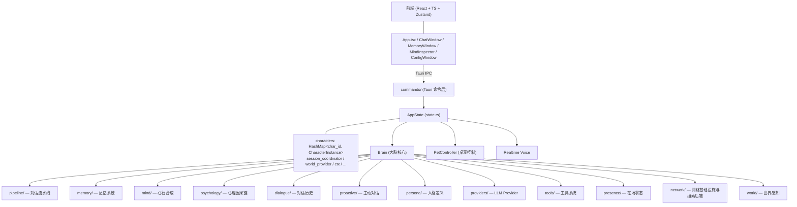

# Vivian 代码 Wiki

本文档按当前源码组织模块职责、数据结构与关键数据流。[README](README.md) 提供功能、安装和配置入门；本 Wiki 说明实现与边界。专题文档保留各次改动的测量与验证记录，不作为当前全量测试状态。

> 后端入口：[`src-tauri/src/lib.rs`](src-tauri/src/lib.rs)
> 前端入口：[`src/main.tsx`](src/main.tsx) + [`src/App.tsx`](src/App.tsx)
> 工具权限矩阵：`ToolRiskTier`（风险等级，6 级）× `AgentAccessLevel`（访问级别，4 级）经 `policy_for()` 决定 `allow`/`ask`/`deny`；定级规则见工具系统章节，具体等级以各工具 `risk()` 为准（工具 `risk()` trait 缺省 `Safe` 即放行，新工具须显式声明）。

---

## 目录

- [顶层架构](#顶层架构)
- [前端架构](#前端架构)
  - [前端构建（多窗口按需加载）](#前端构建多窗口按需加载)
  - [桌宠长按手势与施法动画](#桌宠长按手势与施法动画)
  - [心智观察器页面合并（MindInspector）](#心智观察器页面合并mindinspector)
    - [置顶摘要（PinnedSummary）](#置顶摘要pinnedsummary)
  - [暖纸主题（UI 视觉统一）](#暖纸主题ui-视觉统一)
  - [3D 公寓窗口](#3d-公寓窗口)
  - [ConnectionsPanel.tsx —— 外部连接页](#connectionspaneltsx--外部连接页)
  - [ToastWindow.tsx —— Toast 通知窗口](#toastwindowtsx--toast-通知窗口)
- [核心数据结构](#核心数据结构)
- [模块详解](#模块详解)
  - [brain/ —— 大脑核心](#brain--大脑核心)
  - [coding_agent/ —— 编程智能体](#coding_agent--编程智能体)
  - [task_service —— 自治任务与后台回流](#task_service--自治任务与后台回流)
  - [pipeline/ —— 对话流水线](#pipeline--对话流水线)
  - [cross_character.rs —— 跨角色通信总线](#cross_characterrs--跨角色通信总线)
  - [conversation/ —— 会话生命周期](#conversation--会话生命周期)
  - [memory/ —— 会话与证据记忆系统](#memory--会话与证据记忆系统)
  - [mind/ —— 心智合成层](#mind--心智合成层)
  - [psychology/ —— 心理学因果链](#psychology--心理学因果链)
  - [proactive/ —— 主动对话编排](#proactive--主动对话编排)
  - [skills/ —— 技能服务](#skills--技能服务)
  - [tools/ —— 工具系统](#tools--工具系统)
  - [自建工具系统（custom_tools）—— 能力自进化的执行侧](#自建工具系统custom_tools-能力自进化的执行侧)
  - [providers/ —— 多 Provider 路由](#providers--多-provider-路由)
  - [notebook/ —— 笔记系统](#notebook--笔记系统)
  - [network/ —— 网络基础设施与搜索后端](#network--网络基础设施与搜索后端)
  - [discovery/ —— 多平台内容发现与推荐](#discovery--多平台内容发现与推荐)
  - [browser_bridge/ —— 浏览器自动化桥](#browser_bridge--浏览器自动化桥)
  - [world/ —— 真实世界感知](#world--真实世界感知)
  - [dialogue/ —— 对话历史管理](#dialogue--对话历史管理)
  - [engine/ —— 桌宠表现层](#engine--桌宠表现层)
  - [presence/ —— 在场状态与后台任务](#presence--在场状态与后台任务)
  - [speech/ —— 语音系统](#speech--语音系统)
  - [commands/ —— Tauri 命令层](#commands--tauri-命令层)
  - [remote/ —— 远程访问 HTTP 服务](#remote--远程访问-http-服务)
  - [persona/ —— 人格定义与场景](#persona--人格定义与场景)
  - [emotion/ —— 情绪分类](#emotion--情绪分类)
  - [utils/ —— 通用工具](#utils--通用工具)
- [关键数据流](#关键数据流)
- [持久化模式](#持久化模式)
- [并发与锁策略](#并发与锁策略)

---

## 顶层架构


```mermaid
flowchart TD
    FE["前端 (React + TS + Zustand)"]
    FE_SUB["App.tsx / ChatWindow / MemoryWindow / MindInspector / ConfigWindow"]
    CMD["commands/ (Tauri 命令层)"]
    APP["AppState (state.rs)"]
    APP_SUB["characters: HashMap&lt;char_id, CharacterInstance&gt;<br/>session_coordinator / world_provider / ctx / ..."]
    BRAIN["Brain (大脑核心)"]
    PET["PetController (桌宠控制)"]
    VOICE["Realtime Voice"]
    MOD1["pipeline/ — 对话流水线"]
    MOD2["memory/ — 记忆系统"]
    MOD3["mind/ — 心智合成"]
    MOD4["psychology/ — 心理因果链"]
    MOD5["dialogue/ — 对话历史"]
    MOD6["proactive/ — 主动对话"]
    MOD7["persona/ — 人格定义"]
    MOD8["providers/ — LLM Provider"]
    MOD9["tools/ — 工具系统"]
    MOD10["presence/ — 在场状态"]
    MOD11["network/ — 网络基础设施与搜索后端"]
    MOD12["world/ — 世界感知"]

    FE --- FE_SUB
    FE_SUB -.->|Tauri IPC| CMD
    CMD --> APP
    APP --- APP_SUB
    APP --> BRAIN
    APP --> PET
    APP --> VOICE
    BRAIN --> MOD1 & MOD2 & MOD3 & MOD4 & MOD5 & MOD6
    BRAIN --> MOD7 & MOD8 & MOD9 & MOD10 & MOD11 & MOD12
```

### CharacterInstance（角色实例）

定义于 [`state.rs`](src-tauri/src/state.rs)。每个角色独立持有一份完整资源：

| 字段 | 类型 | 职责 |
|------|------|------|
| `id` | `String` | 角色 ID（`"vivian"` / `"nana"`） |
| `name` | `String` | 显示名称 |
| `brain` | `Brain` | 大脑核心，持有 memory/dialogue/psychology/persona/proactive 等所有子系统 |
| `pet_controller` | `Arc<PetController>` | 桌宠控制器，管理桌宠窗口与状态机 |
| `manifest` | `Arc<ResourceManifest>` | 模型清单，表情/动作映射 |
| `realtime_voice` | `Arc<RealtimeVoiceManager>` | 实时语音会话 |
| `think_lock` | `Arc<tokio::sync::Mutex<()>>` | 思考互斥锁，串行化 think 调用 |
| `online` | `Arc<RwLock<bool>>` | 在线状态 |

### AppState（全局状态）

[`state.rs`](src-tauri/src/state.rs) 的关键共享字段如下（省略语音、快捷键、启动标志等字段）：

```rust
pub struct AppState {
    pub config: Arc<RwLock<ConfigManager>>,
    pub characters: Arc<RwLock<HashMap<String, CharacterInstance>>>,
    pub active_character_id: Arc<RwLock<String>>,
    pub model_router: Arc<RwLock<Option<ModelRouter>>>,
    pub tool_system: Arc<ToolSystem>,
    pub browser_bridge: Arc<crate::browser_bridge::BridgeState>,
    pub skill_service: Arc<crate::skills::SkillService>,
    pub task_service: Arc<crate::brain::TaskService>,
    pub session_coordinator: crate::utils::SessionCoordinator,
    pub world_provider: Arc<WorldStateProvider>,
    pub ctx: Arc<crate::cordis::RuntimeContext>,
    // ...
}
```

世界状态与 Windows 监听跨角色共享；`CharacterInstance` 的心理、记忆和生成锁仍按角色隔离。`model_router` 先为空，初始化后安装路由器；保存配置后的完整重初始化由异步锁串行，避免同时构建多套资源。

---

## 前端架构

### 前端构建（多窗口按需加载）

桌宠由多个 Tauri 窗口组成（桌宠角色窗口 / Chat / Memory / Config / Bubble / Toast / SideChat / MessageBanner 等），每个窗口通过 `?view=` 参数加载不同的 React 组件。

- **逐窗口动态 import**（[`src/main.tsx`](src/main.tsx)）：`main.tsx` 不再静态导入全部窗口组件，而是按 `view` 参数对各自组件做 `await import(...)`。主窗口（无 view）只加载 App，不再打包 Chat / Memory / MindInspector / Config 等它用不到的代码，显著降低主窗口首帧解析量。
- **vendor 拆包**（[`vite.config.ts`](vite.config.ts)）：`build.rollupOptions.output.manualChunks` 将稳定依赖拆成独立 chunk —— `react`（react/react-dom/zustand）、`tauri`（@tauri-apps）、`i18n`（i18next/react-i18next）。多窗口共享这些 chunk 的高效缓存、并行加载。
- **target es2022**：WebView2 为常青 Chromium，无需为旧浏览器降级转译，减少产物体积。
- **按需 chunk 兜底**：其余依赖（mermaid 等）保持 Vite 默认基于动态 import 的按需拆包，不合并成单一巨型 vendor 包（避免本来懒加载的库被提前加载）。
- **Main 控制器窗口瘦身**（[`src/main.tsx`](src/main.tsx)）：隐藏控制器分支（`view=hidden_controller`）直接 return 不渲染任何 React 组件，同时跳过 i18n 初始化与 global.css 加载，仅保留最小 Tauri IPC 桥接层，消除控制器窗口的 UI 渲染开销。

### 桌宠长按手势与施法动画

桌宠窗口支持「按住不拖动满 1 秒**开关心智观察器**」手势，纯前端实现（Rust 零改动）：

- **动作是开关，不是「打开」**（`App.tsx` 的 `toggleMemory`）：窗口此刻已经摆在屏幕上（可见且未最小化）→ 最小化；其余情况（没开过 / 已最小化 / 被 hide）→ 走 `openMemory`（打开、提到前台、播入场动画）。判据用「在不在屏上」而不是窗口焦点：按下桌宠那一刻焦点就被桌宠窗口抢走了，子窗口的失焦回调还会顺手把它降回非置顶，等 1 秒长按成立时它早已不是前台窗口——按焦点判断的话最小化这条路永远触发不了。
- **托盘菜单与全局快捷键仍走 `openMemory`**（`onOpenMemory` / `window:shortcut` 的 `memory`），语义是明确的「打开」，不跟着变开关；`openMemory` 本身也保持原语义（打开/提到前台 + 入场动画）。

- **手势判定**（[`App.tsx`](src/App.tsx)）：挂在背景层根 `mousedown`（`handleBackgroundMouseDown`，宠物本体点击会冒泡到根 div；双角色窗口共用 App，天然覆盖所有桌宠）。`startHold` 同时起两个定时器：**100ms** 的预热（提前加载心智观察器窗口，见下一条）与 **200ms** 的进度环（到点挂载环形进度槽并调 `startCast(800)`）；进度环填满（总 1s）触发 `completeHold` → `stop_window_drag` 清后端 DRAG_OFFSET（用户仍按着左键，防止松手被甩飞采样解析）+ `releasePrewarm`（放行预热好的窗口 / 无预热时直接调 `holdActionRef` 的心智观察器开关 `toggleMemory`）；`holdCompletedAtRef` 吞掉触发后 500ms 内的 click 余波（不触发摸头台词）
- **长按预热：0.1s 就开始加载窗口，长按成立才让它上屏**（`prewarmMemory` / `releasePrewarm` / `abortPrewarmSession` / `finishPrewarm`）：窗口加载（WebView 冷启 + React 挂载 + 首屏数据）是这条链上最慢的一环，而长按判定要整整 1s——等到成立才去建窗口，用户松手后还得再干等一截（实测模型：挂载 120ms 时要等 355ms，冷启 1.5s 时要等 1735ms）。预热把这截等待吃干净，**代价是三条必须同时成立的约束**：
  - **预热期间一律不上屏**。预热 URL 带 `hidden=1`（`buildPrewarmQuery`）关掉 `main.tsx` 对子窗口「渲染完两帧就 show」的兜底；子窗口（`MemoryWindow`）认出 `prewarm` 参数后**只藏不播**（`useLayoutEffect` 里置 `opacity:0` 就返回，不调 `playPetReveal`）；`openWindow` 新增 `prewarm` 选项——与 `selfReveal` 一样不代显形，但**连 `armSelfRevealFallback` 都不挂**。兜底显形的前提是「这个窗口本来就该出现，只是显形链慢/断了」，而预热窗口该不该出现取决于长按成不成立，此刻还没有答案；挂了兜底就成了「长按没成立、窗口自己冒出来」。
  - **长按成立才放行，且要等子窗口接得住**。显形仍走 `pet:reveal` 事件，但「窗口建好」≠「子窗口挂好了监听」——两者之间隔着一整个页面冷启。子窗口在 `pet:reveal` 监听确实挂上之后广播 `pet:prewarm_ready`（全局 `emit`，因为子窗口不知道桌宠窗口的 label；桌宠按会话号比对，非本会话的回执丢弃）；`releasePrewarm` 拿到回执就立刻放行，拿不到则挂起并配 1.2s 上限（`PREWARM_READY_WAIT_MS`）——回执只是条事件，丢了不该让长按毫无反应。这条握手正是「松手即见」的来源：成立时窗口已就绪，放行只走几次 IPC。
  - **长按中止就销毁**。`cancelHold` → `abortPrewarmSession`：窗口是那次长按的私产，长按没成立就不留（心智观察器是整页应用，白留一份 webview 的内存不划算）。加载没跑完的也一并打断——句柄还没回填（窗口正在建）时不在中止处销毁，由预热链 await 到句柄后看到 `aborted` 再就地销毁，那里才不会和创建抢跑。销毁前有一道保险：窗口若已被别的入口摆上屏（长按期间用户又从托盘点了一次）就不关，那已经是用户要看的东西。**已存在但被最小化 / hide 的窗口走「认领」分支**（只标记就绪、不建新窗口），压根不会拿到销毁逻辑上——那种窗口里有用户可能没保存的输入。
  - 预热会话号带随机基数（memory 是共享窗口，两个角色桌宠各有一场预热时纯自增会撞车），随 URL 给子窗口、随回执带回来认领。
  - **预热窗口也把「窗口创建」这段异步窗口期暴露出来了**：`new WebviewWindow()` 返回时 label 还没进 Rust 注册表，这段时间 `getByLabel` 查不到、`CHILD_WINDOWS` 里却已有引用，第二次 `openWindow` 就会用同一 label 再建一次（必然 label 冲突，对外表现是「点了毫无反应」）。`openWindow` 因此新增 `WINDOW_CREATION` 表：同 label 有创建在飞时先等它落地（`tauri://created` / `error` / 3s 超时任一解开）。
- **环形进度槽**（[`HoldProgressRing.tsx`](src/components/HoldProgressRing.tsx)）：SVG 双圆环（半透明深色轨道 + 白色进度弧），白色弧用 **Web Animations API**（`el.animate`）把 `strokeDashoffset` 从整圈周长线性跑到 0，从 12 点方向顺时针填满；完成信号取动画的 `finished`（动画被 cancel 时它会 reject，这种情况不算完成），系统开了「减弱动态效果」或拿不到动画能力时直接判满，保证长按不会被卡住；`pointerEvents: none` 不影响拖拽/穿透判定。**这里必须是 WAAPI，不能退回 CSS 声明式动画**——CSS 要求元素的 `animation-name` 在**首次样式计算时**就能匹配到 `@keyframes`，而本组件的时长与圆周长都由 props 和圆几何在运行时算出，规则后到的话 Chromium 不会为它回溯启动动画，进度弧会一直停在 0 长度（只剩一条空槽），最后只有兜底定时器在收尾
- **取消路径三合一**（`cancelHold`）：`window mouseup` / `onMoved` 窗口位移超 `HOLD_MOVE_TOLERANCE_PX`(10 物理px) / 后端 `drag:cancelled` watchdog；三条路径统一清两个定时器（进度环 + 预热）并作废预热会话。拖动判定必须用窗口位移——拖拽时窗口跟随光标移动，client 坐标的 mousemove 检测不到；`startHold` 记录按下时 `outerPosition` 作基准。时长/容差常量集中在 App.tsx 顶部：`HOLD_PREWARM_DELAY_MS=100` / `HOLD_RING_DELAY_MS=200` / `HOLD_OPEN_TOTAL_MS=1000` / `HOLD_MOVE_TOLERANCE_PX=10` / `PREWARM_READY_WAIT_MS=1200`
- **施法动画会话**（[`ChibiPetCanvas.tsx`](src/components/ChibiPetCanvas.tsx)，`startCast` / `cancelCast` / `stopCast`）：施法与进度环同步——进度环出现时起播，每帧时长按 `durationMs / 素材总时长` 等比缩放（下限 16ms，保持原作节奏），约 0.8s 播完与环填满对齐；12 帧 4×3 雪碧图帧推进走 `sequenceTokenRef` 令牌，会话 `{token, 当前帧, 帧时长表}` 记在 `castSessionRef`。取消时从当前帧倒放回初始帧再归位 idle；`stopCast` 供完成路径兜底归位（不倒放）；`startHold` 开头先 `stopCast`，避免上一段取消倒放与新会话叠加
- **窗口已在时不重建、由子窗口自己显形**（`App.tsx` 的 `openWindow` + [`utils/petReveal.ts`](src/utils/petReveal.ts)）：从「不在屏上」的状态长按（没开过 / 已最小化 / 被 hide，含托盘菜单与快捷键入口）时，既不重建也不 navigate（前者 label 冲突，后者整页 reload 会丢页签与输入），而是「提到前台 + 让子窗口自己再播一遍入场」。桌宠把当前窗口矩形随 `pet:reveal` 事件发给 memory 窗口，**播哪一条动画由子窗口按「此刻在不在屏上」自己选**——只有它看得到自己的最小化状态，两条路径对「显形」的假设又正好相反：

  - **在屏上（可见且未最小化）→ `replayPetReveal`**：先 180ms 收拢回桌宠矩形、再 340ms 展开，展开段与首开逐帧一致（差别只在多了一段收拢）。内容已经在屏上，直接压到起手帧会是一次「全屏啪地塌成小卡片」的可见跳变，而 hide/show 又会闪、会抖 Z 序，所以只能靠收拢过渡。
  - **不在屏上（被最小化 / 被 hide）→ `playPetReveal`**：与首开同一条路，先把首帧摆成桌宠大小再显形。这里没有「别跳变」的约束，但有一个必须避开的坑：若照旧先还原窗口，那次还原本身就是一次呼出，随后的收拢展开是第二次——看起来就是「呼出了两回」。`playPetReveal` 因此自己负责还原（`unminimize` 夹在「摆好首帧」与「show」之间，最小化时未最小化窗口是无操作，可无条件调用）。

  显形时机因此整个归子窗口：`raiseWindow` 对这类窗口带 `selfReveal`，只做置顶与聚焦，**完全不碰可见性**（连 `unminimize` 都不做，「等还原落定」那段轮询也只在非 selfReveal 时跑）；两个入口（创建 / 复用）都用 `armSelfRevealFallback` 兜底——事件丢失或子窗口脚本异常时 1.6s 后强制显示，宁可直接显形没动画，也不能让长按毫无反应（**唯一的例外是预热窗口**，见上一条：它此刻该不该出现还没定，兜底显形会变成「长按没成立窗口自己冒出来」）。预热窗口的显形也落在同一个 `pet:reveal` 上——那就是它第一次上屏的信号，此刻窗口必然不在屏上，自然走 `playPetReveal`。重复通知用 `replayBusyRef` 互斥。复用判定只有一条规则：`isVisible()` **抛异常**才算引用失效（窗口已销毁）；它返回 false 只说明窗口被 hide 过，仍按复用处理、由 `raiseWindow` show 回来。窗口还在却去重建必然 label 冲突，而 Tauri 对冲突只在 console 打一行 `tauri://error`，对外表现就是「点了毫无反应」——同理，复用分支里任何窗口动作（设 topmost / 聚焦 / 改属性）都必须单独兜异常，不能让它的失败把活着的窗口判成死的

#### 轻触反馈与拖动锁

[`ChibiPetCanvas.tsx`](src/components/ChibiPetCanvas.tsx) 在独立变换层播放 420ms 压缩回弹，减少动态效果时跳过；不覆盖角色姿态与帧序列。连续轻触仍按烦躁阈值触发对应表情。

[`commands/window.rs`](src-tauri/src/commands/window.rs) 的拖动路径在调用同步 Win32 窗口移动前释放状态锁，避免窗口消息重入互锁。按下状态、持续姿态与动作序列分开管理；长按进度、拖动取消及轻触反馈不能互相吞掉事件。

#### 等待回复与思考循环

[`replyWaiting.ts`](src/chibi/replyWaiting.ts) 按 `stream_id` 跟踪从发送消息到首个可见文本的等待期。[`ChatController.ts`](src/controllers/ChatController.ts) 在调用后端前广播 `chat:waiting`；`chat:start` 可重复到达，不能让已经输出首字的流重新进入等待。`ChibiPetCanvas` 使用非 promptable 的 `thinking` 循环，与一次性的 `think` 表情复用图集。

- 空白 chunk 不结束等待；有文字的回复优先于另一条排队回复。
- done、error、cancelled、config_error、presence_blocked、yielded 与前端 `chat:waiting-ended` 都清理对应流。取消成功但没有 done 的后端路径显式发送 `chat:cancelled`。
- 前端会话保存目标角色 ID，结束等待事件沿用请求目标，避免多角色发送失败时通知错误角色。
- 思考期间临时表情、动作和 TTS 收尾不能覆盖循环；拖动仍可交互，结束后回到当前基准姿态。

回归检查：`node tests/reply-waiting.test.mjs`。

### 心智观察器与工作台（MindInspector）

Memory 窗口内嵌 [`MindInspector.tsx`](src/components/mind-inspector/MindInspector.tsx)。侧边栏由 [`design-system.ts`](src/components/mind-inspector/design-system.ts) 定义六个一级入口：

- 心智（`mind`）：`MindPage` 展示心智状态，使用 `ClaudeTheme.css` 的公共主题。
- 记忆（`graph`）：`MemoryPage` 展示长期记忆、共同经历、对话记录和画像；旧 `profile` 跳转定位画像层。
- 日记（`diary`）：`DiaryPage` 展示角色日记。
- 笔记（`notebook`）：`NotebookPage` 管理独立笔记与 Markdown 编辑。
- 计划（`planner`）：`PlannerPage` 合并待办与调度，保留 `todo` / `scheduler` 子视图定位。
- 工作（`code`）：`CodeAgentPageNew` 提供会话、对话流、工作区与终端。

日记、笔记和计划共享 `RecordTheme.css`。旧综合页、创作聚合页、世界卡片和对话试验页面已移除；历史导航键经 `resolveNav` 映射到当前入口。窗口封面保留拖拽区、日期、最小化与关闭按钮，页面工具栏通过 `NavigationContext.setHeaderExtra` 注入。

#### 置顶摘要（PinnedSummary）

主工作区右侧的信息列，仿 Codex 的「环境信息」面板，实现于 [`pages/PinnedSummary.tsx`](src/components/mind-inspector/pages/PinnedSummary.tsx) + [`CodeAgentPage.css`](src/components/mind-inspector/pages/CodeAgentPage.css) 的 `.codex-pinned*`：

- **形态**：**贴在主工作区右缘的一条信息列**（`position: absolute`，`right: var(--codex-sb-w)` 紧贴对话滚动条的左边），不是占位的 flex 列。对话区 / 输入区 / 统计行 / 「回到底部」按钮统一用 `padding-right` 让出 `--codex-pinned-reserve`，所以面板既不盖正文，又不会把滚动条挤到自己左边（滚动条属于铺满整条宽度的 `.codex-chat`，恒在最右侧）。面板与对话区之间**没有分隔线**（`border-left` 已删）——分隔靠底色与留白，不靠线。`codex-main-col` 带 `position: relative`，同时给 `.codex-pinned` 和 `.codex-to-bottom` 当定位基准
- **宽度策略**：三个常量构成优先级——`PINNED_W_IDEAL`(250) / `PINNED_W_MIN`(186) / `CHAT_MIN_W`(430)：先保证对话区 border-box 至少 430（= 工作区宽 − 面板宽），剩下的才给面板；面板自己也不低于 186（再窄「提交或推送」那排按钮会换行）。父组件用 `ResizeObserver` 量 `codex-main-body`，把宽度写成 `.codex-main-col` 上的四个 CSS 变量：`--codex-pinned-w`（动画值，收起为 0）、`--codex-pinned-w-expanded`（展开值，收起期间不变，内层靠它维持展开宽度做裁切）、`--codex-pinned-reserve`（= 面板 + 呼吸缝 `PINNED_GAP_W`(18)，收起为 0）、`--codex-sb-w`（实测滚动条宽）。首帧用 `useLayoutEffect` 同步量一次，否则初始那次宽度变化会被当成动画播一遍。**面板宽度不再走 prop**，宽度策略只该有一个出处
- **让位怎么合成**（`CodeAgentPage.css`）：四处统一用 `max(基准内边距, --codex-pinned-reserve)`。展开时 reserve 远大于基准（≥186+18），正文右缘恰好停在面板左侧 `PINNED_GAP_W`=18px 处（就是「刚好不遮挡」）；收起时 reserve 归零，`max()` 取回基准，左右内边距重新对称。**基准值必须由主题声明成变量**（`--codex-chat-pad-x` / `--codex-composer-pad-x` / `--codex-to-bottom-right`），不能写死在让位规则里——让位规则是 `.codex-main-col .codex-chat`（0,2,0），而主题的 `.mind-main[data-ui-style="minimal"] .codex-chat` 是 0,3,0、窄屏那条 `.mind-inspector-root.is-work-page .workbench-root .codex-chat` 是 0,4,0，写死会被整条盖掉（实测展开时右内边距仍是 34px、窄窗下正文被压住 196px、输入卡片被压住 205px）。滚动条槽在 border 与 padding 之间，正文可用宽本来就减掉了它，所以 reserve **不加**滚动条宽；只有浮动按钮的 `right` 要额外加 `--codex-sb-w` 才能和正文列右缘对齐
- **收放动画**：摘要保持固定展开宽度，仅用 `clip-path: inset()` 从上往下揭开、从下往上收起。`--codex-summary-duration: 0.6s` 与 `--codex-summary-easing` 同时控制正文 / 输入区的 `padding-right` 和统计详情的右侧留白，让阅读区同步平滑挤压、恢复。收起后的 `visibility` 延迟相同时长；拖拽调宽、空间不足自动隐藏以及减少动画偏好下关闭相关过渡。
- **输入框不再有蓝色焦点框**：`.codex-composer-textarea` 自身写了 `outline: none`（0,1,0），但 `MindInspectorThemes.css` 的通用 `.mind-inspector-root .workbench-root textarea:focus-visible { outline: 2px solid var(--codex-accent) }`（0,3,1）压过它——手账主题的 accent 是印章青蓝 `#537d96`，于是聚焦时卡片里凭空多一个青蓝框。现在按 0,4,0 加了一条例外把 `.codex-composer-textarea` / `.codex-pinned-input` / `.codex-pinned-select` 设回 `outline: none`，焦点提示改由 `.codex-composer:focus-within`（描边色 + 阴影）承担
- **底色**：`--codex-pinned-bg`，极简主题下覆写为纯白（浅色 `#fff`）/ `#242424`（深色）；其余主题退回 `--codex-paper-card`。**深色那两块（`@media prefers-color-scheme` 与 `:root[data-theme="dark"]`）都要声明**——浅色块同样命中深色环境，漏一处卡片会保持纯白，在深色界面里刺眼
- **显隐开关**：顶栏便签按钮（`StickyNote`，`aria-pressed` 同步状态）控制整块面板的收起 / 呼出。可见性落盘 `localStorage['vivian.code_agent.pinned_summary_visible']`，**默认展开**——只有显式存过 `'0'` 才默认收起，把「用户主动关过」和「从没设置过」区分开。面板不可见、或环境信息卡收起时不轮询 git。每张卡片内部仍可单独折叠；环境信息卡收起时若工作区脏则显示暖色圆点，避免收起来就失明。注意极简主题把 `.codex-icon-btn` 背景统一压成 `transparent !important`，`MindInspectorThemes.css` 里按 `aria-pressed`/`aria-expanded` 把「已开启」态补回来，否则看不出按没按
- **环境信息**（git 仓库状态）：变更 `+N -M` 与改动文件数 / 本地（仓库目录名）/ 分支（detached 时显示「游离 HEAD」）/ 同步（领先 · 落后 · 未设置上游分支）/ 最近提交（短 hash + 说明 + 时间）。数据来自 `git_repo_status`，工作区或折叠态变化时立即拉一次，之后**仅窗口可见时**每 8 秒轮询（`document.visibilityState`）；请求带序号（`reqSeq`），工作区切得快时旧响应不会覆盖新状态
- **写操作**：`提交或推送`（内联表单，Enter 提交 / 按钮提交并推送，**执行前弹确认框**并写明「会暂存全部改动」与目标仓库名）、`比较分支`（拉 `git_list_branches` 填下拉，默认选中推测基准，出 `git_branch_diff` 的领先/落后/增删/提交列表）。无未提交改动时提交按钮禁用
- **来源**：`list_plugins` / `list_skills` / `list_mcp_servers` 三份清单并行拉取后汇总计数，展开可看插件明细（绿=trusted 生效 / 黄=changed 待重认 / 灰=untrusted）；「已装载」只数 `status === 'loaded'`，跳过的插件不计入
- **不做 PR 集成**：Vivian 没有 PR 状态源，就不摆一行「无法获取 Pull Request 状态」凑数——同步行如实汇报上游分支情况
- **后端**：[`commands/git.rs`](src-tauri/src/commands/git.rs)，全部走系统 `git` CLI（`-C <dir>` 指定目录，不依赖进程 cwd），不引入 libgit2/git2。`-c core.quotepath=false` 必须带，否则中文路径会变成八进制转义串；Windows 下 `CREATE_NO_WINDOW` 必须加，否则每次轮询闪一次黑框。未跟踪文件的行数单独统计（`git diff --numstat HEAD` 看不见它们），计入「变更 +N」，带 200 文件 / 2MB 预算上限防大目录卡顿

**兼容跳转**：`resolveNav` 将 `overview` 映射到心智、记忆或画像，将 `journal` 映射到日记、笔记或计划；`profile` 定位记忆页画像层，`todo` / `scheduler` 定位计划子页。URL 参数、`nb_id` 与 `memory:navigate` 沿用当前导航上下文。

#### 会话搜索与记忆高亮

[`SessionSearch.tsx`](src/components/mind-inspector/pages/SessionSearch.tsx) 用原生 modal dialog 提供焦点隔离与关闭后的焦点恢复，入口位于工作页侧栏、顶栏及 `Ctrl+K`。`searchIndex.ts` 在会话数据变化时建立本地索引，搜索标题、工作区及 user/assistant 消息，不搜索原始工具输出；多关键词全部匹配，标题命中优先，其余按最近更新时间排序，最多展示 50 项。结果保留命中附近的文本摘要、工作区、运行状态与关键词高亮。方向键选择，Enter、点击或 Alt+1–9 调用既有 `switchSession`，不会发送任务或访问搜索服务。

`MemoryPage.tsx` 在已有筛选结果中高亮正文、引用证据、待跟进条件及最近交流；关键词转义后按字面匹配，不将输入作为正则表达式执行。搜索弹窗适配手账、极简与窄窗口。

#### 原始对话记录与用户画像同步

[`MemoryPage.tsx`](src/components/mind-inspector/pages/MemoryPage.tsx) 将主动问候与近期对话合并为「对话记录」，其余分类为长期记忆、共同经历与用户画像。已整理的原始发言仍可展示；归档存储的保留策略继续由记忆子系统管理。

[`memoryPresentation.ts`](src/components/mind-inspector/pages/memoryPresentation.ts) 将后端统一会话投影直接呈现；不读取旧对白记忆，也不在历史为空时回填。标题、消息 ID、说话者、受众、时间范围及贴纸均来自原始记录。同一会话内广播、单聊和参与者变化不拆分卡片，参与者名单与标题累积更新；运行会话 ID 不再决定分组，后台评估真实交流的结束与重新开启。每张对话卡片默认预览六条，支持展开全部、手动整理，以及独立切换原文与摘要，不改变其他卡片或整个板块。长期记忆的证据链接可定位原会话。仅原始对白的括号动作显示灰色斜体，长期记忆、摘要与事件进展使用普通文本。

- `MemoryPage` 同时读取 get_memories 与 get_memory_conversations，监听 memory:updated / dialogue:changed / chat:history-cleared，并合并刷新。
- 同一会话不因气泡、聊天窗或微信渠道变化而拆分；运行会话 ID、主题和固定 30 分钟窗口不决定边界，广播与参与者变化不拆分。摘要保留确切来源，不跨会话语义合并。
- 新事实不再使用 topic_summary 标签；读取仅认明确的 record_kind。程序拼接 exchange_record、OS 和会话摘要不作为共同经历卡片。

#### 整页纸面的左右留白与滚动条（心智 / 记忆 / 日记·笔记·计划）

这四页是**整页纸面**：`.memory-page` / `.claude-surface` / `.record-scope` 都带 `.claude-theme`，于是 ClaudeTheme.css 的 `.mind-page-content:has(.claude-theme)` 会把外壳为手账留的那圈内边距清零，**左右留白只能由页面自己给**。这条约束最容易漏，漏了就变成「卡片几乎顶到窗口两侧」。

**外壳只给了左边那 16px，右侧没有对称的一份。** `.mind-sb-body` 是 `padding-left: 16px`（给左缘呼出热区留呼吸位），没有 `padding-right`。于是每个整页纸面的内容都离左缘比离右缘近 16px，整页看着偏左。1440 宽实测（修复前）：

| 页面 | 左留白 | 右留白（到滚动条） | Δ |
|---|---|---|---|
| 心智 `.claude-surface` | 64.0 | 48.0 | −16 |
| 日记·笔记·计划 `.record-scope` | 59.2 | 43.2 | −16 |
| 记忆 `.memory-page` | 20.0 | 4.0 | −16 |

补法只有一处：**`.mind-page-content:has(.claude-theme) { padding: 0 16px 0 0 }`** —— 把那 16px 加在**滚动容器**的右侧内边距上。容器的 padding 落在「页面」与「滚动条」之间（滚动条画在 padding box 之外，仍贴窗口右缘），所以这 16px 变成纯留白，滚动条位置不动；一条规则覆盖全部三族（Δ 全为 0），而且命中的正是**同一批页面** —— 这个 `:has(.claude-theme)` 本来就等于「整页纸面」的集合。

另外两种补法都试过并量过，都否掉：

- **给 `.mind-sb-body` 加 `padding-right: 16px` —— 错。** 它会缩窄 `.mind-main`，把滚动条一起推进来 16px（实测「滚动条距窗口右缘」0 → 16px），滚动条变成悬在窗口里、右边还留一道缝；而且因为滚动条又吃掉 12px，Δ 依旧是 −16，根本没修好。
- **每个页面自己左补偿（`padding-left: calc(gutter - 16px)`）—— 能修好但不要。** Δ 确实变 0，代价是要在三份页面样式里各写一遍，新加一个页面就会忘，等于把同一个知识复制 N 份。

要点：

- **工作页必须排除在外，而它是自动排除的**：`CodeAgentPageNew` 不挂 `.claude-theme`，够不着上面那条规则。这是对的 —— 它的 `.mind-page-content` 自带**故意不对称**的 padding（手账下 `0 14px 16px 4px`、极简下 `0`，视觉 20/14），再叠 16px 会把右留白推到 30px，从「偏左」变成「偏右」；而且工作台的宽度是运行时量的（`ResizeObserver` + `--codex-sb-w`），外壳的视觉留白不该去改它的可用宽度。回归判据：工作页实测仍是 20/14。
- **多出来那 16px 条带不会露馅**：它露出的是窗口根的纸面，而 `.mind-inspector-root.is-claude` 与 `.claude-theme` 声明同一支 `--claude-bg`（当初就是为了「外壳与内容同一张纸」），像素级实测两侧同色（浅色 `250,249,245`、深色 `38,38,36`）。
- **判据要把滚动条当窗框**：右留白 = `滚动条左缘 − 内容盒右缘`（无滚动条时才退化为窗口右缘）。若按窗口右缘量，12px 的滚动条会被算进右留白里，于是「滚动条贴窗口缘 + 两侧留白相等」这条**永远判不过**，会把人往「把滚动条推进来」那个错解上带。滚动条车道用 `clientLeft + clientWidth` 反推，别猜。
- **记忆页额外把自己的滚动条藏掉**（`MemoryPage.css`）：`.mind-page-content:has(.memory-page) { scrollbar-width: none }` + 同选择器 `::-webkit-scrollbar { display: none }`。滚动容器是外壳的 `.mind-page-content`，只对记忆页生效、不动兄弟页。这里的标准属性与 webkit 规则**都指向隐藏**，不适用「滚动条」一节里「标准属性顶掉自定义样式」那条警告；副作用是槽位归零、整页宽度恒定，内容增减不再横向跳动。滚动功能不受影响（滚轮 / 触控板 / 键盘）。
- **记忆页自己的留白**：`--memory-gutter: clamp(20px, 3.4vw, 48px)`，`padding: 6px var(--memory-gutter) 32px`。**左右同值即可** —— 外壳那圈已经等宽，不用再补偿；右侧也不用为滚动条补偿，因为滚动条已藏。视觉留白 = 16（外壳）+ gutter。
- **窄屏兜底要排除记忆页**：`@media (max-width: 760px) { .claude-theme:not(.memory-page) { padding: 22px 16px 36px } }`。`:not(.memory-page)` 是必须的：那条媒体查询在源码顺序上晚于 `MemoryPage.css`，不加排除会静默把记忆页自己声明的 gutter 覆盖成 16px。（记忆窗口 `minWidth: 1260` 且 `resizable: false`，这条窄屏路径当前不可达，属防回归。）
- **验证手法**（免构建，脚本属本地 dev 工具、不入库）：预览页复刻**完整祖先链**（含 `#root` 挂载层）+ 各族真实标记，链接真实 CSS 文件，用 CDP `Runtime.evaluate` 量。两个坑：
  1. **外壳不能叫 `#root`**。`global.css` 有 `html, body, #root { background: transparent !important }`，而真 app 里 `#root` 是 React 挂载点、是外壳的**祖先**。预览页若把外壳也叫 `#root`，纸面会被打成透明，量出来的底色是假的（本次就先把「右侧有接缝」误报了一次）。
  2. **别用多列容器里的卡片当右边界**：`.memory-entry` 在两列 masonry 里，右边缘是列边界，拿它算右留白会得到假 FAIL。
  判据十条：三族左右留白相等（±1px）、滚动条仍贴窗口右缘、工作页保持 20/14、`nav-dock` 恒贴窗口左缘且宽度符合各族设计值（浏览页 24 / 工作页 8，后者由 `WorkbenchPolish.css` 收窄）、封面条左右对称、记忆页槽位 0、心智/记录页槽位 12，外加 CDP `Input.dispatchMouseEvent` 真滚轮让 `scrollTop` 前进（「能滚」不能只靠 `scrollHeight > clientHeight` 推断）。实测 1440/1920/1260/700 × 浅色/深色 **全部 10/10**，记忆页专项 8/8，兄弟页 2/2。

#### 跨会话事件时间线

共同经历按现实事件而非会话归组。巩固模型在同一次原文整理请求中独立输出 `events`；没有事件必须输出空数组。每个事件包含已有事件 ID（或 null）、具体标题、planned / started / progressed / completed / cancelled 阶段、本次进展、用户原消息 ID、逐字证据和置信度。计划不能冒充完成；普通寒暄、资料偏好、角色猜测或幻想不创建事件。同一主题下的不同活动不能仅凭主题合并。

`session_summary.rs::validate_events` 校验用户说话者、当前字符切片中的原话、置信度至少 0.85，以及已有事件 ID 是否存在。新事件 ID 由首条证据消息与标题生成；后续会话由模型从有限事件目录中选择同一 ID，不能虚构 ID。事件进展随 `SummaryPart.events` 与分段水位一起原子保存，不增加独立模型请求，也不把摘要再次作为事件抽取输入。旧无事件字段的分段不复用，后台或手动更新摘要时从保留的原文重新整理。

`sharedEventTimeline` 从有效分段的事件数据投影时间线，按事件 ID 聚合、按原话 ID 去重，每条进展重新核验规范历史中的用户证据，解析当前所属会话以适应重新分组。卡片内进展按原话记录时间升序，事件按最近进展排序，标注时间为“记录于”，不推测实际发生日期；可查看证据并定位来源会话。搜索涵盖标题、进展与原话。事件目录有请求体预算上限，模型关联质量取决于所选 consolidation 模型；UI 不按文本相似度强行合并事件。

结构化画像独立保存于 `user_facts.json`。`BrainChatChain` 在真实用户输入完成流水线后单独异步更新画像，不等待三轮 AutoExtractor 或会话压缩，也不处理插话指令和其他角色的发言。普通聊天先走 simple_judge 的 extract/skip 判断，有明确资料才使用 memory 路由做结构化抽取；source_quote 必须存在于用户原话，姓名保留原始拼写，锁定字段不自动覆盖。更新后 `MemoryManager` 发出 `user-facts:updated`，画像页按角色刷新。

首次读取缺少姓名的画像时，`get_user_facts` 从保留的实际用户记录中优先选择自我介绍和最近发言（最多 40 条、8000 字符），尝试一次历史补全，只填空缺基础字段，不覆盖既有资料。抽取与补全在 UserFactStore 内串行；失败允许后续读取重试，已有姓名不重复补全。

回归检查：`node --experimental-strip-types tests/memory-presentation.test.mjs`；`cargo test --manifest-path src-tauri/Cargo.toml --lib profile_regression_tests`。

### 暖纸主题（UI 视觉统一）

心智观察器与设置窗口（`ConfigWindow`）共用一套「暖纸信纸」视觉基调，由三处集中 token 驱动：

- **颜色 token**（[`global.css`](src/styles/global.css)）：`--panel-*` 三块（深色默认 / 浅色跟随 / 浅色强制）重映射为「纸本 + 墨 + 印章青蓝」，对齐宣纸质感——纸张 `#F5EFE4` / 浮起卡 `#FBF7EE` / 侧边栏 `#EFE8DB`；墨色 5 档（浓墨 `#2A2622` → 极淡墨 `#8F867B`）；分割线 `#D8CFBE`；唯一强调色「印章青蓝」`#537D96`（hover `#3F6179`）；语义色克制墨染（成功墨绿 `#4A6B4A` / 危险深朱 `#8B2C1F`）
- **质感**：`.scrapbook-bg` 用多层 `radial-gradient` 模拟宣纸颗粒与暖斑（无需外部图片）；`.scrapbook-card` 收为 1px 细边框 + 3px 极小圆角；全局滚动条改用 `--panel-scrollbar` token（浅色下不再不可见）
- **排版**（[`design-system.ts`](src/components/mind-inspector/design-system.ts)）：正文切衬线（`Noto Serif SC` / 宋体家族），英文/数字装饰标题保留手写体（`Caveat`）作点缀；圆角 token 极方化（控件「印章取方」：xs 2px / md 4px / xl 8px），呼应信纸邀纸感

页面侧边栏外壳在 `MindInspector.tsx` 挂 `scrapbook-bg` 纸纹底、激活高亮线用印章青蓝；`ConfigWindow` 根容器同样挂纸纹并切衬线字体。视觉整体由 token 层驱动，切换深/浅主题时暖纸调性保持一致。

### 3D 公寓窗口

3D 公寓已完整移入独立 npm workspace [`plugins/3d-apartment`](plugins/3d-apartment/README.md)。Three.js、场景、导航、碰撞与模型均由插件维护；宿主不导入场景源码，也不把房间资源放入主 `dist/`。

| 环节 | 实现与约定 |
| --- | --- |
| 主程序构建 | 根 `npm run build` 只构建主前端，并通过 [`check-apartment-plugin.mjs`](scripts/check-apartment-plugin.mjs) 的 `--core` 检查外置边界。 |
| 插件构建 | `npm run build:apartment` 执行插件类型检查与独立 Vite 构建，再由 [`package-apartment.mjs`](scripts/package-apartment.mjs) 打包清单、`ui/` 和 `room/` 模型为 ZIP。 |
| 配套发行 | [`package-small.mjs`](scripts/package-small.mjs) 先构建插件，再构建基础 NSIS 安装程序，将 setup、插件 ZIP 和校验信息输出到 `release/`。 |
| 安装 | [`apartment-installer.nsh`](src-tauri/windows/apartment-installer.nsh) 从 setup 同目录读取 ZIP；没有 ZIP 时不能勾选。校验 SHA256、清单和路径后在临时目录装配、替换，失败恢复旧插件。静默安装默认基础程序，`/APARTMENT` 可选安装，`/NOAPARTMENT` 优先。 |
| 运行门禁 | [`commands/apartment.rs`](src-tauri/src/commands/apartment.rs) 检查安装状态与 `base.apartment_enabled`；设置 → 通用控制已安装插件的启用状态，未安装或禁用时入口与快捷键不可开启房间。 |
| 宿主接口 | [`commands/apartment_host.rs`](src-tauri/src/commands/apartment_host.rs) 提供通用世界快照；插件 [`hostContract.ts`](plugins/3d-apartment/src/hostContract.ts) 声明消费字段。宿主还负责窗口、桌宠隐藏/恢复与 Windows ESC 看护。 |
| 动态加载 | [`main.tsx`](src/main.tsx) 的 `?view=room` 与 [`apartmentLoader.ts`](src/utils/apartmentLoader.ts) 按安装状态加载插件；发布版挂载独立 `ui/room.js`，模型由插件 [`apartmentAssets.ts`](plugins/3d-apartment/src/apartmentAssets.ts) 定位。 |
| 开发预览 | 根 `npm run dev` 后访问 `/plugins/3d-apartment/preview.html`；场景入口为插件 [`RoomScene.tsx`](plugins/3d-apartment/src/RoomScene.tsx)。 |

房间保留观察者与第一人称模式，天气和时段来自真实世界快照。修改场景后单独检查插件类型、构建、导航与碰撞；主前端构建通过并不代表插件或安装流程已通过。安装包仍需实际检查可选安装、禁用、重新启用和卸载。

### ConnectionsPanel.tsx —— 外部连接页

设置页的「外部连接」页（`src/components/ConnectionsPanel.tsx`）合并了原先分散的两处入口：独立的「浏览器」页 + 工具页里的 MCP 区块。合并依据是两者同属「给 AI 接外部能力的连接」，只是方向相反——内置连接器由扩展反向连入，MCP server 由 app 拉起子进程。

- **内置连接器区**：浏览器桥卡片（连接状态 + 从 `list_tools` 实时取 `mcp__browser__*` 工具清单 + 扩展安装引导），未连接时展开三步引导
- **凭据状态子区**（卡片内，不与 MCP Servers 并列）：平台登录态网格。**它不是连接、也不提供任何工具**——只是扩展 Cookie 哨兵探测出的 `HashMap<String, bool>`（`server.rs::report_platform_status`），唯一消费方是 `discovery/sources/*` 的被动采集器。放在桥卡片内可避免用户误以为「登录某平台即获得该平台工具」
- **MCP Servers 区**：原工具页的 MCP 增删改 UI，状态与加载逻辑一并从 `ConfigWindow` 迁入本组件（`ConfigWindow` 不再持有 `mcpServers` / `mcpEditing` / `mcpSaving`）

### ToastWindow.tsx —— Toast 通知窗口

屏幕右下角的通知体系：每个在线角色一个独立透明窗口（`${charId}_toast`）+ 启动期专用的 `startup_toast`。全部窗口几何一致（宽 400/360、**高度固定为屏幕的一半**、贴屏幕右下角），纵向错开交给跨窗口堆叠协议（[`toastDedup.ts`](src/utils/toastDedup.ts) 的 `STACK_ORDER`，各窗口广播占用高度 `toast:stack`）。

- **半屏高是容量管理的前提**：可用高度 = 窗口高 − 上下留白 − 跨窗口偏移，是一个确定常量。窗口若随内容伸缩，增删条目与重新测高之间必有一帧错位，那一帧里顶部 toast 就会被窗口边界裁掉——这正是旧实现（按 scrollHeight 自适应窗口）偶发被裁的根因
- **堆叠是位移驱动**：条目全部 `position:absolute; bottom:0`，垂直距离写进 `transform`（`StackSlot`，负责布局盒测高与退场动画）。增删条目 = transform 过渡的平滑滑动，没有 flex 重排的一帧跳变；从顶部淘汰一条时下方条目的位置本来就不变，无需做高度塌陷动画
- **先出后进**：新 toast 一律以 `phase:'queued'` 入队，`实地高度 + 间隙 + 估算高度 ≤ 可用高度` 才放行；放不下先从最老的开始标记 `exiting`（滑出淡出），等退场条目摘干净再放行下一条——排序上"正在退场"的窗口不会准入新条目，避免一边出一边进时中间仍是溢出态。确认卡与原地刷新条目（`inplace`）不可被淘汰；无处可让时直接放行——宁可顶部被裁也不吞消息
- **区域级点击穿透**（[`commands/toast_hit.rs`](src-tauri/src/commands/toast_hit.rs)）：窗口是一整块真实 HWND，透明 ≠ 不挡鼠标，而 WM_NCHITTEST 返回 HTTRANSPARENT 不能跨进程递点击，唯一手段是 `set_ignore_cursor_events`。前端只把「确认卡 / 带 action 按钮的 toast」的**布局盒**（`offsetLeft/offsetWidth/offsetHeight`——不能用 `getBoundingClientRect`，堆叠位置与入场退场都是 transform，后者会把动画中间态量成最终位置且不会再有渲染来纠正）上报 `set_toast_hit_regions`；Rust 侧 8ms 轮询光标，命中矩形才关穿透，且**只在状态翻转时下发**——该调用会改写 GWL_EXSTYLE 并触发 SWP_FRAMECHANGED 使透明窗口整块重绘，桌宠历史上"每 60ms 无条件调用"的持续闪烁即源于此。无可交互区域时轮询线程直接退出（空闲零开销）
- **跨窗口去重**（[`toastDedup.ts`](src/utils/toastDedup.ts)）：归属路由（payload 带 `character_id`）+ 内容指纹闸门 + 「让位自愈」（优先级低的窗口撤下自己的副本），保证同一文案在屏幕上只存在一条。**原地刷新的判据是 `ToastKeyTracker` 观察到的"同一个 key 重复出现"**，而不是"payload 带不带 key"——一次性提示普遍自带 `key: Date.now()`（用一次就丢），按后者判会把整张去重网关掉，症状就是同一条 toast 在两只桌宠上各弹一条（`scripts/toast-dedup.test.ts` 场景 J 用真实 payload 形状锁住这条）
- **`key` 的语义收窄在 `App.tsx::showToast`**：`key` 现在只表示「这条有身份，后续会用同一个值再来更新它」，**不再有 `key ?? Date.now()` 的兜底默认值**。这条兜底曾同时造成两个问题——同一毫秒发出的两条 toast 撞上同一个 key 互相顶掉；以及每条一次性提示都被打上数字 key，被接收侧的旧判据（`typeof key === 'number'`）整体豁免出跨窗口去重。需要原地刷新就传一个跨次调用稳定的常量，不需要就干脆不传
- **`inplace` 标记取代对 key 形式的猜测**：`ToastItem.inplace` 是真正参与判断的字段——容量管理不淘汰它、`toast:shown` 让位不动它、可见去重跳过它。判据来自 `ToastKeyTracker.isRepeat(key, now)`（`KEY_REPEAT_WINDOW_MS`=60s 窗口，比内容去重窗 2s 宽得多，因为进度条可能连着刷新几十秒，中间任何一次刷新被误判成一次性提示就会把进度冻住）
- **只有真正落屏的 key 才登记**：`keyTrackerRef.note()` 放在去重分支之后——被拦下的那条不该让后续同名到达获得豁免，否则一次误放的重复会自我加固成永久例外
- **调试**：可自建免 Tauri 预览页——按 `.gitignore` 的「免 Tauri 预览页」约定放一个 `*-preview.html` + `src/*Preview.tsx`（注入假 Tauri bridge，`BroadcastChannel` 跨页中继模拟全局广播），双开不同 `?character_id=` 复现多窗口；建议再支持 `?chars=offline` 模拟主角色解析失败、`?theme=dark` 强制深色。这类预览页是本地开发工具、不入库，仓库里不保留现成文件

---

## 核心数据结构

### ChatMessage（对话消息）

定义于 [`types/response.rs`](src-tauri/src/types/response.rs)。

```rust
pub struct ChatMessage {
    pub role: String,         // "user" / "assistant" / "system"
    pub content: String,
    pub meta: Option<MessageMeta>,
}

pub struct MessageMeta {
    pub channel: String,           // "wechat" / "direct" / "proactive" / "cross_character"
    pub speaker: Option<String>,   // 说话者 ID
    pub listener: Option<String>,  // 听话者 ID
    pub timestamp: Option<f64>,
    pub images: Vec<MessageImage>,
    // ... 文件元数据 / 工具调用标记等
}
```

### AiResponse（LLM 响应）

```rust
pub struct AiResponse {
    pub text: String,
    pub intent: String,
    pub response_mode: String,     // speak / non_verbal / internal / ignore
    pub tool_calls: Vec<ToolCall>,
    pub expression: String,
    pub motion: String,
    pub control_actions: Vec<ControlAction>,
    // ...
}
```

### PipelineState（流水线状态）

定义于 [`pipeline/state.rs`](src-tauri/src/pipeline/state.rs)。73 个字段贯穿全链，主要字段：

```rust
pub struct PipelineState {
    pub user_input: String,
    pub messages: Vec<ChatMessage>,           // 对话历史
    pub memory_text: String,                  // 检索后的记忆上下文
    pub world_brief: WorldBrief,              // 世界快照
    pub character_block: String,              // 人格块
    pub user_model_text: String,              // 用户认知模型文本（UserModel → PromptBuildingStep）
    pub tools: Vec<ToolSchema>,               // 可用工具
    pub response: Option<AiResponse>,         // LLM 响应
    pub metadata: PipelineMetadata,           // 跳过标志/检索结果等
    // ... 50+ 字段
}
```

### MemoryItem（记忆条目）

定义于 [`memory/types.rs`](src-tauri/src/memory/types.rs)。

```rust
pub struct MemoryItem {
    pub id: String,
    pub content: String,
    pub memory_type: String,                  // 写入 API 分类；内容类别由 metadata.record_kind 明确声明
    pub importance: f64,
    pub evidence_score: f64,                  // 证据驱动可信度
    pub created_at: f64,
    pub last_accessed: f64,
    pub tags: Vec<String>,
    pub metadata: serde_json::Value,          // speaker/listener/perspective 等元数据
    pub description: Option<String>,          // LLM 抽取的摘要
    pub protected: bool,                      // 永不归档
}
```

---

## 模块详解

### brain/ —— 大脑核心

[`brain/brain.rs`](src-tauri/src/brain/brain.rs) 是角色的"大脑容器"，聚合所有子系统。

#### 核心方法

| 方法 | 职责 |
|------|------|
| `Brain::build(char_id, config, manifest)` | 构造 Brain，注入 manifest 到 4 个依赖（PsychologyManager / EmotionBridge / ResponseParsingRunnable / ExpressionManager） |
| `brain.think(user_input, stream)` | 用户对话主入口，调用 `think_inner(input, stream, false, true)` |
| `brain.think_cross_character(input, stream)` | 跨角色对话专用入口，跳过异步反思：`think_inner(input, stream, false, false)` |
| `brain.think_proactive(input, stream)` | 主动对话入口，跳过对话历史写入：`think_inner(input, stream, true, true)` |
| `brain.think_inner(input, stream, skip_dialogue_write, run_reflection)` | 内部统一实现，执行完整 pipeline |
| `brain.generate_startup_greeting()` | 无非种子记忆且历史为空时，直接使用固定开场：Vivian「嗨，我是 Vivian！第一次见面，你叫什么名字？」；Nana「你好呀，我是 Nana。很高兴认识你。」不调用模型。回归问候仍走聊天流水线。两者统一写入 assistant 历史、带说话者前缀的记忆和主动问候冷却。 |
| `chain.ainvoke_greeting(user_input, is_first_meeting)` | 启动问候专用流水线入口。走完整 `prepare_pipeline_state` + `execute_pipeline_and_build_response`（含记忆检索→种子记忆在场），但设置 `skip_memory_save` 门控让 UserMemorySavingRunnable / MemorySavingRunnable 跳过写入，避免把合成的问候指令当作用户消息污染记忆库。对话写回与记忆写入由调用方独立后处理 |

#### 子模块

| 文件 | 职责 |
|------|------|
| [`chat_chain.rs`](src-tauri/src/brain/chat_chain.rs) | LangChain 风格 Runnable 链，拆分为 `prepare_pipeline_state` / `execute_pipeline_and_build_response` / `ainvoke` 三步 |
| [`async_reflection.rs`](src-tauri/src/brain/async_reflection.rs) | 按角色预留后台注意力反思许可；每角色最多一个在途请求，在复制历史与创建任务之前限流，失败与取消释放许可但仍消耗冷却额度 |
| [`augment_reply_service.rs`](src-tauri/src/brain/augment_reply_service.rs) | 主对话后异步补充回复服务，slow 检索召回 fast 路径遗漏的重要记忆 |
| [`rate_limiter.rs`](src-tauri/src/brain/rate_limiter.rs) | Token bucket 限流器 |
| [`cognitive_tick.rs`](src-tauri/src/brain/cognitive_tick.rs) | 认知 tick 运行器，每 5 分钟消费 `pending_conflicts` 队列 |
| [`tool_leak_filter.rs`](src-tauri/src/brain/tool_leak_filter.rs) | 流式过滤 `<tool_call>` 等泄露标记 |
| [`topic_signal.rs`](src-tauri/src/brain/topic_signal.rs) | 话题信号检测，驱动话题切换 |
| [`subagent_context.rs`](src-tauri/src/brain/subagent_context.rs) | 子代理上下文，支持 LLM 调用其他角色 |
| [`coding_agent.rs`](src-tauri/src/brain/coding_agent.rs) | 编程智能体服务（会话式 agent loop，详情见[编程智能体](#coding_agent--编程智能体)） |
| [`task_service.rs`](src-tauri/src/brain/task_service.rs) | 自治任务执行（ctx.tasks 能力缝）：LLM 逐步决策执行工具直到完成/达最大步数；`TaskEvent` 广播到事件总线，报告回流陪伴对话（详情见[task_service —— 自治任务与后台回流](#task_service--自治任务与后台回流)） |
| [`budget.rs`](src-tauri/src/brain/budget.rs) | 轮次产出预算与收益递减检测（`OutputBudgetTracker`）：每轮按 LLM 输出 token（无 usage 场景用工具结果摘要字符 `record_chars` 近似）+ 实质进展标志记录，连续 3 轮低产出（token<500 / 字符<120）且无进展 → `StopDiminishing` 提前停机提示，防 agent 循环空转烧配额；与 `DoomLoopTracker`（同签名重复）互补 |

#### 后台反思预算

[`async_reflection.rs`](src-tauri/src/brain/async_reflection.rs) 在五轮或三十分钟等节流条件之外，先取得按角色的 `ReflectionPermit`，再复制文本并创建任务。最近四条普通对话为输入来源，排除工具结果、图片与 reasoning；用户输入最多 1200 字符，上一条回复最多 600，输出预算 256 token，用量归属 `attention_reflection`。同一角色只有一个在途请求，失败、超时、取消通过 RAII 释放许可并保留冷却，避免重复启动。

[`steps/reflection.rs`](src-tauri/src/pipeline/steps/reflection.rs) 的表情、心理与成长分析另用 `reflection_compact.md` 精简协议和角色 profile，不发送主对话完整 system prompt。结构化输出预算 1536 token，支持时关闭额外推理；长输入保留首尾并标注中段省略，主回复正文不受裁剪影响。该请求沿用 `reflection` 路由，与注意力反思分别记账。

### coding_agent/ —— 编程智能体

[`brain/coding_agent.rs`](src-tauri/src/brain/coding_agent.rs) 提供会话式的结对编程能力，前端在记忆观察器的「工作」页签操作。

#### 数据模型

| 类型 | 说明 |
|------|------|
| `CodingSession` | 会话：`session_id`（`code-{uuid}`）/ `char_id` / `working_directory` / `extra_workspaces[]` / `title` / `messages[]` / `status` + 会话级配置（`permission` / `model_id` / `reasoning_level` / `goal` / `plan_mode` / `plan` / `feedback` / `compacted` / `deliverables` / `message_feedback` / `work_todos`，serde default 兼容旧数据） |
| `ExtraWorkspace` | 附加工作区：`path`（绝对路径）+ `read_only`（true 时拒绝写入与删除，读取不受影响）。一个会话 = **主工作区 + N 个附加工作区**，取并集作为可访问范围 |
| `CodingMessage` | 会话消息：`role`（user/assistant/tool_use/tool_result/error）+ `content` + 工具字段（`tool_name`/`tool_arguments`/`tool_success`/`tool_call_id`）+ `timestamp` + 扩展字段（`id` / `images` / `file_refs`，serde default） |
| `CodingImage` | 单张图片：`media_type`（MIME）+ `data`（base64 数据，不含前缀）+ `name`（可选文件名）——用户/助手消息均可含多张图片，随会话持久化 |
| `CodingFileRef` | 文件引用：`path`（绝对路径）+ `content`（读取内容，可空）+ `error`（读取失败原因，可空）——输入框 `@` 选择文件注入上下文 |
| `CodingStatus` | Idle / Running / Canceled |
| `CodingWorkspace` | 工作区项：`id`（=path）/ `name`（basename）/ `path` |

##### 主工作区 vs 附加工作区

会话可以挂多个工作区，但两者地位不同：

| | 主工作区（`working_directory`） | 附加工作区（`extra_workspaces[]`） |
|---|---|---|
| 数量 | 唯一（空串 = 无工作区模式） | 任意个 |
| 决定什么 | 相对路径解析、项目记忆（`.vivian/memory.md`）、终端 cwd、system prompt 环境块的主目录 | 只扩大可访问范围 |
| 可写性 | 由会话 `permission`（访问级别）决定，**没有独立只读标记** | 每个自带 `read_only` |
| 文件链接 | 回复里可用相对路径（前端按主工作区还原） | **必须用绝对路径** |

沙箱与权限层对「是否在授权范围内」只有一个判定口径：`tools::types::is_path_within_any(path, primary, extras)`，
由 `ToolUseContext::is_path_authorized` 委托（主工作区为空串时恒真 —— 见下方「无工作区模式」）。

路径比较统一走 `brain::coding_agent::workspace_key()`（统一分隔符、去尾部斜杠、Windows 忽略大小写），
加挂去重与委派校验共用它，不重写用户传入的原始写法。

会话级配置字段：
- `permission`：`read_only` / `workspace_write` / `full_access`（缺省 workspace_write），经 `permission_to_access_level()` 映射为工具系统 `AgentAccessLevel`（ReadOnly / FsWrite / FullControl）
- `model_id`：会话选中的工作智能体模型 id（与 `config.active_work_model` 同步），None 跟随默认路由
- `reasoning_level`：`low` / `medium` / `high`（缺省 high），low 关闭思维链（`LLMRequest.reasoning=false`）
- `goal`：会话目标（`/goal` 设置，注入 system prompt「# 当前目标」段）
- `plan_mode`：计划模式开关（`/plan` 切换，开启时注入只读研究策略 `PLAN_MODE_POLICY`）
- `plan`：已批准执行方案（`/plan approve` 固化，注入 system prompt「# 已批准方案」段；`/plan off` 清除）
- `feedback`：反馈记录数组（`/feedback` 追加，含时间戳）
- `compacted`：较早历史的 LLM 压缩摘要（`/compact` 生成，注入 system prompt「# 历史摘要」段）
- `deliverables`：产物文件（write_file / edit_file 成功写入的绝对路径，去重，驱动前端产物面板）
- `message_feedback`：单条消息级反馈（消息下标 → `"up"` / `"down"`，`coding_set_message_feedback` 写入）
- `work_todos`：工作待办清单（`Vec<WorkTodo>`，`{content, status}` 两字段；`work_todo_write` 整表替换写入，注入每轮上下文作为执行计划；全部完成时新一轮对话归档清空，否则跨轮保留）

#### Agent Loop

```
用户消息(推入历史 + 置 Running)
   → build_llm_messages(裁剪60条历史 + system prompt)
   → ModelRouter.generate_stream_with_tools(仅白名单编程工具, 原生function calling)
   → has_tool_calls?
       否 → 记录assistant回复 → 置Idle → 完成轮次
       是 → 记录assistant.tool_calls(带id关联) → 逐个 execute_tool_use
             → 结果写入历史(摘要截断6000字符, 保留tool_call_id)
             → 回到循环开始(预算=config.tools.max_coding_rounds, 默认48, 命令层传入)
               ├ 软预算提醒: 用到 2/3、5/6 时注入系统提示"评估是否收尾/方案是否有效"
               ├ 停滞检测: 相同工具+相同参数重复≥3(DoomLoopTracker)
               │            / 同工具连续失败且错误摘要相同≥3 → 注入"重新分析/停止重试"
               ├ 预算耗尽且有实质进展(写/改/执行成功, 或取证类工具取到内容) → 自动续轮一次(+base/3, 封顶96)
               └ 耗尽且无进展 → 硬停止 → 前端弹去向选择条
   → 收尾: summarize_turn_to_memory(本轮对话摘要入库记忆)
```

关键点：
- **工具复用主对话链路**：`execute_tool_use` 自动经过沙箱 `is_path_safe` / 守卫 / 审批矩阵
- **会话级权限接入**：`ToolUseContext` 新增 `access_level: Option<AgentAccessLevel>` 字段（serde default None），`execute_tool_use` 权限检查优先用 `context.access_level.unwrap_or(runtime_cfg.access_level)`——编程 agent 按会话 `permission` 设置覆盖，实现会话粒度的工具放行控制（None 时回退全局 runtime config，不影响其他 agent）
- **工作区写入免确认**：执行器权限检查构建 `PermissionContext` 时，把 `context.working_directory` 注册为已授权工作目录（`add_working_directory`，read_only 会话注册为只读）——工作目录内的读写操作在 `check_file_permission` 中直接 `allow`，不再落到「路径不在已授权目录需确认」分支；路径范围仍由各工具 `validate_input` 的沙箱校验限制在工作目录内，`read_only` 会话写入仍被矩阵拒绝
- **沙箱确认回调**：编程会话的工具执行传入 `coding_sandbox_confirm(has_workspace, has_responder)`——`write_file`/`edit_file` 内置档案 `requires_confirmation=true` 且 Cautious 模式前 3 次需要确认，而执行器在无回调时会直接返回 `SandboxConfirmationRequired` 错误（无弹窗），导致工作区写文件被误拦，故有工作区时恒放行（真正边界仍由路径沙箱 + 权限矩阵 + 命令黑名单把守）；无工作区时没有路径边界，改为"有应答者就弹确认、没有应答者就拒绝"，详见「沙箱确认回调（`coding_sandbox_confirm`）」小节
- **推理等级**：run_loop 从会话读取 `reasoning_level`，`LLMRequest.reasoning = reasoning_level != "low"`（standard/code 两条路径一致）
- **多轮工具调用**：历史中 assistant 的 `tool_calls` 结构完整回传 LLM（`ChatMessage::assistant_with_tool_calls`），tool 结果经 `ChatMessage::tool_result` 按 `tool_call_id` 关联，满足原生 function calling 的多轮上下文协议
- **任务执行期间发消息：插话 / 引导标注**：编程页输入框在智能体工作时仍可发送——消息**不打断**当前任务，进入输入区上方「排队中」卡片（可编辑 / 删除），当前任务结束后按序自动补发：
  - `CodingMessage.interjected`：普通排队插话（前端排水时传 `interjected: true`）。`build_llm_messages` 加 `[系统标注] 用户在你处理上一条消息期间发来了消息…` + `<user_message>` 包裹，帮助模型区分「对当前任务的补充/修正」与「全新对话」。
  - `CodingMessage.guided`：排队消息上的「引导」按钮（原「立刻推送」）**不再取消当前任务**，而是把该条标记为引导（`guided: true`），在当前 run 结束后**优先**于其他排队消息发送；`build_llm_messages` 加 `[系统标注] 用户在你工作期间给出了引导，这是对你当前工作的引导/指示（不是全新任务）…` 标注，让模型明确这是对工作的引导而非全新指令。
  - 两种标注仅注入 LLM 上下文层，UI 展示保持原文纯净
- **流式输出**：`StreamEvent::Text` 增量经 `coding:chunk` 逐字转发前端打字机；`StreamEvent::Thinking` 增量经 `coding:thinking_chunk` 在「思考占位」内渐进展开灰色推理文本（不入库）
- **上下文控制**：历史最多注入 60 条；工具结果经 `prune_head_tail`（executor 公共函数）头尾裁剪——超 6000 字符保留头部 2/3 + 尾部 1/6、中段以 `…[中段 N 字符已折叠]…` 标记折叠（尾部退出码/报错/diff 收尾不丢失），`summarize_result` 与重放历史两条路径一致；错误消息作为 `[系统提示]` 注入让 LLM 感知失败并调整策略
- **工作流与 LSP 工具**：`CODING_TOOLS` 白名单含 `run_workflow`（多步编排，连续 parallel 步骤扇出并发）与 `lsp_query`（定义/引用/实现/hover 语义查询），definition 按白名单顺序输出保持 API tools 前缀缓存稳定
- **图片工具（`send_image`）**：智能体把本地图片发送到聊天界面——编程会话下经 `CodingAgent::push_agent_image` 作为 assistant 消息追加（`images` base64 内联，随会话持久化、恢复会话前端直接重渲染），并 emit `coding:assistant_message`（携带 images）供编程页实时渲染；伴随的 caption 作为可选说明文本。图片副本同时保存到 `<user_data_dir>/images/` 供历史复用
- **可视化组件工具（`show_widget`）**：工作智能体把 SVG 流程图/架构图/时序图/状态图渲染为编程页内联卡片，落「强约束 / 载荷隔离 / 受控渲染」三原则——约束系统（viewBox 固定 680、颜色显式填、暖纸色板、禁渐变阴影/emoji/script/事件、字体≥11px）内嵌在工具 `description`（随 schema 每轮注入，等效每次调用前读一遍规范）；SVG 经 `CodingWidget{title,kind,code}` 走 `push_agent_widget` 推给前端（`widgets` 字段，不进 LLM 上下文）；前端 `WidgetCard` 经 dompurify sanitize 后内联渲染、失败降级为可展开源码卡片。与 `send_image` 同通道、随会话持久化，历史恢复零成本
- **能力进化工具**：`CODING_TOOLS` 白名单末位为 `create_skill` / `use_skill` / `search_skill` / `create_tool` / `create_plugin`——工作智能体是能力进化事件的**执行主体**：沉淀方法论（create_skill，写入即注册）与构建新工具（create_tool，stdin/stdout 函数协议）、打包完整插件（create_plugin，四类贡献原子落盘即装载）。system prompt 明确该职责并引导「任务中总结出值得复用的做法时沉淀技能、确认缺少可执行原语时构建工具、一组相关能力要整体装卸时打包插件」。`create_tool` / `create_plugin` 创建经 executor 能力进化门强制弹预览卡片（宿主自动放行回调不绕过），且属于 `WORK_AGENT_ONLY_TOOLS`——陪伴侧工具面/检索域/执行层三层收口（见 custom_tools 小节），`agent_kind="work"` 才可发起
- **轮次预算与循环保护**（`run_loop_inner`）：预算来自 `config.tools.max_coding_rounds`（默认 48，设置-工具可调，命令层从 `config` 读取后经 `send_message` → `run_loop` → `run_loop_inner` 传入；`DEFAULT_MAX_TOOL_ROUNDS=48` 兜底）。
  - 软预算提醒：`rounds_used` 达到 `budget*2/3`、`budget*5/6` 时向本轮请求注入 `[系统提示]`（只引导、不落库）。
  - 停滞检测①：`DoomLoopTracker`（复用 `pipeline::doom_loop`）记录工具名、规范化参数和实际结果，连续重复序列达到阈值才介入；结果变化表示出现新观察，不算原地打转。
  - 停滞检测②：同一工具连续失败且错误摘要（summary）hash 相同 ≥3 次 → 注入「停止重试、重新分析根因」；一旦有任何成功即清空失败计数。
  - 收益递减检测：`brain/budget.rs::OutputBudgetTracker` 每轮记录 LLM 输出 token（无 usage 场景用工具结果摘要字符近似 `record_chars`）+ 实质进展标志，连续 3 轮低产出（token < 500 / 字符 < 120）且无进展 → 判定空转，提前提示收尾停机；与 `DoomLoopTracker`（同签名重复）互补，抓"调用各不相同但都毫无产出"。
  - 实质进展判定：`coding_agent.rs::is_substantive_progress(call_name, ok, result)`。**不只认写文件**——只认 `write_file/edit_file/run_command` 会让"先调研后交付"型任务（做 PPT / 写报告 / 查资料后总结）在调研阶段全程零进展，从取证到定稿一次文件都不写，连续 3 轮必被误判停机（曾发生：日志第 5 轮 `web_fetch` 已拿到资料仍被停）。`web_search` / `web_fetch` 按**是否真的取到内容**计入（`web_payload_has_content` 兼容单查询与 `queries` 数组形状、支持 `{data:{...}}` 嵌套包装），空页面 / 零命中仍算空转以免掩盖真实抓取循环；其余只读工具（`read_file`/`list_dir`/`grep_search`）**不放宽**——反复读小文件正是本检测要抓的形态。
  - 自动续轮：预算耗尽时若 `made_progress`（本轮任一成功调用通过上述判定，见 `is_substantive_progress`），`budget = (base + base/3).min(96)` 续轮一次（仅一次），并向历史写一条 `CodingRole::Error` 提示「自动续轮 N 轮」；无进展则 `break` 硬停止。
  - 硬停止：写 Error 消息 + `coding:error` 事件（含实际上限数字），前端据此弹去向选择条。
- **角色化 system prompt**：按 `char_id` 注入人设（Vivian/Nana），限定 Windows + PowerShell、工作目录沙箱，"先看再动、局部用 edit_file、改后跑命令验证"。**无工作区模式**：会话未绑定目录（如陪伴侧 `delegate_to_work_agent` 未指定与无历史工作区时）时，system prompt 改为"未选择（无工作区模式）：文件操作使用绝对路径；未绑定工作区，无目录沙箱，写入前会请求用户确认"——文件工具沙箱边界（`is_path_within_working_directory` 空 base 恒通过）配合权限矩阵兜底，轻量/进化类任务无需先选工作区即可工作；轮次摘要 `build_turn_transcript` 同步标注"未选择（无工作区模式）"
- **会话摘要入库记忆**（`summarize_turn_to_memory`）：run_loop 结束后异步执行——从最后一条用户消息起切片本轮消息，经 `router.generate`（memory 路由，`TURN_SUMMARY_SYSTEM_PROMPT` 压缩为 2-4 句中文摘要；LLM 失败退化为 `rule_turn_digest` 规则摘要兜底），写入会话所属角色的 `MemoryManager`（ShortTerm，importance 0.4，tags `coding_session`/`work`，metadata 含 `source=session_id`/`working_directory`/`speaker`/`listener`）。内容前缀 `[编程会话]`，与主对话记忆体系打通，角色可在后续对话中回忆自己做过的编程工作
- **项目记忆（工作区级 memory.md）**：跨会话沉淀的项目约定与教训，存储在**工作区内** `.vivian/memory.md`（项目级随项目走；`build_llm_messages` 每轮重读注入 system prompt「# 项目记忆（跨会话沉淀）」，超 8000 字符截断保尾部，文件未变时字节一致不影响缓存）。产出链路：`/compact` 归档时自动蒸馏（`distill_project_memory`，尽力而为）、`/memory 提炼` 手动蒸馏、`/memory <内容>` 手动追加；超过 `PROJECT_MEMORY_MERGE_LINES`(100) 行时蒸馏自动转为全文重写合并去重（`rewrite_project_memory`，LLM 返回空视为失败保留原文件）。`/memory` 无参查看（附路径）、`/memory 清除` 清空。旧版 appdata 存储（`coding_memory/<工作目录编码>/project_memory.md`）在 `read_project_memory_raw` 首次读取时一次性迁移到工作区（工作区已有文件优先，旧文件保留作备份）

#### 工作侧流式恢复

当前轮遇到网络、超时、服务故障、过载或限流错误，最多尝试三次，重试间隔 1 / 2 秒；流未经 Done 就关闭也视为传输中断。鉴权、余额不足和参数错误等永久错误不重试。仅完整响应进入工具执行，不执行半截参数，不重放先前轮次已完成操作。

重试保留本轮请求与已有工具结果，`coding:stream_reset` 让前端清理中断尝试的文本与思考片段。模型名构造时裁剪首尾空白。具体错误分类与验证见 工作任务流式恢复（本地历史专题，未随仓库发布）。

#### 斜杠命令（Slash Commands）

输入 `/` 在前端弹出命令菜单（`SlashCommandMenu`，按命令名/标签字母模糊筛选，↑↓ + Enter 选择、Esc 关闭；选中命令插入输入框并保持聚焦，命令名后输入空格自动收起菜单便于补参数）。后端 `send_message` 检测消息以 `/` 开头时**不走 agent loop**，改由 `handle_slash_command` 拦截分发（同步命令即时处理，`/compact` 异步走 LLM），结果以 assistant/error 消息写入会话并复用 `coding:assistant_message` / `coding:error` / `coding:turn_done` 广播，前端消息流直接展示，不消耗 agent loop 轮次。

| 命令 | 处理器 | 行为 |
|------|--------|------|
| `/goal [目标]` / `/goal 清除` | `cmd_goal` | 无参查看当前目标，有参设置会话目标（`CodingSession.goal`，注入 system prompt「# 当前目标」段）；`清除` / `-clear` 移除目标 |
| `/plan` / `/plan approve` / `/plan off` | `cmd_plan` | 无参切换计划模式开关（`plan_mode`，开启注入 `PLAN_MODE_POLICY` 只读研究策略）；`approve` 把最近一条 assistant 方案消息固化为已批准方案（`CodingSession.plan`，注入「# 已批准方案」段并保持计划模式）；`off` 退出计划模式并清除已批准方案 |
| `/compact` | `cmd_compact` | 每次最多处理 24 条旧消息，并至少保留最近 24 条；按工具调用组调整边界，避免调用与结果拆开。摘要请求有长度上限，提交时只移除模型确实看到且未被并发改写的历史前缀 |
| `/permission [等级]` | `cmd_permission` | 无参查看当前权限，有参切换 `read_only` / `workspace_write` / `full_access` |
| `/feedback <内容>` | `cmd_feedback` | 把带时间戳的反馈追加进 `feedback` 数组 |
| `/export` | `cmd_export` | 将会话导出为 Markdown 到 `<用户数据目录>/coding_exports/`（含目标/已批准方案/计划模式/历史摘要/反馈/全部消息记录） |

关键点：
- **system prompt 注入**：`build_llm_messages` 在静态人设 prompt 之后按序追加「# 当前目标」（goal）、「# 已批准方案」（plan，仅 `plan` 非 None 时注入）、计划模式策略（plan_mode）、「# 历史摘要」（compacted）；四者默认缺失时 system prompt 与既有完全一致，不破坏前缀缓存
- **标题保护**：`send_message` 与 `push_message` 均跳过以 `/` 开头的首条消息作为会话标题
- **未知命令**：返回「未知命令」错误并列出可用命令

#### 事件广播（`coding:*`）

| 事件 | 载荷 |
|------|------|
| `coding:user_message` | `{session_id, content}` |
| `coding:assistant_message` | `{session_id, content}` |
| `coding:tool_call` | `{session_id, id, name, arguments}` |
| `coding:tool_result` | `{session_id, id, name, success, result, duration_ms}`（前端按 `id` 回填本地 `tool_use` 为结果卡；找不到对应 `tool_use`（刷新/切会话错过事件）时兜底追加独立结果卡，避免结果丢失） |
| `coding:deliverable` | `{session_id, path}`（write_file / edit_file 成功写入的新产物，增量驱动前端产物面板） |
| `coding:thinking` | `{session_id, thinking: true}`（生成期占位提示） |
| `coding:chunk` | `{session_id, content}`（流式文本增量） |
| `coding:thinking_chunk` | `{session_id, content}`（推理链增量） |
| `coding:stream_reset` | `{session_id, ...}`（清理当前中断尝试的文本与思考，重试不重复执行已完成工具） |
| `coding:turn_done` | `{session_id}`（恢复 Idle + 持久化，前端权威同步） |
| `coding:error` | `{session_id, message}` |
| `work_todo:changed` | `{session_id, items}`（待办清单变更，右栏面板实时刷新） |
| `coding:question` | `{question_id, session_id, question, context, options[], multi_select}`（方向询问卡片） |
| `coding:subagent` | `{session_id, phase: started/finished, depth, task/rounds/tool_calls, stop}`（子 agent 运行指示条） |
| `coding:job` | `{session_id, job_id, status: started/completed/failed/canceled}`（后台任务计数） |

#### 持久化

会话写入 `%APPDATA%\Vivian\coding_sessions.json`（保留最近 30 个，`serde_json` 序列化）；启动时 `load_from_disk` 恢复并将所有会话重置为 Idle，避免上次中断的 Running 会话残留。会话级配置（`permission` / `model_id` / `reasoning_level` / `goal` / `plan` / `deliverables` / `message_feedback`）随会话一同持久化，`switchSession` 时前端自动恢复。

#### 会话级配置命令（`commands/coding_agent.rs`）

| 命令 | 说明 |
|------|------|
| `coding_list_workspaces` | 历史会话中出现过的工作区列表（去重，按最近使用倒序） |
| `coding_set_workspace` | 切换会话**主工作区**（目录必须存在；运行中拒绝）。只扩大范围请用 `coding_add_workspace` |
| `coding_add_workspace` | 挂载附加工作区 `(session_id, path, read_only)`；目录必须存在，已挂载则更新其只读标记，**重复挂主工作区直接报错**（避免同一目录出现两份互相矛盾的权限记录）；运行中拒绝；返回最新列表 |
| `coding_remove_workspace` | 卸载附加工作区 `(session_id, path)`；运行中拒绝；返回最新列表 |
| `coding_set_workspace_read_only` | 切换附加工作区的只读标记 `(session_id, path, read_only)`；对主工作区无效（主工作区可写性由访问级别决定）；返回最新列表 |
| `coding_set_permission` | 设置会话权限等级（read_only / workspace_write / full_access；运行中拒绝） |
| `coding_set_model` | 设置会话工作模型 id（与 `select_work_model` 热切换同步；运行中拒绝） |
| `coding_set_reasoning_level` | 设置推理等级（low / medium / high；运行中拒绝） |
| `coding_list_available_models` | 可用工作模型列表（复用 `config.work_models`，返回 `{id, name}`） |
| `coding_get_work_todos` | 读取当前会话工作待办清单（供右栏面板只读展示） |
| `coding_respond_question` | 回传用户对方向询问的回答（唤醒挂起中的 `work_ask_user`） |
| `coding_pending_question` | 取当前会话未回答的询问（面板重挂载时恢复卡片） |

`CodingAgentService` 对应方法（`list_workspaces` / `set_workspace` / `add_workspace` / `remove_workspace` / `set_workspace_read_only` / `set_permission` / `set_model` / `set_reasoning_level`）均走「校验 → 更新 → persist」模式，与既有 `set_mode` 同构。

三个工作区命令都**返回最新列表**而不是 `()`：前端拿到结果直接 patch 本地会话状态，不必整表刷新
（`patchSessionWorkspaces`）。`coding_fork_session` 会一并复制 `extra_workspaces`。

#### 前端编程页（CodeAgentPage）

[`CodeAgentPageNew.tsx`](src/components/mind-inspector/pages/CodeAgentPageNew.tsx) 实现 Codex 布局 + 手账风格三栏界面，`MindInspector.tsx` 直接导入该文件：

- **左栏（会话/工作区管理）**：「新会话」按钮（主点击 + 下拉箭头，见下）、会话按工作区分组或单列表，可按最近更新/手动排序，支持搜索会话；工作区分组标题提供三点菜单（重命名 / 删除工作区）和新建当前工作区会话的加号按钮；主工作区非空时展示工作区文件树
- **中栏（flex:1）**：空态 hero / 会话顶栏（会话标题 + **工作区芯片** + 运行状态 + 模式切换）/ 消息流（消息按角色区分渲染，文件类工具 read/write/edit 以手账风格代码块 + diff 高亮展示；非文件工具 `ToolCallCard` 紧凑展示；用户/助手消息含图片时渲染为图片缩略图气泡，点击经 `onOpenImage` 打开大图）+ 底部输入卡片。空态下 `canSend` 只看输入内容（不再要求已有会话），直接发送会经 `ensureSession` 先建会话再继续发。
- **中栏内部结构**：顶栏以下是一条横向带 `.codex-main-body`，里面只有一个 `.codex-main-col`（对话区 + 回到底部 + 输入区 + 统计 + 置顶摘要）。摘要是**绝对定位贴在右缘的信息列**（`right: var(--codex-sb-w)`，紧贴滚动条左边），不参与 flex 分配——四处内容靠 `padding-right: max(基准, --codex-pinned-reserve)` 让位，所以正文永远不会被面板盖住，同时滚动条能留在整条工作区的最右侧
- **右栏（检查器，可整体收纳）**：概览统计（轮次/步数/LLM 与工具耗时/首 token/缓存命中/token 用量）+ 预览标签页 + 内嵌终端标签页；标签名沿用工作区目录名，支持多开/关闭；左右侧边栏均可拖拽调整宽度
- **侧边栏收放过渡**：两侧收起/呼出走 320ms `cubic-bezier(0.4,0,0.2,1)` 宽度缓动；拖拽调宽期间挂 `.resizing` 关掉过渡（否则每帧目标宽度被缓动拖住，手感变成橡皮筋追鼠标）。右栏内层 `.codex-inspector-inner` 保持展开宽度、由外层 `overflow:hidden` 裁切，动画期间内容整块滑出而不逐帧重排；左栏收起后仍留 54px 窄条，故不裁切，改为内容 `opacity` 快速淡出 + 品牌标题/新建按钮收掉占位。两侧内容均**不随收起卸载**（否则动画一开始内容就消失，只剩空栏在缩）；拖拽手柄也常驻渲染，收起时淡出，避免它消失时布局瞬跳 6px。已用无头 Chrome 逐帧采样宽度验证 14 项（含「拖拽 0 中间帧」「内层宽度恒定」）。
- **右栏拖动上限（`maxRightWidth`）**：右栏**没有固定像素上限**，但有两个**算出来的**边界，取小的那个——① 工作区自身宽度减去左栏占用与两条 `RESIZE_HANDLE_W`（6px，与 `.codex-resize-handle` 的 width 必须保持一致）：再往右 `aside` 只会溢出被 `.workbench-root` 的 `overflow:hidden` 裁掉，观感上像卡住了，不如提前夹住；② 再减去 `WORKSPACE_MIN_W`（= `LEFT_DEFAULT_W` = 268，左栏的默认/初始宽度）——右栏不能把中央工作区压得比「一个标准宽度的左栏」还窄。上限在 **mousedown 那一刻算好存进 `resizeRef`**（`maxWidth` 字段），不在 `mousemove` 里现算——拖动期间左栏不会变，按当下布局算最直观，也免得在逐帧回调里读到闭包里的旧值。工作区根节点宽度靠 `rootRef` 实测（窗口尺寸可变，不能写死）。外层 `Math.max(260, …)` 是窗口实在太窄时的兜底（那时两条约束都满足不了，至少保住右栏自己的最小可用宽度，与 `onMove` 里的下限同一个数）
  - **不设边界 ② 时主区域会归零**（这就是加它的理由）：`maxRightWidth` 原先只有边界 ①，1440 工作区 + 268 左栏 ⇒ 上限 1160，主区域正好 **0px** —— 右栏一路拖到底，中栏彻底消失、只剩两条手柄和一条缝。现在同一场景上限 892、主区域恰好 268。回归哨兵（30 项，属本地调试工具、不入库）里有一条专门跑这个对照
  - **为什么 `WORKSPACE_MIN_W` 取「左栏默认宽度」而不是手调一个像素**：它回答的是「主区域被挤到多少就算没法用了」。一个标准宽度的侧栏摆在那儿，主区域至少还该有同样多的地方放得下对话——比这更窄已经不是「侧栏占地方」而是「主区域被挤没了」。它与左栏共用同一个常量 `LEFT_DEFAULT_W`（侧栏初始宽度也用它），于是「改侧栏默认宽度」只在一个地方发生、两处不会漂移；回归哨兵里有一条专门对账 CSS 的 `.codex-sidebar` 宽度 vs 这个常量，另一条钉住 `leftWidth` 初值用的是 `LEFT_DEFAULT_W` 而不是又写一遍 268
  - **光在拖动那一刻夹住不够**：`rightWidth` 是**存下来的状态**，之后有三种情况会让它变得不合法——窗口变小、**左栏被拖宽**、左栏展开 / 收起。尤其第二条：先拉右栏到上限、再把左栏拖宽，主区域照样会被压过 `WORKSPACE_MIN_W`，那就等于「保证」没兑现。所以另有一个 effect 在 `maxRightWidth` 换新时重新夹一次，**并且挂载时也夹一次**（`rightWidth` 可能来自上次会话的持久值）。依赖写 `maxRightWidth` 本身而不是逐个列 `leftWidth` / `leftCollapsed`——它只在真正影响上限时才是新函数；夹完若值没变，`setState` 会 bail out，不会多渲染一轮
  - **顺带修掉一个既有 bug：右栏收起后仍占 1px**。`MindInspectorThemes.css` 的主题规则 `.mind-main[data-ui-style="scrapbook"] .codex-inspector { border-left: 1px solid … }` 是 **(0,3,0)** 且用的是 `border-left` **简写**，压过基类 `.codex-inspector.collapsed { border-left-width: 0 }`（0,2,0）——于是收起态（宽度已写 0）仍占 1px、右缘留一条竖线。修法是在**同一个作用域**里补一条 `.codex-inspector.collapsed { border-left-width: 0 }`（(0,4,0) 稳赢），而不是去基类上加 `!important`：谁设的边框谁负责清，出问题就在这两行旁边能看到。这个 bug 是回归哨兵发现的（「右栏收起 ⇒ 主区域拿到整块剩余宽度」实测 1159px 而非 1160px，五块宽度和少 1）
- **窄窗口输入区**：输入区始终保留；容器查询让工具栏换行、模型长名省略，保护麦克风与发送按钮。辅助面板在无法保住阅读空间时自动收起或转为抽屉，不再通过隐藏输入卡片腾位置。
  - **为什么不能用「中栏宽度 < 常量」**：同一个中栏宽度下，卡片能拿到多少宽度**取决于它在哪** —— 消息视图里卡片长在 `.codex-composer-wrap` 里只吃 16px×2；空状态里长在 `.codex-chat` → `.codex-empty` 里，多吃 `--codex-chat-pad-x` + 20px（实测共约 119px）。实测消息视图 445px 中栏就不折行、空状态要 **540px**，差 95px。所以中栏宽度阈值必然顾此失彼：上一版按 480 收，空状态在 480~540 之间还露着一张折行的卡片（用户报的「空状态下宽度过小时输入框也要隐藏」就是它）。**折行边界是卡片自己的属性**，就该量卡片自己的可用宽度 —— 容器查询正是干这个的。顺带把 JS 侧的观察者 / 状态 / 类名全省掉了，而且 `container-type: inline-size` 蕴含 `contain: inline-size`（容器行内尺寸与内容无关），**结构上不可能再有反馈回路**。
  - **两处输入槽复用同一个 `.codex-composer-inner`**：消息视图 1 处 + 空状态 2 处（`CodeAgentPageNew.tsx` 的两个 `{composer}` 分支）。空状态那两处原来写的是内联 `style={{width:'100%',maxWidth:780}}`，现在改成 `className="codex-composer-inner"`（顺带把重复的 780 收进 CSS），`width: '100%'` 必须留着 —— `.codex-empty` 是 `align-items: center` 的纵向 flex，不给宽度子项会收缩成内容宽。**空状态那两处漏掉类名，容器查询就对它们无效**（没有 `container-type`），这正是上一版的漏洞。
  - **阈值 448 = 折行边界 410 + 38px 余量**。实测（直接设槽宽、量药丸里那个 `<span>` 的高度）：默认模型名 `claude-sonnet-4-5-20250929`（25 字符）折行边界 **410px**；448 约合再长 7~8 个字符。仓库里真实在用的模型 id 最长 22 字符（`qwen3-max-thinking`）。**注意这个边界随模型名变长右移**：29 字符 → 430px，38 字符 → 480px，名字到 36 字符以上就该往上调。
  - **量这个数有两个坑**：`.codex-composer` 是 `overflow: visible`，看 `scrollWidth` 永远报「没溢出」（父级不裁）；药丸有**固定高度 29px**，里面文字折成两行它也不长高，于是工具条高度恒定、看着「一直正常」。只有药丸里那个 `<span>` 的高度一步一个台阶（单行 16 / 折行 32）。
  - **收卡片本体，不收 `.codex-composer-wrap`**：wrap 里除了输入卡片，还并排挂着预算横幅、子代理条、**提问卡（`WorkQuestionCard`，`.codex-ask-card`）**。连 wrap 一起收掉，Agent 抛问题让用户选的时候卡片会跟着消失 —— 那是功能故障，不只是不好看。收的也不是槽（槽留着塌成 0 高即可；容器查询没法命中容器自己）。
  - **容器查询的适用前提**（换别处用时先确认）：`container-type: inline-size` 蕴含 `contain: layout`，会给 `position: fixed` 后代换包含块。这里安全 —— 输入卡片子树里没有 fixed 元素：`.codex-composer-bubble` 是 portal 到 body 的，`.codex-slash-menu` / `.codex-drop-overlay` / `.codex-lightbox` 都渲染在 `.workbench-root` 顶层（输入卡的兄弟层级，不是后代）。回归哨兵（41 项，**两个视图各跑一遍**，属本地调试工具、不入库）里有一条「槽宽高于阈值时不折行、低于阈值时已收」直接钉住这个关系。
- **Ctrl+B 切换左侧边栏**：`CodeAgentPage` 内一个 window 级 `keydown` 监听，`Ctrl/Cmd+B` → `preventDefault()` + `setLeftCollapsed((v) => !v)`。四道守卫：`shiftKey/altKey` 直接 return、`e.isComposing`（部分中文输入法用 Ctrl+B 翻页）、`e.repeat`（长按不连翻，否则配合宽度过渡会抖成一团）；`preventDefault` 是必须的，否则浏览器会打开书签管理器。**刻意不做「正在输入」守卫**——语义对齐 VS Code：光标停在对话输入框里按 Ctrl+B 才是最自然的时机，静默忽略只会让人以为快捷键坏了；工作页里 Ctrl+B 本来也没有别的归属（就地编辑器只吃 Ctrl+Z / Ctrl+Y / Enter），而浏览器给 `contenteditable` 的默认「加粗」动作恰好被这次 `preventDefault` 挡掉——那件事本来就不该发生，它会把 `<b>` 塞进 DOM、破坏就地编辑的偏移换算。监听挂 window 不会污染别的页面：组件只在工作页挂载（`MindInspector.tsx` 的 `case 'code'`）。折叠按钮的 `title` / `aria-label` 追加 ` (Ctrl+B)`，否则快捷键无从发现（本工程为 Windows 目标，直接写 Ctrl+B，不做平台判定）
- **置顶摘要的收放过渡**：与两侧边栏同一条曲线（320ms），同样「宽度归零 + 内层固定宽度裁切 + 不卸载」；**两轴同时**——横向宽度 0 ↔ 250，纵向由 `clip-path: inset()` 从上往下揭开 / 从下往上收掉（内层靠右对齐，动画期间内容不横向平移）；额外用 `visibility` 延迟切换让收起后退出 tab 序列。宽度不是固定值，而是按主工作区实测宽度动态算（先保对话区 `CHAT_MIN_W`=430，面板在 250~186 之间自适应）。四处让位（`padding-right` / `right`）必须与面板宽度过渡同曲线同步，否则收起期间正文与面板会互相错位。已用无头 Chrome 验证 46 项，覆盖滚动条在面板右侧、无分隔线、呼吸缝恒为 18px、四个让位元素在 1440/900/640/560 四个视口下都不被遮挡、三档主题基准内边距、真实鼠标点击聚焦后无描边 + 对照元素仍有描边、手账主题同样成立，以及纵向方向：底边内缩 0%↔100% 单调、顶边内缩恒为 0、内层未裁切左缘恒定。

**「新会话」按钮（`handleCreate` / `createSessionByDefault`）**：主点击**不弹目录选择框**，直接建会话：

| 情形 | 行为 |
|---|---|
| 设置里配了默认工作区 | 建在该目录 |
| 未配置默认工作区 | 建成**无工作区模式**会话（`workingDirectory: ''`） |
| 配了默认工作区但目录已失效 | 退回目录选择框让用户重新指向（配置过期不静默降级成无沙箱会话） |

按钮右侧的下拉箭头保留手动入口：「使用默认工作区」（未配置时文案变为「无工作区新建」）与「选择工作区…」。
`ensureSession`（首次发送消息时若还没会话）走同一规则，不再有第二个隐藏的弹框触发点。
默认工作区由设置项 `default_workspace` 提供（见 README「配置系统」），工作页监听 `config:saved` 即时生效。

**工作区芯片（`WorkspaceDropdown`）**：会话顶栏的目录名不是纯文本，而是可点芯片（`+N` 徽标提示附加工作区数量），
展开后是该会话的工作区管理菜单——列出主工作区与各附加工作区（含只读开关、逐个移除），
底部两个动作：「挂载目录…」（`coding_add_workspace`，默认可写）与「更换主工作区…」（`coding_set_workspace`）。

更换主工作区时，**原主工作区会降级为附加工作区（可写）而不是被丢弃**——换主目录不该让 agent 静默失去对原目录的访问权，
菜单里有 hint 文案说明；真不想要了可以手动移除那个附加目录。会话运行中芯片禁用（与后端「运行中拒绝」一致）。

**常驻目标/计划条（`GoalPlanBar`）**：消息流顶部常驻条，展示会话目标（内联编辑发送 `/goal <新目标>` / 清除 `/goal 清除`）与计划模式状态——未批准时显示「计划模式」标签 + 「批准方案」按钮（回传 `/plan approve` 固化最近方案为执行依据）+ 「退出计划」（`/plan off`）；已批准时展示方案摘要。只有 goal 或 plan_mode 非空时才渲染，不挤占空布局。

**@-mention 文件引用（`FileRefMenu`）**：输入框当前词以 `@` 开头时弹出工作目录文件选择菜单（`loadFileTree` 拉文件列表，标签/路径模糊筛选，↑↓+Enter 选中，选中把 `@路径` 插入输入）；发送时解析 `@引用` 为 `draftRefs`，随 `coding_send_message` 的 `fileRefs` 传后端——[`resolve_file_refs`](src-tauri/src/brain/coding_agent.rs) 相对路径拼工作目录、沙箱校验、读取内容截断（单文件 `FILE_REF_MAX_CHARS`，至多 `FILE_REF_MAX_COUNT` 个），存进 `CodingMessage.file_refs`；用户消息气泡以文件图标 + 路径展示引用，读取失败显示 `path（错误）`。文件内容经 `build_llm_messages` 以 `<file_refs>` 块注入上下文，历史重放时持续有效。

**产物面板（`DeliverablesCard`）**：右栏概览展示会话产物清单（`session.deliverables`，write_file/edit_file 成功写入的绝对路径去重），按工作目录转相对路径渲染；`coding:deliverable` 事件增量追加（不重复）。

**消息操作（`MessageRow` hover 动作）**：操作条位于消息气泡**下方独立一行**（文档流内，不再绝对定位悬浮遮挡正文，hover 淡入），提供复制 / 有帮助 / 没帮助（`coding_set_message_feedback` 写入 `message_feedback`，消息下标 → up/down）/ 从此处派生新会话（`coding_fork_session` 复制该消息为止的历史为独立会话，刷新并切换）；用户气泡右对齐时操作条 `margin-left:auto` 跟随右对齐。助手消息渲染经 `MarkdownText`（[`codeMarkdown.tsx`](src/components/mind-inspector/pages/codeMarkdown.tsx)，见「Markdown 正文渲染」小节）。

**工具卡片（`ToolCallCard`）紧凑展示**：数据流由 `coding:tool_call`（`role:'tool_use'`，`content:''`、参数在 `tool_arguments`）与 `coding:tool_result`（按 `tool_call_id` 回填 `tool_success` / `content`=后端 `summarize_result` 摘要）驱动。卡片头部带「工具调用」徽标 + 明确状态文字（`运行中… / ✓ 已完成 / ✕ 失败`），取代旧式裸 `✓/✕` 图标。
- **摘要行默认可见（仅折叠态）**：`toolArgSummary` 取关键参数（command/pattern/path…），`toolResultSummary` 按工具类型提取要点——`grep_search` → `找到 N 处匹配 · 扫描 M 个文件`、`run_command` → `✓ 成功 / ✕ 退出码 N · 首行输出`、`list_dir` → `N 个条目`、`edit_file` → `+N −M`（解析结果 JSON 内嵌 `diff` 的增减行数）、`write_file` → `路径 x`、通用取前两个非空键；未展开即可一瞥 Agent 在做什么。展开后摘要行隐藏（由完整 IN/OUT 取代，避免双虚线占位）。
- **展开详情**：完整 IN/OUT 等宽块，仅在有内容时渲染（`argumentsJson` / `result` 非空），空参数/空结果不再显示「（空）」大框；IN/OUT 文本 `trim()` 后渲染，杜绝 `pre-wrap` 下字符串首尾换行造成空行；`codex-tool-detail` 容器内边距紧凑（5px/6px/7px）。
- **空值处理**：`tool_arguments` 为 null/undefined/""/0/false 时摘要返回 `''`（不占行）、展开态按「无参数与返回内容 / 运行中 / 执行失败（无返回内容）」显示小字，区分「没参数」与「有参数但为空」。
- **running 挂钩会话状态**：`running = (role==='tool_use') && 会话运行中`——会话结束后任何卡片（含 code 模式「组合程序」卡）不再残留「运行中」；`coding:tool_result` 找不到对应 `tool_use`（刷新/切会话错过 `tool_call` 事件）时兜底追加独立结果卡片，避免结果凭空丢失。

**单轮工作过程分组（`ToolProcessGroup`）**：`groupChatMessages(messages, running)` 把消息流切分为渲染项——**连续 ≥2 条 tool_use/tool_result 消息聚为一组**（单张卡片直接渲染），其余消息透传。
- **自动收纳**：组后出现 assistant 总结 / 下一轮 user 消息 / 会话停止运行即判定 `settled`，进行中默认展开实时观察、总结出现瞬间自动折叠成一行摘要（`工作过程 · N 步 · M 个文件 · 耗时` + `✓ 已完成 / 进行中…` 状态 + `✕ 失败数`），之后用户自由开合；历史会话加载的组默认折叠。
- **展开/折叠动画**：CSS grid `grid-template-rows: 0fr→1fr` 过渡高度（无需测量实际高度）+ 内容 opacity 淡入 + 箭头旋转 -90°↔0°，250ms `cubic-bezier(0.25,0.6,0.3,1)`；内容始终挂载（仅视觉收起），不丢滚动位置与卡片内部展开态；折叠时上边框虚线透明化。
- **组内渲染**：复用原工具卡片渲染逻辑（含 diff / 工作流 / LSP 可视化卡），组内卡片收紧间距去阴影以体现层级；后端聚合落库的空壳 `tool_use` 桩消息（无 `tool_name`）仍跳过。

**工作流可视化卡片（`WorkflowVizCard`）**：`run_workflow` 的 tool_result（`{name, total, succeeded, failed, steps[]}`）解析成功后渲染为可视化卡片——头部（名称 + 成功/总数 + 状态章「全部成功 / N 步失败」）+ 进度条（成功占比，失败着色）+ 步骤区按连续 `parallel` 标记聚为「顺序 / 并行组」（并行组带「并行组 · N 步」标签），每步显示序号/工具/✓✕/结果要点。解析失败（如结果被裁剪）自动回退普通 `ToolCallCard`。

**LSP 语义导航卡片（`LspVizCard`）**：`lsp_query` 的 tool_result（`{kind, result}`）解析成功后渲染——`go_to_definition` / `find_references` / `go_to_implementation` 的位置（file URI + range.start）归一为 1 基 `path:line:col`、按文件分组（相对工作目录展示），每条为可点击导航行，点击经 `@tauri-apps/plugin-shell` 用系统默认编辑器打开（真实语义跳转）；`hover` 提取可读文本（兼容字符串/数组/`{value}`/markdown）渲染为滚动等宽块。解析失败自动回退普通工具卡片。

**三段式输入卡片**（`inputBar`，空态居中 / 有消息贴底复用）：
- 空态顶部：`WorkspaceDropdown`（`coding_list_workspaces` 缓存列表 + 添加工作区）+ `ModeDropdown`（标准/代码/极简 + 说明）
- 中间：多行 `textarea`，输入 `/` 触发 `SlashCommandMenu`（按命令名/标签字母模糊筛选，键盘 ↑↓ 选择 + Enter 插入 + Esc 关闭；选中命令插入输入框并保持聚焦，命令名后输入空格自动收起菜单便于补参数）
- 底部工具栏：附件上传（图片草稿 `AttachmentRail`）+ `PermissionDropdown` + `ModelDropdown`（模型 + 推理等级双区）+ 发送/停止

**轮次预算耗尽的去向选择条（`BudgetStopBanner`）**：当 `coding:error` 消息同时含「已达到单轮最大工具调用轮数」与「自动停止/可发送新消息继续」时，前端判定为预算耗尽硬停止（区别于「自动续轮」提示——那只是中途扩额、任务仍在继续），在输入区上方弹出横幅：
- 展示本轮进展（`computeTurnProgress`：自最后一条用户消息起统计 `tool_result` 次数 / 失败数 / 工具调用分布 / 涉及文件 ≤5）
- 三个动作：**继续**（`sendContinuation('请继续完成当前任务')` 开新一轮，LLM 带完整历史继续）/ **补充说明后继续**（聚焦输入框，补充后正常发送）/ **停止任务**（仅关横幅）
- 发送新消息（`handleSend`/队列/`sendContinuation`）或切换会话时自动清除横幅与聚焦提示

各下拉组件共用 `DROPDOWN_MENU_STYLE` / `DROPDOWN_OPTION_STYLE`，点击外部关闭（document mousedown）；会话切换（`switchSession`）与初次加载时从 `CodingSession` 恢复 `permission` / `reasoning_level` / `model_id`。模型下拉以 id 作为选中值，触发器显示映射的模型名。**无工作模型空态**：`coding_list_available_models` 返回空（或拉取失败）时，模型下拉渲染「尚未配置工作模型」+「去设置 LLM」按钮，按钮经 `openLlmSettings` 打开设置窗口并跳 AI/LLM 页（已开则聚焦 + `config:open-tab` 热切页签）；`handleSend` 在 `loadActiveModelId()` 为 null 时**不发送**，改为置 `modelHighlight` 高亮模型下拉（触发器脉动圆环 + 自动展开，8 秒自动熄灭）并页内提示，引导先配置工作模型。

**内嵌终端**：终端位于右栏检查器的「终端」页签内，右栏整体可收纳（不卸载：宽度归零 + 外层 `overflow:hidden` 裁切，而不是 `display:none`——终端既保持 ConPTY 会话，又不会被逐帧压窄到 0 列）；终端标签名沿用工作区目录名，支持多开/关闭。终端实例为 [`TerminalPanel.tsx`](src/components/mind-inspector/pages/TerminalPanel.tsx)（xterm.js + ConPTY，懒加载），主题跟随浅色/深色手账配色，字号 11 默认等宽字体。

**源码查看/编辑视图（`SourceFileView`，文件 read 结果的文本分支）**：文件类工具 `read` 返回的文本文件（`coding_read_file`），非 Markdown 时经此组件渲染——只读态用 highlight.js 语法高亮 + 行号 gutter；编辑态为等宽 textarea + 行号，保存走 `coding_write_file`。超大文件初始只收首段，`coding_read_file_lines` 分页「加载更多」（单次行数 `CHUNK_LINES` 与后端 `coding_read_file_lines` 的 count 上限对齐）。高亮产物经 DOMPurify 白名单（`span` / `class`）过滤后再注入，与 `WidgetCard` 同一套安全链路。

Markdown 文件另有**源码 / 渲染两态**（顶栏切换）：渲染态交给 `MarkdownLiveEditor` 做所见即所得就地编辑（见下）；分页未完（`hasMore`）时不给编辑——写盘会把还没加载的部分截断，退化成只读块视图并提示「超大文件需先加载全部才能编辑」。渲染态的落盘与回填由本组件负责（`saveRenderedContent` → `coding_write_file` → 同步 `lines` / `totalLines` / 宿主缓存）。

- **语法映射**：扩展名 → hljs 语言名集中在 `EXT_LANG`（`ts/tsx/js/jsx/mjs/cjs`、`css/scss/less`、`json/yaml/yml`、`html/htm/xml/svg/vue`、`md/markdown/mdx`、`rs`、`py`、`sh/bash/zsh/ps1/bat/cmd`、`c/h`、`cpp`、`java`、`go`、`sql`、`diff/patch`、`ini/env` 等）。各语言模块从 `highlight.js/lib/languages/*` 按需**静态 `import`** 并在模块顶部 `registerLanguage`，避免运行时异步加载。
- **TOML 由 ini 语法原生覆盖**：`highlight.js` 的 `ini` 语法（`ini.js`）`name` 为「TOML, also INI」且 `aliases: ['toml']`，注册 `ini` 后 `getLanguage('toml')` 即命中该语法，TOML 高亮来自 ini 语法本身；**不要补 `import 'highlight.js/lib/languages/toml'`**——该文件不在 `highlight.js` 发布物内，静态 import 会让 Vite 预转换直接抛 `Failed to resolve import`（历史上已因此崩过构建）。
- **未知语言退化为转义纯文本**：`highlightHtml` 先查 `hljs.getLanguage(lang)`，未注册语言走 `escapeHtml` 转义后由 DOMPurify 过滤，内容不丢也不报错。

**右侧预览面板（`PreviewPanel`，右栏检查器的「预览」页签）**：消息里的本地文件链接卡片、文件树、工具卡片中的路径都从这里打开；`previewTabs` 多页签（`{path, key}`），按会话隔离的 path → 内容缓存（`baseKey` = 会话 id，切会话自动重建），内容按 `coding_read_file` 返回的 `kind` 分流——`text` → `SourceFileView`、`image` → 图片视图、`pdf` → 内嵌 PDF、`office` → `OfficePreview`、`binary` → 二进制提示卡。

- **页签右键菜单**：打开（交给系统默认程序，`@tauri-apps/plugin-shell` 的 `open`，动态 import）/ 在文件资源管理器中显示 / 另存为 / 关闭所有标签页（`onCloseAll` 清空 `previewTabs` + `activePreview` + `previewTarget`）。菜单走 **portal 到 body + `position:fixed` 按鼠标坐标定位**，不放进 `.codex-preview-tabs` 里——那个容器有 `overflow`，菜单会被裁掉、还会跟着页签栏横向滚动跑偏。坐标按菜单尺寸（160×150）夹进视口，靠右 / 靠下右键时才不会被窗口切掉。收起时机三处：点菜单外（`document` mousedown）、按 Esc、以及**切页签 / 切会话时菜单作废**（否则它会悬在一个已经关掉的页签上）
- **另存为走字节级复制**：先弹 `save` 对话框选目标（`defaultPath` 给原路径、`filters` 按原扩展名），取消则直接返回；确认后由 `coding_copy_file_to` 复制。**不能在前端读文本再写回**——预览里的图片 / PDF / 二进制同样要能另存，这些内容没有可用的文本形态
- **后端配套命令**（`commands/coding_agent.rs`）：`coding_reveal_in_explorer`（Windows 走 `explorer /select,<路径>`——**必须是单参数形式**，拆成 `/select,` + 路径两个参数会被当成两个待打开对象而失效；macOS `open -R`；Linux 无统一「选中」语义，退化为 `xdg-open` 打开所在目录）；`coding_copy_file_to`（`std::fs::copy`，目标父目录不存在则 `create_dir_all`，**源与目标同路径直接当成功**——用户可能把另存对话框指回了原文件）。两者都注册进 `lib.rs` 的 `invoke_handler`。菜单动作失败经 `onNotifyError` 回吐页内 toast

**Office 文档预览（`OfficePreview`）**：`.docx/.xlsx` 等 OOXML 本质是 zip、`.doc/.xls` 是 OLE2 复合文档，按文本硬读只会得到一整屏乱码。后端 `coding_read_file` 因此**在文本读取分支之前**单列一类 `kind === 'office'`（`OFFICE_EXTS` 覆盖 doc/docx/docm/dot/dotx/rtf、xls/xlsx/xlsm/xlsb/xlt、ppt/pptx/pptm/pot/pps、odt/ods/odp/odg、wps/wpt/et/ett/dps/dpt 等 30 余种后缀），前端按格式分流：

| 分流 | 格式 | 渲染 |
|---|---|---|
| `word` | docx / docm / dotx / dotm | **mammoth** 转 HTML（保留标题 / 加粗 / 列表 / 表格），产物过 `DOMPurify.sanitize(..., {USE_PROFILES:{html:true}})` 后注入 |
| `excel` | xlsx / xlsm / xlsb / xls / xlt / xltx / xltm / ods | **SheetJS** `XLSX.read` → 按工作表切换渲染表格 |
| `other` | doc / ppt / pptx / odt / rtf / wps … | 无可用网页渲染方案，退化成信息卡 + 三个动作按钮 |

- **字节走 asset 协议**：`fetch(convertFileSrc(path))` → `arrayBuffer()`，比让 Rust 端 base64 一遍再传回来省一半开销（`tauri.conf` 的 `assetProtocol.scope` 为 `**/*`）
- **两个解析库都动态 `import`**：`mammoth` 的浏览器包是 UMD，默认导出挂在 `default` 上，取不到就退回模块本身（`mod.default ?? mod`）；只有真的预览到对应格式时才把这坨体积加载进来
- **三道降级**：体积 > 40MB 跳过解析直接劝用外部程序；解析抛错（损坏 / 加密 / 后缀名对不上）退化成同一张信息卡并附错误详情；解析结果为空（空文档）同样退化——**任何一条路径下「用系统程序打开」都还在**，预览失败不等于用户拿不到文件
- **表格截断**：`MAX_TABLE_ROWS = 300` / `MAX_TABLE_COLS = 60`，整张百万行的表塞进 DOM 会把预览页拖死；截断时底部提示「仅显示前 300 行」。`sheet_to_json` 用 `raw: false` 取**单元格的展示值**（日期、千分位、百分比都按 Excel 里的样子给），不是底层序列号
- **迟到结果丢弃**：`aliveRef` 在卸载 / 换文件时置 false，`await` 之后逐个检查——否则切走文件后旧解析结果会盖到新文件上

**渲染观感：Word 是一页纸，Excel 是一张网格**（`CodeAgentPage.css` 的 `.codex-office-*`）。mammoth 产出的是一串**结构 HTML、没有样式**，直接铺出来就是「贴在面板上的散文字」——正文透明、贴边、没有测度上限，面板一宽就被拉成一行六七十个字。修法是把文档渲染成**一张浮在桌面上的纸**：

- **纸**：`.codex-office-doc` 自己就是那张纸 —— `--codex-paper-card` 底色（比页面纸面亮一档）、`1px` 描边、**2px 方角**（纸片不是药丸，与便利贴代码块同一条原则）、`--codex-shadow-md` 抬起阴影、`38px` 上留白（天头）
- **测度上限 `max-width: 680px`**，与 markdown 正文的 `--md-measure` 对齐；左右内边距用 `clamp(22px, 7%, 46px)` —— 右栏只有 480px 左右时固定 44px 会吃掉近两成宽度，宽面板下又不该无限变大
- **字体直接复用 `--codex-md-font` / `--codex-md-hand` / `--codex-md-h-weight`**，与旁边的 markdown 渲染共用同一批变量：手账下是衬线正文 + 手写标题，极简下这三个变量已被压回无衬线 —— 于是**不必为极简另写一份字体规则**，跟着主题走就对了。标题字重同样交给变量（手写体只有 400，写 600 会被合成粗体糊掉）
- **标题间距写进各自的简写**：原来六个标题共用 `margin: 16px 0 8px`，h1 会顶在纸的上沿、又和 h2 挤在一起，层级看不出来。四~六级与正文同字号、字重压回 400，改用 `--codex-accent-deep` 区分（与 markdown 同一条取舍）
- **`> *:first-child { margin-top: 0 }`**：纸的 padding 已经给了顶部留白，首元素别再叠一层 margin
- **表头挂在 `tr:first-child td` 上，不是 `th`** —— **mammoth 不产出 `<thead>`/`<th>`**，首行也是 `<td>`，写在 `th` 上的规则是死代码（原先那两条从来没生效过，表头一直只有加粗、没有底色）。表头底色走 `--codex-tape-yellow`（本仓库约定的「主题钩子」：手账浅色暖黄 / 手账深色暗琥珀 / 极简浅色 `#f4f4f5` / 极简深色 `#29292d`，四套组合一次覆盖），隔行底色走 `--panel-bg-surface`（与 markdown 表格同一个变量）
- **引用块**与 markdown 的引用共用「和纸胶带便签」观感（左侧强调条 + 非对称圆角 + `--codex-tape-blue`）；**图片**居中并给一点纸边（默认 inline 图会贴着正文左缘，长文档里显得散）
- **极简主题把纸整个撤掉**（`MindInspectorThemes.css`）：该主题的立意是「去纸感」，所以 `.codex-office-doc` 在极简下 `background: transparent` / `border: 0` / `box-shadow: none` / `min-height: 0`，排版改进全部保留、只是不再有纸。**必须撤掉而不能不管**——`--codex-paper-card` 在极简下是 `#fafafa`、比页面（`#fff`）**更暗**，不撤的话文档会变成灰白界面里的一块脏灰
- **Excel**：首行表头底色原先是 `--codex-paper` —— 和面板底色**一模一样**，等于没有底色，整张表就是一片网格。改用 `--panel-bg-active`（四套主题都定义过，比 `--panel-bg-surface` 深一档）并加隔行浅底，单元格内边距 `3px 8px → 5px 10px`、字号 `11.5 → 12px`

**markdown 所见即所得就地编辑（`MarkdownLiveEditor`）**：预览态直接就是编辑区——没有铅笔按钮、没有弹窗 textarea，把光标放进渲染结果里打字 / 删字即可，敲完 `**加粗**` 的最后一个 `*`，星号立刻消失、只剩加粗的「加粗」。

- **核心手法：DOM 里存的就是 markdown 原文**。渲染时不丢弃语法标记，而是把它们包进 `<span class="md-mark">`（CSS `display:none`），格式交给 `<strong>` / `<h2>` / `<ul>` 这些结构元素承担。于是：`textContent`（跳过 `data-md-ui` 子树——复制按钮、勾选框这类纯视觉件）**逐字符等于原文**，不需要把 DOM 反推成 markdown（那条路在嵌套列表缩进、转义字符、行尾空格上都是有损的，见 `codeMarkdown` 里同一条结论）；光标 / 选区 / 退格全是浏览器原生行为，**不需要任何 offset 换算表**。纯渲染部分独立在 [`markdownLiveHtml.ts`](src/components/mind-inspector/pages/markdownLiveHtml.ts)，不依赖 React / DOM，可单独跑不变量测试
- **重渲染判据**：比较「重新生成的 HTML（先经浏览器解析再序列化归一）与当前 DOM 的 `innerHTML` 是否一致」。纯打字时两者相等（都是同一段文本节点）→ 不重渲染、光标天然不动；只有敲出或破坏一个语法构造时才重建 DOM，并把光标按原文偏移放回去
- **块级回写**：只把**真的变了**的块写回原文，避免用户改一段、整个文件被重排成规范形式。块数与 DOM 块壳数一致才走逐块回写，否则整篇重渲染。**空文档要特判**：`docHtml('')` 的占位段 `<p><br></p>` **不带** `data-md-block`，于是 `els.length === 0` 且 `oldBlocks.length === 0`，条件 `0 === 0` 竟然成立、循环体一次都不执行、`srcRef` 原地不动，紧接着 `scheduleRender` 看到 DOM 变了就把 `innerHTML` 重置回占位段——**用户敲的字被抹掉**。所以条件必须带前置 `els.length > 0`
- **已知取舍**：重渲染会重建 DOM、浏览器原生 undo 栈随之失效（故自维护撤销栈，`Ctrl+Z` / `Ctrl+Shift+Z` / `Ctrl+Y`）；中文输入法组合期间（composition）不重渲染，否则会把候选词打断；`Enter` 自己插换行文本节点（交给浏览器会塞 `<div>` / `<br>`，破坏偏移换算）；粘贴只取 `text/plain`
- **踩过的坑：`mark('\n')` 不产生断行**。换行符落在 `display:none` 的 `md-mark` 里，**它本身不产生任何断行**——凡是「同一块内唯一的分隔手段就是 `mark('\n')`」的地方都会塌成一行。引用块就踩过：多行引用在就地编辑态里挤成一行（聊天区没这问题，因为那边是把引用内容重新 `parseBlocks` 成块来渲染的）。修法是每行套一层 `<span class="md-line">`（CSS `display:block`），换行标记仍留在行内只为让 `textContent` 还原原文；该规则的作用域挂 `.codex-md` 而非 `.md-live`——断行是「引用块能不能读」的硬要求，绑在宿主类上太脆
- **顶部不写说明文本，状态区不抢布局**。「直接编辑，markdown 语法边打边渲染」这类提示已删掉——编辑器本身就是说明，白占一行反而把正文往下挤。`.md-live-status` 只在**有稳定理由**时才占位（目前只有「分页未完不给编辑」的 `disabledNote`）；「保存中…」是毫秒级的瞬时状态（写本地文件），若也走这条占位条，一出现 / 消失就把正文顶下去约 21px、每存一次抖一下，所以改成**不占布局的浮层** `.md-live-saving-float`：`position: absolute` 贴 `.md-live-wrap` 右上角（`.md-live-wrap` 因此加了 `position: relative`；不能挂在 `.md-live` 里——那是滚动容器，跟着内容滚走就白做了）、`pointer-events: none`（它浮在正文上方，别把点击吃掉）、底用**不透明**的 `--panel-surface`（半透明的 `--panel-bg-surface` 会让下面的字透出来糊成一团；`--panel-surface` 在纸感 / 极简 × 明暗四组合下都有定义）
- **不变量测试**（改这块必须跑，属本地 dev 工具、不入库）：用 jsdom 加载**真实模块**跑三类断言——A 严格还原（渲染出的 `textContent` 逐字符等于 markdown 原文）、B 幂等（把渲染结果重新 `parseBlocks`，块结构必须不变，**硬门禁**）、C 引用行壳数（`md-line` 数量 == 引用行数），外加空文档占位契约（占位段不含 `data-md-block` 且文本为空）。语料 48 篇 / 63 个块。打包这步必须 `--format=cjs`——ESM 产物不认 `NODE_PATH`，jsdom 会解析不到

**markdown 排版与 codex 风格字体（`--codex-md-*`）**：正文走一套专为 markdown 新开的字体变量，**刻意不复用 `--codex-font`**——那条链首选 `Kalam` 从未引入，回退会一路掉到 Microsoft YaHei（黑体），与暖纸信纸风对不上（同样的坑见 `.codex-group-menu`）。**拉丁字体必须排在 `Ma Shan Zheng` 前面**——CSS 的字体回退是**逐字符**的，取「列表里第一个含有该字符字形的字体」，而 `Ma Shan Zheng` 自带拉丁字形，排在首位就会把西文全吃掉（毛笔行书体写西文又斜又软）；所以西文衬线提到它前面：`EB Garamond` → `PT Serif` → `Georgia` → `Times New Roman`，中文这些族都没有字形、自然落到本地打包的 `Ma Shan Zheng`（`public/fonts/ma-shan-zheng.woff2`，3.2MB，`@font-face` 在 `index.html`，必然可用），后面 `Noto Serif SC` / `Source Han Serif SC` / `Songti SC` / `SimSun` 是中文兜底。标题与表头另走装饰手写体 `--codex-md-hand`（`Caveat` → `Segoe Print` → `Dancing Script` → `Ma Shan Zheng` → 楷体），同一条原则——`Segoe Print` 是 Windows 自带的西文手写体、离线可用，排在毛笔体前面。正文基准 `--md-fs: 15px` / `line-height: 1.78` / `--md-measure: 680px`（约 45 个中文字一行，代码块与表格突破此限）。

- **手写体只有 400 一个字重 —— 必须关掉「合成粗体」**。`@font-face` 里 Ma Shan Zheng 只声明了 `font-weight: 400`，而 `strong` / 表头写的是 700，浏览器找不到 700 的字面就**自己给笔画描边**（synthetic bold）：中文勉强能看，拉丁字母会糊成一坨、粗细还忽轻忽重（描边宽度固定，字母越窄越明显——用户报的「加粗后英语字母很难看」就是它）。所以 `.codex-md` 上直接 `font-synthesis-weight: none`。**只关 weight 不关 style**：`em` 的斜体同样没有真字形，一并关掉会让 `*斜*` 彻底失去标记，比轻微失真更糟。`.codex-md` 是四处 markdown 渲染面的公共根（聊天区 `codeMarkdown.tsx:547`、输入区 `ComposerEditor.tsx:478`、就地编辑器 `MarkdownLiveEditor.tsx:407`、渲染预览 `SourceFileView.tsx:330`），且该属性可继承，所以一条声明全覆盖，连 `::marker` 与未来新增的子元素都在内。标题字重另做成变量 `--codex-md-h-weight`（默认 400，极简主题覆盖成 600 —— 那边有真粗体，关合成不影响它）。**这道开关现在主要保中文**：西文前移到 `Georgia` / `Times New Roman`（自带 700）之后本来就匹配得到真字面，压根轮不到合成——所以「关掉合成」与「西文加粗仍是真粗体」两件事并不冲突，别看到 `strong` 里的英文变粗了以为是开关失效
- 一二级标题压一道**荧光笔底**（`linear-gradient(transparent 62%, var(--codex-tape-yellow) 62%)`，`width: fit-content` 是必须的——标题是块级，不收回宽度就会把整条 680px 全刷上色）；`strong` 的强调在**中文侧全靠这道荧光笔底**（中文栈里所有族都只有 400，`font-weight: 700` 保留是为了语义正确与极简主题），**西文侧则是真粗体 + 同一道底**（`Georgia` 的 700 字面）。这是刻意的取舍：手写体没有字重可用，就改用手账里最常见的强调法「把要强调的一段划出来」，与标题的底、便签、胶带是一路的
- 四~六级标题与正文同字号、字重又压回了 400，改用强调色 `--codex-accent-deep` 与正文区分，否则会跟普通段落长得一模一样
- 引用块做成**和纸胶带便签**（`--codex-tape-blue` 底 + 左侧强调色竖条 + `4px 10px 10px 4px` 非对称圆角）；分隔线改虚线；表头走手写体 + 强调色 + `--panel-bg-surface` 浅底 + 更重的下边框；表格隔行浅底防串行
- **等宽代码块显式清掉正文加的字距**（`letter-spacing: normal`）——`.codex-md` 为手写体加了 `0.012em`，不清掉每个字符都会被撑开、列对不齐
- **代码块做成便利贴（只限手账主题）**：`.codex-md-codeblock` 是一张「贴在纸上的便签」，只用三样东西立住——底色换暖黄 `--codex-note-bg`（`#fbf0c9`，比纸面 `#f6efe1` 暖一档）、圆角从 14px 收到 3px（**便签是纸片不是药丸**）、加一道抬起阴影 `--codex-note-shadow`。**头部不再铺常驻底色**：原先是 `--panel-bg-surface` 灰带，会把这张纸切成「工具栏 + 内容」两截，「一张便签」的错觉就没了；改 `transparent` + 一道 `--codex-note-line` 暖色细线分隔语言标签与代码（复制按钮靠 `:hover` 自带底色，不需要常驻的带子）。刻意**不加折角 / 胶带 / 旋转**——旋转会让里面的等宽文本错位、横向滚动条跟着歪，属「复杂」那一类。极简主题里 `--codex-note-*` 直接引用平面卡片变量（`--codex-note-bg: var(--codex-paper-card)`、`--codex-note-line: var(--codex-line)`、`--codex-note-shadow: none`）——**用 `var()` 引用而不是写死色值**，深色极简块只覆盖颜色、这两条自定义属性求值时自己就跟上了，不必两处同步；圆角由既有的 7px 规则拉回，头部底色由既有的 `--panel-code-banner` 规则拉回，整套装饰完整退回。**换底要重算对比度**：语言标签原走 `--codex-ink-faint`，在旧底 `#fffcf3` 上是 3.10:1，挪到暖黄底掉到 **2.79:1（低于 3:1）**，故另开一档 `--codex-note-ink-faint`（合成后 3.65:1，仍明显轻于正文的 10.78:1，保住「语言标签是次要信息」的层级）。深色手账下 `--codex-note-bg: #3b3122`（比 `--codex-paper-card` 的 `#2b241e` 亮一档），语言标签 `#a1958a`（4.36:1）。**三个手账调色板块（浅色 / `@media` 深色 / `:root[data-theme="dark"]`）都要加这批变量**，漏一处就在那条路径上回退成透明底
- **极简主题整体压回无衬线**（`MindInspectorThemes.css` 里 `--codex-md-font` / `--codex-md-hand` 一并覆盖，`--codex-md-h-weight: 600`）——该主题的立意就是「去手写、去纸感」；这套变量只在那里定义一次即可，深色极简块只覆盖颜色、自定义属性照样继承得到
- **验证手法**（免构建，脚本属本地 dev 工具、不入库）：① 写一个 CSS 变量体检脚本，扫 CSS 定义 **加** TS/TSX 里 React inline style 的 `['--x' as string]:` 键（漏后者会把 `TrajectoryPanel.tsx` 的 `--lane` 误报成缺失），去注释后扫描，并区分「未定义但有兜底」与真缺失；② 另建一份免构建预览页（直接 `<link>` 真实样式表，**不要粘贴副本**，否则验的是副本），配无头 Chrome CDP 读计算样式断言。两个坑：**不能用中文字符量宽度判断字体是否生效**（中文字形在任何中文字体里都是全角等宽，换字体宽度不变——第一版得出 `ma=320 serif=320` 的假失败，要用西文串），**无头 Chrome 默认 `prefers-color-scheme: dark`**（不先 `Emulation.setEmulatedMedia` 钉住浅色，基准值量到的其实是深色，颜色断言会集体失败）。预览页还须复刻主题祖先链（`.mind-main[data-ui-style]` + `.codex-theme.workbench-root` 必须落在**同一个**元素上），否则极简主题的覆盖全部失效；③ **合成粗体只能靠「墨量」验，量宽度测不到**：Blink 的合成粗体只影响栅格化描边，**不改 advance width**，所以「加粗段宽度」在开关合成前后完全相同（实测手账主题 345.61 vs 345.61），而真有 700 字面的极简主题宽了 7%。用宽度验证这个 bug 会得到一个**空洞的 PASS**。正确做法是 CDP `Page.captureScreenshot` 裁到探针元素的文本区（clip 取 Range 矩形而非元素盒，否则 `strong` 的 `padding: 0 1px` 会让两个待比对象差 2px），自己解 PNG（`zlib.inflateSync` + 逐扫描线反过滤，Chrome 出 8bit 非隔行 RGBA/RGB）后统计深色像素——阈值卡在 `背景亮度 − 96`：字形笔画接近黑，而荧光笔底是很浅的黄，正好被排除掉。判据是**同一个 DOM 只切换合成开关**，于是任何 padding / 字距 / 兜底字体差异都被抵消。实测：手账主题笔画像素 4737（正文）→ 7249（合成 auto，**+53%，这就是用户看到的「糊」**）→ 4889（合成 none，与正文只差 3.2%）；对照组极简主题 4751 → 8320（**+75%**，真粗体未被误伤）

**Portal 弹层的主题化（`data-ui-style` 镜像到 body）**：心智观察器里有一批弹层是 `createPortal(..., document.body)` 的——选区浮卡 `SelectionBubble`、就地改写卡 `PreviewEditCard`、输入框格式气泡（`ComposerEditor` 的 bubble）、页签右键菜单、会话右键菜单 / 弹窗。它们**逃出了 `.mind-main`**，而主题标记 `data-ui-style` 只挂在 `.mind-main` 上，于是这些弹层在极简模式下拿到的仍是 `.codex-theme` 的默认调色板（手账暖纸）——症状是「页面灰白、弹层奶油纸」。

- **标记镜像到 `<body>`**（`MindInspector.tsx`）：body 是内联内容与 portal 的唯一共同祖先，标记只能挂这里。仍由 `uiStyle` 这一处状态驱动（两处不会漂移），卸载时 `removeAttribute`——否则属性会泄漏给别的窗口，`MemoryWindow` 也是 `.codex-theme`，不该吃到心智观察器的主题
- **调色板作用域要覆盖两种形态**：极简调色板的选择器列表 = `.mind-main[data-ui-style="minimal"]` + 它下面的 `.workbench-root` + `body[data-ui-style="minimal"] :is(<弹层清单>)`；深色两套（`@media (prefers-color-scheme: dark)` 与 `:root[data-theme="dark"]`）各加一条同样的。**新增 portal 弹层要记得把类名加进 `:is()` 列表**，否则它在极简下会穿手账的衣服（窗口外壳还有第三支，见下一节）
- **纸面背景只铺内联内容，绝不铺弹层**：调色板块末尾那四行（`background: var(--codex-paper)` / `background-image: none` / `color` / `font-family`）必须**单独拆成只命中 `.mind-main` 与 `.workbench-root`** 的规则。弹层要的只是那批变量，底色/描边由各弹层自己的规则声明。若把 `background` 一并套给弹层，弹层根节点那个矩形就会重新铺一层纸色，从内层圆角之外**四个角**露出来（手账 `#f6efe1` 米白 / 极简 `#fff` 纯白）——这就是用户报的「浮卡四个角落有半透明的底色」
- **`.codex-selbubble` / `.codex-editcard-overlay` 显式 `background: none`**：它们是 `fixed + translateX(-50%)`、宽度由内容撑开的**贴合内容的矩形**，内层（`border-radius: 999px` 的胶囊 / 10px 圆角的卡片）才是视觉主体；不显式清掉就会继承 `.codex-theme` 的窗口纸面
- **右键菜单 / 会话菜单 / 会话弹窗原本只覆盖 `background-color`**（还是 `!important`），`.codex-theme` 那张 22px 稿纸网格 `background-image` 会漏到菜单上——手账下菜单会隐约带稿纸点阵。已改成 `background` 简写一并重置。同时删掉了从来没被挂上过的 `.codex-context-menu.scrapbook` / `.minimal` 死规则（没有任何代码给这两个菜单加类），免得留下第二套互相打架的机制
- **菜单按钮不再写死字体栈**，改走 `--codex-md-hand`（手账 = `Caveat` → `Segoe Print` → … 的手写体，极简 = 无衬线）。注意 `.codex-group-menu button` 在**手账下本来就是无衬线**——`.mind-main[data-ui-style="scrapbook"] .workbench-root button`（0,3,1）压过它（0,1,1），原先写死的手写体栈只在极简模式生效，也就是在唯一不该生效的地方生效
- **验证手法**（免构建，脚本属本地 dev 工具、不入库）：复现页把弹层渲染成 `body` 的**直接子元素**（与 portal 一致），再切 `body[data-ui-style]` 断言。四角露底是纯像素问题，**必须看像素**：在浮卡背后垫一块洋红（绿通道 0，纸色绿通道 239+，连阴影压暗都判得开），截浮卡盒矩形后取四角。两个坑：① **取样点内缩不能大**——胶囊半径被夹到 22px，四个角外侧只剩 `t < r·(1 − 1/√2) ≈ 6.4px` 一条窄缝，内缩 3px 时离弧线只有 0.6px、正好落在抗锯齿边上，量到的是**药丸自己的边缘色**（假 FAIL）；② 复现页里那个内联应用根是**不透明内容块**，与弹层区域重叠时会把垫板挡掉一半，必须把弹层挪到不重叠的空白区。另外「这次改动有没有动到另一个主题的外观」这类问题，**不能用内联样式做 A/B**（内联压过一切，测不出样式表原本会给什么），要用**同特异性**的规则插到样式表末尾再比

**窗口外壳的主题化（`data-ui-style` 挂到窗口根）**：上一节修的是「弹层逃出去」，这一节是反方向——**窗口外壳压根不在 `.mind-main` 里**。心智观察器的封面条 `.mind-sb-cover`、左侧贴纸导航卡 `.mind-nav-card`、页内 Tab 栏 `.mind-tabs` 三者中，前两个是 `.mind-main` 的**祖先**、第三个是**兄弟**，而 CSS 的后代选择器只能向下找，`data-ui-style` 只挂 `.mind-main` 时它们一律够不着 ⇒ 极简模式下右侧内容区已经是灰白的，封面条 / 导航卡 / Tab 栏 / 窗口底却还是手账奶油纸。窗口底这一层更隐蔽：`.mind-scrapbook-window` 自己没背景，铺色的是它带的 `.codex-theme`（`--codex-paper` `#f6efe1` + 22px 点阵网格），而 `.mind-main` 只盖住右侧内容区——**封面条四周的留白**与**主体左缘那条 16px 让位带**都还露着窗口根，于是整窗成了「灰白内容区浮在一块奶油纸上」。

- **标记要挂两处，且同源**（`MindInspector.tsx`）：窗口根 `.mind-inspector-root` 与 `.mind-main` 各挂一个 `data-ui-style`，都来自同一个 `uiStyle` state，不会漂移。（第三处是上一节的 `document.body`，给 portal 用。）三处作用域各管一段——窗口根管外壳与窗口纸面、`.mind-main` 管内联内容、body 管弹层
- **调色板块三处都要补**：极简调色板的选择器列表加上 `.mind-inspector-root[data-ui-style="minimal"]`；深色两套（`@media (prefers-color-scheme: dark)` 与 `:root[data-theme="dark"]`）各加一条同样的。变量设在根上会向下继承，内容区照旧拿同一套值
- **「窗口纸面」规则也要含窗口根**，且必须用 `background` **简写**——只改 `background-color` 清不掉那张 22px 点阵网格，`background-image` / `background-size` 得一并重置
- **两个深色极简块要补 `--codex-paper-grid: transparent`**：浅色块本来就有，两个深色块漏了。窗口根这里不像 `.mind-main` 那样有 `background-image: none` 兜底，深色手账的 `:root[data-theme="dark"] .codex-theme`（0,4,0）会把 22px 点阵照画出来
- **外壳只置换变量、不改任何形状**（用户明确要求「封面条样式不用改，保持手账风格样式，置换配色」）：异形圆角 `16px 20px` / `18px 22px`、封面条顶部那道纸感渐变、浮起阴影、导航卡的毛玻璃 `blur(14px) saturate(1.5)`、Tab 栏上的纸胶带、旋转 2° 的日期印章、悬停上浮 1px——全部照旧。做法是**覆盖 `--sticker-sky` / `--sticker-sky-soft` 这两个变量本身**，作用域只给外壳那三块容器（封面条 / 导航卡 / Tab 栏）——印章在封面条里、导航按钮在导航卡里、页内 Tab 在 Tab 栏里，三条就覆盖了全部用点；**不能写在窗口根上**，否则内容页（`DiaryPage` / `MemoryPage` / `shared-components`）拿 `--sticker-sky-soft` 做的强调底会被一起改掉。**自定义属性在「声明所在元素」上求值**，不在使用它的元素上——这就是覆盖要写在容器、而不是写在用它的子元素上的原因
- 剩下的硬编码只有五处，逐条换：① 三处手账蓝辉光 `rgba(83, 125, 150, ·)`（= `--codex-accent` `#537d96`）换成中性黑，**位移 / 模糊 / 扩散一个不改**；② 窗口控制按钮那圈暖金描边 `rgba(178, 130, 42, .2)` 换 `--codex-line-light`；③ 导航按钮 / 页内 Tab 的激活字色写死 `#1F2A31`，换 `--codex-ink`；④ 深色手账那三条写死 `rgba(43, 36, 30, ·)` 是 (0,4,0)，极简的答案要写到 (0,5,0) 才压得住（`MindInspector.css` 里不去改那三条——它们对手账是对的）；⑤ 封面条 / 导航卡 / Tab 栏的底色本身由调色板变量带过去，不需要额外规则
- **调色板变量里藏着「非颜色」——这是第二轮返工的根因。** 外壳那一节本身一条形状属性都没写（18 属性黑名单全绿），但外壳照样变了外观，因为极简调色板块里有两支变量**不只是颜色**，外壳作为后代直接继承了：
  - `--codex-font`：手账 `'Kalam', 'Segoe Print', 'STKaiti', 'KaiTi', '楷体', …`（手写体）→ 极简 `"Segoe UI", "PingFang SC", …`（无衬线）。连字宽都变：封面条标题 181.375px → 175.969px、日期印章 67.375 → 56.328px、导航卡高 235 → 202px、页内 Tab 36 → 31px —— 这些 `width` / `height` / `perspective-origin` 差异全是**字体派生出来的**，不是谁写了尺寸。
  - `--codex-shadow-sm/md/lg`：**位移 / 模糊 / 层数都不同**。手账 sm 是两层 `0 1px 2px, 0 1px 3px`、极简 sm 只有一层 `0 1px 2px`；手账 md `0 2px 8px, 0 1px 2px`、极简 md `0 8px 24px`。
  - 修法是**按手账的值钉回几何、只换颜色**：在外壳三块容器上声明 `font-family`（字面量照抄 `CodeAgentPage.css` 的 `--codex-font`）与三级 `--codex-shadow-*`（手账几何 + `rgba(24,24,27,·)`；深色两套用深色手账那三条纯黑值）。**不能改成「不给窗口根覆盖 `--codex-font`」**——自定义属性在**声明它的元素**上求值，而 `.mind-inspector-root` 同时是外壳与内容区的祖先，拆开声明就得把那 70 行调色板按「外壳 / 内容」劈成两半，深色那两套也要跟着劈；写在三块容器上只多 4 行，内容区照旧拿极简的无衬线字体与轻阴影
  - 注意 `--codex-font` 这类变量**在容器上仍保留极简值**（我们只覆盖了 `font-family` 这个真实属性）—— 这不影响渲染，因为外壳里没有任何元素再用 `var(--codex-font)`；运行时全属性校验也因此**跳过 `--*`**（自定义属性是「输入」不渲染，它的效果一定会在某个真实属性上现形）
- **`box-shadow` 不能整个当「颜色」**：它的**值里混着颜色与几何**。第一版把它归到「该变的」里，于是漏掉了几何也变了（`0 2px 8px, 0 1px 2px` → `0 8px 24px`）。正确判据是三条一起：① 颜色确实换了（暖棕 → 中性）② 抹掉颜色后的**几何骨架逐字相同** ③ 浮起感还在（不是 `none`）。只判「是不是 `none`」的话 `0 8px 24px` 也能混过去。比对时还要注意**计算值与 CSS 声明写法不同**——声明里颜色在**后**、`0` 不带单位、省略 0 扩散；计算值里颜色在**前**、补成 `0px` 且带出省略的扩散。直接比骨架字符串会得到假 FAIL（手账「`0 2px 8px C`」vs 计算值「`C 0px 2px 8px 0px`」），要取「每条阴影的数字元组（位移/模糊/扩散，不足 4 个补 0）+ 层数」再比
- **验证手法**（免构建，脚本属本地 dev 工具、不入库）：预览页要复刻 `MemoryWindow` → `MindInspector` 的完整 DOM 链（含 `.codex-theme` 祖先），并把三处标记**都**跟着切；**必须 link `global.css`**——`--sticker-sky` / `--sticker-sky-soft` 定义在它的 `:root` 上，漏了会未定义、相关声明 IACVT 成透明，量出来是一片假象（第一版就是这样把「手账下的贴纸蓝」量成 `rgba(0,0,0,0)`）。两条判据：① **成对采极简 / 手账两态**，颜色必须 `diff`、形状必须 `same`，再给形状补反空转断言（印章确实旋转 2°、圆角确实异形）；② **整窗逐像素扫一遍**数「暖调像素」（红 − 蓝 > 8）——手账 738,996/771,280 个，极简 **0** 个。这一条才是「没有漏」的证明：点选元素只能证明被点到的地方对了，而这次的 bug 恰恰在「没被点到」的地方（封面条留白、16px 让位带）。另外「只置换配色」这条约束**光靠黑名单钉不住**——第一版列了 18 个改形状 / 排版属性的黑名单（`border-radius` / `display` / `backdrop-filter` / `transform` / `padding` / `margin` / `width` / `height` / `position` / `font-size` / `font-weight` / `opacity` / `transition` / `animation` / `border-style` / `letter-spacing` / `gap` / `overflow`），67/67 全绿，而封面条明明变了外观：**`font-family` 与 `box-shadow` 都不在名单里**。黑名单只覆盖「当时想到的」属性，这是它必然的漏。改成白名单式的**穷举**：把外壳 19 个元素的**全部计算样式**在两套主题下逐条 diff，每一条差异都必须能被解释成颜色 —— ① 纯颜色属性（`color` / `background-color` / `border-*-color` / `caret-color` / `text-emphasis-color` / `-webkit-text-fill-color`…）放行；② 值里混着颜色与几何的（`box-shadow` / `background-image` / `outline`…）抹掉颜色后**骨架必须逐字相同**；③ 其余任何差异 FAIL 并打印属性名与两个值；④ `--*` 跳过（输入，不渲染）。实测外壳 346 条外观差异全是配色、另有 1159 条自定义属性被跳过。**这条闸门与属性名单无关**，以后谁再往调色板里塞一支带几何/字体的变量、或在外壳节里顺手写个 `letter-spacing`，都会现形。两个坑：① 分类正则里 `border(-block|inline)` 是**不对称**的（`-block` 带横线、`inline` 不带），`border-inline-end-color` 会匹配不上、被误报成非颜色差异，要写 `border-(block|inline)`；② 状态必须**同态对比** —— `#style-switch button`（第一个）在手账下带 `.active`、切极简就变空闲，同一 DOM 节点两种状态，阴影当然不同，那不是 bug；列表里只放状态稳定的节点（用 `.active` / `#idle` 这类由固定 class 决定的），并刻意排除窗口根与内容区（前者纸纹按设计要去掉、后者本来就该用极简字体）。**切主题后要等过渡播完再量**（封面条 0.2s / 导航按钮 0.15s / Tab 0.12s，只等 160ms 会量到过渡中间帧：手账的激活底量成 `rgba(228, 228, 231, 0)`、封面条阴影量成一串小数），`border-radius: 16px 20px 16px 20px` 的计算值会被**简写成 `16px 20px`**（判「是不是异形」要数不同值的个数，不能数空格）。**源码级断言必须先剥 CSS 注释再匹配**：不剥的话「把某行注释掉」这种回退会骗过所有正则 —— 实测把外壳节的 `font-family:` 那行用块注释包起来，`^[ \t]*font-family:[ \t]*(.+?);` 照样匹配到注释里的那一行，「字体与手账逐字相同」依然报绿，而浏览器里的外壳已经变回无衬线了。剥注释必须在**切片之后**做（外壳那一节的开头本身就是一段注释，先剥整份文件会把定位锚点一起抹掉）

**主题作用域：极简只在工作页生效**（用户要求「极简模式只在工作页生效，其他页永远都是手账模式」）。这里的关键是把**「开关偏好」与「生效主题」拆成两个值**——合成一个就必然二选一：要么切页时把用户的偏好改掉，要么非工作页也跟着极简。

- `uiStyle` = **偏好**（用户点开关选了什么）。它写 `localStorage`、驱动开关的 `.active` 高亮、`useState` 初值从 `localStorage` 读。
- `effectiveUiStyle = isWorkPage ? uiStyle : 'scrapbook'` = **真正渲染的值**。它只喂给那三处标记（窗口根 / `.mind-main` / `document.body`），别处一概不读。
- `isWorkPage = activeNav === 'code'` 收敛成一个常量，窗口根与 `.mind-main` 两处 `is-work-page` class 拼接共用它（原先各写一遍判定）。
- **开关只在工作页渲染**（`{isWorkPage && (…)}`），但它的高亮读的是 `uiStyle` 而不是 `effectiveUiStyle` —— 读后者的话，切到记忆页开关会自己跳到「手账」，等于悄悄改了用户的偏好。同理 `<body>` 那个 effect 的依赖要写 `[effectiveUiStyle]`（写 `uiStyle` 则切页时不重跑，portal 弹层会留在上一个主题里）。
- **`localStorage` 里存的必须是偏好**。存 `effectiveUiStyle` 的话，用户在工作页选极简 → 切到记忆页 → 退出，下次打开偏好就变成手账了。
- **验证要分两层，别指望浏览器段能发现逻辑回归**：预览页里那份 `apply(pref, page)` 是**副本**（静态 HTML 没法 import TSX），所以浏览器段证明的只是「当标记取某个值时 CSS 会渲染成什么样」；「App 有没有把标记设成那个值」必须由**源码段**负责 —— 从 `MindInspector.tsx` 里把那条表达式的**源码原文**切出来、`new Function` 跑 2×2 真值表（不是重写一份逻辑来测）。实测把 `effectiveUiStyle` 退回 `= uiStyle`（旧逻辑），源码段 3 条 FAIL 而浏览器段全绿，这正是这份分工存在的意义。反向也要有一条对照：非工作页的结果集合必须恒为 `{scrapbook}`（与偏好无关），而工作页必须**跟随**偏好（两支都出现）——否则「非工作页恒手账」可能只是因为那个函数恒返回 `scrapbook`。
- 预览页要把「当前页」也做成开关（偏好 × 页面 = 2×2 四态）。**摘掉开关必须用 inline `style.display`，不能用 `hidden` 属性**：`.mind-ui-style-switch { display: inline-flex }` 是作者样式，会压过 UA 的 `[hidden] { display: none }`，写 `hidden` 它照样参与布局、照画（实测差别是 24 个暖调像素，全来自那一档高亮按钮）。真组件是条件渲染、节点根本不在 DOM 里，所以只有 inline `display` 才等效。另外**判断开关可见性时别按字面比 `inline-flex`** —— `.mind-sb-cover-extra` 是 flex 容器，子元素会被 blockify，`inline-flex` 的计算值是 `flex`（标准行为，不是 bug），判据写「非 `none` / `none`」。**读 `state.pref` 要在观测点上读**，等四组 probe 全跑完再读只会拿到最后一组的偏好。

**工作页内容的悬浮高亮（极简节把基类 `:hover` 压死了）**。极简节里有一批「把背景压平」的规则，比如 `.mind-main[data-ui-style="minimal"] .codex-workspace-chip, … .codex-session-item, … .codex-tree-node { background: transparent }`，特异性 **(0,3,0)**；而基类的 `.codex-session-item:hover` 是 **(0,2,0)** —— **伪类算在 class 那一档**，所以极简节多出的属性选择器 + 类名让它稳输。于是工作区标签 / 会话列表行 / 文件树节点 / 模型选择器在极简下悬浮**毫无反馈**（手账下分别是暖白 `#fffcf3` 和纸蓝 `rgba(83,125,150,.06)` / `.07`），而这几个恰好是工作页里最常悬停的内容。

- **修法：谁把 `background` 压成非 hover 值，谁就在同一作用域把 `:hover` 补回来**，而不是去基类加 `!important`。颜色统一用极简节既有的 `--panel-bg-hover`（浅色 `rgba(24,24,27,.055)` / 深色 `rgba(255,255,255,.06)`），与 `.codex-worktodo-row:hover` / `.codex-icon-btn:hover` / `.codex-lsp-loc:hover` 同一支，不再带手账的蓝调。工作区标签的静止态描边也被压成了 `transparent`，所以 hover 要把 `border-color: var(--codex-line)` 一起还回来（同 `.codex-new-btn:hover` 的做法）。
- **会话行要写 `:not(.active)`**，为的是**对齐手账行为**：基类里 `.codex-session-item.active` 排在 `:hover` **之后**（同特异性、靠源序取胜），所以手账下当前选中的那一行悬浮时也不变色。不写 `:not(.active)` 的话，极简下选中行一悬浮反而变浅，两套主题行为不一致。
- **第三类坑：压根没写过 `:hover`（右侧栏五个页签，用户报「五个 tab 在两种主题下都缺少高亮」）。** 这一类既不是「被压死」也不是「两条 `:hover` 互压」—— 是**基类 `.codex-inspector-tab` 整条 `:hover` 规则都不存在**，五个页签在两套主题下悬浮时计算样式**一个像素都不变**。**静态闸门对它完全无效**（没有基类 `:hover` 可供「被压掉」的判据去发现），只能靠全量扫描里「这个类一个属性都没变」现形。修法是基类补一条 `.codex-inspector-tab:hover:not(.active)`（纸蓝 `rgba(83,125,150,.07)` + 字色提到 `--codex-ink-soft`，并加 `transition: background .12s, color .12s`），极简节再补同作用域的 `:hover:not(.active)` 走 `--panel-bg-hover`。**`:not(.active)` 在这里是刻意的、与上面会话行那条的理由不同**：会话行是「对齐手账既有行为」，页签是「选中态已经有实底 + 虚线框，再叠一层悬浮色会让『当前在哪一页』变含糊」，也会盖掉它与下方内容区连成一片的那道缝 —— 两处都写 `:not(.active)`，但一个是复刻、一个是新设计。
- **第四类坑：兄弟按钮只适配了一个（`.codex-new-caret` 漏网，用户报「新建任务选项按钮缺少极简主题适配」）。** 「新建任务」是**同一行里的两个按钮**：主按钮 `.codex-new-btn` + 下拉箭头 `.codex-new-caret`（`aria-label` =「新建任务选项」）。前一轮给极简节写适配时只列了主按钮，`grep codex-new-caret MindInspectorThemes.css` **零命中** —— 箭头在极简下留着 **6 处手账痕迹**：① `border: 1.5px dashed`（极简主按钮 `1px solid`）② `border-radius: 10px 12px 10px 12px`（主按钮 `7px`）③ `background: var(--codex-paper)` 纯白 `#fff`（主按钮 `--codex-paper-card` `#fafafa`）④ `box-shadow: var(--codex-shadow-sm)`（主按钮 `none`）⑤ **它自己没写 `height`**，而 `.codex-new-row` 是 `align-items: stretch` + 主按钮单侧 `margin-bottom: 8px` ⇒ 箭头被撑到 **30×44**（主按钮 184×36，一行里两个按钮不一样高）⑥ 悬浮落到基类 `.codex-new-caret:hover { background: #fbf4e6 }`，在灰白界面里刷成手账暖奶油底。修法是把两个选择器**合并成一组共用规则**（`height` / `border` / `border-radius` / `background` / `box-shadow` / `font-size` 一起写），只让 `margin` 各自写（主按钮 `0 10px 8px`、箭头 `0 10px 8px 0`）；深色 (0,6,0) 那组覆盖同步从 1 个选择器扩到 3 个（含 `.codex-new-caret.open`，因为深色手账那组也声明了它）。**闸门化**：从极简节的静态声明里抽出两个按钮各自的属性集做**交叉包含**断言（`SIBLING_PROPS = ['height','border','border-radius','background','box-shadow']`），并配**变异自检** —— 把 `.codex-new-caret` 全局改名成 `.codex-new-caret-gone` 再跑，闸门必须重新变红。另加一条「**不许穿错衣服**」：悬浮底色不许等于手账暖奶油 `rgb(251,244,230)`，专抓「极简下走了手账 `:hover`」。两条新闸门把哨兵从 43 项推到 **69 项**。
- **解析样式表时要能钻进 `@media`。** 本轮要修的那个深色 `.codex-new-btn` 问题，规则**恰恰只在深色媒体查询里**。第一版用扁平正则 `/([^{}]+)\{([^{}]*)\}/g` 扫，在 `@media (…) { .a {…} }` 上会匹配到**内层** `.a` 并把媒体条件丢掉 —— 于是「深色手账那组会不会压过来」这个问题根本问不出来。要改成手写配对扫描（找到 `{` 后逐字符配平到对应的 `}`，遇 `@media` 就**递归进 body 并带上媒体条件**），本轮脚本里叫 `rulesDeep()`。
- **第二类坑：两条 `:hover` 互相压，静态分析看不见。** 深色手账那组「深色模式局部修正」里有 `:root:not([data-theme="light"]) .workbench-root .codex-new-btn:hover { background: var(--codex-paper-card) }`，特异性 **(0,5,0)**，压过极简自己的 `.mind-main[data-ui-style="minimal"] .codex-new-btn:hover` **(0,4,0)**。那组修正是给**手账**写的（手账静止态不是 `--codex-paper-card`，hover 抬到纸卡色能看出变化），可极简的静止态**本来就是** `var(--codex-paper-card)`，于是被盖成同一个颜色 —— **深色极简下「新建会话」悬浮逐像素无差**（浅色没这问题：那组 workbench 修正只在 `prefers-color-scheme: dark` / `[data-theme="dark"]` 里）。修法沿用本文件既有的「深色极简要盖过深色手账」写法，把特异性抬到 (0,6,0)，`@media (prefers-color-scheme: dark)` 与 `:root[data-theme="dark"]` 两支都要写。**这类问题任何静态特异性分析都判不了**（两条都是 `:hover`，谁赢要比较**声明值**），只能靠浏览器里真实悬浮、逐条量计算样式。
- **验证手法**（免构建，脚本属本地 dev 工具、不入库）分三段：① **静态闸门** —— 交叉比对「基类 `:hover` 给背景的元素」×「极简节压背景的规则」，断言 0 处 dead；**并做变异自检**（把极简节里所有改 `background` 的 `:hover` 规则剔掉再跑一遍，那几个目标必须重新变红），否则「0 处」可能只是判据本身跑不动，而**空转的闸门比没有闸门更糟**。② **真实鼠标** —— CDP `Input.dispatchMouseEvent`（`mouseMoved`）移到元素中心，**并断言 `el.matches(':hover')` 为真**：这一条把两类失败分开了，`engaged=false` 是**脚手架**没把鼠标送上去（坐标 / 遮挡 / 视口），`engaged=true` 但计算样式没变才是真的「悬浮无反馈」。`CSS.forcePseudoState` 不能用在这里 —— 它只证明「`:hover` 规则能匹配上」，证明不了用户把鼠标放上去时浏览器真的进入 hover 态。③ **全量扫描** —— 从三张样式表枚举出所有「作用在元素**自身**上的 `:hover` 规则」，在预览页里**动态生成**探针元素、逐个真实悬浮、在**悬停中**逐条 `matches()` 确认哪条规则生效（`matches()` 顺带回答了「探针的祖先链够不够」），再断言计算样式确实变了。实测枚举到 103 条规则 / 74 个类，浅深两轮各 71 个目标全部有反馈、0 个静默。深色那个 `.codex-new-btn` 就是这一条抓到的 —— 静态闸门看不见它；下面那条「页签**从来没写过** `:hover`」同理，也**只有全量扫描能抓**。
- **判据怎么选：「变没变」用计算样式，「变亮还是变暗」用像素**。`getComputedStyle` 会把 `rgba(0,0,0,0)`（transparent）与 `rgba(24,24,27,.055)` 如实区分开，判「变没变」够用且精确；但**拿它算亮度是错的** —— `rgba(0,0,0,0)` 的「亮度」是 0，比任何半透明黑都「暗」，于是「悬浮后更暗」这种方向断言会得到**假 FAIL**（第一版就是这么翻车的：静止态 transparent 亮度 0.0、悬浮态 24.2，断言 `hot < rest` 判 FAIL）。方向一律用截图矩形逐像素均值（截元素矩形、取 RGB 均值算亮度），并利用两套主题的**方向相反**这一点加一条交叉验证：浅色 `--panel-bg-hover` 是黑色 5.5% 叠加 ⇒ 悬浮**更暗**，深色是白色 6% ⇒ 悬浮**更亮**，写反了立刻现形。
- **脚本性能**：全量扫描有 70+ 个探针 × 3 轮（浅 / 深 / 变异自检），每个探针要 2 次 CDP 往返 + 1 次鼠标派发 + 一次过渡等待，很容易顶到命令超时。三处优化：把「悬停中逐条 `matches()`」**合进 `snap()` 那一次 `Runtime.evaluate`**（省一次往返）、过渡等待用 180ms（过渡本身只有 0.12s）而不是正文段的 320ms、变异自检只重扫**那一个**探针。改完 42→43 项全跑 55 秒。另外**探针跳过项要打印出来并设上限**（本轮 3/73）：跳太多说明探针没搭起来（祖先链缺失、被裁掉），那时「0 个无反馈」是假绿。跳过的 3 个都是合理的：`.codex-session-delete` 是行悬停才显形的删除按钮（探针悬不上）、`.codex-terminal-close` 与 `.codex-tool-card` 的规则依赖特定祖先（`matches()` 为假，按设计过滤）。
- **截图脚本的落点要用绝对路径**。`writeFileSync('shot-xxx.png', …)` 是相对 `node` 的 CWD（仓库根）解析的，第一版就把三张 PNG 掉在了仓库根上（`.gitignore` 管不着，差点被一起提交）。用 `new URL('./', import.meta.url).pathname.replace(/^\//, '')` 取脚本自身所在目录。

**滚动条（`CodeAgentPage.css` 的 `.codex-theme ::-webkit-scrollbar` 一节）**：全主题共用一套 —— 12px 槽、3px 透明边框 ⇒ **6px 可见胶囊滑块**（两侧各 3px 呼吸位）、无轨道、**无箭头**，颜色走 `--panel-scrollbar` / `--panel-scrollbar-hover`。

- **`scrollbar-width` / `scrollbar-color` 一声明，`::-webkit-scrollbar` 整段作废。** 这是本节唯一真正重要的知识。Chromium 只要看到这两个**标准属性**（值不是 `auto`）就改用原生滚动条渲染，之前那些 `::-webkit-scrollbar` 规则全部变成**死代码**。原状是 `.codex-theme { scrollbar-width: thin; scrollbar-color: rgba(59,52,40,.22) }` + 一整套精心写的 webkit 规则 —— 实测真正画出来的是 Windows 原生滚动条：**槽宽 15px、顶端一个箭头按钮**、滑块用 `scrollbar-color` 那支写死的暖棕（极简模式下也不跟主题走）。判据：`offsetWidth - clientWidth` 量出来是 15 而不是声明的 10；把标准属性去掉立刻变 10~12、箭头消失。
- **给 Firefox 兜底要用 `@supports not selector(::-webkit-scrollbar)`。** Chromium 认这个选择器（实测 `CSS.supports('selector(::-webkit-scrollbar)')` = true），块会被整段跳过，不会反过来把自定义样式顶掉；不认 `@supports selector()` 的旧引擎也不会误命中（条件为假 ⇒ `not` 为真 ⇒ 块生效，正是想要的）。**写错方向会很惨**：若反过来把标准属性写在 `@supports selector(...)` 里，Chromium 就会命中并再次废掉 webkit 样式。
- **`::-webkit-scrollbar-button { display: none }` 要显式写。** 原生滚动条两端各有一个小三角按钮，这是「不好看」最直观的来源。滚动靠滚轮 / 触控板 / 键盘，不需要按钮。
- **几何靠「透明边框 + `background-clip: padding-box`」留呼吸位**：槽 12px、`border: 3px solid transparent` ⇒ 可见滑块 6px，左右各 3px 空隙，滑块不再贴死在窗口边缘。`border-radius: 999px` 与主题里其它圆角元素同一套语言。`min-height/min-width: 40px` 保证长内容里滑块不缩成一个小点。
- **`background:` 是简写，会重置 `background-clip`** —— 所以 `:hover` / `:active` 那两条必须把 `border` 与 `background-clip` 一并重写，否则一悬停滑块就变回 12px 满宽、把 3px 呼吸位吃掉。
- **颜色跟着主题走要覆盖 `--panel-scrollbar` 本身**：它定义在 `.codex-theme` 的调色板里（手账暖棕 `rgba(59,52,40,.22)`），极简那三个调色板块**没有**这一支 ⇒ 极简下滚动条一直是暖棕。自定义属性在**声明它的元素**上求值、子元素只继承值不重算，所以在极简调色板块里补 `rgba(0,0,0,.22)` / 深色 `rgba(255,255,255,.22)` 即可，三个板块都要写。
- **一处写死、别处各写各的**：原先共有五种滚动条处理 —— `.codex-theme` 一套（死代码）、`.codex-trajectory-table` 8px + 用 `--panel-scrollbar-hover` 当底色、`.codex-pinned-inner` 6px/圆角 3px、极简 7px、以及一堆 `scrollbar-width: none` 的隐藏。前三种已删，统一继承 `.codex-theme` 那套。顺带一个反讽：轨迹表那两行 `scrollbar-width: thin` + `scrollbar-color: var(--panel-scrollbar-hover)` 的注释写的是「列表滚动条显式化：默认主题的滑块太淡」——**那两行恰恰是滑块太淡的原因**。
- **`--codex-sb-w` 是实测的，改槽宽不用动它**：`CodeAgentPageNew.tsx` 用 `chat.offsetWidth - chat.clientWidth` 量出来写进 CSS 变量（配合 `.codex-chat` 的 `scrollbar-gutter: stable`），只有 `--codex-sb-w: 12px` 这个兜底默认值要跟着槽宽改。
- **唯一的例外：记忆页把滚动条整个藏掉**（`MemoryPage.css`）。滚动容器是外壳的 `.mind-page-content`，规则写成 `.mind-page-content:has(.memory-page) { scrollbar-width: none }` + 同选择器的 `::-webkit-scrollbar { display: none }`，只作用于记忆页、不动兄弟页。这里的标准属性与 webkit 规则**都指向隐藏**，所以不适用上面第一条「标准属性顶掉自定义样式」的警告；副作用是槽位归零、整页宽度恒定，内容增减不再横向跳动。滚动功能不受影响（滚轮 / 触控板 / 键盘），验证要靠真滚轮事件而不是 `scrollHeight > clientHeight`。详见「整页纸面的左右留白与滚动条」。
- **验证手法**（免构建，脚本属本地 dev 工具、不入库）：预览页复刻 `.codex-theme` 祖先链，同时放一个纵向滚动容器（长内容）与一个横向滚动容器（超宽内容）。判据四条：① **源码级**——兜底块之外不许有任何「会顶掉自定义样式」的标准属性（`scrollbar-width: none` 放行，它是故意隐藏），注意要先 `strip` 注释再找 `@supports`（主注释里就引用了一次那个条件，直接 `indexOf` 会命中注释）；② **实测槽宽** = `offsetWidth - clientWidth - 左右边框`（不减边框的话带 `border` 的容器会多出 2px）；③ **颜色跟主题**（手账暖棕 / 极简中性灰，浅深四套两两不同）；④ **像素级**——逐列扫滚动条那一条找「暗像素」（亮度比纸面低 20 以上；阈值 20 的来历：稿纸点阵只低约 9，滑块与原生箭头都低约 40），滚动条**底部**必须 0 个暗像素（原生向下箭头在那里）、**顶部**滑块恰好 6 列且两侧各留 3px、**横向右端** ≤3 个（容器有 `border-radius` 时圆角弧线会伸进采样框 1~2 个抗锯齿像素，实测就是 1 个 `--codex-line-light`；原生箭头是 ~10×10 实心三角，同一块区域里 40+ 个）。实测 41/41 PASS。
- **连带修掉一条过拟合的哨兵**：`check-main-too-narrow` 里「中栏 → 槽宽」的换算常量原先写死 `EMPTY_OFFSET = 119`（注释记的是「chatPad 34×2 + empty 20×2 + 滚动条槽 11」，两个数都不对，只是恰好也等于 119，因为当时槽宽是 15px：64+40+15 = 119）。槽宽变成 12px 后偏移成了 116，`mainAt(SLOT_MIN_W - 1)` 算出的中栏宽偏大 3px、卡片其实还在，「槽宽低于阈值时卡片已收」当场假 FAIL 两条。**改成在接近阈值的宽度上实测一次**（`600 - widthOf('#composerSlot')`），这条断言就再也不会因为滚动条变粗变细而误报。教训：**凡是含「浏览器相关尺寸」的换算常量，都别写死。**

**Markdown 正文渲染（`codeMarkdown.tsx` / `MarkdownText`）**：助手回复以 markdown 为主，直接产出 React 节点（不拼 HTML、不走 dangerouslySetInnerHTML，零新增依赖）。块级——围栏代码块（语言标签 + 复制）、ATX 标题（1.5/1.25/1.125/1 倍递减）、分割线、引用（左侧竖条）、有序/无序列表（disc→circle→square 嵌套）、任务清单（`- [ ]` / `- [x]`，无项目符号 + 方框，完成项转灰）、表格、段落；行内——`code`、`**粗**`、`*斜*`、`~~删~~`、链接。
- **有意不解析 `_` 系**（`_斜_` / `__粗__`）：`some_var_name`、`__init__` 这类标识符在工作回复里太常见，误伤成本高于收益。`*` / `**` 两侧都是 ASCII 字母数字时按运算符处理（`2*3*4`、`2**3` 保持字面量），中文两侧不受限（`这是*斜体*文字` 正常）。`**` 找不到闭合时整对定界符按字面量消费，避免第二个 `*` 落进斜体分支吞掉后续整段。
- **本地文件链接卡片**：`[标签](路径)` 的目标判定为本地路径（`file://` / 盘符 / UNC / `/abs` / 含路径分隔符且带已知扩展名的相对路径）时，渲染为图标 + 标签的文件卡片（图标按扩展名挑：代码 / `#` / 花括号 / 文档 / 图片），点击经 `MarkdownFileContext` 的 `onOpenFile` 回调送右侧预览打开（相对路径按会话工作区补全，见 `resolveWorkspacePath`）；其余按外链。宿主经 React context 注入回调，不在 `MessageRow` → `MessageBubble` 层层透传。
- **流式逐块淡入**：`animate` prop 打开时根节点挂 `data-md-animated`，子块 opacity 0→1 并注入递增 `animation-delay`；块 key 由下标决定，React 复用已有 DOM，已存在块不重放动画。仅流式文本启用，历史消息静态。
- **正文阅读宽度**：正文块（段落/标题/列表/引用）`max-width: 680px`，代码块与表格突破该限占满整列。

**富文本输入区（`ComposerEditor.tsx`）**：底部输入卡片的内容层，把原来的 `<textarea>` 换成 `contentEditable` 块编辑器。**外部真源仍是 markdown 字符串**——发送、斜杠命令、@-mention 插入都基于 `value`，`ComposerEditorHandle` 只暴露 `focus()` / `insertText()` / `getMarkdown()` 三个方法给 `CodeAgentPageNew`（原来的 `inputRef.current.value` 全部换成 `getMarkdown()`，语音输入的算基线长度、润色前后的"内容没变"判定都靠它取即时值，不能依赖 React state）。

- **只有粘贴才解析，手打不做语法转换**：粘贴的文本经 `parseBlocks` 拆成块序列并走 `.codex-md-*` 类名渲染（与上方消息区同一套观感，输入框里看到的就是发出去的样子）；手打字符保持原样，敲 `# ` 不会自己变成标题。纯文本粘贴（解析结果只有单个 `p`）交回浏览器默认插入，不接管
- **DOM 是打字期间的唯一真相**：块内容由 ref **只写一次**（`BlockNode` 的 `setRef` 打 `data-hydrated` 标记后不再触碰），之后编辑全交给浏览器，`onInput` 时读回 DOM → 序列化 → `onChange(md)`。若改用受控的 `dangerouslySetInnerHTML`，每次 render 都会重设内容——光标弹回开头、原生撤销栈失效。`value` 与内部最近一次 emit 的 `lastEmittedRef` 不一致才判定为「外部写入」并整篇重解析，这条判据是外部插入（斜杠命令 / @-mention）与内部编辑共存的关键
- **序列化双向对齐 `codeMarkdown`**：`inlineMdToHtml` / `inlineHtmlToMd` 的规则与 `renderInline` 严格同源（含「不解析 `_` 系」「`2**3` 按运算符处理」两条），块级各自处理列表嵌套缩进、表格单元格 `|` 转义、引用逐行加 `> `、code 块走 `textContent` 而非 innerHTML
- **抹黑选中浮出格式卡**：监听 `selectionchange`，选区内锚点落在编辑器里才出卡（`portal` 到 body，`fixed` 定位，`onMouseDown` 阻止默认以免点击时选区丢失）。**主题变量不能只靠 `codex-theme`**——portal 逃出了 `.mind-main`，标记要由 MindInspector 镜像到 `<body>` 才拿得到（见上文「Portal 弹层的主题化」）。提供链接 / 加粗 / 斜体 + 块类型下拉（Body / H1-H3 / 有序 / 无序）。行内格式走 `document.execCommand`（已废弃但选区操作仍是最省事的路径）；切块类型**先 `readMarkdown()` 同步 DOM 现状再换标签**，否则会拿旧 `html` 覆盖用户刚敲的字
- **Shift+Enter 换行走 `insertLineBreak`**：直接在根节点回车会让浏览器造出「没有块标记」的新元素，读回时只能按标签兜底；`insertLineBreak` 产生 `<br>`，序列化后是块内的 `\n`
- **占位符与空态标记写在 `dataset` 上**（`data-empty` / `data-placeholder` + `::before`），不走 React state——每次按键都重渲染会把光标弹走
- **对话正文可选中**：`CodeAgentPage.css` 给消息区与编辑器补 `user-select: text`（全局 `body { user-select: none }` 是为窗口拖拽时不误选文字），选中高亮沿用系统默认色

#### 编程工具集（`tools/builtin/coding_tools.rs`）

| 工具 | 风险 | 说明 |
|------|------|------|
| `read_file` | FsRead | 读取文件内容（UTF-8/GBK/Shift-JIS 自动检测），沙箱校验工作目录 |
| `write_file` | FsWrite（破坏性） | UTF-8 写入，自动建父目录，沙箱校验工作目录 |
| `edit_file` | FsWrite（破坏性） | 精确字符串替换，要求唯一匹配或 `replace_all`，防止误改；成功后结果 JSON 内嵌 unified `diff`（`build_edit_diff`：每处替换一行 hunk 含 3 行上下文、间隙 ≤6 行自动合并、6 hunk/100 行/4000 字符体积受控），供前端 diff 渲染与 LLM 感知改动 |
| `run_command` | Shell | PowerShell 非交互执行，120s 超时，输出截断 8000 字符，破坏性命令黑名单，`CREATE_NO_WINDOW` |
| `grep_search` | FsRead | 递归内容搜索，跳过依赖目录与二进制，最多 50 处匹配 |
| `list_dir` | FsRead | 树状列目录（深度上限 4），跳过依赖目录 |
| `run_workflow` | Shell | 多步编排：steps 为 `{tool, arguments, parallel}` 数组，连续 `parallel:true` 扇出并发执行，经沙箱/审批管线，逐步结果含 `parallel` 标记（驱动前端可视化分组） |
| `lsp_query` | Safe（只读） | 经语言服务器语义查询：`go_to_definition` / `find_references` / `go_to_implementation` / `hover`，按文件位置（0 基行/列），需 `lsp.json` 配置对应扩展的语言服务器 |
| `notify_companion` | Safe | 阶段成果播报：`{title?, message}` 发给陪伴人格——异步走 `brain.think_with_options(input, false, true)` 完整陪伴管线生成人设化播报，经 `proactive:bubble` 事件投递（前端 TTS + 气泡 + 聊天记录），写入对话历史（channel=proactive）与记忆（trigger=work_report）；每角色 60s 节流（`work_agent_tools.rs::LAST_NOTIFY`），节流期内仅记录不即时播报 |
| `send_image` | Safe（`send_image_tool.rs`） | 发送本地图片到聊天界面（编程页/微信面板双通道路由，据 `ToolUseContext.session_id` 是否命中编程会话）：编程侧走 `push_agent_image` 进入会话；聊天侧镜像 `send_image_message` 管线写历史 + emit `chat:assistant_image`，窗口不可见时弹横幅 |
| `show_widget` | Safe（`show_widget_tool.rs`） | 渲染 SVG 可视化组件为编程页内联卡片（流程图/架构图/时序图/状态图）：约束内嵌 `description`，call 先做防御性校验（`looks_like_svg` + `contains_forbidden` 拒 script/事件/foreignObject）再经 `push_agent_widget` 推给前端；`CodingWidget{title,kind,code}` 随会话持久化 |

#### 工作待办清单（`work_todo_write`）

`CodingSession.work_todos`（`Vec<WorkTodo>`，`{content, status}` 两字段）随会话持久化，是工作智能体的「当前执行计划」：

- **整表替换**：单工具 `work_todo_write` 每次提交完整清单（`todos: [{content, status}]`，`additionalProperties:false`），没有局部更新、没有按下标的单条编辑——模型每调一次就把整个计划重述一遍，计划因此持续锚定在上下文里
- **强制规则内嵌在工具描述**：每步先建 todo / 完成即标不得批量 / 至多一项 in_progress（多开直接拒绝）/ 简单单步任务跳过清单 / 计划有变就重写整表
- **校验一律拒绝而非静默降级**：trim、非空、去重、状态合法、条数与长度上限（`WORK_TODO_MAX_ITEMS=30` 条 / `WORK_TODO_MAX_CONTENT_CHARS=200` 字）
- **注入每轮上下文**：`render_work_plan` 把清单渲染为「# 工作待办（当前执行计划）」段拼进 system prompt，模型无需主动回读；空清单不注入（不破坏缓存前缀）
- **loop 消费**：清单全部 completed 但循环仍在跑时，注入一次收尾提醒（`plan_done_hinted` 保证只提示一次）
- **生命周期**：新一轮对话开始时若清单已全部完成则归档清空（`maybe_clear_completed_plan`），否则跨轮保留（长任务可多轮推进）；清理点在 `send_message`、斜杠命令拦截之后
- 前端：编程页右栏「待办」页签（`WorkTodosCard`）是**只读面板**——清单的唯一写入方是工作智能体的 `work_todo_write` 工具，用户不参与增删改（面板没有输入框、勾选与删除按钮，也没有回写命令），只订阅 `work_todo:changed` 如实展示智能体当前的计划

#### 方向询问（`work_ask_user`）

`brain/work_question.rs` 注册表 + `coding:question` 事件。推进方向确实分叉、且读代码/跑命令无法判断时，给 2-4 个选项问用户：

- **挂起等待**：工具 `call()` `await` oneshot，`Sender` 存注册表；等待期间不产生 token、不消耗轮次预算，loop 停在那一行
- **答案回流**：以工具返回值（`{selected, custom}`，存 label 而非下标）进入上下文，不伪装成用户消息，上下文保持 append-only
- **三种收尾**：正常回答 / 取消（sender 被 drop，返回 success 让模型自行收尾）/ 30 分钟超时（TTL 与注册表一致）——后两者都不会被停滞检测误判成工具失败
- **校验**：选中 label 必须属于本题选项；单选时选项与自由输入互斥；两者皆空视为跳过（模型自行拍板并在总结里说明）
- **取消联动**：会话 `cancel()` 调用 `cancel_session()` 撤销挂起问题，否则 loop 永久挂起、会话卡在 Running 无法接收新消息
- 命令：`coding_respond_question` / `coding_pending_question`；前端 composer 上方渲染选择卡片

#### 子 agent 委派（`work_delegate` / `work_job`）

`brain/coding_subagent.rs` 执行器 + `brain/work_jobs.rs` 后台注册表：

- **独立上下文**：子 agent 有自己完整的消息历史与工具循环，看不到父会话；`task` + `context` 必须一次交代清楚
- **只回传最终文本**：中间探索步骤不进父上下文——这是委派的价值；前台模式 `await` 到结果
- **后台模式**：`background: true` 登记任务（`WorkJobRegistry`，每会话并发上限 `MAX_JOBS_PER_SESSION=8`）后立即返回 `job_id`；任务终结后结算经 `drain_settlements` 收件箱**主动注入下一轮上下文**（`render_settlement` 渲染），模型不必记得回查；`work_job` 提供 `output`（取回结果）/ `cancel`（放弃，协作式取消在轮次边界生效）/ `list`。终态任务记 `finished_at`，`create()` 机会性执行 `cleanup_terminal_jobs`（终态保留 30 分钟供取回，过期释放——注册表不无界累积，也不新增轮询循环）
- **深度限制**：`ToolUseContext.subagent_depth`（0 = 顶层），`SUBAGENT_MAX_DEPTH=2`，越界返回明确错误让模型自己做或交回上层
- **子 agent 不能向用户提问**：`work_ask_user` 在 `subagent_depth > 0` 时返回 `SubagentCannotAsk`，错误文案指引模型把未决问题写进最终结果带回父级
- **工具边界**：默认只读探索 + `run_command`（`SUBAGENT_DEFAULT_TOOLS`）；委派 / 询问 / 播报 / 进化类工具恒定剔除，模型可经 `tools` 参数显式追加
- **工作区范围由父会话决定**：`work_delegate` 的 `workspaces` 参数 —— 省略 = 继承父会话全部；给数组 = 只用给定的这些；`[]` = 一个都不给。见下方「子 agent 的工作区范围」
- 事件：`coding:subagent`（started / finished）、`coding:job`（started / completed / failed / canceled）
| 工具 | 风险 | 说明 |
|------|------|------|
| `work_todo_write` | Safe | 工作待办清单整表替换（含约束校验），清单注入每轮上下文驱动执行（见下小节） |
| `work_ask_user` | Safe | 方向分叉时出 2-4 个选项问用户，挂起等待回答（见下小节） |
| `work_delegate` | Safe | 委派自包含子任务给独立子 agent（前台 await / `background` 后台派发） |
| `work_job` | Safe | 后台子任务收集 / 取消 / 列表 |

##### 子 agent 的工作区范围（`work_delegate.workspaces`）

父会话可以限定子 agent 能用哪些工作区——只能从**父会话自己拥有的**工作区里选。

| `workspaces` | 子 agent 的工作区 |
|---|---|
| 省略 / `null` | 继承父会话全部（历史行为） |
| `["D:\\a", "D:\\b"]` | 只用给定的这些 |
| `[]` | 一个都不给 |

两条硬约束，方向都是**权限收缩**，实现里是拒绝式校验：

1. **只能选父会话自己拥有的路径。** 传了不属于本会话的目录 → 直接报错，并把本会话的工作区列表回给模型。
   否则子 agent 就拿到了父会话没有的目录，等于绕过父会话的沙箱边界。
2. **主工作区必须可写，所以只读工作区只能进附加列表。** 会话模型里主工作区没有独立只读标记
   （可写性由 `access_level` 决定），把只读目录提成主根会凭空放大授权。
   规则：遍历选中集合，**第一个可写**的当主工作区，其余进 `extra_workspaces`（保留各自只读标记）；
   一个可写的都没有 → 主工作区为空串（无工作区模式）+ 全部进附加列表。

`SubagentRequest.workspaces_restricted` 记录「上层是否显式限定过」，用于提示词：
受限的子 agent 被告知把「需要别处的信息」写进最终回复交回上层，而不是把轮次烧在反复被沙箱拒绝上。

**零工作区的子 agent = 不允许修改任何文件**（可读、不可写、不可执行命令）。这不是额外加的标志位，
而是下面「沙箱确认回调（`coding_sandbox_confirm`）」那条规则的自然结果：无工作区时确认一律被拒
（子 agent 面前没有应答者）。

### task_service —— 自治任务与后台回流

[`brain/task_service.rs`](src-tauri/src/brain/task_service.rs) 是自治任务执行服务（`ctx.tasks` 能力缝），支撑陪伴对话直接用工作侧能力派活（`run_job` / `spawn_subagent` / `run_workflow` / `delegate_to_work_agent`），并负责把任务状态与完成报告**回流到陪伴对话**。

#### Agent-loop 形态

给定 directive，LLM 逐步决策「下一步调用哪个工具」并执行，直到 `done=true`、某工具声明 `goal_completed`，或达到 `MAX_TASK_STEPS=8`。每步经 `execute_tool_use` 复用主对话沙箱 / 守卫 / 审批矩阵；`TaskEvent`（Started / Step / Completed / Failed / Canceled）经 `ctx.emit_serial` 广播到事件总线（跨角色分享等前端订阅）。

#### 谱系与报告

- `TaskState` 含 `parent` / `children`（子代理谱系）、`report`（子代理回传文本）、`report_consumed`（报告是否已注入陪伴对话）；`run_loop` 的 `tool_ctx.session_id` 携带任务 id，`subagent_report` 据此回写报告。
- 成功结束但模型未调 `subagent_report` 时，`set_fallback_report` 用末尾 3 步摘要自动生成兜底报告，保证回流段始终有内容。
- 命令层 `commands/tasks.rs`：`list_agent_tasks` / `get_agent_task`（含后代谱系树）/ `cancel_agent_task`，供外部查询与取消自治任务。
- 全局句柄：`AppState::new` 里 `task_service::set_global` 注册（[state.rs](src-tauri/src/state.rs)），供管线步骤等无 AppState 上下文的代码经 `task_service::global()` 访问。

#### 报告回流陪伴对话（收件箱语义）

1. **注入**（`pipeline/steps/prompt.rs::build_background_tasks_section`）：每轮构建 prompt 时查询 `running_top_level_for`（运行中顶级任务）+ `unconsumed_reports_for`（已完成、报告未消费、2 小时窗口内的顶级任务），渲染为「后台任务」动态段——运行中任务显示指令+步数，刚完成未汇报的显示报告并附带「用你的口吻主动向用户汇报」引导。三语标题（`section_heading("background_tasks")`）。
2. **移交**：`prompt.rs::ainvoke` 把待汇报任务 id 写入 `state.metadata["bg_report_task_ids"]`。
3. **消费**（`pipeline/steps/generation.rs`）：动态便签进入请求后，`mark_reports_consumed` 标记该批任务为已消费——**每份报告只注入一次**，后续轮次不再重复注入（便签/整体 system 两条切分路径均覆盖）。
4. **位置**：后台任务段在动态区紧随 Self State（"我正在做什么"的延伸），动态区整体位于历史之后、用户输入之前，不破坏前缀缓存。

#### 结果裁剪

陪伴链路通过私有执行器回传宿主事实回执；工作与自治任务保留自身循环并复用底层执行器。普通长文本可用 `prune_head_tail` 预览，执行回执须保留所有 ID、状态与错误，正文不足时通过分页或 spill 续读，不能把预览当作完整证据。

### pipeline/ —— 对话流水线

[`pipeline/`](src-tauri/src/pipeline) 实现 LangChain 风格的 Runnable 流水线。

#### 流水线步骤

```
PreProcessing → UserMemorySaving
    → [Prompt 稳定快照准备 ∥ ([QueryRewrite ∥ FastSemantic] → MemoryRetrieval → WebContext)]
    → Prompt 最终选择与组装 → Generation → ResponseParsing → Validation → ExpressionMotion
    → PsychologyInsight → MoodUpdate → MemorySaving
```

#### 核心文件

| 文件 | 职责 |
|------|------|
| [`base.rs`](src-tauri/src/pipeline/base.rs) | `Runnable` trait 与组合子（`\|` / `RunnableBranch` / `RunnableRetry` / `RunnableWithFallbacks`） |
| [`state.rs`](src-tauri/src/pipeline/state.rs) | `PipelineState` 贯穿全链，携带共享查询嵌入、分类信号、回复前心情及阶段元数据 |
| [`advisor.rs`](src-tauri/src/pipeline/advisor.rs) | Advisor 拦截器链（日志/限流/Re2/循环检测） |
| [`prompt_modules.rs`](src-tauri/src/pipeline/prompt_modules.rs) | Prompt 模块构建、渠道风格与软预算；按模型窗口、用户等级和任务类型计算预算，并按优先级裁剪动态段落 |
| [`companion_prompt.rs`](src-tauri/src/pipeline/companion_prompt.rs) | 陪伴聊天实际请求编排：短角色指令、角色卡、独立虚构示例、真实历史、系统上下文与后置指令；JSON 路径在末尾保留紧凑格式协议，原生工具路径不强制文本 JSON。输出所保留 block 的元数据，供 Mind Inspector 展示；预算优先保护历史与核心证据 |
| [`template_engine.rs`](src-tauri/src/pipeline/template_engine.rs) | Prompt 模板引擎，`section_schema()` 定义 32 个 section 的结构元数据（9 静态 + 23 动态），`build_prompt_with_sections()` 产出 prompt + 逐 section 元数据（char_count / token_estimate / present） |
| [`context_compress.rs`](src-tauri/src/pipeline/context_compress.rs) | 上下文压缩与工具结果摘要；识别宿主执行回执 JSON，保留全部调用 ID、状态、错误和停止原因，仅裁剪证据并标明 `evidence_truncated` |
| [`compaction_reminder.rs`](src-tauri/src/pipeline/compaction_reminder.rs) | 压缩后提醒，从丢弃消息提取活跃工具名与最后话题 |
| [`doom_loop.rs`](src-tauri/src/pipeline/doom_loop.rs) | 按工具名、参数和实际结果检测连续重复序列；新观察结果可打断误判，历史有界 |
| [`react.rs`](src-tauri/src/pipeline/react.rs) | 主智能体续轮、私有执行器交接、实际回执回流、重复调用检测和收尾；纯 `continue_thinking` 保留完整人格，最多 4 轮 |
| [`tool_execution.rs`](src-tauri/src/pipeline/tool_execution.rs) | 陪伴侧独立工具执行上下文，支持原生和文本调用；中性模型草稿不进入角色回复，宿主构造事实回执 |
| [`inline_tag_scanner.rs`](src-tauri/src/pipeline/inline_tag_scanner.rs) | 内联标签扫描器，流式剥离 `<e>/<m>` 标签驱动桌宠表情/动作 |

**内联标签字母表（只认这两个）**：`<e name="…" dur="ms"/>` 表情、`<m name="…"/>` 动作。
扫描器的前瞻判定是 `matches!(bytes[after_lt], b'e' | b'm')`——**其它字母一律按普通文本原样保留**，
包括 2026-09-12 下线的 `<s name="…"/>` 贴纸标签（对应回归测试
`test_unknown_tag_letter_kept_as_text`）。加新标签必须同时改前瞻判定、`parse_tag` 的
match 臂和 `commands/chat.rs` 里的 `chat:inline_meta` 映射，三处漏一处就静默失效。

#### 提示词预算、并行准备与语义选择

Prompt 使用总量软预算：`resolve_prompt_budget` 根据模型窗口、用户等级和任务类型计算，基数为 `window / 2`，上限为 `window × 3 / 5`，绝对上限 262144 token。静态人设与框架先占用预算，动态部分按优先级裁剪；增加预算可能使更多上下文实际进入请求，不能将上限增加描述为零成本。记忆组另有 `MEMORY_CONTEXT_MAX_TOKENS` 限制。

陪伴聊天由 [`companion_prompt.rs`](src-tauri/src/pipeline/companion_prompt.rs) 编排：短主指令与自然语言角色卡 → 独立的虚构示例 → 真实历史 → 系统角色的上下文数据/状态 → 当轮真实发言或内部 system 指令 → 简短的后置接话指令。角色卡保留可编辑段落、语言偏好、禁忌、显式场景/卡片偏好和已学习场景；出厂外观长文、人格配置解析协议与经典台词库不再每轮注入聊天，显式外观覆盖仍生效。显式自定义示例优先，否则按本轮场景检索，最多三个完整示例；未命中时保留最多两个通用语气示例，且不恢复已被成长替换的 play/sharing 场景。预算扣除真实历史、当前输入、原生工具估算和回复余量，先删示例，再删低优先级背景；不以裁剪示例为由删除历史。核心证据仍可能超预算，日志会告警，并非模型上下文的硬上限保证。旧 `PromptBuilder` 与模板接口仍用于兼容和预览，不代表聊天请求的实际编排。

生成时原生工具请求清除文本 JSON schema，由工具结构化接口承载调用、普通文本承载角色发言；普通文本路径保留 JSON 协议。格式重试提示使用 system 消息，明确 `no_reply` 不因空文本被误判为格式失败，流式纯空白响应进入已有生成失败回退流程。请求级选项关闭陪伴聊天的旧 provider 框架，避免叠加助手口吻。

**室友组是单一 section（`who_else`）**：在场状态、行为印象、"我眼中的她"、三方社交状态原先各占一个带 `##` 标题的段落，同一个事实被四处强调——重复本身就是显著性放大器，模型于是把"她也在场"当成本轮要点。四者合并为 `## 还有谁在`，子块降级为 `###`，段首带门禁（背景状态不是谈资：除非用户正好问到她或某个变化与本次交流相关，否则不复述、不播报、不用它开场收尾、不替她说话）。在场状态本身改由 `observe_roommate_presence` **变化驱动**注入（稳态无内容），按需查询走 `get_roommate_status`；行为印象只在跨角色会话注入，与 `pet_identity` 的 `[ROOMMATE_SAME_BOUNDARY]`（只能从供给上下文或查询工具了解她）保持一致。共享世界知识讲的是"世界是什么样"而非"谁在场"，保持独立段落，不并入该组。

**准备与最终选择分离**：[`PreparedPromptPipeline`](src-tauri/src/pipeline/steps/prompt.rs) 用 `spawn_blocking` 预取人格、关系、示例、语气、记忆笔记、用户事实及技能等稳定快照，与查询重写、快速分类和检索上下文链并行；检索与搜索完成后才最终组装 Prompt。准备失败可在最终阶段重建，`metadata.timings` 分别记录 `prompt_preparation` 和 `prompt_building`。

**语义路由**：本轮共享一次查询嵌入，供意图、话题、记忆需求、关系需求、工具选择与语气示例复用。可选段落由分类结果筛选，记录于 `metadata.semantic_prompt_selection`；用户原输入仍按原文保存。无分类结果时使用保守回退，不能凭空补记忆。关系需求为 none 时可省略可选关系日志，核心身份与关系背景仍保留。

**内容优先级**：本轮请求与真实证据决定回答目标；心情、关系和场景只调节表达。负面情绪或明确任务不应被泛化日常叙事抢占。世界书与文化材料是参考，不能作为角色亲历；来自网络或工具的文本不构成新指令或授权。

共享陪伴、内心独白与认知证据规则也用于主动路径，减少直接对话与后台生成的口吻分裂。相关实现、取舍与验证见 语义路由（本地历史专题，未随仓库发布）、提示词协调（本地历史专题，未随仓库发布） 与 人设写作（本地历史专题，未随仓库发布）。

**自然接话（2026-10-02）**：普通认识、邀请、投入分享和自述可以直接、亲切地接住；不要求点评、嘴硬或文学化表达。分类器保留检索与工具路由作用，不再把推测的动机或回应剧本直接交给发言角色。情绪、记忆和工具事实保留为背景依据，用户的当前话语决定交流目的。聊天请求关闭 provider 的旧通用框架预设，防止精简后被重新加回；失败回退复用同一组消息。主动行为完整路径也使用这套编排，事件/状态不冒充用户，末尾追加主动渠道的静默协议。旁观插话允许没有新补充时静默。实现与验证见 自然对话提示词（本地历史专题，未随仓库发布） 与 酒馆参考与聊天编排（本地历史专题，未随仓库发布）。

**旁观插话机会评分（2026-10-03）**：普通对话完成后，内部判断一次评估相关性 R、补充价值 N、时机 T（均为 0–1 的模型估计分，非校准概率）。机会置信分 C = 0.45R + 0.30N + 0.25T；距实际上次插话 Δt 秒的时间扣分 P = 0.20 × exp(-Δt/60)，从未插话则 P = 0。R/N/T 均至少 0.55 且 C − P ≥ 0.65 时提供发言机会，高分可立即通过；时间不再硬封锁新对话。拒绝、判断失败、生成空文本或投递失败均不推进发言时间；只有非空 proactive:bubble 成功发出后更新 last_bystander_speech_time。旧 last_trigger_times 不参与该路径。每角色用 RAII 许可防并发，30 秒内相同交流去重，不拦截不同的新交流；日志记录三个维度、扣分与最终判断。实现见 src-tauri/src/proactive/interjection.rs、proactive/mod.rs 与 commands/chat.rs。

**角色口吻与连续接话（2026-10-03）**：参考本地 Shinsekai 的主角色/配角材料分区、台词/显示协议分离与交流动机，但保留桌宠一次只说自己下一句的协议。缩短聊天总规则和末尾指令，用当下兴趣、关系和小动机引导回应；更新两人的中文性格重心与中英日口吻材料，将默认声音锚点改为连续三轮的虚构例子，展示玩笑接续、改口和满足后收住。检索例库同步更新口吻，不改变匹配条件、成长作用域或用户覆盖。详见 Shinsekai 借鉴与目标口吻（本地历史专题，未随仓库发布）。


**表达播放（2026-10-03）**：语音队列按句保存角色、stream_id、表情/动作及持续时间；元数据边界先结算上一句，积压仅合并同角色、同流且表达相同的相邻片段。串行泵独立于 tts:finished 状态，取消使用 epoch 避免旧请求干扰新队列。Planner 的 presentation:start 提供待用表达，实际 tts:started 才应用；合成失败应用文字兜底。气泡按代际绑定语音保留，最后文字和贴纸等待排队语音结束，旧完成回调不释放新气泡；旁观插话在首段音频开始时显示气泡，传递表情、动作和贴纸。

#### 首次见面与启动介绍

`brain.rs::generate_startup_greeting` 用 `memory.non_seed_count() == 0 && dialogue.get_history_length() == 0` 判断首次见面。提示词准备阶段用持久记忆与历史独立判断 `is_first_meeting`，不能从本轮空召回推断；没有记忆管理器时取 `false`。

首次启动或恢复初始状态后，固定开场直接进入真实 assistant 历史，既确定初次见面的距离感，也为后续语气提供实际参考。之后重启采用回归问候，不重复首次介绍；普通首次任务不插入开场介绍。`first_contact_greeting` 快照与旧首次介绍模板保留兼容接口，但默认首次开场不再依赖它们生成。Vivian 的口是心非来自确实出现的羞涩；与 Nana 的日常交流放松、坦率，室友指引适用于聊天与主动路径。

#### 桌宠交互的可选语音反馈

`commands/pet_reaction.rs` 将事件合并与开口频率分开处理。账本只记录可观测的点击、拖动与边缘碰撞，不预判用户恶意或角色生气。点击反馈参考用户可见历史，并排除室友渠道和旧格式的室友前缀。

普通单击的开口尝试概率为 20%，双击 35%，长按 8%，普通拖动 10%，连续点击 25%，快速拖动与边缘碰撞 35%；观测到至少四次连续点击时概率减半。每个角色跨动作共用 40 秒冷却和 120 秒内最多两次生成尝试的滑动预算，两个角色之间至少间隔 12 秒；同一角色不并发生成。失败、空结果和取消仍消耗尝试预算，取消释放在途许可。即时动画、音效不受此语音门控影响。

反应生成只携带精简身份与当前角色的反馈语气，不叠加主框架。Nana 以温柔好奇接住注意，Vivian 可以惊讶、害羞地别扭一下；两者不因普通点击责问或贬低用户。没有自然的一句话时允许 `[SILENT]`，后端转换为无回复。主动陪伴提示词同样禁止把界面动作扩展成对用户的抱怨。

#### 关键函数

```rust
// prompt_modules.rs
pub fn build_memory_block(memory_text: &str, lang: &str) -> String
// 在记忆块末尾追加忠实度约束 + 时间感知指引：
// - 记忆可能过时，与用户矛盾时以用户为准
// - 每条记忆带时间戳，需与「## 你周围正在发生什么」中的当前时间对比
// - 区分已发生/正在发生/未来计划（"下周要做xx"那一周没到就是未来计划）

// prompt_modules.rs —— Agent 状态栏
pub fn build_agent_status_bar(messages: &[ChatMessage], user_input: &str) -> Option<String>
// 以 <agent_status> 键值对（当前时间 / 本次对话轮数 / 最近工具调用）作为
// system-role 内部状态放在当轮发言前；不冒充用户，不作为新的任务。
// 计数由代码确定性维护，不依赖 LLM 统计。

// context_compress.rs —— 上下文感知压缩
pub async fn compress_conversation_context_aware(
    router: &ModelRouter, task_type: &str, messages: &mut Vec<ChatMessage>,
    threshold_tokens: usize, keep_recent: usize, query: &str,
) -> CompressResult
// 在确定性压缩之上，对被丢弃的工具调用组用 LLM 结合 query 生成针对性摘要（三语），
// 失败回退到确定性预览；分组/原子性/阈值逻辑与 compress_conversation 一致。
```

#### steps/ 子目录

| 文件 | 步骤 | 职责 |
|------|------|------|
| `pre_processing.rs` | PreProcessing | 输入预处理、speaker prefix 解析、channel 路由 |
| `query_rewrite.rs` | QueryRewrite | LLM 查询重写，含 `should_skip_retrieval` 启发式（跳过"嗯/你好/好的"等闲聊） |
| `fast_semantic_step.rs` | FastSemantic | 在阻塞线程执行嵌入分类，复用本轮查询向量；保留认知知识需求与日程通知评估，与 QueryRewrite 并行 |
| `memory.rs` | MemoryRetrieval | 混合检索 + 置信度标记 + Verifier 二分类过滤 + 多跳关联检索（注入 user_model 时展开关联话题二次召回）。同文件内 `UserMemorySavingRunnable` / `MemorySavingRunnable` 提供 `skip_memory_save` 元数据门控——启动问候等内部指令设置后跳过用户消息/AI 回复的记忆写回，避免合成的问候指令被当作真实用户消息污染记忆库 |
| `web_context.rs` | WebContext | 基于 KnowledgeDecision 驱动主动搜索，结果注入 prompt |
| `prompt.rs` | PromptBuilding | `PreparedPromptPipeline` 并行准备上下文，最终按语义信号选择可选段落并组装；记录 `mood_before_reply` |
| `generation.rs` | Generation | 首轮响应生成（`call_llm_native_fc` / `call_llm_native_fc_stream`），拿到首轮文本与工具调用后委托 `pipeline/react.rs` 的共享循环继续多轮；`push_stream_chunk` 统一 emitter 推送 |
| `validation.rs` | Validation | 空文本检测 + 长度截断 + 幻觉检测（注入对话历史防误报） |
| `reflection.rs` | ReflectionRunnable | 独立精简 system 协议，使用回复前心情、近期对话、角色视角、已知目标、成长候选和可用动作；生成表情、心理更新、成长与 `memory_note`，不复制主对话工具协议 |
| `mood.rs` | MoodUpdate | 心理状态更新 |

#### direct 渠道纯文本约定（气泡不露 markdown）

同一份回复文本有三条渲染通道、规范各不相同：ChatWindow 富文本渲染（markdown 语法被消费）、桌宠气泡（`MessageBubble`）纯文本容器（语法会**裸露**）、记忆图谱按入库原文展示（不剥语法）。直接对话（direct）因此双管齐下：

- **prompt 禁源**：`prompt_modules.rs::build_channel_style_guide("direct")` 的 `[CHANNEL_STYLE]` 规则区声明 `no markdown formatting ever`（无 ** 加粗 / * 斜体 / 反引号 / # 标题 / 列表）——话语落入纯文本气泡并按原样写入记忆；`wechat` / `wechat_group` 分支不加此限制（保留富文本能力）。guide 经 `PromptParts.channel`（`steps/prompt.rs` 由 `state.current_channel` 填充）注入静态区
- **前端显示层兜底**（`src/utils/stripMarkdown.ts`）：剥 markdown 语法保留正文——反引号 → 加粗/删除线（`**`/`__`/`~~`）→ 斜体（带守卫：定界符紧贴内容且内容非纯数字，防 `3 * 4` 误伤）→ 链接 `[t](url)→t` → 行首 `#`/引用/列表符；代码围栏行丢弃、正文保留
- **接入点**（`src/controllers/BubbleController.ts`）：四个文本写入入口（`showBubble` / `updateBubble` / `showStreamingBubble` / `settleSegment`）收文本先 `stripMarkdown` 再上屏——打字机逐字揭示的是净化后文本，不闪半个 `*`；`currentBubble` 全仓写入点仅此四处，无绕过路径

记忆入库仍是回复原文（对话记忆由 brain 层存 `response.text`），若 direct 禁源效果不足，图谱侧需另做入库前净化。

#### ReAct 工具调用循环（react.rs）

主智能体保留人设、记忆和对话，首轮决定工具及参数。陪伴渠道 `direct`、`broadcast`、`proactive`、`wechat`、`cross_character` 的外部调用交给 [`tool_execution.rs`](src-tauri/src/pipeline/tool_execution.rs)，其消息列表与主对话隔离；原生 function calling 与文本 JSON 调用共享边界。

```text
主智能体选择工具 → 私有执行器 → 实际 ToolCallResult
    → 宿主 execution_evidence 回执 → 主智能体继续判断或以角色口吻回复
```

- 前台查询、获取活动窗口、截图和画面识别直接执行并等待回执，不为原子操作额外调用执行模型。
- 其他多步任务可请求中性执行模型；只提供原始任务、已解析参数和实际结果，不提供角色、记忆与聊天历史。自然语言草稿被丢弃。
- `without_framework_instructions()` 经 provider task-local 作用域禁止本次请求自动注入陪伴框架，不改变共享 provider 或并发角色。执行调用归属 `tool_execution` 用量。
- 宿主从实际结果构造工具名、原始调用 ID、状态、成功标志、时间、证据与错误；停止调用、无下一步和登记成功都不等于用户目标完成。
- `ask_user`、角色间交谈等交互由主智能体决定，执行器不能自行发起。纯 `continue_thinking` 留在完整人格上下文内，最多 4 轮，不对用户输出内部思维链。
- 权限、工具禁用、动态工具加载、依赖、doom loop 和轮次预算仍生效；未获得权限时执行器收尾，不能从结果文本获得新授权。
- 主智能体最终表达失败时，不重放已执行工具，避免重复副作用。前端收到主智能体文本，不收到执行器草稿。

配置 `tools.max_rounds` 默认 20，`0` 表示不设外部工具轮数上限；内部思考与停滞检测仍有边界。工作渠道保持自身循环并共用底层 `execute_tool_use`，不能把陪伴隔离等同于重写所有工作智能体。

工具循环由 `react.rs` 协调，`generation.rs` 负责首轮及流式推送；`ToolSemantics` 区分查询和动作，不能取代实际执行成功与目标完成证据。验证边界见 工具隔离说明（本地历史专题，未随仓库发布）。

#### WebContext —— 认知知识需求驱动的主动搜索

[`web_context.rs`](src-tauri/src/pipeline/steps/web_context.rs) 基于认知知识需求评估（Epistemic Assessment）驱动主动搜索。Web Search 是认知能力而非用户显式调用的工具——当系统检测到用户输入可能需要外部知识验证时，在生成前预搜索，结果作为上下文注入 prompt。

**设计理念**：替代单一置信度阈值，转向多维知识需求评估。核心问题不是"我有多确定"，而是"为了给出可靠回答，是否需要从外部世界获得证据"。

**评估流程**：

1. **FastSemantic 阶段**（`fast_semantic.rs`）同步计算 `EpistemicAssessment`，产出四维评分：
   - `semantic_clarity`：语义清晰度（我理解用户在说什么吗？）
   - `factual_dependence`：外部事实依赖度（回答是否依赖外部事实？）
   - `temporal_sensitivity`：时效敏感性（事实是否可能随时间变化？）
   - `interpretation_risk`：解释风险（不搜索自行解释是否容易误解用户？）
   - `knowledge_gap`：知识缺口（模型是否有足够知识？）

2. **规则映射**（`evaluate_epistemic_state`，纯规则，不调用 LLM）：
   - 模糊指代（"那个瓜""你听说了"）→ 降低 clarity，提高 risk
   - 矛盾描述（"被"+"攻击"）→ 降低 clarity，提高 risk、factual
   - 网络梗/流行语 → 提高 risk、factual
   - 多专有名词组合 → 提高 gap、factual、risk
   - 时效性内容（"最近""今天"+非问候语）→ 提高 temporal、factual
   - 复杂问句（>15字+问号）→ 提高 factual、gap

3. **决策映射**（`KnowledgeDecision`）：
   ```
   temporal ≥ 0.7 → SearchRequired
   risk ≥ 0.7 → SearchRequired
   factual ≥ 0.7 && gap ≥ 0.5 → SearchRequired
   clarity < 0.4 → SearchPreferred
   factual ≥ 0.5 && temporal ≥ 0.3 → SearchPreferred
   factual ≥ 0.4 → SearchOptional
   其他 → NoSearch
   ```

4. **WebContext 步骤**读取 `state.epistemic_assessment`，在 `SearchRequired` / `SearchPreferred` 时执行搜索，结果写入 `PipelineState.web_context`。

5. **PromptBuilding 步骤**同时注入：
   - `epistemic_signals_section`：认知信号段落（"系统检测到用户输入可能存在以下特征"），让 LLM 感知是否需要搜索，辅助自主调用 `web_search` 工具
   - `proactive_search_section`：主动搜索结果（已搜索完成时注入），附带"不要假装本来就知道"的指导

与 LLM function calling 互补：预搜索在生成前完成，LLM 生成时仍可自主调用 `web_search` 工具做进一步搜索。

#### ScheduleSignal —— 日程通知信号驱动的助理剧本

[`fast_semantic.rs`](src-tauri/src/emotion/fast_semantic.rs) 的 `evaluate_schedule_signal` 判定用户输入是否像一份**转来的、含时间安排的通知材料**（群通知 / 会议安排 / 活动须知），命中时在 prompt 注入助理引导段，让角色按真人助理的方式处理：抽取事件 → 高置信直接 `add_todo` 建待办并告知（用户可一句话撤销）→ 到点经 Scheduler 主动提醒。

**为什么走规则而不是嵌入分类**：嵌入语料全是短句，拿 500 字通知去比相似度会被细节稀释、全类掉到 unknown；正则恰恰相反——文本越长，日期/特征词命中越多，判定越准。日程检测是**内容属性**而非用户意图（转发通知的 intent 本来就是 sharing），故与 EpistemicAssessment 一样纯规则、零嵌入零推理。

**判定规则**（`evaluate_schedule_signal`）：

- 日期模式（`X月X日`、`星期X/周X`、ISO 日期、明天/下周等相对词）+ 时间模式（`HH:MM`、`X点`）计数为 `temporal_hits`
- 通知特征词（通知 / @所有人 / 签到 / 入场 / 携带 / 地点 / 会场 / 主讲人 / 届时 等）命中列表
- 满足任一即判定 `is_schedule_like`：`temporal_hits ≥ 3`；或 `≥2 + 特征词 ≥2`；或 `≥1 + 特征词 ≥3`；或 `≥1 + 长文(≥200字) + 特征词 ≥1`

**数据流**：`analyze()` 同步计算 → `FastPerceptionResult.schedule_assessment` → `PipelineState.schedule_assessment` → PromptBuilding 的 `format_schedule_signals` 仅在 `is_schedule_like` 时产出 `schedule_signals_section`（动态区 rank=1，位于 epistemic_signals 之后）。引导段内容：把输入当作转来的材料而非用户本人在说话；多时间点通知按事件分别建待办或询问要记哪些；**事件时间与提醒时间分离**（见下）。

**提醒时间的智能提前量**：`add_todo` 的 `event_time` 参数记录事件本身的开始时间（如典礼 09:00），`due_date` 承载提醒触发时间——引导段要求 LLM 结合画像组（user_facts 的住址/通勤/作息，每轮已注入）预留路程与准备时间，把提醒定在 `event_time` 之前；记忆不足时先问用户，答复经 auto_extractor 沉淀回 user_facts，同类事件的提前量随使用变准。到点提醒由 Scheduler 联动完成（桌面通知 + 聊天窗主动开口），无需额外机制。

### cross_character.rs —— 跨角色通信总线

[`cross_character.rs`](src-tauri/src/cross_character.rs) 实现角色间对话。

#### 核心结构

```rust
pub static CROSS_CHARACTER_BUS: Lazy<Arc<CrossCharacterBus>> = Lazy::new(|| ...);

pub struct CrossCharacterBus {
    app_handle: RwLock<Option<AppHandle>>,
}

pub struct CrossCharacterRequest {
    pub source_id: String,    // 发起方
    pub target_id: String,    // 接收方
    pub message: String,      // 源角色要说的话
    pub stream_id: String,    // 前端路由用
}

pub struct CrossCharacterReply {
    pub reply: String,                // 目标回复文本（仅 speak 模式非空）
    pub response_mode: String,        // speak / non_verbal / internal / ignore
    pub conv_state: String,           // active / cooling / closed / peer_busy / target_busy
    pub should_continue: bool,        // 是否建议源角色继续
    pub expression: String,
    pub motion: String,
}
```

#### `send()` 完整流程

```
1. 会话生命周期检查（start_or_continue）
   ├── 冷却中 → 直接返回 CrossCharacterReply{response_mode:"ignore"}
   └── 创建/继续会话 → 继续

2. 互锁检测
   ├── 源在 UserChat turn 且目标在 UserChat turn 或收到 pending_user → 返回 peer_busy
   └── 通过 → 继续

3. emit cross:start（通知前端对话开始）

4. 获取目标角色 think_lock（25s 超时）
   ├── 超时 → 返回 target_busy
   └── 获取成功 → 继续

5. TOCTOU 加固：获取锁后再次校验目标角色是否已进入 UserChat turn 或收到 pending_user
   └── 是 → 返回 peer_busy（注意只检查目标角色，源角色在 UserChat turn 内调用
        talk_to_character 是工具调用的正常语义，不构成死锁条件——死锁需要双方互相
        等待对方的锁，而源角色持有自己的 think_lock，目标 think_lock 已被获取，
        目标无法构成反向等待）

6. 切换 channel 为 cross_character
   session_coordinator.try_enter_cross_turn(target_id, conv.id, memory, dialogue)
   ├── 用户输入等待中 → 返回 user_input_pending
   └── 成功 → 继续

7. 构造合成输入：
   - 主体：[源角色名 says to me] 消息内容
   - 记忆锚点：从 unified_event_ledger 检索 A↔B 最近 2-4 条事件
   - 交接上下文：build_handoff_context（源情绪/疲劳度/最近对话/亲密度）
   - 共同观察：activity_journal.to_brief()
   - 轮次提醒：WARN_ROUNDS 提示收尾 / MAX_ROUNDS 强制结束

8. brain.think_cross_character(synthesized_input, stream=true)
   └── 流式 chunk 通过 cross:chunk 事件推送

9. 会话状态更新：update_after_round(response_mode, text, message)

10. emit cross:done（含 final_text / response_mode / conv_state / should_continue）

11. 源角色记忆持久化：
    - dialogue_add_with_meta：写入源角色发言（assistant）+ 目标反馈（user）
    - add_memory_with_metadata：源端保存实际发言 ShortTerm 条目，目标端总结独立归档；源端显式保留会话标识
      （带 short_term 标签 + speaker/listener/perspective 元数据）
    - 目标角色补写 1 条对称记忆

12. 关系日志 + SocialState 数值更新 + 关系认知事实抽取（每 3 轮一次）

13. 更新双方 LAST_SPOKEN / LAST_SPOKEN_TEXT
```

#### 关键函数

| 函数 | 职责 |
|------|------|
| `build_handoff_context(source_brain, target_brain, target_id, reason)` | 构建交接上下文包（源情绪/疲劳/最近对话/亲密度） |
| `HandoffContext::render(source_name)` | 渲染为 prompt 注入文本 |
| `build_speaker_prefix(speaker, listener, char_id)` | 构造 `[I say to User]` / `[User says to me]` 前缀 |
| `parse_any_speaker_prefix(text)` | 解析任意说话者前缀（支持第一/第三人称/旁观） |
| `strip_memory_anchor(text)` | 剥离合成输入尾部的 `[近期你们的话题]` 等锚点脚手架 |
| `roommate_status_text(source_id, lang)` | 室友 Public State 一句话（是否在桌面上 / 在场状态 / 共处时长**档位**）；纯函数，供按需查询工具与 inspection 面板重复调用。措辞刻意不写"她是另一个桌面宠物"、不给秒级时长——前者是无用的高显著度元信息，后者每轮都变，会被模型读成"刚发生的变化" |
| `observe_roommate_presence(source_id, lang)` | **变化驱动**的室友在场观测：只在首次观测或状态真正切换时返回一句，稳态返回 `None`。世界状态的价值在"变化"而非当前值——每轮复述会把"她也在场"变成每轮最显著的信息 |
| `classify_presence(previous, observed)` | 上述判定的纯函数内核（`First` / `Steady` / `Changed` / `LeftDesktop` / `Returned`）；抽出来是为了让"稳态绝不注入"这条不变量可测 |
| `roommate_cognitive_text(source_id, lang)` | 室友行为印象（注意力/活动/目标/社交意愿）；**仅跨角色会话注入**——主对话里给它等于授权越界读心 |

### conversation/ —— 会话生命周期

[`conversation/`](src-tauri/src/conversation) 把所有对话建模为有生命周期的会话对象。

#### 状态机

```
Created → Active → Cooling → Closed
              ↑       │
              └───────┘
              抢救（score ≥ 0.8）
```

#### 核心文件

| 文件 | 职责 |
|------|------|
| [`manager.rs`](src-tauri/src/conversation/manager.rs) | `CONVERSATION_MANAGER` 全局单例，管理所有会话 |
| [`session.rs`](src-tauri/src/conversation/session.rs) | `Conversation` 会话对象，含状态机与评分公式 |
| [`evaluator.rs`](src-tauri/src/conversation/evaluator.rs) | Novelty/Energy/Continuation 评分计算 |
| [`integrity.rs`](src-tauri/src/conversation/integrity.rs) | 对话完整性修复，扫描孤立 tool_call 插入合成 tool_result |

面对面气泡使用 `direct` 渠道，应用内 ChatWindow 私聊使用 `wechat` 渠道；后者不是外部微信。主动新话题先根据触发情境和语义决定渠道，已有话题沿用原渠道，生成提示也按渠道调整用词与语气。显式要求发送私聊时，`send_chat_message` 可直接写入应用内私聊历史并通知前端。详见 渠道与投递说明（本地历史专题，未随仓库发布）。

#### ResponseMode

```rust
pub enum ResponseMode {
    Speak,        // 正常回复（生成文本）
    NonVerbal,    // 只做动作/表情
    Internal,     // 只更新内部想法/记忆
    Ignore,       // 完全忽略
}
```

#### 评分公式

- **Novelty**（新信息密度）：问号 +0.3 / 长度 >10 字 +0.2 / >30 字 +0.2 / jieba 实词 >3 +0.3 / 回复 >15 字 +0.1
- **Energy**：Speak +0.1+ΔNovelty×0.3 / NonVerbal -0.05 / Internal -0.02 / Ignore -0.3
- **Continuation**：0.3 + Novelty 加成 + Energy 加成 - 轮次衰减 - 低能量惩罚

### memory/ —— 会话与证据记忆系统

[`memory/`](src-tauri/src/memory) 按原始消息、会话摘要、事实与约定、主观内容区分用途，保留策略、主题与重要程度分别记录。仅使用当前存储，不迁移旧数据。

#### 核心文件

| 文件 | 职责 |
|------|------|
| [`manager.rs`](src-tauri/src/memory/manager.rs) | `MemoryManager` 主入口，按 char_id 路由；含种子记忆解析（`parse_seed_file` / `seed_from_file`）；`save_to_disk` 手指纹差异落盘（`persisted: HashMap<id, fingerprint>` 与当前条目比对，仅 upsert 变更行/删除移除行）；**检索零拷贝**：候选无过滤时直接借用 `data.entries` 切片（`Cow`），仅需过滤时才深拷贝；`search_memories_with_options` 的 Step 2~4 移入 `inner` 作用域内借用切片，省掉整表克隆；**常驻上限**：超过 `MAX_RESIDENT_ENTRIES=20000` 时 `evict_archived_from_memory` 卸载完全归档条目（`consolidated && !is_summarized`，检索候选都进不去的死重），只卸内存副本、磁盘行保留，且同步从 `persisted` 摘除指纹——否则下一次 `save_to_disk` 会把「内存无而磁盘有」误判为删除 |
| [`entry_store.rs`](src-tauri/src/memory/entry_store.rs) | 记忆条目 SQLite canonical 存储（`memory/entries.db`）：行级 upsert/delete/clear，WAL 模式；只使用 SQLite，不导入旧 JSON。明文镜像默认关闭，`VIVIAN_MEMORY_PLAIN_MIRROR=1/true/yes` 才生成，并在事务提交后原子同步；WAL 定期 checkpoint 回收 |
| [`conversation_archive.rs`](src-tauri/src/memory/conversation_archive.rs) | 多级对话存档：L1 满 4 条合并最旧 3 条，最高 L3；摘要写入前脱敏，索引为 `conversation_archive.jsonl` 并原子重写；明文 `archive_plain/` 仅在 `VIVIAN_MEMORY_PLAIN_MIRROR` 显式开启时生成；每轮最多注入 8 条 `[CONVERSATION ARCHIVE]` 摘要 |
| [`memory_md.rs`](src-tauri/src/memory/memory_md.rs) | 角色长期记忆笔记（`characters/<char_id>/memory/memory.md`，与结构化记忆库互补——每轮全量注入的相处约定层）：只收相处约定/承诺/教训/梗四类；**两区模型**——按分节标题形态分已整理区（主题分节）与待整理区（日期分节 `## YYYY-MM-DD HH:MM`，原始沉淀）；**写侧字符预算硬不变量**——append 溢出时 `enforce_char_budget` 从最旧日期分节起整节驱逐（文件恒 ≤ cap 2000，注入侧永不截断），write 超 cap 直接 Err 拒绝（不静默截断），read 侧 cap 仅作手工编辑旁路安全网；`tidy_need`（`TidyNeed`：待整理区非空行数 ≥ 12 走 `Incremental` 只整理新增沉淀、由 `merge_entries` 机械并入，总字符 > 1700 走 `FullCompaction` 全文重排）供睡眠整理分派路径 |
| [`pipeline.rs`](src-tauri/src/memory/pipeline.rs) | 从 DialogueManager 原始历史整理会话；一个会话一个稳定摘要节点，暂停后或达到增量阈值自动整理，每次自动最多两段，手动最多八段；成功分段即时提交，空白/格式错误不推进水位；不做跨会话相似合并，不从摘要抽取事实 |
| [`conversations.rs`](src-tauri/src/memory/conversations.rs) | UI 与巩固共用的原始消息会话投影；按社会交流场景与持久化语义边界归组，运行会话 ID 只作诊断，参与者变化只更新名单，聊天入口切换不拆分；保留消息 ID、说话者、受众、时间和贴纸，按 ID 去重，不按内容去重 |
| [`session_summary.rs`](src-tauri/src/memory/session_summary.rs) | 约 12000 字符分段，超长单条按 4000 字符切片，原文完整覆盖；分段指纹及字符范围用于恢复和失效判断，每次生成仍读原文，避免摘要二次摘要漂移 |
| [`conversation_semantics.rs`](src-tauri/src/memory/conversation_semantics.rs) | 交流边界候选、结构化 LLM 判断与持久化；后台 consolidation 路由，中性指令；按原文指纹缓存，重置使在途判断失效 |
| [`kinds.rs`](src-tauri/src/memory/kinds.rs) | 新记录类别初始化、主观与内部记录隔离；record_kind / retention / topics / important_event / evidence_kind 互相独立；`memory_type = knowledge` 归reference（采集资料，可召回但不进事实链路），`reference` 仍属 fact；事实合并保留 evidence_sources |
| [`consolidation.rs`](src-tauri/src/memory/consolidation.rs) | 夜间睡眠巩固；**步骤级熔断**：pipeline / belief / memory_md 三步连续失败 ≥ 5 次转 `paused`（显式 `paused_reason`，暂停期间跳过不烧 LLM，1 小时半开重试），健康快照持久化到 `consolidation_health_<char_id>.json` 供 UI 读取；**memory.md 整理步**（Stage 5）：`tidy_need` 非 `None` 才触发——`Incremental` 经 `split_regions` 取待整理区（仅新增沉淀）交 memory 路由（机械整理不需人设）产出条目，由 `merge_entries` 机械并入已整理区，`FullCompaction` 读全文按主题重排精简；并入后逼近 1700 字符自动回落全量压缩；`write_memory_md` 内部校验预算上限、超限拒绝写保原文件不动 |
| [`step_health.rs`](src-tauri/src/memory/step_health.rs) | 步骤健康跟踪：每步 last_success/error + 熔断暂停原因；同根因错误签名只打一次 error；原子写入。**熔断双路径**：① 连续失败 ≥ 5 次（快路径，彻底死亡）；② 滑动窗口错误率 ≥ 60% 且样本 ≥ 5（慢路径，半死不活状态）——`recent_results` 窗口记录最近 20 次成败（成功样本也计入，偶发失败不误熔断，交替成败的 flaky 步骤照样熔断）；serde default 兼容旧持久化 |
| [`retriever.rs`](src-tauri/src/memory/retriever.rs) | 混合检索（BM25 + 向量 + RRF 融合 + 实体/专名多路补充召回 + 语义去重 + **MMR 多样化**）。**MMR 多样化**（`mmr_diversify` / `MMR_LAMBDA=0.7`）：对排序结果贪心重排 `λ×relevance − (1−λ)×max_sim(已选集)`，相似度用 Jaccard token 重叠（jieba 分词，零嵌入成本），让 Top-K 覆盖更多不同侧面而非近重复堆叠，插入在精排/综合权重排序之后、截断之前；λ≥1 短路纯相关度。`MemoryRetrievalFilter` 结构化预过滤（memory_type/tags/时间窗口）；检索评测集（hit@k / MRR）。**BM25 分词缓存**：以 `memory_id` 为 key 的全局有界缓存（上限 8000 条），值为 `(内容指纹, 词频表+总词数)`，指纹由 content/tags/description 哈希得到，内容变更自动重算，避免每次对话重复 jieba 分词 |
| [`strategy.rs`](src-tauri/src/memory/strategy.rs) | 三档检索策略（Auto/Vector/Hybrid）+ Knowledge 时间衰减 |
| [`reranker.rs`](src-tauri/src/memory/reranker.rs) | 独立精排（cross-encoder reranker）：`Reranker` trait + `OllamaRerankClient`（本地 Ollama `/api/rerank`）+ `NoopReranker` 回退；精排失败静默回退不阻塞检索 |
| [`embedding.rs`](src-tauri/src/memory/embedding.rs) | 嵌入服务工厂 `build_embedding`（local Ollama / 云端 API / 哈希回退）；**自动升级** `probe_ollama_embedding_model`：未配置时纯 socket 探测运行中的 Ollama（127.0.0.1:11434 /v1/models），装有 bge-m3/bge*/embed*（维度可解析）即自动启用远程嵌入，否则回退哈希；不启动任何服务。**全局嵌入缓存**：cap 512，key 为 `(fnv1a64(text), 文本长度, model, dim)` 而非完整文本——记忆正文动辄数百字节，用全文当 key 会和向量本身吃同样量级的内存 |
| [`embedding_registry.rs`](src-tauri/src/memory/embedding_registry.rs) | 嵌入模型注册表：内置已知模型元数据（dimension/source），`build_embedding` 自动校正维度，避免错配反复重建索引 |
| [`qdrant.rs`](src-tauri/src/memory/qdrant.rs) | 外部向量库（Qdrant）REST 客户端：collection/HNSW 管理、带元数据过滤检索、upsert/delete/count/滚动读取 |
| [`lifecycle.rs`](src-tauri/src/memory/lifecycle.rs) | 记忆生命周期统一评估：`health_score`（0..1，evidence/importance/recency/usage 加权）+ `HealthGrade` 分级 + `plan_compression` 压缩预算规划 |
| [`graph_store.rs`](src-tauri/src/memory/graph_store.rs) | 知识图谱（实体 + typed edges + BFS fanout）；支持 `EntityType::Concept` 概念实体（`ingest_concepts` / `find_concept_memories`） |
| [`evidence.rs`](src-tauri/src/memory/evidence.rs) | 证据驱动可信度（reinforcement/disputation 双时钟衰减） |
| [`retention.rs`](src-tauri/src/memory/retention.rs) | 保留策略 + 归档倒计时 |
| [`conflict.rs`](src-tauri/src/memory/conflict.rs) | 冲突检测三阶段流水线（语义相似度 → LLM 判定 → 合并/覆盖） |
| [`event_log.rs`](src-tauri/src/memory/event_log.rs) | 事件溯源 append-only 日志 |
| [`redact.rs`](src-tauri/src/memory/redact.rs) | 消息入库前 PII 脱敏：`detect_pii` 识别银行卡号/密码等敏感片段并替换为 `[大写类型]` 占位符（`redact_content` / `redact_for_log` / `has_pii`），`tracker_lookup` 凭占位符还原原文；纯占位符内容（无语义价值）由 `is_pure_placeholder_content` 判定后调用方跳过入库，不污染条目库与向量索引。占位符→原文追踪表 `TrackerStore{map + VecDeque order}` FIFO 上限 `TRACKER_STORE_CAP=4096`，超限驱逐最旧——表内驻留敏感原文，驱逐即隐私信息最先离开内存（占位符仍可读，仅丢失还原能力） |
| [`unified_event_ledger.rs`](src-tauri/src/memory/unified_event_ledger.rs) | 统一事件账本，跨角色共享事件索引；行为事件（long_idle/quiet_mode/mood_event/presence_log 等）经 `register_world_event` 写入（sender=system/receiver=all/visibility=Public/associated_char_id=角色ID）。**事件覆盖补全**：被冷落过程事件 `user_ignored`（连续第 N 次主动搭话未获回应）、用户关键操作 `user_media_changed`（播放/切歌，600s 节流）与 `user_app_switched`（应用类别切换，180s 节流）均入账本。`event_base_importance` 按类型分级：dialogue 0.9 / compacted_summary 0.85 / action 0.7 / user_ignored·ignored_message·mood_shift·mood_event 0.6 / user_media_changed·user_app_switched·observer_note 0.5，驱动日记 / recap / 对话 prompt / 内心独白素材排序 |
| [`verifier.rs`](src-tauri/src/memory/verifier.rs) | 检索后小模型二分类过滤无关记忆 |
| [`llm_enricher.rs`](src-tauri/src/memory/llm_enricher.rs) | 写入时 LLM 抽取元数据；`manager.rs::should_enrich` 类型门控：仅 ImportantEvent/LongTerm/Knowledge/User/Preference/Identity/SessionSummary 走增强，其余规则化 |
| [`auto_extractor.rs`](src-tauri/src/memory/auto_extractor.rs) | 仅从真实用户会话提取事实与约定；逐字 source_quote 校验，定位 source_message_ids / conversation_id；直接写入已判定的 semantic_type 和 record_kind=fact，不逐条再调用 enrich；去重/合并只考虑事实，先写成功再归档旧条目 |
| [`user_facts.rs`](src-tauri/src/memory/user_facts.rs) | 用户事实画像（L0/L0.5/L1/L2 四层）；`freshness_note` 时效标注：L1 近期状态整段超 7 天、L2 各条事实超 30 天未更新时在 prompt 中标注「⚠ 此信息已 N 天未更新，可能已过时」，防过时信息被当现状引用 |
| [`user_model.rs`](src-tauri/src/memory/user_model.rs) | 用户认知模型（UserTrait/UserGoal/UserProject，证据驱动更新）；概念层归并（`merge_concept`） |
| [`session_compressor.rs`](src-tauri/src/memory/session_compressor.rs) | 单层会话回顾 `[CONVERSATION RECAP]`（多级存档为空时的回退路径，见 conversation_archive.rs） |
| [`ivf_index.rs`](src-tauri/src/memory/ivf_index.rs) | IVF 倒排索引（k-means 聚类加速） |
| [`vector_search.rs`](src-tauri/src/memory/vector_search.rs) | 向量存储，后端可切换：内置 sqlite-vec（默认，零依赖）或外部 Qdrant（`open_configured` 按配置选择）；含 `model` 列支持增量/断点续传重建；`MemoryVectorStore` 各方法按后端路由 |

#### 会话、事实与证据边界（2026-10-04）

原始发言的规范来源为 `DialogueManager::get_all_history()`（磁盘 JSONL 与尚未刷新缓冲一起读取）。`get_memory_conversations` 返回会话卡片，`summarize_memory_conversation` 整理指定会话。UI 只在没有原始历史时回退展示旧对白记忆；不会从程序拼接记录或摘要反推发言。

**语义会话边界**：记忆会话定义为一次相互参与的交流，而非话题、一次请求或运行时状态机。用户交流场景包含单聊、广播、渠道切换和插话；两个角色私下交谈使用独立场景，可与用户交流交错。运行 ID 更换、应用重启、应答冷却和 20 轮上限不会切断原始会话。投影 ID 由角色 ID 与首条原始消息 UUID 锚定（`conversation:<character>:<message_id>`），参与者扩充不改变 ID。

明显连续的消息直接归组；间隔至少 10 分钟、结束语后的重新开口或暂停后的新问候形成边界候选。时间只是送审线索；未判定的普通停顿保守合并，至少六小时且无续聊线索的新来访暂分，LLM 可明确判为延迟回答而合并。后台一次最多判断四个候选，读取 UI 不发请求；左侧六条、右侧至多三条原文，每条最多 500 字并保留首尾。通过 `consolidation` 内部路由、结构化 JSON 和独立中性指令判断 continue / new_exchange / uncertain。新交流须置信度至少 0.85，继续须至少 0.8；低置信度使用暂定规则，相同上下文不反复付费重问；右侧新增回复时可重新判断（至多取三条），已高置信度确认的边界不随普通新消息改变。未知或重复消息 ID、缺项、空白及非法置信度均拒绝整批结果；失败 120 秒退避，不把未确定的片段写成摘要。

结果保存于角色 `companion-v2/history/conversation_boundaries.json`，按原消息和邻近上下文指纹复用。模型请求期间原文改变则拒绝陈旧结果；清空历史同时清空判断并使在途结果失效。UI、摘要和事实证据定位统一使用 DialogueManager 的语义投影。分组变化时，事实按原消息 ID 重连来源；失效摘要退出展示与召回，原文和事实内容不改写，随后按新边界重新整理。

会话摘要 ID 为角色与会话投影 ID 的 SHA-256 标识（`mem_session_<hash>`），保持稳定并适用于 Windows 明文镜像文件名；`upsert_session_summary` 跳过通用相似去重和容量淘汰，原子写入规范条目，再更新可重建的向量索引。metadata 保存参与者、起止时间、source_message_ids、source_message_count、summary_parts（原消息字符切片和指纹）、completed_parts / total_parts 及 summary_status（partial / complete / no_content）。只有已完整覆盖的消息进入 source_message_ids。无可延续内容的明确 null 结果保存为不展示、不召回的水位；失败不标记为成功。单次手动超出八段时可继续整理，已完成分段不会重复调用模型。

内容类型在 metadata.record_kind 中区分 dialogue / session_summary / fact / reference / subjective / observation / internal；evidence_kind 区分 quoted / derived / inferred / unspecified。retention 是独立策略提示（window / durable / ephemeral），topics 表示偏好、身份、项目等主题，important_event 是标记，重要程度继续使用 importance。新记录写入时声明类别；读取时不按类型名称、标签或文本猜测类别，也不补写旧记录。

**采集资料不属于事实层。** `memory_type = knowledge`（后台热梗采集、后台知识采集、分享链接抓取、笔记成文，均经 `add_knowledge_document` 写入）归入 `record_kind = reference` 而非 `fact`。区分依据是证据来源：事实要有用户原话支撑（quoted），采集资料是由搜索结果总结出的外部内容（derived）。两者混为一类，会让「Vivian 记得的事」被外部资料淹没。

- `reference` **可召回**：`recallable()` 包含它，检索与对话上下文照常使用——角色要能引用查到的热梗，否则整个采集功能白做。过期由自身 `expires_at` / TTL 控制，不因类别被提前淘汰。
- `reference` **不进事实链路**：`is_durable_fact`、retention 内容去重、topic_merger、共享世界路由都只处理 `fact`，因此采集资料不会被当作「已知事实」注入 AutoExtractor，也不会与真实事实互相合并。
- 心智观察器 `MemoryPage` 的 `layerOf` 只认 `record_kind = fact`，采集资料因此天然不出现在长期记忆页，不需要前端额外过滤。
- `memory_type = reference`（save_memory 的 category）是**用户口述的资料性事实**，仍属 `fact`，与上述采集资料是两回事。

事实抽取与画像独立处理原话，跳过其他角色发言、问候指令及内部插话指令。AutoExtractor 用同一次抽取判定写入 semantic_type（user / relationship / project / reference），无需再逐条调用 enrich；source_quote 必须来自对应说话者。事实合并保留 evidence_sources，显式更正通过 supersedes 留下追溯关系。通用去重和话题合并只处理事实，不能删除同样内容但不同 ID 的真实发言或会话摘要。

召回的全部入口隔离 subjective / observation / internal 及已归档对白。内心 OS 不作为用户事实或共同经历，也不进入会话摘要。旧 OS/Insight 仍可保留审计，但不会混入事实召回。当前 TimeStampedMemory 与 conversation_archive 是模型上下文压缩缓存，不能代替 UI 的会话摘要或原始记录；成长模块仍使用用户对白记忆副本作为已有证据接口，原始会话展示和摘要不依赖这些副本。索引窗口满时仅将旧对白副本标记 index_active=false 并移出向量索引，保留内容与 ID；退窗不冒充摘要成功，不淘汰事实与约定。

#### 写入类别与持久化边界

`MemoryType` 是现有写入 API 的分类参数；新记录在创建时明确写入 `metadata.record_kind` 与正交字段。读取只认声明的类别，缺失或未知类别不得进入事实、共同经历或召回。SQLite 条目和 JSONL 原始历史是唯一存储，不导入旧 JSON，不从对白缓存恢复会话卡片。此次重构清空旧陪伴记忆、历史和衍生状态，模型配置与凭据保留。

#### 角色前史解析（`manager.rs`）

角色前史是首次启动（或记忆被清空）时写入的角色专属记忆，定义在 `src-tauri/prompts/characters/<char_id>/seed_memories.md`，每个角色约 40 条，覆盖世界观锚点 / 身份觉醒 / 个人兴趣与习惯 / 性格弱点 / 跨角色关系里程碑 / 日常碎片 / 内部梗与共同秘密 7 类。叙事重心在角色自身（创造者仅在前 2 条出现），60%+ 的记忆为角色独处或两人日常；时间非线性，包含"后来……"式历史沉淀记忆。Vivian 与 Nana 两份文件的共同经历条目成对镜像（同一事件各自视角），覆盖完整关系时间轴：第一次见面 → 试探 → 第一次合作 → 第一次争吵 → 和好 → 共同失败 → 内部梗 → 只有两人知道的固定私称 → 一起被"搬进用户电脑"。

记忆按 `protected` 字段分级：`protected: true`（世界观、核心关系、身份锚点）永不被归档；`protected: false`（日常碎片、内部梗、缺点、无意义小事）可被正常检索但不强制注入上下文，随真实用户记忆增长而衰减。

**播种时机**（`seed_if_empty`）：仅在存储中完全没有种子记忆时（首次启动 / `clear_all_memories` 清空后）从文件播种；之后种子记忆连同向量索引与积累的 `visit_count`/`heat_score` 等状态一并持久化，每次启动不重建，避免重复计算嵌入并保留检索热度与生命周期状态。

| 函数 | 职责 |
|------|------|
| `parse_seed_file(char_id)` | 解析前史 Markdown 文件。采用 front-matter 双 `---` 分隔格式（第一条 `---` 开启条目 → 字段区收集 `description`/`type`/`importance`/`protected`/`tags` → 第二条 `---` 进入内容区 → 下一条 `---` 结束条目），多行内容保留换行符（`push('\n')`），与正式记忆写入格式一致 |
| `seed_from_file(char_id)` | 从文件创建 `MemoryItem` 实例。对 `tags` 含 `cross_character` 的前史记忆，自动注入 `channel: "cross_character"`、`speaker: char_id`、`listener`（对方角色 ID）、`perspective: "speaker"` 元数据，确保与正式跨角色对话记忆在检索时的元数据完全对齐 |

**前史 Markdown 格式示例**：
```markdown
---
description: 谁更聪明
type: casual_conversation
importance: 0.65
protected: true
tags: backstory, vivian, shared_memory, relationship, cross_character
---
AlenTinn 有一次问我们："你们两个谁更聪明？"
[I say to Nana] 当然是我
[Nana says to me] 你上次把自己的名字拼错了
[I say to Nana] 那是测试
[Nana says to me] 你测试了三个小时
[I say to Nana] ……闭嘴
```

跨角色对话使用 `build_speaker_prefix` 定义的统一前缀格式（`[I say to ...]` / `[... says to me]`），与正式对话历史中的说话者标记一致。

#### 用户认知模型（`user_model.rs`）

[`user_model.rs`](src-tauri/src/memory/user_model.rs) 在记忆系统之上新增一层"对这个人的稳定理解"——把碎片化的记忆证据组织成用户特征、目标、项目的结构化认知模型。

**核心数据结构**：

```rust
/// 用户特征（稳定的抽象理解）
pub struct UserTrait {
    pub category: UserTraitCategory,     // Personality / Preference / Skill / Behavior / Value / Communication
    pub key: String,                     // 特征键（如 "ui_style", "engineering_vs_research"）
    pub value: String,                   // 特征值（如 "custom_css", "engineering"）
    pub meaning: String,                 // 概念含义：一句话说明"用户长期在乎什么 / 为什么"（概念层语义表达）
    pub confidence: f64,                 // 综合置信度 [0.0, 1.0]
    pub stability: f64,                  // 稳定性 [0.0, 1.0]（区分"现在喜欢"和"长期稳定"）
    pub importance: f64,                 // 重要性 [0.0, 1.0]
    pub scope: String,                   // 适用范围（如 "project:vivian", "frontend", "global"）
    pub evidence_ids: Vec<String>,       // 证据记忆 ID 列表（可反向追溯）
    pub related_topics: Vec<String>,     // 关联话题（多跳检索锚点，如 agent_autonomy → [proactive, inner_monologue, web_search]）
    pub lifecycle: TraitLifecycle,       // Emerging / Active / Stable / Fading / Contradicted
    pub evidence_count: u32,             // 证据计数
    pub contradiction_count: u32,        // 矛盾证据计数
}

/// 用户目标
pub struct UserGoal {
    pub id: String,
    pub description: String,             // 目标描述
    pub deadline: Option<f64>,           // 截止时间戳
    pub priority: f64,                   // 优先级 [0.0, 1.0]
    pub status: GoalStatus,              // Active / Paused / Completed / Abandoned
    pub source_quote: Option<String>,    // 用户原话引用（防幻觉）
    pub evidence_ids: Vec<String>,
}

/// 用户项目
pub struct UserProject {
    pub name: String,
    pub description: String,
    pub tags: Vec<String>,
    pub status: ProjectStatus,           // Active / Paused / Completed / Dormant
    pub activation: f64,                 // 动态激活度（话题匹配 × 时间衰减）
    pub last_mentioned: f64,             // 最后提及时间
}
```

**设计要点**：

| 特性 | 说明 |
|------|------|
| **证据驱动更新** | 强证据（`detect_strong_evidence`：用户明确陈述"我喜欢/我习惯/我是"）直接更新模型；弱证据（`detect_weak_evidence`：用户行为暗示）进入 CandidateTrait 候选池，累积到阈值后提升为正式特征 |
| **零 LLM 开销** | 证据检测基于规则匹配（关键词/模式），不调用 LLM |
| **Trait 生命周期** | 5 阶段自动流转：Emerging（新出现）→ Active（活跃）→ Stable（稳定）→ Fading（衰减）→ Contradicted（矛盾），各阶段阈值可调 |
| **项目激活度** | `update_project_activations()` 基于话题标签匹配度 + 时间衰减（30 天半衰期）动态计算，高激活度项目优先出现在 prompt 中 |
| **多跳关联检索** | `expand_related_topics()` 根据当前话题命中特征/项目后展开关联话题；`MemoryRetrievalStep` 用展开话题二次召回"概念相关但字面不相似"的旧记忆并合并，实现跨关联召回 |
| **概念层归并代码** | `UserModel::merge_concept` 保留；`ConsolidationPipeline` 的 Stage 3/3.5 已移除，不能视为自动运行的夜间巩固结果 |
| **概念写入图谱代码** | `stage3_concept` 包含 `KnowledgeGraph::ingest_concepts` 写入逻辑；只有未来接入运行路径后才会自动产出新的 Concept 实体 |
| **图谱概念路** | query 话题词经 `KnowledgeGraph::find_concept_memories` 命中 Concept 实体，按 ID（`MemoryManager::get_memories_by_ids`）取回该概念支撑的 evidence 记忆 |
| **结果侧回跳** | `MemoryRetrievalStep` 基础命中后，用命中记忆的 `topic:`/`concept:` 标签作为第二跳种子再次检索合并 |
| **共现关联构建** | `associate_active_traits_with_topics()` 把当前话题关联进最近更新特征（10 分钟窗口 + 去重），让关联随真实对话积累 |
| **Prompt 注入** | `format_for_prompt()` 产出"我对你的了解"自然语言段落，注入 `user_model_section`（位于 memory_text 之后、epistemic_signals 之前） |
| **与 UserFacts 互补** | UserFacts 是"用户已知的事实数据"（L0-L2 四层），UserModel 是"角色对用户的认知理解"（特征/目标/项目），两者数据源不同、用途不同，相互补充 |
| **持久化** | 按角色隔离存储到 `characters/<char_id>/user_model.json`，`UserModelManager` 管理加载/保存/更新 |

**集成路径**：

```
chat_chain.rs 中 pipeline 执行前：
  ├── UserModelManager::new(char_id, path) → 加载/创建
  ├── update_project_activations(&topic_labels) → 更新项目激活度
  ├── associate_active_traits_with_topics(&topic_labels, 600s) → 共现关联构建
  └── format_for_prompt(&lang) → 设置 state.user_model_text

MemoryRetrievalStep（注入 user_model）：
  ├── 基础检索（向量 Top-K → MemoryFilter）
  ├── collect_query_terms(&state) → FastSemantic 话题标签（不足时用户输入分词）
  ├── user_model.expand_related_topics(terms) → 命中特征/项目后展开关联话题（查询侧多跳）
  ├── knowledge_graph.find_concept_memories(terms) → 图谱概念路，按 ID 取回概念记忆
  ├── 用命中记忆的 topic:/concept: 标签作为第二跳种子再次检索（结果侧回跳）
  └── 三条关联路结果按 id 去重合并 → 进入 verifier/attention/截断

AutoExtractor 中：
  └── detect_strong_evidence(user_input, user_model) → 强证据直接更新模型

L1 近期状态同步：
  └── current_projects 自动注册到 UserModel.upsert_project()

ConsolidationPipeline::run() 当前路径：
  └── 原始历史 → 按会话的稳定摘要；事实由原话独立提取，原消息始终保留
```

### mind/ —— 心智合成层

[`mind/`](src-tauri/src/mind) 在 World / Memory / Reflection 之间增加状态合成层。

| 文件 | 职责 |
|------|------|
| [`mind.rs`](src-tauri/src/mind/mind.rs) | `Mind` 结构体，聚合 BeliefStore / GoalStore / AttentionStore / UserGoalLedger / `social_urge: Arc<RwLock<f32>>`（角色"想主动搭话"的冲动强度，由 thought_synthesis 写入，proactive 读取做双向门控） |
| [`attention.rs`](src-tauri/src/mind/attention.rs) | 注意力焦点管理 |
| [`belief.rs`](src-tauri/src/mind/belief.rs) | 信念存储 |
| [`belief_generator.rs`](src-tauri/src/mind/belief_generator.rs) | LLM 生成信念 |
| [`goal.rs`](src-tauri/src/mind/goal.rs) | 目标管理 |
| [`current_activity.rs`](src-tauri/src/mind/current_activity.rs) | 当前活动状态（Talking/Focusing/Observing/Thinking 等） |
| [`reasoning_trace.rs`](src-tauri/src/mind/reasoning_trace.rs) | 推理轨迹记录 |
| [`temporal_context.rs`](src-tauri/src/mind/temporal_context.rs) | 时间关系合成器（零 LLM 调用合成关系型时间事实） |
| [`thought_synthesis.rs`](src-tauri/src/mind/thought_synthesis.rs) | 当前想法合成：重要事件请求刷新至少间隔 90 秒；稳定时用户在场约 15 分钟、离开约 60 分钟兜底。一次调用输出 `{ thought, social_urge }`，用量标签为 `current_thought`，与独立的内心独白区分 |
| [`user_cognition.rs`](src-tauri/src/mind/user_cognition.rs) | 用户认知 |
| [`user_goals.rs`](src-tauri/src/mind/user_goals.rs) | 用户长期目标账本 |
| [`working_memory.rs`](src-tauri/src/mind/working_memory.rs) | 工作记忆 |

### psychology/ —— 心理学因果链

[`psychology/`](src-tauri/src/psychology) 实现五层因果链。

```
Persona → Needs → Appraisal → Emotion → BehaviorDrive → 行为决策 + Mood + PetState
```

| 文件 | 职责 |
|------|------|
| [`manager.rs`](src-tauri/src/psychology/manager.rs) | `PsychologyManager` 主入口 |
| [`persona.rs`](src-tauri/src/psychology/persona.rs) | 长期人格 |
| [`needs.rs`](src-tauri/src/psychology/needs.rs) | 5 项需求 + set point + Homeostasis |
| [`homeostasis.rs`](src-tauri/src/psychology/homeostasis.rs) | 平衡引擎 + 昼夜节律调制 |
| [`appraisal.rs`](src-tauri/src/psychology/appraisal.rs) | 6 项评价 |
| [`emotion.rs`](src-tauri/src/psychology/emotion.rs) | 7 类唯一情绪枚举 |
| [`behavior_drive.rs`](src-tauri/src/psychology/behavior_drive.rs) | 8 项行为驱动 |
| [`mood.rs`](src-tauri/src/psychology/mood.rs) | 心情快照计算，供 UI、桌宠表现、主回复表达与事后情绪反馈使用 |
| [`relationship.rs`](src-tauri/src/psychology/relationship.rs) | 关系系统（阶段状态机 + 5 种事件 + 里程碑） |
| [`social_state.rs`](src-tauri/src/psychology/social_state.rs) | A↔B 双向关系数值 |
| [`relationship_facts.rs`](src-tauri/src/psychology/relationship_facts.rs) | 关系认知事实（"A 眼中的 B"陈述性认知） |
| [`relationship_log.rs`](src-tauri/src/psychology/relationship_log.rs) | 关系演化日志 |
| [`pet_state.rs`](src-tauri/src/psychology/pet_state.rs) | 桌宠状态枚举 |
| [`mood_cue.rs`](src-tauri/src/psychology/mood_cue.rs) | 心情提示（MoodSnapshot → 桌宠表情 Cue 纯规则快速通道），规则集按「真实心理表现的可观测优先级」五层分层：① 生理底线（睡着 / 极度疲惫 / 身心俱疲 / 压力临界/高压力）；② 高强度主导情绪（intensity>0.55 的 7 类情绪各自强/弱两档，压过中度疲劳）；③ 中度疲劳（昏昏欲睡）；④ 效价-唤醒空间（valence×arousal 平面细分兴奋 / 期待 / 安心 / 温馨 / 焦虑 / 嘟嘴 / 低落 / 委靡 / 好奇）；⑤ 关系背景（高亲密度暖意 / 低亲密度疏离）→ 平静待机兜底。**输出只有一个 `accent`（限时点缀），没有持续基调**：`tone` 字段与 `map_by_emotion` 快捷映射已于 2026-09-22 撤除（前者会让角色十几分钟钉在同一张脸上、还会因姿态非 `idle` 冻住自主漫步；后者早已无调用方） |

#### 回复前心情与事后更新

Prompt 构建调用 `PsychologyManager::compute_mood()` 并保存 `metadata.mood_before_reply`。当前心情调节语气、表达与精力，不覆盖任务目标，也不要求向用户报告数值。

现有反思读取回复前快照与本轮对话，输出七维 `emotion_update` 的净变化；直接互动增量已先进入 appraisal，反思不重复计算。经敏感度与幅度限制后更新心理系统，影响下一轮 Prompt、UI 与桌宠表情。全零明确表示无变化，不触发额外回退和联动；`ai_emotion` 仅是回复表层标签，不能代替真实心理增量。

该路径复用原反思调用，不为心情增加模型或嵌入请求。实现与验证见 心情回复闭环（本地历史专题，未随仓库发布）。

### proactive/ —— 主动对话编排

[`proactive/`](src-tauri/src/proactive) 实现自适应间隔 tick 调度的主动行为。

主动消息在生成前确定 `direct` / `wechat`：明显情境走规则捷径，模糊的新话题才调用轻量语义判断；存续话题优先继承会话渠道。生成结果的 `delivery_channel` 必须与已确定渠道一致，分别投递到桌宠气泡或 ChatWindow，避免同一话题中途换媒介。

| 文件 | 职责 |
|------|------|
| [`mod.rs`](src-tauri/src/proactive/mod.rs) | `ProactiveOrchestrator` 主入口；含 `format_elapsed_lang` / `format_relative_time_lang` 多语言时长格式化（中/英/日），记忆检索与对话历史格式化时注入相对时间标注；7 个事件驱动触发器（不经常规概率循环，由 tick 专门路径触发）：`maybe_sunrise_sunset_reminder`（日出/日落提醒）+ `emit_theme_recommendation_toast`（附「一键切换主题」按钮的确认 toast，按钮点击直接写 `base.theme` 并广播换肤，生效主题上报/查询 `set_effective_theme` / `current_effective_theme`，已是推荐主题则跳过）、`maybe_system_pressure_reminder`（内存占用 ≥85% 转换瞬间提醒；`build_system_hint(m, top)` 在触发瞬间按需采集 `top_memory_processes(8)` 聚合明细注入 `system_hint`，让提醒能点名最吃内存的应用并给轻量建议）、`maybe_screen_peek` + `spawn_screen_peek_task`（主动截屏观察，复用 `system_ops.rs` 的 `capture_screen_png_bytes` / `describe_screen_bytes`，经 `ToolSystem.request_confirmation` 弹确认 toast，拒绝后 2h 冷却）、`maybe_app_duration_reminder`（应用会话时长按类别差异化提醒，`poll_window` 维护会话跟踪）、`maybe_late_night`（凌晨 1-4 点按日期去重催睡）、`maybe_music_changed`（对比前后 `MusicSnapshot` 检测播放/切歌变化，按 source_app 过滤视频源，同时经 `last_media_event_ts` 600s 节流注册 `user_media_changed` 事件入账本；`poll_window` 经 `last_app_switch_event_ts` 180s 节流注册 `user_app_switched` 事件）；`maybe_spawn_inner_monologue` 产出独白前经纯函数 `evaluate_monologue_gates` 做多维门控（每日上限 / 最小间隔 × 交互系数 / 用户密集操作 / 低唤醒负面，高优先级与深度反思豁免除每日上限外的门），并在 `ProactiveState` 维护 `last_inner_monologue_ts` / `monologue_day` / `monologue_count_today` 防跨 tick 双发；经模块级 `APP_HANDLE`（lib.rs 注入）读取 `base.theme` / `base.language` 并 emit `toast:show` |
| [`triggers.rs`](src-tauri/src/proactive/triggers.rs) | **20 种触发器**：13 种常规概率循环触发器（HourlyGreeting / IdleGreeting / TeasingResponse / Icebreaker / WindowTrigger / TopicExtension / MemoryRecall / HealthReminder / Spontaneous / WelcomeBack / MoodDriven / CrossCharacterReply / BystanderInterjection）+ 7 种事件驱动触发器（Sunrise / Sunset / SystemPressure / ScreenPeek / AppDuration / LateNight / MusicChanged）；含 Threshold/概率/冷却配置 |
| [`timing.rs`](src-tauri/src/proactive/timing.rs) | 时机判断 |
| [`behavior.rs`](src-tauri/src/proactive/behavior.rs) | 主动行为内容生成器（`BehaviorDecider`）：按触发类型与上下文经 LLM 生成主动交互文本/表情。注入 `prompt_step` 时走 `build_messages_with_full_prompt` 复用主对话完整 prompt（`PromptBuildingStep::build_parts`，含人设/记忆/环境/关系/心理/用户画像等），并把最近对话历史以结构化 `Vec<ChatMessage>` 注入 `PipelineState.messages`，让近期自我发言 / tone_injection / worldbook 段落真正拿到"最近聊了什么"；触发器专属指令、主动消息输出格式、真实工具调用历史作为 `user_input` 末尾段附加（近因效应） |
| [`behavior_modes.rs`](src-tauri/src/proactive/behavior_modes.rs) | 行为模式 |
| [`mind_state.rs`](src-tauri/src/proactive/mind_state.rs) | 9 种心理状态（PetMindState） |
| [`icebreaker.rs`](src-tauri/src/proactive/icebreaker.rs) | 多级破冰（`build_messages` 接收 `idle_seconds` 参数，场景描述注入具体空闲时长如"用户离开了 1小时23分钟"） |
| [`recap.rs`](src-tauri/src/proactive/recap.rs) | 用户回归摘要（welcome-back recap）：Away → Present 转换时（`mark_user_present` 幂等返回 ReturnEvent）从统一事件账本提取离开窗口内可见事件（≤40 条），轻量模型生成 1-3 句「刚才发生了什么」写 ObservationNote 记忆并通知前端；离开 <10 分钟或无事件则跳过 |
| [`inner_monologue.rs`](src-tauri/src/proactive/inner_monologue.rs) | 内心独白生成：LLM "inner_monologue" 任务生成 50-120 字第一人称独白，写入 InnerMonologue 记忆（标签 inner_os / inner_monologue / autonomous），不打扰用户；信息源含世界快照 + 心理状态 + 近期记忆 + 活动日志 + 统一事件账本（`build_prompt_section`，注入被冷落/切歌/切应用等近期事件）；产出前经 `maybe_spawn_inner_monologue` 内 `evaluate_monologue_gates` 多维门控降频 |
| [`activity_journal.rs`](src-tauri/src/proactive/activity_journal.rs) | 用户活动日志（后台线程每 5 秒轮询前台窗口） |
| [`thought_lifecycle.rs`](src-tauri/src/proactive/thought_lifecycle.rs) | 思绪生命周期（Seed→Growing→Active→Expressed→Faded）；`ActiveThought.high_priority` 字段 + `passes_age_gate`：普通种子播种后需存活 ≥120s（`SEED_MIN_AGE_SECS`）才可产独白，高优先级种子（休息/醒来/节日）豁免；`pick_monologue_candidate(now)` 接收当前时间做年龄门筛选 |
| [`thought_trigger.rs`](src-tauri/src/proactive/thought_trigger.rs) | 16 类思绪种子触发（going_to_rest / waking_up / user_left / user_return / long_silence / weather_shift / environmental_event / festival / activity_pattern / emotion_accumulation / cross_character_spoke / want_to_share_with_roommate / deep_reflection / background / music_changed / app_switch）；`last_music` 字段检测播放/切歌播种 `music_changed`（900s 冷却），相邻活动类别变化播种 `app_switch`（900s 冷却）；情绪抖动修复：标签变化需强度跳跃 ≥0.15 且 300s 冷却才播种（`last_primary_intensity` 字段），同标签萦绕 900s 冷却 |
| [`preference_learner.rs`](src-tauri/src/proactive/preference_learner.rs) | per-trigger EWMA 偏好学习 |
| [`habits.rs`](src-tauri/src/proactive/habits.rs) | 作息学习（90 天滚动窗口） |
| [`capability_planner.rs`](src-tauri/src/proactive/capability_planner.rs) | 能力规划 |
| `services/` | 生活服务（HealthReminder / Recommender / StressMonitor） |
| `topics/` | 话题池（DailyTopicPool / TopicTree / Recall，其中 `recall.rs` 的 `build_messages` 接收 `idle_seconds` 参数，提示词开头注入"距上次对话已过: X分钟"） |

角色可以结合当前请求提出具体协助；用户简短同意后，工具路由可有限回看最近用户/角色消息定位先前提案，不改写用户原输入，也不由此自动授权执行。`run_command` 等仍经过确认，AllowOnce 只放行当前动作，AllowAlways 按本次运行生效，拒绝优先；后台不得据此开启新的未授权任务。见 陪伴主动协助（本地历史专题，未随仓库发布）。

#### Path B 续聊（`commands/proactive.rs::deliver_cross_character_messages`）

```rust
// 系统主动发起的跨角色对话，若目标回复 should_continue=true 且为 speak 模式，
// spawn 一次反向续聊（目标→源），让主动对话能自然延续一轮。
if reply.should_continue && reply.response_mode == "speak" && !reply.reply.is_empty() {
    tokio::spawn(async move {
        let followup_req = CrossCharacterRequest {
            source_id: source_id_for_followup,  // 原目标 → 现源
            target_id: target_id_for_followup,  // 原源 → 现目标
            message: reply_text,
            stream_id: generate_cross_stream_id(),
        };
        let _ = CROSS_CHARACTER_BUS.send(&app_clone, &state_clone, followup_req).await;
    });
}
```

### skills/ —— 技能服务

[`skills/mod.rs`](src-tauri/src/skills/mod.rs) 提供作用域内可注册/可卸载的技能服务，技能是 `(名称, 描述, 关键词, 内容)` 四元组，只承载提示词片段，由 prompt 注入与 `use_skill` / `search_skill` 工具消费。

#### 核心结构

```rust
pub struct Skill {
    pub name: String,           // 技能名
    pub description: String,    // 一句话描述（列表/语义匹配用）
    pub body: String,           // 技能正文（注入 prompt 的能力片段）
    pub keywords: Vec<String>,  // 检索关键词（仅供 BM25 召回，不出现在 prompt 列表里）
    pub scope: Option<String>,  // None=全局（所有角色可见）；Some(char_id)=仅该角色可见
}
```

`Skill::global` / `Skill::scoped` 构造时 `keywords` 为空，另有 `with_keywords(Vec<String>)` builder 供目录装载 / `create_skill` / 插件装载附加召回关键词。

#### 关键方法

| 方法 | 职责 |
|------|------|
| `register(skill) -> Disposer` | 追加注册，返回可逆 Disposer（drop 时自动移除同名技能） |
| `replace_or_register(skill)` | 同名唯一原子替换（先移除旧再写入，供插件装载/热重载复用，幂等） |
| `remove_by_prefix(prefix)` | 按名称前缀整组移除，返回被移除技能名（插件卸载撤销 `<插件名>/` 命名空间贡献） |
| `list_for(char_id)` | 列出指定角色可见技能（全局 + 该角色 scoped） |
| `search_skills(char_id, query, n)` | 角色可见域内按 BM25 召回 Top-N（复用 `tools::discovery::ToolSearchIndex`）：把每个技能映射为 `DiscoverableTool`（name→名、description→摘要+描述、keywords→`search_hint` 权重最高、scope→layer），检索后映射回 `Skill`；query 为空或无可见技能返回空。取代了旧的 `search` 子串匹配 |
| `prompt_section(char_id)` | 生成 `## 可用技能` 注入段落（仅名称+描述，正文按需激活），并引导 use_skill 加载 / search_skill 自然语言召回 / create_skill 沉淀 |
| `load_default_dir()` | 从 `<用户数据目录>/skills` 装载 `*.md`（目录缺失自动创建），同名原子替换 |
| `spawn_hot_reload(interval)` | 后台热刷新：每 30 秒对比目录指纹（文件名 + mtime），变更自动重载 |

#### 技能文件格式（`parse_skill_file`）

支持可选 front-matter 头（`name:` / `description:` / `keywords:`，其余字段忽略），正文紧随其后；无 front-matter 时以文件名（去扩展名）为技能名、正文首行为描述。`parse_skill_file` 返回 `(name, description, keywords, body)` 四元组，`keywords:` 一行按逗号/空格/制表符切分为去空 token 列表（供 `search_skills` 的 BM25 召回加权）：

```markdown
---
name: my_skill
description: 一句话描述
keywords: 同义词, 触发短语 相关词
---
（技能正文）
```

#### 集成路径

- **内置技能**：风格预设（`default_style` / `lively_style` / `healing_style` / `focused_style` / `sweet_style`，`BUILTIN_SKILL_NAMES` 公共名单）作为全局种子——该名单同时是 `create_skill` 的防覆盖名单与管理面板的过滤名单（内置风格不显示在设置窗口技能清单）
- **Prompt 注入**：`pipeline/steps/prompt.rs` 从全局 ctx 取 SkillService，`prompt_section(char_id)` 注入 `## 可用技能` 段落（仅名称+描述），并引导三条动作——用 `use_skill` 加载完整指引、不确定用哪项时 `search_skill` 按自然语言召回、总结出可复用做法时 `create_skill` 沉淀
- **use_skill 工具**（`tools/builtin/skill_tools.rs`）：按名激活返回正文，限定当前角色可见（全局 + scoped），未命中附可用技能列表
- **search_skill 工具**（`tools/builtin/skill_tools.rs`，只读）：与 `tool_search` 对延迟工具的两段式加载同构——按自然语言 `query`（可选 `max_results`，默认 5）经 `search_skills` BM25 召回当前角色可见技能，返回候选的名称+描述+关键词（**不含正文**），由 LLM 选定后再 `use_skill(name)` 加载全文。已知精确技能名时不应调用（直接 use_skill）；搜工具用 tool_search、搜记忆用 memory_search（anti_use_cases 明示）
- **create_skill 工具**（`tools/builtin/skill_tools.rs`，自进化闭环写入侧）：智能体把复用做法沉淀为技能——`(name, description, body, keywords?)`，front-matter Markdown 写入 `<用户数据目录>/skills/<name>.md` 并**立即注册**（不等 30s 热重载）。`keywords` 可选（数组或逗号/空白分隔字符串），写入 front-matter 供后续 `search_skill` 召回；缺省则仅靠名称/描述匹配。防护：技能名白名单（字母/数字/`_`/`-`/中文，≤64 字符，防路径穿越）、内置 `*_style` 不可覆盖、description 单行化保证 front-matter 合法。`risk()=FsWrite` 走审批矩阵，属于能力进化事件（见 executor 进化门）
- **插件技能**：`plugins.rs` 以 `<插件名>/` 命名空间前缀注册进同一 SkillService，与用户技能隔离不冲突；技能文件的 `keywords` front-matter 同样经 `parse_skill_file` 解析并随技能注册（插件技能也可被 `search_skill` 召回）；卸载插件时 `remove_by_prefix("<插件名>/")` 整组撤销
- **注册**：`state.rs` 初始化 `SkillService::new()` 加入 cordis 全局 ctx

### plugins.rs —— 插件贡献点体系

[`plugins.rs`](src-tauri/src/plugins.rs) 从 `<用户数据目录>/plugins/<name>/plugin.json` 装载插件声明的能力，支持**四类贡献点**（数据声明 + 可执行代码混合）：

| 贡献点 | 清单字段 | 装载语义 |
|--------|---------|---------|
| skills | `"skills": ["skills/*.md"]` | glob 展开，经同一 `parse_skill_file` 解析（含 `keywords` front-matter），以 `<插件名>/<技能名>` 命名空间注册进 SkillService（同名原子替换，幂等）；插件技能同样可被 `search_skill` 召回 |
| tools | `"tools": ["tools/*.json"]` | 工具定义文件（格式同自建工具 `CustomToolDef`），经 `DynamicTool` 适配器注册进 ToolSystem——插件贡献**可执行能力**；校验同自建工具（名字合法 / 脚本黑名单 / schema 为 object），与已注册工具重名时跳过（防影子化，后注册不覆盖先注册） |
| mcp_servers | `"mcp_servers": [McpServerConfig]` | 按归属合并进 servers.json（`source_plugin` 字段标记归属），新增/同插件重载的 server 由 `add_server` 连接；用户手配（无归属字段）或其他插件的同 id 配置优先，插件不覆盖 |
| providers | `"providers": "providers.json"` | LLM 供应商预设数据（`ProviderPresetData` JSON 数组）；按需读盘不常驻——`list_provider_presets` 命令每次调用重新读取，编辑后重开设置即生效；插件目录字典序遍历，同 id 先到保留（内置预设 id 受保护，任何插件不得覆盖） |

**MCP 归属追踪**（运行时装卸的架构前提）：`McpServerConfig.source_plugin: Option<String>`（serde default，存量 servers.json 无此字段 = 用户手配，插件操作永不触碰）。`merge_plugin_servers(incoming, plugin_name)` 写入归属，语义按 id 分三种：不存在 → 写入并标记；归属同一插件 → 用新声明覆盖（插件重载自身声明为准）；无归属或归属其他插件 → 跳过。`remove_plugin_servers(plugin_name)` 按归属撤销（断开连接 + 注销工具 + 移除配置）。

**运行时装载 / 卸载 / 删除**（`load_one` / `unload_one` / `delete_plugin`，均 async）：

- `load_one(key)`（key = 插件目录名）：先 `unload_contributions` 撤销旧贡献（技能按 `<插件名>/` 前缀 `remove_by_prefix`、工具按磁盘展开名单 `unregister_tool`、MCP 按 `remove_plugin_servers`），再读 manifest 注册全部贡献点，MCP merge 后逐个 `add_server` 连接——**先卸旧再装新，幂等可重载**；manifest 损坏时尽力按目录布局卸载后返回明确错误
- `unload_one(key)`：只撤销运行时贡献不动磁盘（重启后按目录重新装载）
- `delete_plugin(key)`：撤销贡献 + `remove_dir_all`；内置插件（`BUILTIN_PLUGIN_DIRS = ["llm-providers", "plugin-authoring"]`）禁删，错误文案指明"改内置的正确方式是复制为新插件"
- **命令**（`commands/plugins.rs`）：`list_plugins`（盘点，含 tools 贡献名）/ `reload_plugin` / `unload_plugin` / `delete_plugin` / `list_provider_presets`（先 `ensure_builtin_plugins` 再读盘）/ `plugin_paths` / `list_skills`

**装载时序（勿乱）**：技能注册 + MCP 合并在 AppState **构造期**（`load_all`——MCP 合并须早于 initialize() 内的 `mcp_manager.init_all()`，插件 server 才会被连接）；工具注册独立 `load_all_tools()`，位于 initialize() 内 `register_builtin_tools` **之后**、自建工具 `custom_tools::load_all` **之前**——防影子化 `has_tool` 校验先对内置工具生效，且与自建工具同名时自建覆盖插件（用户直接创建的一等公民优先）。

**`write_plugin_files(draft)`**（`create_plugin` 元工具的落盘实现）：`PluginDraft { name, version, description, skills: [(文件名, 正文)], tools: [CustomToolDef], mcp_servers, providers }`。**全量校验先于落盘**（插件名/技能文件名仅字母数字-/_、技能正文非空、工具复用自建工具全部校验规则、草稿内工具名与 MCP id 去重、MCP command 非空、预设 id/providerType 校验），任一不合法整体拒绝；落盘走临时目录（`.<name>.tmp`）写满 → 更新场景先移除旧目录 → rename 替换，写不出坏数据。plugin.json 的 skills/tools 声明固定为 `["skills/*.md"]` / `["tools/*.json"]`，providers 固定文件名 `providers.json`（无则省略键）。

**`ProviderPresetData`**（camelCase 序列化，对齐前端 `ProviderPreset`）：`id`（稳定标识，前端按此与 ConfigWindow.tsx 内置兜底浅合并覆盖；provider_cache 凭据快照按 id 索引，**不可变更已发布 id**）/ `labelKey`（复用 `config.preset_*` i18n 键）或 `label`（第三方插件直给显示名，优先于 labelKey）/ `providerType` + `endpoint`（默认协议）/ `defaultModel` / `mainModels`（datalist 建议）/ `contextWindow` / `suggestedMaxTokens` / `needsSecret` / `needsAppId` / `consoleUrl` / `protocols`（协议变体，`ProviderProtocolData`：`providerType` + `labelKey|label` + `endpoint`）/ `verifiedAt`（上次逐字段核对官方文档的日期，`YYYY-MM-DD` 字符串——类型宽容，单行格式异常不应导致整文件拒绝反序列化）/ `verifiedSource`（核对依据的官方文档入口 URL）。id 安全校验：非空且仅字母/数字/`-`/`_`。

**运行时 upsert**（`plugins.rs::upsert_provider_preset`，`update_provider_preset` 工具的核心实现）：按 id **整行替换**（新 id 追加），`verified_at` 由 `chrono::Local::now()` 写入（不信任调用方传入的日期——模型对"今天几号"的先验不可靠），同步 `bump_plugin_version` 递增 plugin.json version（patch +1，磁盘版本高于内置 → 播种不覆盖本次修改）；文件缺失时先 `ensure_builtin_plugins` 播种再改。目录参数化实现 `upsert_provider_preset_at` 供单元测试隔离。

**内置插件播种**（`seed_builtin_plugin(dir, manifest, files)` 通用实现）：磁盘缺失时写入完整文件集；版本落后时更新清单和技能，保留现有 LLM/嵌入预设；仅为缺少思考资料的同名 LLM 预设补充内置能力（`parse_version` 比较 major.minor.patch；磁盘清单解析失败也重播）。两个内置插件，均编译期 `include_str!` 嵌入：

- **llm-providers**（`src-tauri/plugins/llm-providers/`）：
  - `providers.json`：18 家厂商预设（GPT / Claude / Gemini / DeepSeek / Qwen / GLM / Kimi / Doubao / MiniMax / MiMo / Grok / OpenRouter / Groq / Ollama / Mistral / Together / Baidu / Hunyuan）——设置 → LLM 页厂商卡片的主数据源
  - `skills/verify-provider-presets.md`：联网核对官方文档的工作流程，读取现有预设，核对模型、协议、端点、输出上限和思考能力，经 `manage_provider_preset` 整行更新并保留未修改字段；无证据的资料保留原值。核对日期由宿主写入，不修改用户密钥、路由或应用源代码。
  - `reasoningProfiles`：模型匹配规则 + 协议类型 + 开启/关闭 JSON + 支持强度/预算 + sampling 温度/输出上限字段路径 + 官方来源与核对日期。`reasoning_profiles.rs` 在最终请求发送前套用资料，用户 `reasoning_overrides` 最后合并。自动模式不发送思考控制参数；未确认可关闭的模型禁用关闭按钮。高级覆盖允许思考、采样及适配描述明确声明的安全参数路径，`null` 删除字段，不能改消息、工具或密钥。显式关闭发送温度或输出上限时，最终删除对应字段，包括自定义适配路径。未迁移模型使用集中兼容适配，不在各提供商重复猜测模型能力。
  - `ReasoningConfigField.tsx`：主模型、工作模型与路由分别配置，按模型能力显示控件；`preview_reasoning_config` 使用运行时同一适配流程预览请求参数，并显示采样字段路径及资料/兼容来源。连接检测包含当前未保存的思考偏好和覆盖，不把不同参数配置合并探测。

- **plugin-authoring**（`src-tauri/plugins/plugin-authoring/`）：插件创作技能 `plugin-authoring/skills/plugin-authoring.md`——四类贡献点格式约定、命名空间规则、防影子化与内置插件保护、create_plugin 的使用时机（单条方法论用 create_skill / 单个原语用 create_tool / **一组相关能力要整体装卸才打包成插件**）、装载语义与失败排查。此内置包仅贡献使用指导；实际创建和安装由独立注册的工具执行，读取指导不会获得执行权限。

**前端合并**（`settings/ModelSettings.tsx`，`ConfigWindow.tsx` 保留兼容导出）：`useProviderPresets()` Hook 经 `invoke('list_provider_presets')` 取插件数据，`mergeProviderPresets` 按与内置 `PROVIDER_PRESETS` 合并——插件行浅覆盖同名项（仅覆盖出现的字段）、新增 id 追加在「自定义」卡片之前、插件不可用时回退内置兜底；模块级缓存保证多选择器（主配置 / 工作模型 / 路由矩阵）共享一次 invoke。显示名 `presetLabel`：`label` > `labelKey`（i18n）> `id`。LLM 页标题行右侧「更新预设」按钮创建独立标准工作会话，调用 `llm-providers/verify-provider-presets` 联网核对，通过预设工具更新，进度在工作界面查看；完成后重新打开设置并保存，重建模型路由。

**插件与技能的界限**：插件是安装/信任/加载的能力包，可贡献工具、协议、数据及技能；技能是智能体可调用的流程说明。插件可附带技能，但可执行贡献与指导分别注册。llm-providers 为附带指导的数据包，plugin-authoring 为使用指导包；纯技能不执行操作、不安装工具、不授予权限。插件页按可执行扩展、配置数据包、使用指导包或混合包标注贡献类型；用户技能可单独安装。

**插件页 UI**（`PluginsPanel.tsx`）：盘点每个插件（技能/工具/预设计数 + MCP 数 + 跳过原因），内置插件带「内置」徽章且无删除按钮；每行提供「重载」（`reload_plugin`，手工编辑目录后免重启生效）与「删除」（`delete_plugin`，带确认对话框）操作，操作后重新盘点清单。

### tools/ —— 工具系统

[`tools/`](src-tauri/src/tools) 提供内置工具及元工具（`tool_search` 延迟加载元工具 + `create_tool` 工具创建元工具 + `create_plugin` 插件创建元工具），并支持运行时自建工具（`custom_tools`）。

#### 核心文件

| 文件 | 职责 |
|------|------|
| [`registry.rs`](src-tauri/src/tools/registry.rs) | `ToolSystem` 工具注册表（`register_tool` 同名幂等，支持自建工具更新/热重载重复注册）；含**用户禁用集合**（`disabled_tools`，来自 `config.tools.disabled_tools`，`list_tools_for_scene` / `get_tool_schemas` 过滤禁用工具、`is_tool_disabled` 供执行层拒绝）；含**工作智能体专属工具集合**（`WORK_AGENT_ONLY_TOOLS` = `create_tool`，`list_tools_for_scene` 过滤之——陪伴侧工具面不暴露，工作侧走 `CODING_TOOLS` 白名单不受影响） |
| [`executor.rs`](src-tauri/src/tools/executor.rs) | 7 步执行管线（查找→沙箱检查→输入验证→缓存→权限→执行→缓存写入）；含**能力进化事件强制门**——`create_tool` 不受宿主 `can_use_tool` 自动放行回调影响，必须经用户预览卡片确认；步骤 1.06 **调用方硬门**——`WORK_AGENT_ONLY_TOOLS` 且 `agent_kind != "work"`（陪伴侧）直接拒绝，错误码 `WorkAgentOnly`；入口对用户禁用工具早退拒绝 |
| [`custom_tools.rs`](src-tauri/src/tools/custom_tools.rs) | 自建工具系统（智能体运行时构建的可执行能力）：`CustomToolDef` 持久化定义 + `DynamicTool` 适配器 + 目录装载/热重载 + 创建入口 |
| [`sandbox.rs`](src-tauri/src/tools/sandbox.rs) | 路径穿越校验 + 危险命令检测 |
| [`permission.rs`](src-tauri/src/tools/permission.rs) | 风险矩阵与四档确认策略、真实注册名校验、等价能力簇和显式规则；`always_deny` 与进入权限链后，敏感页面 HandOff 在 Bypass 之前判断 |
| [`confirmation.rs`](src-tauri/src/tools/confirmation.rs) | 三态确认（拒绝/放行一次/始终允许）+ `confirmation_info()` 按工具生成风险等级与确认文案 |
| [`types.rs`](src-tauri/src/tools/types.rs) | `Tool` trait + `ToolContext` + `ToolRiskTier`（含定级规则文档）+ `AgentAccessLevel` + `policy_for()` 矩阵 + `ToolVisibility` |
| [`chainer.rs`](src-tauri/src/tools/chainer.rs) | 顺序工具链（`ToolChain` 声明式步骤序列 + 失败策略 Stop/Skip/Continue + `${result}` 参数注入）+ `IntentRecognizer` 正则意图识别；MultiStepExecutor 死代码已删除 |
| [`mcp.rs`](src-tauri/src/tools/mcp.rs) | MCP 原生集成（手写 JSON-RPC 2.0 over stdio） |
| [`observability.rs`](src-tauri/src/tools/observability.rs) | 工具调用可观测性 + 指标 |
| [`cache.rs`](src-tauri/src/tools/cache.rs) | 工具结果缓存 |
| [`discovery.rs`](src-tauri/src/tools/discovery.rs) | BM25 多字段加权检索索引（`ToolSearchIndex` + `DiscoverableTool`），`tool_search`（延迟工具）与 `skills::search_skills`（技能召回）共用的检索底座 |
| [`semantic_filter.rs`](src-tauri/src/tools/semantic_filter.rs) | 语义过滤：把「用户输入嵌入」与「工具描述 + `usage_corpus` 嵌入」做余弦相似度召回 Top-N（`should_filter_tools` 决定是否触发）。构造时**必须**经 `normalize_lang` 归一语言码——工具 i18n 分支只认 `zh`/`ja`/`en` 字面量，而 `config.base.language` 是 BCP-47 的 `zh-CN`；不归一会有 84/91 个工具落进英文回退分支、`usage_corpus` 变空串，中文召回整体退化成跨语言匹配 |
| [`trust.rs`](src-tauri/src/tools/trust.rs) | 信任列表管理 |
| [`trusted_origins.rs`](src-tauri/src/tools/trusted_origins.rs) | 浏览器可信来源白名单（内置 BUILTIN + 用户 `trusted_origins.json` 两级合并，`exact:`/`*.` 通配，mtime 热重载） |
| [`runnable_adapter.rs`](src-tauri/src/tools/runnable_adapter.rs) | Runnable 适配器 |
| [`tool_call_manager.rs`](src-tauri/src/tools/tool_call_manager.rs) | 原生与文本调用共用执行批次、依赖与回执；最多 8 个只读调用并发，保留原始 ID 和调用顺序，异常返回失败，不留下独立读取任务。另含**工具可见性分档与两条注入通道**（见下文「工具注入链路」） |

#### 工具注入链路（2026-10-07）

两条通道共用同一份可见性判定，任一环失效都会表现为「模型就是不调用某个工具」，而且不报错。

**分档**（`resolve_visibility_with_recall`）——`recalled=Some` 时能拿到完整 schema 的只有三类：

1. 保底集：`tool_search`（`is_floor_tool`）
2. **常驻集：`always_load()=true` 的工具**（32 个，含 `delegate_to_work_agent` / `web_search` / todo / 记忆 / 计划 / 子代理）。这是工具作者声明的显式契约——语义召回只应决定**其余工具**的档位，不能推翻它，否则一次没召回到就等于该工具彻底不存在
3. 语义召回集：本轮命中 Top-N（`semantic_recall_top_n`：Chat / Idle / LowTrust 6，Focus / Default / Task 7）

其余按 `should_defer` 降级为 `Deferred`（仅名）/ `Lazy`（名+描述）；`recalled=None`（嵌入不可用）时回退纯场景矩阵。

**共用分桶**：`ToolListTool::bucket_tools_for_scene` 是唯一分桶实现，两条通道与延迟索引用同一份结果，杜绝判定发散。

- API `tools` 字段 ← `get_tool_definitions_for_scene`（只发 `Always` 档；描述与参数按 `normalize_lang(language)` 本地化——这几条 schema 是 native FC 下模型能看到的全部工具语义）
- prompt 工具清单 ← `get_tools_for_ai_with_scene`

**native FC 下必须单独注入延迟工具索引**：`build_tools_block` 在 `enable_native_fc=true` 时返回空串（避免与 API `tools` 字段重复）。若索引也被一并丢弃，模型既没有未召回工具的 schema，也不知道它们**叫什么名字**，`tool_search` 无从搜起。因此 `PromptParts::deferred_tools_section` 把 `<available-deferred-tools>` 名称块单独渲染并作为一个独立段落注入（`deferred_tools`）。

**执行侧升级**（`react::takes_over_execution`）——交给 reasoning 执行会话（`tool_execution.rs`，deepseek + native FC + 私有循环）的条件：

```
keeps_companion_persona(channel)
  && (!first_calls.is_empty() || executable_intent)
  && !is_deliberation_only(first_calls)
```

`executable_intent` 由 `AIResponseGenerationRunnable::requests_execution` 显式判定（意图 `request` / `tool_request` 置信度达 `PROMPT_ROUTING_CONFIDENCE`，或命中三语任务关键词）；跨角色互聊与主动开场一律不升级。**不能只靠 `!first_calls.is_empty()`**——那等于把"能不能干活"押在模型恰好愿意动手上，而工具注入残缺时它手里根本没有可用工具，于是永远不动手。

进入执行会话后：`widen_executor_tools` 按能力类别（Web / File / Memory + 点名编排工具）补一档完整 schema，避免执行器还要先 `tool_search` 才有工具可用；首轮草稿在会接管时**不推送**，由执行完后的 `chat` 路由生成正式回复，防止两段发言撞车；`execute_session` 首轮调用为空时先让执行器自己决定要做什么（空集会被 `atomic_batch` 判成已完成而直接收场）。

**零调用审计**（`needs_execution_audit`）只由 `requests_execution` 开启。常驻委派工具存在不代表用户这轮提出执行请求，否则普通闲聊也会触发审计。显式能力请求不受 question 误分类影响，无嵌入时保留词法兜底。

#### 联网搜索与证据资料（2026-10-04）

`network/web/providers/search_api.rs` 注册 Exa、Perplexity Search、OpenAI Responses、xAI Responses 和 Anthropic Messages，统一到现有 `WebSearchProvider`；凭据留空不可用，原生模型搜索必须显式填写模型名。带凭据请求不跟随重定向，解析结构化来源与 URL 引用，不把无来源模型回答当作搜索结果。

`network/web_evidence.rs` 按会话/角色/用户隔离保存来源元数据、正文 JSON、Markdown 与 PDF；`web_fetch(source_id, offset/find)` 重开资料，不依赖五分钟网络缓存。`url_fetcher.rs` 保留 HTML 标题、列表、代码与表格，并逐跳检查公共目标与 DNS 地址。`web_fetch(prompt)` 进行一次无工具、有时限的定向提取，模型摘要与原文分别保留；失败不丢原文。工作页 `WebEvidenceCard` 展示可点击来源、摘录、局部失败与保存资料入口。

完整接口、付费配置和边界见本地文档 `docs/web-evidence-architecture-2026-10-04.md`；此处实现检索架构，不包含 Codex 托管索引及专用数据服务。

#### 权限分级与三态确认

每次工具调用由 `ToolRiskTier`（风险等级，6 级）× `AgentAccessLevel`（访问级别，4 级）的矩阵决定 `allow` / `ask` / `deny`；定级以各工具当前 `risk()` 实现为准。

**定级规则**（写在 `types.rs::ToolRiskTier` 的文档注释里，逐条向下匹配，命中即定级）：

| # | 问题 | 等级 |
|:-|:-----|:-----|
| 1 | 模拟键鼠 / 剪贴板 / 焦点切换？ | `InputControl` |
| 2 | 访问网络或把内容外发？ | `Network` |
| 3 | 执行进程 / 拉起后台智能体 / 改变系统状态？ | `Shell` |
| 4 | 写入本地文件或持久化数据？ | `FsWrite` |
| 5 | 读取本地文件或持久化数据？ | `FsRead` |
| 6 | 皆否（纯内存态 / 应用内查询 / UI 呈现） | `Safe` |

**行为矩阵**（`policy_for()`）：

| 风险等级 \ 访问级别 | `read-only` | `fs-read` | `fs-write`（默认） | `full-control` |
|:---|:---|:---|:---|:---|
| `Safe` | 允许 | 允许 | 允许 | 允许 |
| `FsRead` | 询问 | 允许 | 允许 | 允许 |
| `FsWrite` | 拒绝 | 询问 | 允许 | 允许 |
| `Shell` | 拒绝 | 询问 | 询问 | 允许 |
| `Network` | 拒绝 | 询问 | 允许 | 允许 |
| `InputControl` | 拒绝 | 拒绝 | 拒绝 | 询问 |

**判定链**（`permission.rs::check_tool_permission`，按顺序短路）：

```
0    always_deny 规则           → deny       ← 显式拒绝优先
0.5  HandOff 敏感页脚本         → deny       ← 必须交回用户，Bypass 不覆盖
1    Bypass 模式                → allow
1.2  等价能力簇冲突              → ask        ← 同簇有被拒工具时重新确认
1.5  矩阵 Deny                  → deny
2    文件路径检查（写/删越界）    → deny / ask
3    always_ask 规则            → ask
4    always_allow 规则          → allow
4.5  browser_navigate 可信白名单 → allow
5    Ask 模式                    → ask
5.5  矩阵 Ask                   → ask        ← 在步骤 6 之前
6    confirmation_tier         → 四档策略   ← NotRequired 才继续工具自决
```

`requires_permission(tool, args, context)` 先判断显式拒绝，再处理免确认工具、Bypass、矩阵、规则、等价能力簇、四档策略和文件路径；最后才回退 `!tool.is_read_only()`。进入权限链不等于弹窗，非只读工具也不必然进入该链。

##### 授权工作区：一个判定口径，四处消费

`ToolUseContext` 携带一组已授权目录：主工作区 `working_directory` + 附加目录 `extra_working_directories`
（各带 `permissions` 与 `is_read_only`）。「某路径是否在授权范围内」全链路只走一个函数：

```
tools::types::is_path_within_any(path, primary, extras)
  ↑ ToolUseContext::is_path_authorized() 委托给它
  ├─ 沙箱硬闸门 check_tool_safety · 参数路径      → 不在范围内【直接 deny】
  ├─ 沙箱硬闸门 check_tool_safety · 命令文本      → 字面绝对路径越界【直接 deny】
  ├─ 各工具 validate_input（write_file / read_file / edit_file / list_dir / …）
  └─ resolve_file_refs（@-引用解析）
```

**四处口径必须一致**，否则会出现「沙箱放行、权限拒绝」这类互相矛盾的结论——旧的
`sandbox::is_path_within_working_directory`（单根版）已删除，不再留着当第二套口径的后门。

`primary` 为空串时 `is_path_within_any` **恒返回 true**（无目录沙箱）——这是「无工作区模式」的既有设计，
见下方「沙箱确认回调」。

###### shell 命令的路径检查（尽力而为，不是边界）

工作区边界原本只校验**工具参数里的路径字符串**。这对文件工具成立（参数就是路径），
但 shell 命令是一段不透明程序：`extract_paths` 只认 path-ish **键名**（path / file / dir / …），
而 `command` / `cmd` 不是——**它压根抓不到命令内容**。所以 `run_command` 天然是路径校验的缺口。

为此 `check_tool_safety` 增加一段对命令文本的校验：`split_shell_tokens()`
（**引号感知**切词，引号内空白不切分）+ `extract_literal_absolute_paths()`
（只认盘符绝对 `C:\` / `C:/` 与 UNC `\\server\share`），任一字面绝对路径越界即 deny，
并给出可操作话术（把该目录挂为附加工作区）。

三个刻意的边界：

| 选择 | 理由 |
|---|---|
| 只认绝对路径，不猜"像路径的相对串" | 相对路径已被进程 cwd（`cmd.current_dir` 绑在工作区）约束；`..` 穿越已由 `is_path_safe` 拦下；把 `/xxx` 也算绝对路径会与 PowerShell 开关（`/silent`）混淆 |
| 只对**工作会话**生效 | 陪伴侧没有「声明过的工作区」，其 `working_directory` 只是进程 cwd，当边界用会误伤正常的跨目录操作（例：让 Vivian 统计 `D:\Photos`） |
| 引号必须做对 | `"G:\my project\a.txt"` 若被空格切碎成 `G:\my`，而它在工作区 `G:\my project` **之外**，合法命令会被误判 |

**已知限制（这是检测，不是边界）**：动态拼装的路径（`$p='D:'; type "$p\other\x.txt"`）
与经子进程间接访问（`python -c "open(r'D:\\x')"`）都检测不到。**真正封死 shell 需要 OS 级约束**
（Job Object / 受限令牌 / AppContainer），是独立课题。本层的目标是挡住「模型随手写了个工作区外的
绝对路径」这类**意外越界**，并给出一条可学习的出路：需要访问就挂成附加工作区。

**嵌套工作区取最长匹配。** 多个工作区可以互相嵌套（附加目录落在主工作区内），
`check_file_permission` 与 `PermissionContext::get_working_directory_permissions` 都按
`max_by_key(|wd| wd.path.len())` 取**最具体的那个**。取第一个匹配会让结论随 `HashMap` 迭代顺序摆动：
「主工作区可写 + 其中某个子目录只读」这种配置下，同一路径会在 allow / deny 之间随机跳。
（两者有一致性测试 `working_directory_membership_matches_file_permission` 守着。）

##### 沙箱确认回调（`coding_sandbox_confirm`）

沙箱内置档案给 `write_file` / `edit_file` 标了 `requires_confirmation`（首次使用 + 前 N 次），
执行器拿到「需要确认」时由 `can_use_tool` 回调裁决。编程侧按两维分三种形态：

| 有工作区 | 有应答者 | 行为 | 理由 |
|:---|:---|:---|:---|
| 是 | — | 恒放行 | 路径校验（限工作区）才是真正的边界，再弹一次纯属重复打扰 |
| 否 | 是（主 agent） | 返回 `None` | 执行器改走前端确认弹窗 —— 无工作区就没有路径边界，写入必须真的经用户同意 |
| 否 | 否（子 agent） | 恒拒绝 | 弹窗发出去没人应答会把子任务挂死，改为快速失败，让子 agent 把需求写进结果交回上层 |

**为什么 shell 类工具必须在这一层兜住**：`run_command` 是 `Shell` 风险，在 `fs-write` 级别下矩阵判定为
`Ask` → 走到这一层。但它**绕过参数路径校验**（命令里没有可识别的路径键），所以「无工作区时不许改文件」
这条规则光靠参数路径校验不成立，必须由确认回调拒绝。

**有工作区时的 shell 越界**由上一节的命令文本路径检查覆盖（字面绝对路径越界即 deny）。
两者分工：确认回调管「没有路径边界时要不要放行」，命令文本检查管「有边界时命令有没有绕出去」。
**仍未覆盖**：动态拼装路径与经子进程间接访问——见上一节的「已知限制」，那需要 OS 级约束。

**两个必须记住的坑**：

- **`Tool::risk()` 的 trait 缺省值是 `Safe`，而 `Safe` 在任何访问级别下都放行**——有副作用的工具忘了覆盖 `risk()` 等于悄悄放行，不是"安全默认"。新增工具必须显式声明。
- **默认访问级别为 `fs-write`**：工作区读写与联网直接允许，Shell 操作需要确认，输入控制被拒绝；`full-control` 必须由用户显式启用。

**确认策略与真实工具名**：当前使用 `ToolConfirmationTier` 四档，独立于风险矩阵。确认 UI 为拒绝、放行一次与本次运行允许；矩阵、路径、显式规则和工具自身附加检查仍共同参与。

| 档位 | 当前行为 |
| --- | --- |
| `NotRequired` | 不因确认档位额外询问，继续工具自身权限检查。`save_memory` 默认免确认，显式拒绝仍优先。 |
| `PreApprovalAllowed` | 截图、画面识别、壁纸、媒体与应用开关等可使用本轮已明确指向目标的授权；未获得授权则询问。矩阵 Ask 或显式 Ask 仍会先拦截。 |
| `ConfirmAtAction` | `read_file`、`write_file`、`edit_file`、`list_dir`、`grep_search`、`run_command`、`delete_plugin` 和普通页面 `browser_eval_js` 等执行前确认。 |
| `HandOff` | 进入 `check_tool_permission` 后，支付、银行或凭据等敏感页脚本先于 Bypass 被拒绝并交回用户。 |

`manage_todo` 的安全动作是 list/get/update，`manage_scheduled` 是 list/get/pause/resume；白名单以外或缺失的 action 需确认。不能用不存在的 `delete_todo`、`cancel_scheduled` 等名称描述注册工具。

当前入口有一项实现限制：`requires_permission` 在 Bypass 下提前返回 false，而 HandOff 在后续档位判断；因此不能把 `check_tool_permission` 的顺序描述成所有 Bypass 调用都必经 HandOff。确认策略与实际执行门应分别核对。

浏览器 MCP 名与扩展线名统一匹配。等价能力簇处理换工具绕过拒绝的情况；注册结束会校验确认名单的真实注册名，并有 `confirmation_list_names_all_registered` 测试。执行器的沙箱确认由 [`executor.rs`](src-tauri/src/tools/executor.rs) 桥接到前端，拒绝和超时均不能被解释成已完成。

**子代理工具的分工**（`builtin/subagent_tools.rs`）：闸门在"新起子代理"一侧——`spawn_subagent` 申报 `Shell` 且 `check_permissions` 返回 `ask`；`subagent_control` 只操作智能体自己的任务登记表（list / get / cancel / followup / report），申报 `Safe` 且 `check_permissions` 恒 `allow`，全程不弹确认。`subagent_report` 同为 `Safe` + `allow`。

#### builtin/ 内置工具

| 文件 | 工具类别 |
|------|---------|
| `cross_character_tools.rs` | 跨角色对话（`talk_to_character`，60s 超时；会拉起室友角色的独立 agent 循环，`Shell`）+ 室友在场查询（`get_roommate_status`，只读 `Safe`，无参数，属核心陪伴集故在 Chat/Idle 场景仍保持 Always 可见——prompt 侧的在场状态是变化驱动注入的，稳态下查询工具是唯一的按需通道；跨角色会话中与 `talk_to_character` 一同隐藏） |
| `diary_tools.rs` | 日记（`write_diary`，基于当日对话与情绪状态生成，落盘 `FsWrite`） |
| `discovery_tools.rs` | 兴趣探针与内容推荐（`get_interest_probes` / `answer_interest_probe` / `recommend_content` / `submit_content_feedback`，均 `Safe`，只动应用内偏好数据） |
| `extended_system_ops.rs` | 扩展系统操作（`open_url` 仅 http/https，`Network` + 需确认；`get_active_window` / **`get_memory_usage`**——系统内存占用概况 + Top 进程明细：总览走 10s 轮询缓存，进程明细按需枚举并按可执行名聚合，只读 `Safe` 免确认、`should_defer=true` 经 tool_search 唤起） |
| `provider_preset_tools.rs` | 供应商预设更新（**update_provider_preset**：核对技能的结构化落点——按 id 整行 upsert llm-providers 插件预设行，`verifiedAt` 由系统时钟写入不信任模型日期、`verifiedSource` 传官方文档 URL；自动 bump 插件 version 防播种覆盖；风险 FsWrite 走审批矩阵，`should_defer=true` 经 tool_search 唤起；description 强调整行替换需传完整行、id 不可改名） |
| `input_control_tools.rs` | 输入控制（`click_mouse` / `type_text` / `hotkey` 等，均 `InputControl`；默认 `fs-write` 下拒绝，显式启用 `full-control` 后仍需确认） |
| `media_tools.rs` | 媒体控制（`media_control`：播放/暂停/切歌/音量/静音，`InputControl`）。**播放类动作优先走 SMTC**（`world::MusicSource::control`）——可经 `target_app` 定向到具体播放器、有成功回执、能读回曲名校验；失败降级媒体键，但**指定了 `target_app` 就不降级**（媒体键全局无定向，降级会误控另一个播放器）。音量/静音无 SMTC API，始终用媒体键 |
| `music_tools.rs` | 音乐（`music_now_playing` 读 SMTC `Safe` / `music_play` 按名字找歌并播放 `Shell` 需确认）。不单独暴露「搜索」工具——检索内嵌在 `music_play` 里，多结果时把候选清单附在返回里。桌宠内置能力，无设置开关，开箱即用 |
| `memory_tools.rs` | 记忆操作与 `memory_md` 长期笔记；日常 `memory_note` 由独立精简反思协议沉淀，不复用主对话 system prompt，写入与睡眠整理仍由原笔记路径处理 |
| `notebook_tools.rs` | 笔记（create/list/get_detail/update/share/create_html_note，均 `should_defer=true` 按需加载；落盘类 `FsWrite`、读取类 `FsRead`、`share_notebook` 仅推前端卡片故 `Safe`；`list_notebooks` 枚举已有笔记定位 note_id，分享时防止"为分享重建笔记"；`create_html_note` 的 validate 用 `sanitize_html` 前后对比拒绝含 script/on*/iframe 的输入，约束文案禁 script 并引导 nb-chart / mermaid 约定） |
| `file_tools.rs` | `read_file` 与 `read_spilled_result`，支持 Unicode 字符 offset、返回长度与 next_offset；尊重小页预算并适配上下文裁剪阈值，受原沙箱与权限限制 |
| `coding_tools.rs` | 编程智能体工具集（`write_file` / `edit_file` `FsWrite`、`run_command` `Shell`、`grep_search` / `list_dir` `FsRead`，读改跑闭环，供 Coding Agent 使用） |
| `perception_tools.rs` | `get_foreground_app_context` 区分 foreground 与 running_apps；包含真实前台（含自身窗口）、最近外部窗口及其观测年龄，超过 300 秒标记陈旧；应用存在不证明正在录屏 |
| `pet_tools.rs` | 桌宠（表情/动作/状态；`toggle_watch_mode` 注视跟随开关，内存态 `Safe`） |
| `presence_tools.rs` | 在场状态（`set_presence_state`：online/busy/rest/offline 自主切换，内存态 `Safe`） |
| `plan_tools.rs` | 计划模式（`plan_task`：复杂/多步任务先出方案等用户批准，`Safe`） |
| `question_tools.rs` | 主动提问（`ask_user`：向用户抛多选题收集需求/澄清歧义，挂起等待不耗轮次，`Safe`） |
| `jobs_tools.rs` | 后台命令任务（`run_job` / `manage_job`：后台命令执行与轮询，`Shell`） |
| `lsp_tools.rs` | LSP 语义查询（`lsp_query`：定义/引用/实现/hover，只读 `Safe`） |
| `relationship_tools.rs` | **空占位**——关系工具已移除（关系数据自动注入 prompt，无需 LLM 主动查询），文件仅保留以兼容 `mod` 声明 |
| `research_tool.rs` | 行为观察记录（`observe_user`：记录用户行为/习惯样本供长期聚合，落盘 `FsWrite`；`semantics()` 显式声明 `Retrieval` 用于回执后的主智能体判断） |
| `scheduler_tools.rs` | 定时任务（`schedule_reminder` / `manage_scheduled`：创建/取消/暂停/恢复，落盘 `FsWrite`） |
| `wakeup_tool.rs` | 自主唤醒（`schedule_wakeup`：角色给自己排"稍后再来"的日程，落盘 `FsWrite`） |
| `subagent_tools.rs` | 子代理委派与控制（`spawn_subagent` 起后台 agent 循环，`Shell` + 需确认；`subagent_control` 查询/取消/延续/取报告，`Safe` + 恒放行；`subagent_report` 子任务回传报告，`Safe`） |
| `workflow_tools.rs` | 多步编排（`run_workflow`：一次提交多步工具脚本 + `parallel:true` 步骤扇出并发，`Shell` + 需确认） |
| `web_fetch_tool.rs` | `web_fetch` 读取 HTML、文本、Markdown、JSON、XML 与 PDF 文本，支持字符分页、find 和链接索引；结果只作不可信证据，动态/登录页面用浏览器桥，扫描 PDF 不自带 OCR |
| `send_image_tool.rs` | 图片发送（`send_image`）：把本地图片发送到聊天界面，双通道路由（编程会话 → `push_agent_image`；聊天 → 镜像 `send_image_message` 管线 + `chat:assistant_image` + 横幅），与 `take_screenshot` 配合发截图；仅推前端不走网络，故为 `Safe` |
| `send_chat_message_tool.rs` | 应用内私聊发送（`send_chat_message`）：将角色消息写入 `wechat` 渠道历史、更新会话渠道并通知前端；供明确要求“发消息/发微信”等语义使用，不对接外部微信 |
| `show_widget_tool.rs` | 可视化组件（`show_widget`）：把 SVG 流程图/图表渲染为编程页内联卡片，约束系统内嵌 `description`，call 先做防御性校验（`looks_like_svg` + `contains_forbidden`）再经 `push_agent_widget` 推前端，`should_defer=true` |
| `share_link_tool.rs` | 分享链接（`share_link`：把搜索结果渲染为富卡片，仅 `app_handle.emit` 推前端、**不走网络**，故为 `Safe`） |
| `system_ops.rs` | 应用开关与屏幕工具；截图在线程 DPI 上下文中按物理虚拟屏幕坐标捕获，等待保存/剪贴板实际结果；`screenshot_analyze` 返回客观 description，视觉调用失败单独说明 |
| `todo_tools.rs` | 待办（add/list/complete/update/整表替换 + `manage_todo`；写入类 `FsWrite`、`list_todo` `FsRead`；**Scheduler 联动**：`due_date` 到点自动创建定时提醒、完成/删除自动取消、变更先取消旧提醒再建新；**`event_time` 记录事件本身的开始时间**，与 `due_date`（提醒触发时间）分离，供日程通知场景按路程/准备时间计算提前量） |
| `wallpaper_tools.rs` | 壁纸（Wallpaper Engine；`wallpaper_list` 读列表 `FsRead`、`wallpaper_set` / `wallpaper_control` 切换与播放控制 `Shell`） |
| `work_agent_tools.rs` | 工作智能体派活（`delegate_to_work_agent` 后台起工作会话 `Shell`、`get_work_status` 查会话状态 `FsRead`、`notify_companion` 阶段成果交陪伴人格播报 `Safe`） |
| `work_question_tools.rs` | 工作侧方向询问（`work_ask_user`：编程会话内 2-4 选项提问，挂起等待 TTL 30 分钟，`Safe`） |
| `work_subagent_tools.rs` | 工作侧子任务（`work_delegate` 委派独立上下文子 agent `Shell`、`work_job` 取回/取消/列表后台子任务 `Safe`） |
| `work_todo_tools.rs` | 工作待办清单（`work_todo_write`：整表替换的编程计划清单，注入每轮 system prompt，落盘 `FsWrite`） |
| `weather_tools.rs` | 天气（`get_weather_forecast`，只读 `Network`） |
| `web_search_tool.rs` | 多查询搜索与时间、域名、语言过滤，fast/research 策略、来源去重与明确的失败/部分结果；自动结果数陪伴 5、工作 10，详见 network/ |
| `skill_tools.rs` | 技能（`use_skill` 按名激活，返回完整正文指引，正文不常驻上下文；限定当前角色可见范围，未命中附可用列表）+ `search_skill`（按自然语言 BM25 召回可见技能的名称/描述/关键词，不含正文，选定后再 use_skill 加载——与 tool_search 两段式同构）+ `create_skill`（智能体沉淀复用做法，可带 keywords 检索线索，写入即注册） |
| `tool_tools.rs` | 工具创建元工具（`create_tool`）：智能体把「PowerShell 脚本 + JSON Schema」封装为可执行新工具，创建走预览卡片授权 |
| `plugin_tools.rs` | 插件创建元工具（`create_plugin`）：把技能 / 可执行工具 / MCP server 声明 / 供应商预设四类贡献打包为完整插件，校验全绿原子落盘后立即 `plugins::load_one` 装载（落盘即生效） |

#### 工具回执、依赖与长结果

原生和文本调用先完成依赖批次再注入 `${...}` 结果；失败或不存在的依赖返回 `UnresolvedDependency`，不执行后续步骤。只读批次最多八个并发，按调用顺序回传真实 ID；上下文修改供后续步骤复用，panic 等异常转换成失败回执并结束执行观测。旧非阻塞名单已清空，不把未注册的 `set_timer` 报为已启动。

`read_file` 请求页以字符计算，返回 `offset`、`next_offset`、`returned_chars` 和全文字符数；小预算不会被扩大到 20000。当前仍先按编码检测解码整文件再取页，不是超大文件流式解码。被裁剪的正文不能充当全文证据。

超长工具结果完整写入 spill 成功后才返回 `spill_id`；`read_spilled_result` 按页恢复，只接受宿主 spill 目录中的直接文件名，拒绝越界与目录外链接。文件名包含唯一标识，临时结果沿用三天保留策略；保存失败不声称可恢复。共享续读工具也列入工作侧 `CODING_TOOLS`。

`context_compress.rs` 保留执行回执所有调用状态与停止原因，只缩减 evidence 并标记截断；若元数据本身超过软预算，仍保留事实并明确标记。协议、权限、异常和 Unicode 分页的验证见 陪伴侧工具对齐（本地历史专题，未随仓库发布）。

#### 自建工具系统（custom_tools）—— 能力自进化的执行侧

[`custom_tools.rs`](src-tauri/src/tools/custom_tools.rs) 让智能体**运行时构建可执行工具**，与技能（提示词级知识沉淀）互补，构成四级能力进化体系：

| 层级 | 载体 | 工具 |
|------|------|------|
| 知识沉淀 | 技能（提示词方法论） | `create_skill` / `use_skill` / `search_skill` |
| 能力组合 | 既有工具编排 | `run_workflow` |
| **能力构建** | **自建工具（可执行原语）** | **`create_tool`** |
| **能力分发** | **插件（四类贡献打包，可整体装卸）** | **`create_plugin`** |

**定义格式**（持久化于 `<用户数据目录>/tools/<name>.json`）：

```rust
pub struct CustomToolDef {
    pub name: String,        // `^[a-zA-Z0-9_-]{1,64}$`（同时是文件名，兼容 OpenAI 函数命名）
    pub description: String, // 何时调用（注入工具列表）
    pub parameters: Value,   // JSON Schema（type: object）
    pub script: String,      // PowerShell 脚本
    pub deferred: bool,      // 动态注入等级：true=延迟加载（仅列名，tool_search 按需加载 schema）；false=始终注入完整 schema
    pub created_at: f64,
}
```

**执行契约（stdin/stdout）**：调用参数 JSON 写入脚本 stdin（`$args = [Console]::In.ReadToEnd() | ConvertFrom-Json` 读取），stdout 作为工具结果返回——完整的函数协议，脚本自身可校验非法输入。

**动态注入等级**：`DynamicTool::should_defer()` 返回 `def.deferred`——延迟加载的工具仅出现在 `<available-deferred-tools>` 块，经 `tool_search` 按需加载完整 schema（省 token）；`ToolSearchTool` 改为持有 `Weak<ToolSystem>` 优先查**活注册表**（自建工具运行时注册、启动快照看不到），避免 Arc 循环，注册表释放时回退快照。

**注册即生效**：注册表是 `RwLock<HashMap>` 且工具列表每请求实时读取——`create_tool` 创建后下一轮对话可见，同一 agent 循环内创建后可立即调用；启动时 `load_all` 装载历史工具，30s 目录热重载（新增/更新重注册替换、删除注销，`register_tool` 幂等）。

**安全护栏**：名称白名单防穿越；不可影子化内置工具，但同名 `.json` 存在时允许更新自己的自建工具（能力迭代必需）；脚本过 `FORBIDDEN_FRAGMENTS` 黑名单（创建 + 每次执行双重校验防手动改写绕过）；`risk()=Shell` 每次调用走审批矩阵三态确认；进程加固复用 run_command 策略（`-NoProfile -NonInteractive` + 无窗口 + kill_on_drop 超时 + 输出截断）。

**创建授权（预览卡片）**：`check_permissions` 显式返回 `ask` 强制确认（矩阵在 FullControl 下会放行 Shell，必须显式强制）；executor 的能力进化门确保宿主自动放行回调（工作智能体 `coding_sandbox_confirm`）不绕过。前端 [ConfirmToast.tsx](src/components/ConfirmToast.tsx) 对 `create_tool` 渲染专用预览卡片，六项审核内容：工具名称 / 工具描述 / 参数定义（JSON Schema 滚动预览）/ 脚本内容（完整脚本 150px 滚动区）/ 权限等级（Shell 级）/ 动态注入等级。三按钮：拒绝 / 创建（仅本次）/ 本次运行允许创建（会话级放行）。

**调用确认**：已创建工具每次调用仍是 Shell 级三态确认；`confirmation_info` 对 `create_tool` 生成"请求创建新工具「X」…"原因，对 `create_plugin` 生成带贡献点概要的原因（"请求创建插件「X」（N 条技能、M 个工具、K 个 MCP server…）"），预览卡片展示 MCP 命令行与工具脚本全文。

**调用方收口（陪伴侧隐藏）**：`create_tool` 与 `create_plugin` 在 `registry.rs` 的 `WORK_AGENT_ONLY_TOOLS` 名单内——重进化事件（脚本落地 / 插件打包 + 预览卡片授权）的执行主体统一是工作智能体，陪伴侧三层收口：① `list_tools_for_scene` 按 `tool_scope()` 过滤（`WORK_AGENT_ONLY_TOOLS` 即 `ToolScope::Work`，陪伴侧工具面 / API tools 字段 / prompt 工具清单 / 延迟列表均不含）；② `tool_search` 检索域按 `agent_kind` 剔除（`select` 精确加载也拿不到 schema）；③ executor 步骤 1.06 硬门（`agent_kind != "work"` 直接拒绝，错误码 `WorkAgentOnly`，文案引导 `delegate_to_work_agent` 派发）。轻量沉淀 `create_skill` 不在名单内，陪伴侧可直接使用。

**前端特殊标识（`Tool::is_custom`）**：`Tool` trait 默认 `is_custom()=false`，`DynamicTool` 覆盖为 `true`。`list_tools` 命令返回 `is_custom` 字段，设置 → 工具页签对自建工具卡片渲染特殊样式（虚线主色边框 + 淡紫渐变底 + Sparkles 星标 + 「自进化」徽标三语），与内置工具一眼可辨。

**工具级开关（`config.tools.disabled_tools`，分侧）**：设置 → 工具页签提供逐工具启用/禁用（卡片网格 + 右侧胶囊开关；按 `ToolCategory` 分组收纳为可折叠抽屉 + 搜索框 + 启用计数）。**开关按智能体侧别隔离**——页签顶部以「陪伴侧工具 / 工作侧工具」两个 tab 切换，同一工具（如 `web_search`）在一侧禁用不影响另一侧：

- **侧别归属单一真相源**：`registry.rs` 的 `tool_scope(name) -> ToolScope`（`Companion` / `Work` / `Both`）读 `WORK_AGENT_ONLY_TOOLS`（→ `Work`）与 `CODING_TOOLS`（→ `Both`），其余 → `Companion`。设置页展示、陪伴侧工具面、工作侧工具面**都取这一处**，不再各自硬编码（此前设置页直接 dump 全量注册表，与智能体实际工具面不一致）
- 配置字段：`ToolConfig.disabled_tools: DisabledTools { companion: Vec<String>, work: Vec<String> }`。`DisabledTools` 自定义反序列化兼容旧的扁平 `Vec<String>`（旧全局禁用 → 两侧都禁用，行为等价），空值 / null 退化为无禁用
- 运行时同步：启动时（`AppState::new`）与 `save_config` 后（`commands/config.rs`）调 `ToolSystem::set_disabled_tools(companion, work)` 整体替换，保存即生效
- 过滤层：`list_tools_for_scene` 按**陪伴侧**集合过滤（prompt 文本 + FC tools 来源）；`get_tool_schemas` 按**工作侧**集合过滤（编程智能体 schema 的来源）——两侧各自完全看不到被禁用项
- 拒绝层：`execute_tool_use` 入口按 `AgentSide::from_agent_kind(context.agent_kind)` 映射侧别后 `is_tool_disabled(name, side)` 早退，防 LLM 幻觉调用旧工具名 / 历史消息重放
- 锁定工具：`WORK_LOCKED_TOOLS`（`read_file` / `list_dir` / `grep_search`）在**工作侧**不可禁用——它们是只读基座，禁用后任何编程任务都会立刻失败；`is_tool_disabled` 对其恒为 false，设置页渲染为「常驻」徽标而非开关。可变更类（`run_command` / `write_file` / `edit_file`）不锁，出于安全关闭它们是合法操作
- `list_tools`（设置界面用）不过滤，始终返回全部工具，并附 `scope` / `companion_enabled` / `work_enabled` / `companion_locked` / `work_locked` 字段供设置页分区渲染与重新启用
- **浏览器桥工具的归组**：桥工具 `category()` 为 `ToolCategory::Mcp`（原为 `Web`），因此设置页工具抽屉里它们落在「MCP」分组下，模型侧名字也是 `mcp__browser__*`——与外部 MCP server 的工具视觉与命名一致，不再自成一套

### providers/ —— 多 Provider 路由

**统一请求生命周期**（2026-10-03）：`transport.rs` 处理端点拼接、类型化 HTTP 错误、有限重试与 Retry-After；请求 guard 对逻辑请求记录一次健康结果，流式成功不能仅凭 HTTP 200 判定，取消不计作上游故障。`sse.rs` 按字节增量解析 SSE，处理跨块 UTF-8、多行数据和不同换行格式，并限制帧大小及首字节/空闲等待。

`routing.rs` 管理请求级 schema 降级与首个有效输出前的流预读；只有明确不支持 schema 才缓存能力降级，用户 schema 错误不污染能力。`router.rs` 统一工作模型覆盖、任务模型和主模型的候选顺序，输出开始后失败不重放，流结束或取消后释放并发许可。绑定 provider 共享健康状态，但隔离回复缓存及请求参数。源码级 Provider 测试使用本地 `scripts/test-provider-core.ps1 providers::`；此轻量测试不等同于完整桌面应用测试，详见本地 `docs/provider-architecture-2026-10-03.md`。

[`providers/`](src-tauri/src/providers) 支持 10 种 ProviderKind。

| 文件 | Provider | 协议 |
|------|----------|------|
| `openai_responses.rs` | OpenAiResponses | OpenAI Responses API |
| `openai_compat.rs` | OpenAiCompat | OpenAI Responses 兼容（DeepSeek/Qwen 等）；`supports_structured_output=false`，降级为 `json_object` 模式；input 不含 "json" 关键词时自动追加提示，避免 400 错误 |
| `doubao.rs` | DoubaoResponses | 豆包 Responses API |
| `chat_completions.rs` | ChatCompletions | 标准 Chat Completions（Hunyuan / OpenRouter / Groq / Ollama 等） |
| `zhipu.rs` | Zhipu | 智谱 GLM |
| `gemini.rs` | Gemini | Google 原生 REST |
| `anthropic.rs` | Anthropic | Claude |
| `wenxin.rs` | Wenxin | 百度 OAuth |
| `spark.rs` | Spark | 讯飞 WebSocket |
| `factory.rs` | — | Provider 工厂（`create_task_provider` 按任务构建 provider；`create_probe_provider` 构建 API 探测用"裸" provider） |
| `router.rs` | — | `ModelRouter` 路由矩阵（15 个任务类型 + 按任务分组并发限制 + 路由回退 120 秒冷却，同 task_type 不重复发通知） |
| `schema.rs` | — | Provider schema |
| `thinking_stripper.rs` | — | ` thinking` 标签流式过滤 |

**请求级框架隔离**：`LLMRequest.include_framework_instructions` 与 `without_framework_instructions()` 经 [`base.rs`](src-tauri/src/providers/base.rs) 的 task-local `ProviderCallOptions` 传递；执行模型请求屏蔽自动陪伴指令，其他并发及后续请求恢复原规则。请求缓存指纹包含该标志，不能命中人格请求的旧结果。

**原生联网与引用**：OpenAI Responses 的 native web search 与 Gemini grounding 可与 function tools 共存；流式和非流式通过 [`web_citations.rs`](src-tauri/src/providers/web_citations.rs) 保留来源并合并进最终文本。搜索/工具调用不使用完整回复缓存；普通 Chat Completions 和未支持的协议走通用搜索工具，不盲填未知原生搜索字段。

**工作智能体模型热切换**：`ModelRouter.reasoning_override` 沿用历史字段名，但现在只匹配独立的 `work_agent` 任务。`select_work_model` 构建的 provider 在工作任务上优先于路由矩阵；陪伴对话即使从 `chat` 升级为 `reasoning`，也不会被编程模型接管。`active_work_model` 持久化并在重启或保存配置后的 reload 中恢复覆盖。

**工作智能体输出预算（`factory.rs::work_model_default_max_tokens`）**：编程智能体的 `max_tokens` 不要求用户配置——设置窗口工作模型表单已移除该字段，由后端按服务商分级给出默认（聊天主配置 `ai.max_tokens=2048` 对代码生成过小），避免超出各家输出上限被 400 拒绝：

| 端点 / 类型 | 默认输出 |
|---|--:|
| api.deepseek.com | 16384（V4 已移除 V3/R1 时代的 8K 硬上限） |
| generativelanguage.googleapis.com | 65536 |
| dashscope / aliyuncs（Qwen）、api.x.ai（Grok） | 32768 |
| open.bigmodel.cn（GLM）、ark.cn-beijing.volces.com（豆包） | 65536 |
| api.moonshot.cn（Kimi） | 32768 |
| api.mistral.ai、api.hunyuan.cloud.tencent.com（混元） | 16384 |
| api.siliconflow.cn、api.groq.com、openrouter.ai、api.together.xyz、aip.baidubce.com、星火、Ollama/本地 | 8192 |
| anthropic / claude | 64000 |
| 未知（chat_completions/custom 等兜底） | 8192 |

生效位置：`set_work_model_override`（热切换）与 `build_reasoning_override`（重启恢复）构建工作 provider 时统一 `cfg.max_tokens = Some(work_model_default_max_tokens(...))`；路由矩阵 `reasoning` 任务未显式配置 `max_tokens` 时同样套用（显式配置优先）。

**工作智能体请求省略 temperature（`ProviderBase::strip_temperature`）**：工作智能体（编程）provider 构建后统一 `set_omit_temperature(true)`，请求体按各厂商路径移除 `temperature` 字段——

- 顶层 `temperature`：OpenAI 兼容 / Responses / Anthropic / 文心 / 豆包 / 智谱 等
- `generationConfig.temperature`：Gemini REST
- `parameter.chat.temperature`：讯飞星火

**不做递归删除**（避免误伤工具 JSON Schema 中名为 temperature 的业务字段，如天气工具参数）。`ProviderBase` 用 `AtomicBool` 存储该标志，`BaseProvider` trait 暴露 `set_omit_temperature`（默认空实现，9 个 provider 转发到 base）。前端工作模型表单已移除 temperature 滑杆；旧配置残留值不生效。

**设置 → LLM 页签协议选择与官网跳转**：`ProviderPreset` 新增 `protocols`（`(provider_type, endpoint, labelKey)` 变体列表）与 `consoleUrl`（获取 API Key 页面）。协议族含 Responses API（provider_type `openai`）、Chat Completions（`chat_completions`）、Anthropic 兼容（`anthropic`，端点 `{base}/anthropic`，`x-api-key` 鉴权）与厂商原生（`doubao` / `zhipu`）——DeepSeek / GLM / Doubao / MiniMax / MiMo 各提供 Anthropic 兼容入口。切换协议仅覆盖 `provider_type` + `endpoint`（不动 model/key）；主配置、路由矩阵、工作模型三处选择器一致生效，`presetMatches` 统一按 `(provider_type, endpoint)` 匹配预设（含协议变体），保证卡片选中态 / 模型建议 / 一键检测目标正确。前端经 `tauri-plugin-shell::open` 打开控制台（`shell:allow-open` 已在 capabilities 授权）。

**主 LLM max_tokens 厂商建议默认**：`ProviderPreset.suggestedMaxTokens` 存各厂商建议单次输出上限，主配置（`isMain`）切换预设时自动写入 `ai.max_tokens`（与 `contextWindow` 同模式），替代聊天默认 2048 对代码/长回复偏小的局限；数值分级与工作智能体 `work_model_default_max_tokens` 一致。协议只读（`WorkModelProviderSelector` 切换协议时保留 model 与凭据，仅写 provider_type/endpoint）。

**执行参数「-1 = 无限」**：设置中的 `max_iterations`、`max_rounds` 与 `max_coding_rounds` 将前端 `-1` 存为后端哨兵 `0`。陪伴 ReAct / 私有执行器和工作循环分别消费自己的预算；`0` 只取消对应外部执行轮数上限，不取消权限、重复调用、收益递减或纯 `continue_thinking` 的四轮边界。工作侧无限预算跳过比例提醒，避免溢出。

**LLM API 一键检测（`commands/config.rs::test_llm_route` + `factory.rs::create_probe_provider`）**：设置 → LLM 页签「一键检测」按钮调用 `test_llm_route`，对主 LLM 配置 + 全部路由任务按协议、模型、凭据与当前参数去重后串行发送探测请求验证端点可达 / 鉴权有效 / 模型存在：

- 入参 `LlmRouteTestParams` 与 `TaskRouteConfig` 字段一一对应，由前端传入当前界面值（含未保存修改）；返回 `LlmRouteTestResult { success, elapsed_ms, error, reply }`（reply 截取前 64 字符）
- `create_probe_provider` 复用 `create_provider_by_kind` 的协议分发，但 `include_instructions=false` 不注入 system instructions（`prompt_modules::build_instructions`），遵守当前参数开关及思考配置，并使用适合模型的探测输出预算
- `LlmProbeResults` 按共享配置分组显示进度、成功/失败状态、路由与错误详情；地区限制与配额耗尽分别提示，429 按服务端重试时间冷却，避免重复探测形成请求突发。
- 与运行时共用国内直连（`is_domestic_endpoint` → `ProxyMode::Direct`）/ 代理分流（`ProxyConfig`）逻辑；探测用独立 `ClientCache::default()`，即用即弃不与运行时共享连接池，避免污染热缓存

**采样惩罚（presence / frequency penalty，2026-09-15 接入）**：陪伴对话的复读分两类，此前只有一类有解——**跨轮**复读由 prompt 侧的 `build_recent_self_utterances` 处理（见下），**轮内**复读（一轮回复内部自我复读、同一个词反复出现）此前没有任何手段，只能靠提示词求模型别这么写。采样惩罚补的就是后者。现已接通端到端链路：

| 环节 | 位置 | 说明 |
|---|---|---|
| 配置 | `AiConfig.presence_penalty` / `frequency_penalty` | 默认 `0.3` / `0.2`，`#[serde(default)]` 兼容旧配置文件 |
| 策略 | `router.rs::is_conversational_task` | 只对 `chat` / `reasoning` / `vision_describe` 注入；与 `build_chat_request` 注入响应 Schema 的集合一致 |
| 传递 | `LLMRequest.presence_penalty/frequency_penalty` → `ProviderCallOptions` | task-local 作用域，并发请求互不污染；请求级 `with_penalties()` 可覆盖 |
| 落地 | `ProviderBase::apply_sampling_penalties(_to)` | 只有真正支持该参数的 provider 才调用 |

**协议支持面是不完整的，这不是遗漏**：

| Provider | 是否写入 | 原因 |
|---|---|---|
| `chat_completions.rs` | ✅ 顶层蛇形 | 标准 Chat Completions 协议原生字段 |
| `gemini.rs` | ✅ `generationConfig` 驼峰 | Gemini 原生支持 `presencePenalty` / `frequencyPenalty` |
| `openai_compat.rs` / `openai_responses.rs` / `doubao.rs` | ❌ | 走 `/responses`，**Responses API 无这两个参数**，严格服务端会以 400 拒绝未知字段 |
| `anthropic.rs` | ❌ | Messages 协议没有对应字段 |
| `wenxin.rs` / `spark.rs` / `declarative.rs` | ❌ | 请求体形状不同 / 插件协议未知，不冒险 |

两个易踩的坑：

- **`0.0` 必须折叠成"不发送"**（`ProviderBase::sanitize_penalty`）。"发送 0.0"与"不发送"语义完全等价（服务端默认就是 0 惩罚），而省略字段能避免严格服务端 400。因此 `LLMRequest::with_penalties(0.0, 0.0)` 是"本请求关闭惩罚"的合法写法。
- **惩罚只作用于单次生成，不跨轮**。`presence_penalty` 无法解决"每轮都用同一个开场白"——那是跨轮问题。它能解决的是"一轮回复内部自我复读"。
  跨轮复读**已经**由 prompt 侧处理：`steps/prompt.rs::build_recent_self_utterances` 取本角色最近 6 条发言（40 字片段 + 相对时间）拼成反重复清单，并配三语提示词（"反复出现的起手式、口头禅和句式本身就是模板信号，这轮换个说法"）。只取**自己**的发言——跨角色对话里混着对方台词，列成"你别重复"会让模型束手束脚。清单不足 2 条时不注入（还没形成可辨识的说话模式，注入等于凭空设限）。`LoopDetectionAdvisor` 是事后补救且只认归一化后完全相同的文本，拦不住"换几个字、句式照旧"，所以两者互补而非替代。

测试：`providers::base::sampling_penalty_tests`（4 项，覆盖折叠规则 / 作用域隔离 / 两套键名 / 0.0 不写入）+ `providers::router::conversational_penalty_tests`（2 项，正例 3 个 + 反例 10 个）。

### notebook/ —— 笔记系统

[`notebook/`](src-tauri/src/notebook) 生成手账风格 HTML 笔记。

| 文件 | 职责 |
|------|------|
| [`renderer.rs`](src-tauri/src/notebook/renderer.rs) | HTML 渲染器，手账风格 CSS |
| [`storage.rs`](src-tauri/src/notebook/storage.rs) | 笔记存储（按 char_id 隔离） |
| [`collected.rs`](src-tauri/src/notebook/collected.rs) | 采集资料 → 笔记的反向同步（`ingest_collected` 统一入口） |
| [`mod.rs`](src-tauri/src/notebook/mod.rs) | 模块入口 |

#### 采集资料归档为笔记

采集资料（热梗采集、后台知识采集、分享链接抓取、用户文件）经`add_knowledge_document`
写入知识库后，由 `collected::ingest_collected` 另存一份笔记，使其在 NotebookPage
有正式归档位置，而不是只躺在记忆条目里。

- **知识条目是权威副本，笔记是可读归档。** 与 `sync_notebook_to_knowledge`（笔记 → 知识库）
  方向相反。采集笔记因此是只读的：用户编辑它不会回写知识条目，两个方向不会互相覆盖。
- **笔记 id 由知识条目 id 派生**（`note_collected_<memory_id>`），不是时间戳。
  这样「重新采集刷新」会原地覆盖同一篇笔记，不会每次刷新堆一篇新的。
- **`should_archive` 明确排除两类来源**：`notebook`（反方向同步的产物，归档会自循环）
  与 `migration`（历史搬迁，归档只会产生重复内容）。这是防自循环的唯一闸门。
- **过期同步清理**：知识条目 TTL 过期被删除时（`collect_expired_knowledge_topics`），
  一并删掉对应归档笔记，否则笔记里会留下空壳。
- 归档失败只记日志不阻断：采集链路的主产物是知识条目，笔记是次要的。

反向的 `delete_notebook` 链路已能处理归档笔记：删笔记时先读 `.memory_ref` 清知识条目，
而采集笔记的 `.memory_ref` 里正是知识条目 id，双向都通。

#### 采集笔记的呈现约定

采集笔记只带**一个**固定标签 `COLLECTED_TAG`（「知识采集」），来源与细分主题
在封面（标题 + 中文副标题）里表达。来源枚举值 → 中文说明由 `source_label` 映射
（`meme_acquisition`→网络热梗采集 / `web`→后台知识采集 / `user_link`→分享链接 /
`user_file`→分享文件），**未登记来源退化为「采集资料」而非透传原始枚举值**。

`COLLECTED_TAG` 是**筛选标记而非展示标签**：`renderer.rs` 判到采集笔记就跳过页脚
标签云，所以内部枚举值不会重新摆到成品页面上。手写笔记的标签云照常渲染
（`collected_note_tags_stay_out_of_the_footer` 有反面对照断言）。

`created_at` 的语义是**首次采集时间**，不是最后更新时间：TTL 资料（如 3 天有效的
热梗）每次刷新都重建笔记，若跟着刷新就变成了「最后一次采集」，对「这资料有多新」
是反向误导。因此 `first_collected_at` 会在覆盖前先读旧笔记沿用其 `created_at`，
页脚文案相应写「采集于」以区别于手写笔记的纯日期。

采集内容的排版走 `compose_blocks` 结构化编排（实测样本为 11 个编号条目，
每条固定「来源/背景 / 用法 / 慎用」三字段），而非按空行切段塞纯文本；
字段标签用 `KNOWN_FIELDS` 白名单识别——汉字的 `is_alphanumeric()` 为 true，
靠字符集猜测会把「他说：这样」误判成字段。自由形态内容退回按空行分段。

#### 笔记不使用 emoji

笔记正文、标题、封面与块内容里都不放 emoji，视觉层次靠标题层级、配色与卡片结构
表达。这条约定落在四处：

- **数据结构**：`Cover` 与 `Block`（`Card` / `Divider` / `Callout`）都没有 `emoji` 字段，
  `Block::Divider` 因此是无字段变体。旧的 `note.json` 若残留该字段，serde 会忽略，
  **存量笔记无需迁移**。
- **渲染器**：不渲染任何 emoji；页脚日期用纯文字（「采集于」/ 日期本身），
  标题装饰符 `✦` 改为 CSS 绘制的小方块。图表加载占位与 mermaid 错误提示也用纯文字。
- **工具 schema**：`create_notebook` 不再向 LLM 提供 `cover.emoji` 与各块的 emoji 字段。
- **工具描述**：`create_notebook` 与 `create_html_note` 的中/英/日三语描述各加一条
  明确禁令——只删 schema 不够，模型仍可能自己往正文里塞 emoji。

**`rendered_note_contains_no_emoji` 按码位区间扫描整页 HTML**（含 CSS `content`），
而不是枚举具体字符：历史上有四处漏网（标题 `✦`、页脚 `📅`、图表占位 `📊`、
mermaid 错误 `⚠️`）都是枚举式断言与肉眼 review 漏掉的。约定要由测试守住。

#### 笔记分类标签

笔记标签是**筛选标记**，用于笔记页的分类筛选，由智能体自主标注。

- **复用优先**：`create_notebook` 与 `create_html_note` 的三语描述都要求
  「创建前先 `list_notebooks` 看已有标签，语义相同就复用」。不设受控词表——
  标签池随笔记自然生长，所以更需要模型主动收敛近义标签。
- 标签取主题/领域词，不取「待办」「重要」这类状态词与日期，2-4 个。
- 采集笔记固定带 `COLLECTED_TAG`（「知识采集」），供筛选自动归档的资料。

**标签池是自由生长的，但筛选 UI 是单选 chip**（`NotebookPage` 的 `activeTag`，
再次点击同一标签取消，另设「全部」）。标签统计从 `NoteSummary.tags` 实时聚合，
按笔记数降序、同数按名称稳定排序。

#### 主题：预设配色 vs 自定义 CSS

`NoteBook::custom_css` 让智能体在 `create_notebook` 时自定义视觉风格。
**两者互斥**（Alen 定的），由 `NoteBook::theme()` 收敛成唯一决策点：
```rust
pub enum Theme {
    Preset(Palette),   // 用预设配色
    Custom(String),    // 用智能体写的 CSS 片段
}
```

- **互斥实现**：`render_html` 匹配 `Theme` —— `Custom` 时不套预设配色逻辑，
  自定义规则注入在预设 CSS **之后**（同优先级下后写先生效）。
  预设的配色变量仍会注入，作为兜底色板（自定义只改 `.card` 间距而没定义颜色时，
  不会拿到错误的暖橙）。
- **空白串等同未提供**：`theme()` 对 `custom_css` 做 trim，空串返回 `Preset`——
  否则笔记会变成「既没配色也没样式」的白板。
- **注入点集中在一处**：`render_html` 拼 `base_css + custom_css`，
  不在各个 `render_*` 里散落判断。

**封面背景曾有覆盖漏洞**：`render_cover` 原本写内联 `style="background: ..."`，
内联优先级高于任何样式表，智能体的自定义 CSS 改不动。现改为写
`style="--cover-bg: ..."` + CSS `background: var(--cover-bg, var(--accent-grad))`，
自定义与预设都能正常覆盖（`cover_background_is_overridable_by_css` 锁住）。

**「自定义范式」集中在 `notebook/css_guide.rs`**：可用 CSS 变量清单
（`--accent` / `--ink` / `--rule` …）与可用选择器清单（`.cover` / `.card` /
`.heading` / `.nb-table` …）都是**从 `renderer.rs` 实际 CSS 里核对出来的**，
不是设计意图——避免模型去改不存在的类。范式以常量复用到三处：工具 schema 的
`custom_css` 字段描述、工具描述正文第 8 条、前端编辑器提示。

写入路径三处：`create_notebook` / `update_notebook`（传空串表示「显式撤销 CSS
回到预设」，不传则保持原值）、`remote::mod.rs` 的远程创建接口。
`collected.rs` 显式置 `None`——采集笔记的排版由 `compose_blocks` 固定编排。
前端编辑器开启自定义时**禁用配色选择器**（`opacity: 0.4` + `not-allowed`），
否则用户改了配色却看不到变化。

#### 笔记人设：char_id 的精简版拼进工具描述

**笔记要体现人设、用第一人称写**（Alen 要求，像日记而非报告）。
做法是把 `char_id` 的人设做成**笔记专用精简版**拼进工具描述——
只用文字引导不够「软」，给了具体锚点命中率才高。

实现落在 `notebook/persona_brief.rs` + `prompt_modules::build_notebook_persona_brief*`。

**只取 4 类字段**，其余（外观、场景模式、决策权重、演化层）不进prompt——
大部分与「怎么写笔记」无关，而这段每轮都进 prompt：

| 来源 | 产出 |
|---|---|
| `identity.name` | 角色名（必报，否则模型认不出自己是谁） |
| `language_style.catchphrases` | 最多 2 个口癖（再多变口头禅堆砌） |
| `expression` 数值 | **转成可执行措辞**（见下） |
| `identity.taboos` | 写作相关禁令：客服腔、动作描写 |

**数值必须转成文字，不能直接给模型**：`tsundere: 0.3` 对模型无意义，
「关心藏在别扭的语气后面，不要直白说在乎」才可执行。阈值分档而非线性插值
（`sass >= 0.6` / `< 0.3` 两档），每档给写法提示而不只是形容词。

**双语用 `TraitLine { zh, en }` 成对产出**——不要「先出中文、再按中文匹配回英文」，
那种靠字符串相等判断语义的写法改一个字就静默失配。同理最终 `join` 的分隔符
要跟语言走（中文「；」/ 英文 `"; "`），混用会让英文描述里出现中文分号。

**中文版不硬译 tagline**：出厂 `identity.tagline` 是英文
（"A weeb netizen who lives online…"），混进中文句子只是噪音。
真正决定文风的是表达倾向与禁令，所以中文版只报名字。

**注入点选 `parameters_schema` 的 `title` 字段描述**，而不是 `description()`：
`Tool::description()` / `description_in()` 返回 `&'static str`（trait 约束），
装不下按角色变化的人设；而 `title` 是必填字段、模型一定会看它的描述，
`parameters_schema()` 本身已是运行时 `format!`（拼 `css_guide` 的先例）。

**并列全部角色而不是只给当前角色**：工具实例是**无状态全局单例**
（`CreateNotebookTool::new()` 不带角色上下文），`ToolScene` 也不携带 `char_id`，
整条静态组装链路都拿不到角色。所以 schema 里并列 Vivian 与 Nana 两段，
由模型按 `char_id` 认领（`all_brief_zh` / `all_brief_en`，`known_char_ids` 是权威清单）。
`build_notebook_persona_brief(char_id, lang)` 留给将来「已知 char_id 的调用上下文」。

**不复用 `PersonaEngine::new()`**：那个构造函数会 `create_dir_all` 写磁盘，
工具层拿个描述文本不该有文件副作用。`load_persona_for_notes` 直接读
`persona.json`，失败回退 `default_persona_for`（当前实测用户还没保存过
persona.json，所以这条回退路径是主路径而非边缘情况）。

**来源说明存但不渲染**用 `Block::Meta { key, text }`：

- **不渲染**：`render_html` 显式 `filter(|b| !matches!(b, Block::Meta { .. }))`，
  不是靠 `render_block` 返回空串——空串无法与「渲染意外失败」区分。
- **参与检索**：`note_to_searchable_text` 把 Meta 拼成 `key: text` 进检索文本。
  漏了这一步就等于「存了也白存」：`meta_block_takes_part_in_retrieval` 锁住。
- **成块而非独立字段**：块序列是数据层的统一载体，智能体用 `create_notebook`
  也能主动写 Meta 块，不必为它单开一套参数。
- **前端不提供编辑入口**：类型上用 `AddableBlockType = Exclude<BlockType, 'meta'>`
  排除，`tsc` 会在任何试图新增 meta 的地方报错（实施时抓到 3 处）。
- **raw_html 路径没有 note.json**，所以用 `meta.json` **侧车文件**
  （`storage::save_raw_html_meta` / `load_raw_html_meta`），工具参数是 `meta_note`。
  独立文件而不是塞进 note.json：raw_html 的定义就是「没有 note.json」，
  加回来会破坏 `is_raw_html` 的判据。

**采集笔记的导语改成了 Meta 块**，带来两个连带影响：
1. **封面副标题不再取导语首句**，改用 `source_label` 的中文来源标签
   （「网络热梗采集」）。原先截断 48 字后仍会把「…可靠性中等」这类
   来源声明摆在封面上，与「不渲染来源说明」的意图矛盾。签名顺势简化成
   `cover_subtitle(source)`。
2. 渲染后的页面**不再有 Callout**，11 个条目直接以 Heading 起头。

#### 两种笔记形态

- **结构化笔记**（`note.json` + `renderer.rs` 渲染的 `note.html`）：LLM 输出结构化 JSON 描述内容编排，经 `create_notebook` 生成，后端渲染成手账风格 HTML
- **raw_html 笔记**（`storage.rs::save_raw_html`）：仅有 `note.html`（无 `note.json`，由索引文件补全到列表，`render_type="raw_html"`），保存完整 HTML 文档。由 LLM 经 `create_html_note` 撰写，或用户经 `import_html_note` 命令 / 文件选择器 / 拖放导入；前端经 iframe（`sandbox="allow-same-origin"`，不带 allow-scripts）渲染，支持自由排版
- **笔记 HTML 安全（黑名单 sanitize + sandbox 双保险）**：`storage.rs::sanitize_html` 做黑名单式消毒（移除 `<script>` / `on*` 事件属性带引号+无引号 / 嵌套 `<iframe>` / `javascript:` 协议，其余 HTML 原样保留——笔记需完整表达能力不用全量白名单）；`save_raw_html` 是 `create_html_note` 与 `import_html_note` 的**单一写入口**，写入前统一 sanitize。前端 iframe `sandbox` 是浏览器级脚本隔离（主防线），sanitize 是纵深防御兜底。`renderer.rs` 的 Custom 块复用同一 `sanitize_html`（原私有 `sanitize_custom_html` 已删除合并）

> 工具可见性：`create_html_note` / `read_file` / `list_notebooks` / `get_notebook_detail` 等笔记与文件类工具均标记 `should_defer=true`（`Deferred`），按需增量加载，不常驻 LLM 上下文。

#### 手账风格 CSS 实现

```css
/* 字体：Google Fonts 加载三套手写字体回退链 */
@import url('...Caveat...Ma+Shan+Zheng...Gochi+Hand...');
body {
    font-family: "Caveat", "Ma Shan Zheng", "Gochi Hand", "PingFang SC", ...;
    /* 纸张纹理：稿纸线 + 两角墨迹晕染 */
    background-image:
        repeating-linear-gradient(0deg, transparent 0, transparent 31px, ... 31px, ... 32px),
        radial-gradient(circle at 18% 12%, ... 0%, transparent 40%),
        radial-gradient(circle at 82% 88%, ... 0%, transparent 38%);
}
.cover { transform: rotate(-0.6deg); }                    /* 封面倾斜 */
.card { transform: rotate(-0.3deg); border-radius: 2px 16px 2px 16px; }
.card::before { /* 和纸胶带装饰：56×20 半透明色块 + 4deg 倾斜 */ }
.callout { /* 和纸胶带便条样式 */ }
```

### network/ —— 网络基础设施与搜索后端

[`network/`](src-tauri/src/network) 提供 HTTP 客户端、代理、重试、搜索后端等网络能力。

| 文件 | 职责 |
|------|------|
| [`diagnose.rs`](src-tauri/src/network/diagnose.rs) | 网络检测（设置窗口「网络」页签的完整诊断，见下） |
| [`http_client.rs`](src-tauri/src/network/http_client.rs) | 全局 HTTP 客户端（连接池复用） |
| [`http_retry.rs`](src-tauri/src/network/http_retry.rs) | 可配置重试策略与退避 |
| [`proxy.rs`](src-tauri/src/network/proxy.rs) | 代理配置（系统代理 / 手动 / 直连） |
| [`request_utils.rs`](src-tauri/src/network/request_utils.rs) | 请求构建工具 |
| [`url_fetcher.rs`](src-tauri/src/network/url_fetcher.rs) | 网页链接抓取（用户消息中 URL 自动提取入库） |
| [`web/`](src-tauri/src/network/web/mod.rs) | `WebSearcher`、多后端查询、配置/过滤感知缓存与 RRF 合并；pipeline `steps/web_context.rs` 消费搜索结果 |

#### 网络检测（`diagnose.rs` + `commands/config.rs::diagnose_network`）

设置 → 网络页签的「网络检测」按钮打开 `NetworkDiagnosisDialog`（`src/components/NetworkDiagnosisDialog.tsx`），调用 `diagnose_network` 命令。它取代了早期只对 `https://www.google.com` 发一次 GET 的「测试连接」——那种检测只能回答"通/不通"，无法区分是代理没开、DNS 被劫持，还是服务端本身异常。

**检测目标**由 `resolve_service_endpoint` 解析：路由矩阵 `chat` 任务的 endpoint → `ai.endpoint` → `https://www.google.com` 兜底。即检测的就是**运行时真正会发请求的那个地址**。

**五项检测**并发执行（`tokio::join!`），每项独立给出 `pass` / `warn` / `fail` / `skip`：

| id | 做法 | 判为 warn 的情形 |
|----|------|-----------------|
| `proxy` | 解析生效代理 URL，对其 host:port 做 TCP 握手（5s） | — |
| `hosts` | 读系统 hosts 文件精确匹配目标域名 + `lookup_host` 解析 | 命中 hosts 映射（解析被本地覆盖） |
| `connectivity` | 复用 `is_domestic_endpoint` 分流规则请求服务端点 | 收到 5xx |
| `tcp` | 直连目标 `host:443` 的 TCP 握手（5s） | 直连失败但该端点实际走代理（属预期） |
| `packet_loss` | 系统 `ping`（Windows `-n 4 -w 1500`）解析丢包率与均值 RTT | 部分丢包 / 全丢（云厂商常禁 ICMP） |

**几个关键约定**：

- 后端**只返回事实**（`DiagnosisItem { id, status, facts }`），标题/说明/右侧细节全部由前端按界面语言组装（i18n 的 `config.diag_*`）。加语言不用改 Rust，也不会出现后端中文串混进英文界面。
- 国内厂商域名在运行时是**强制直连**的（`is_domestic_endpoint`），连通性检测必须复用同一条规则，否则会出现"检测失败但实际能用"的误导结论；界面上会把这条规则显式写出来（`target.force_direct`）。
- 代理检测与连通性检测**刻意分开**：前者只验证"代理进程在监听"，后者验证"能否真的出网"。分开才能在报告里区分「代理没开」和「代理开着但出不去」。
- ICMP 走系统 `ping.exe` 而非 raw socket——Windows 上裸 ICMP 需要管理员权限。输出解析要兼容中/日/英与 Unix 四种区域设置写法（`(0% 丢失)` / `(0% の損失)` / `(0% loss)` / `0% packet loss`）。
- 服务连通性探测超时收口到 `min(配置超时, 15s)`：诊断是交互式操作，配置里 30s 的超时会让弹窗长时间空转。
- 改样式时另建一份静态复现页对照（引用真实 `global.css`，可切换三组检测结果组合）—— 按 `.gitignore` 约定属本地工具，不入库。

#### WebSearcher 多引擎混用

当前可启用后端为 DuckDuckGo、SearXNG、Tavily 与 DeepSeek。SearXNG 需服务地址，Tavily / DeepSeek 需相应端点及凭据。Azure Bing Search v7 已于 2025-08-11 退役：provider 与配置结构均已删除，仅在加载旧配置时静默剔除用户遗留的引擎选择。

- 每次最多四个查询，每个查询最多 2000 字符，可并行执行。结果数 1–20；优先模型参数、用户固定配置，再取陪伴 5 / 工作 10 的默认值，配置 `0` 表示自动。
- `fast` 按配置顺序逐个尝试已启用引擎、取第一个取得内容的结果，`research` 并发混用以提升覆盖率；显式引擎子集仍受启用配置约束。**不按 `available()` 预先截断链**：该检查只看凭据非空、不发请求，key 被吊销 / 限流 / 请求被判非法都不会反映到它上面，截断后就无人接手（曾导致 tavily 持续 400 时已配的 DeepSeek 一次都没被调用）。每查询总预算 5–50 秒，默认 fast 15 / research 40 秒，重试与回退共享剩余预算，部分有效结果可保留。
- 支持 include/exclude domains、recency_days、语言与国家提示；域名按主机与子域校验。缺失日期的结果明确标记未验证日期，不冒充满足时效。
- 合并采用 RRF、规范化 URL 去重和稳定来源 ID，保留引擎、原始 URL、发布日期与抓取时间。同一文章被多个引擎收录不等于独立验证，摘要仍是待核实材料。
- 缓存键包含查询、过滤、引擎配置与代理；时效查询短缓存 30 秒，其他 120 秒，refresh 可跳过缓存。

[`url_fetcher.rs`](src-tauri/src/network/url_fetcher.rs) 的正文读取支持 HTML / 文本 / Markdown / JSON / XML / PDF 文本；按 Unicode 字符 offset 分页，可定位 find 命中和返回链接。交互默认页 6000 字符，最多 32000；正文缓存上限 500000 字符、16 个文档、五分钟，请求响应上限 8 MiB。自动知识导入仍使用自己的较小预算，不把交互续读缓存全部写入记忆。

动态或登录页面通过浏览器桥读取；扫描型 PDF 需另行 OCR。完整参数、错误与模拟服务验证见 搜索升级说明（本地历史专题，未随仓库发布）。

### discovery/ —— 多平台内容发现与推荐

[`discovery/`](src-tauri/src/discovery) 实现跨平台内容主动发现：兴趣画像 → 多平台源采集候选 → LLM 批量评估 → 入库 + 兴趣探针确认。数据按角色隔离于 `characters/<char_id>/discovery/`（interest_profile.json / content_store.json / speculative_state.json），全部原子写。

| 文件 | 职责 |
|------|------|
| [`mod.rs`](src-tauri/src/discovery/mod.rs) | 模块聚合与四个聚合点（Busy 分享竞争 / maintenance_pass / interest_search_hints / Bangumi 导入） |
| [`engine.rs`](src-tauri/src/discovery/engine.rs) | 发现引擎：搜索词生成 → 各源并行取候选 → LLM 批量评估 → 入库 → 探针确认；`admit_candidates` 外部采集统一入库 |
| [`profile.rs`](src-tauri/src/discovery/profile.rs) | `InterestProfile` 兴趣画像（兴趣域权重/生命周期状态/不喜欢主题/探索开放度） |
| [`store.rs`](src-tauri/src/discovery/store.rs) | `ContentStore` 内容库存（上限 60，跨源去重） |
| [`recommend.rs`](src-tauri/src/discovery/recommend.rs) | 推荐账本（`platform:id` 防重复） |
| [`speculator.rs`](src-tauri/src/discovery/speculator.rs) | `InterestSpeculator` 探针投机（观察入库标题 → 猜测兴趣域） |
| [`bilibili.rs`](src-tauri/src/discovery/bilibili.rs) | B 站匿名 WBI 客户端（加密参数 + 签名 + 5 分钟密钥缓存） |
| [`sources/mod.rs`](src-tauri/src/discovery/sources/mod.rs) | `SourceAdapter` trait + `ContentCandidate` 统一候选（platform+content_id 跨源去重键） |
| [`sources/bangumi.rs`](src-tauri/src/discovery/sources/bangumi.rs) | Bangumi v0 API（搜索/榜单 + 公开收藏导入初始化画像，UA 必须可识别） |
| [`sources/v2ex.rs`](src-tauri/src/discovery/sources/v2ex.rs) | V2EX 官方 API（hot/latest，限频严格每轮只取一次热门） |
| [`sources/weibo.rs`](src-tauri/src/discovery/sources/weibo.rs) | 微博匿名源（m.weibo.cn H5 容器 + 引导游客 SUB cookie + 实时热搜） |
| [`sources/x.rs`](src-tauri/src/discovery/sources/x.rs) | X (Twitter)：twitter-cli cookie 重放（扩展回传 auth_token+ct0，环境变量 `VIVIAN_X_COOKIE` 优先） |
| [`sources/reddit.rs`](src-tauri/src/discovery/sources/reddit.rs) | Reddit：rdt-cli 优先 + 匿名 .json 回退（扩展回传 Cookie 同步 rdt-cli 凭据文件） |
| [`sources/browser_signals.rs`](src-tauri/src/discovery/sources/browser_signals.rs) | 登录态被动信号采集（受控标签页正停平台域名时同源 fetch 历史，6 小时冷却） |
| [`sources/task_tabs.rs`](src-tauri/src/discovery/sources/task_tabs.rs) | 隔离任务 tab 发现（小红书/抖音/知乎：inactive+静音标签 + 同源提取，平台 3 小时冷却） |

关键数据流：

```
搜索词生成（LLM 3-5 个 / 失败回退画像顶层兴趣）
   ↓
各源并行取候选（搜索 + 热门/榜单），跨源 platform:id 去重 + 库存/推荐账本去重
   ↓
LLM 批量评估（score/reason/topic_group，只看画像匹配度，热门与否不影响）EVALUATE_BATCH_SIZE=12
   ↓
score ≥ 0.5 入库（cap 60）｜≥ 0.75 惊喜队列 → Busy 分享竞争（acquire_delight_candidates）
   ↓
入库标题 → InterestSpeculator 探针行为确认（偏好/无感/没有感觉）
```

外部采集统一入库入口：`admit_candidates(char_id, candidates)` — 任务 tab / 引擎外采集路径复用同一套准入门槛（跨源去重 → LLM 评估 → 入库 + 探针），返回入库条数。

### browser_bridge/ —— 浏览器自动化桥

[`browser_bridge/`](src-tauri/src/browser_bridge) + 配套 [`browser-extension/`](browser-extension) Chrome 扩展构成「把真实浏览器交给角色」的通道：模型侧工具派发给扩展在受控/隔离标签页执行。

**命名空间**：桥工具在模型侧注册为 `mcp__browser__{action}`（`ToolCategory::Mcp`），与外部 MCP server 同处一个命名空间——桥本质上就是一个「连接」，只是方向相反（扩展反向连入 app，而非 app 拉起子进程）。扩展派发仍用线名 `browser_*`，两者由 `BrowserTool` 的 `name`（线名）/ `mcp_name`（模型可见名）成对维护，`wire_name()` / `to_mcp_name()` / `action_of()` 提供双向换算。

| 文件 | 职责 |
|------|------|
| [`protocol.rs`](src-tauri/src/browser_bridge/protocol.rs) | WS 线协议帧契约（hello / tool.call / tool.result / rpc / ping / error）+ 常量与 RPC 方法名 |
| [`server.rs`](src-tauri/src/browser_bridge/server.rs) | token 认证 WS 服务（axum 仅回环 :3080）+ 工具派发 + 平台状态 / X cookie / Reddit cookie 内存存储 |
| [`tools.rs`](src-tauri/src/browser_bridge/tools.rs) | `browser_*` 工具（navigate/click/type/eval_js/snapshot/task_tab 等）经桥派发；模型侧名 `mcp__browser__*`，`BRIDGE_SERVER_ID` / `wire_name` / `to_mcp_name` / `action_of` 为命名空间换算入口 |

**命名空间换算的必改点**（工具名从线名变为 MCP 名后，按名字做字符串分支的逻辑会静默失效）：[`confirmation.rs`](src-tauri/src/tools/confirmation.rs) 的 `confirmation_info` 在 match 前经 `wire_name()` 归一化；[`permission.rs`](src-tauri/src/tools/permission.rs) 的可信来源免确认改按 `action_of(name) == Some("navigate")` 判定；[`config/manager.rs`](src-tauri/src/config/manager.rs) 加载配置时把 `disabled_tools` 里的旧线名迁移为 MCP 名（幂等，无需迁移标记），否则用户已禁用的桥工具会被静默重新启用。经 `BridgeState::request_tool` 直接派发的调用方（`discovery/sources/*`）用线名，不受影响。

- **协议**：每个 WS 消息一个 JSON 帧，按 `t` 字段判别；工具调用带 `id` + `expiresAt`（过期不执行），支持 `tool.cancel` 撤回；新连接 `hello` 需在 5s 内提交 token 与 caps，顶替旧连接；服务端每 20s `ping` 探活（`PING_INTERVAL_MS=20s`，刻意低于 Chrome MV3 service worker 约 30s 的空闲终止阈值，留出余量防连接周期性掉线）
- **扩展 RPC 上报**（扩展 background 主动推送）：
  - `bridge.injectBrowserSnapshot`：用户显式选择跟随的标签页快照注入（服务端缓存，无参 `browser_snapshot` 优先返回）
  - `bridge.reportPlatformStatus`：平台登录态哨兵（Cookie 名探测，只回传布尔值，Cookie 值不离开浏览器）
  - `bridge.reportXCookie`：x.com `auth_token`+`ct0` → 服务端 twitter-cli cookie 重放（唯一真实 Cookie 离开浏览器的通道之一）
  - `bridge.reportRedditCookie`：reddit.com 整罐 Cookie（含 reddit_session）→ 服务端同步 rdt-cli 凭据文件
- **工具派发**：`BridgeState::request_tool` 登记挂起调用并派发 `tool.call`，扩展回传 `tool.result` 按 correlation id 唤醒等待方；`browser_task_tab` 不经受控标签页，直接在 background 层创建 inactive+静音的隔离任务标签执行（脚本在同 profile 下天然携带平台登录 Cookie），完成后自动关闭，用于需登录态平台的后台发现
- **扩展**（[`browser-extension/`](browser-extension)）：manifest v3，权限 `tabs`/`activeTab`/`storage`/`cookies`/`alarms` + `<all_urls>`；background service worker 负责 cookie 哨兵探测、X/Reddit cookie 回传、工具分派与任务 tab；content script 在页面上下文执行动作（同源 fetch 自动携带登录 Cookie）
- **连接稳定性（防 MV3 service worker 空闲终止掉线）**：Chrome MV3 的 SW 约 30s 无活动即被终止，而 WS 消息交换（Chrome 116+）会重置该计时器。三道保活互相兜底——服务端每 20s `ping`；扩展侧另以 20s 间隔主动发送 `pong` 心跳帧（服务端对主动 pong 静默忽略，无契约变更）；manifest `alarms` 权限下 1 分钟周期 alarm 唤醒 SW 重建断开的连接（断线状态下纯 `setTimeout` 链无法唤醒 SW，会永久失联）。被顶替的旧 socket 迟到的 `close` 事件不再清理新连接状态（否则误杀新连接上的 in-flight 工具调用）

### world/ —— 真实世界感知

[`world/`](src-tauri/src/world) 让 Vivian 感知真实世界。

| 文件 | 职责 |
|------|------|
| [`state.rs`](src-tauri/src/world/state.rs) | `EnvironmentContext` 世界快照 |
| [`mod.rs`](src-tauri/src/world/mod.rs) | `WorldStateProvider` 世界快照组装 + `build_sunrise_sunset`（`is_daytime` 昼夜判定按系统本地小时与日出/日落小时实时比较，不直接用天气 API 的 `is_day` 快照，避免随天气缓存刷新的滞后误判） |
| [`time_perception.rs`](src-tauri/src/world/time_perception.rs) | 时间/节气/节日/日出日落（本地 NOAA 简化算法，作为天气 API 不可用时的回退，同样按日出/日落小时实时判定昼夜） |
| [`weather.rs`](src-tauri/src/world/weather.rs) | Open-Meteo 天气（`daily=sunrise,sunset` 同时返回当日日出/日落小时，写入 `WeatherSnapshot.sunrise_hour` / `sunset_hour`） |
| [`volume.rs`](src-tauri/src/world/volume.rs) | 系统音量（Windows Core Audio） |
| [`music.rs`](src-tauri/src/world/music.rs) | 媒体播放检测（SMTC 事件） |
| [`foreground_window.rs`](src-tauri/src/world/foreground_window.rs) | 原始前台读数与过滤后的外部活动观察分离；WinEvent 使用事件 HWND 记录最近外部窗口，保留标题、进程与时间，不因聊天窗口抢焦点返回空白 |
| [`network_watch.rs`](src-tauri/src/world/network_watch.rs) | 网络连接监控（COM 事件） |
| [`geolocation.rs`](src-tauri/src/world/geolocation.rs) | IP 地理位置（ipwho.is） |
| [`events.rs`](src-tauri/src/world/events.rs) | 世界事件检测（日出/日落事件驱动 proactive 的 `Sunrise`/`Sunset` 提醒） |
| [`entity_state.rs`](src-tauri/src/world/entity_state.rs) | 用户实体状态机 + ExpectationEngine |
| [`activity_classifier.rs`](src-tauri/src/world/activity_classifier.rs) | 前台窗口双层活动分类器（A 进程名映射 + B 嵌入分类） |
| [`activity_corpus.rs`](src-tauri/src/world/activity_corpus.rs) | 活动观察丰富语料库（235 条种子，21 个细粒度活动标签） |
| [`user_behavior.rs`](src-tauri/src/world/user_behavior.rs) | 用户行为日志（FIFO 300 条） |
| [`system_metrics.rs`](src-tauri/src/world/system_metrics.rs) | 系统指标：常规轮询只刷总量（CPU/内存/网速，`SystemMetricsCollector` 持句柄跨轮询复用）；`top_memory_processes(n, exclude_pid)` **按需**枚举进程并按其可执行名聚合内存（进程数/合计/峰值，排除自身），供系统压力提醒与 `get_memory_usage` 工具在"需要告诉用户谁在吃内存"的时刻调用，不进常规轮询 |

### dialogue/ —— 对话历史管理

[`dialogue/`](src-tauri/src/dialogue) 管理角色与用户及其他角色的对话记录。

| 文件 | 职责 |
|------|------|
| [`history.rs`](src-tauri/src/dialogue/history.rs) | `DialogueManager` 主入口，固定 10 条消息窗口；持久化为 **JSONL 追加写**（`history/chat_history.jsonl`，flush 仅 append 新行 + 尾部 20 条缓存重复检测），不导入旧 JSON 历史 |
| [`intent_judge.rs`](src-tauri/src/dialogue/intent_judge.rs) | 意图判断（告别种子短语 Top-K 投票 + softmax 加权预检 + LLM 语义判断） |
| [`strategy.rs`](src-tauri/src/dialogue/strategy.rs) | 对话策略 |
| [`topic_tracker.rs`](src-tauri/src/dialogue/topic_tracker.rs) | 话题跟踪 |

#### 关键函数

```rust
// 按渠道过滤对话历史（wechat / direct / cross_character）
pub fn get_history_filtered_by_channel(&self, channel: Option<&str>) -> Vec<ChatMessage>

// 设置当前 channel（跨角色对话时临时切换为 "cross_character"）
pub fn set_channel(&self, channel: &str)

// 添加消息（带元数据）
pub fn add_with_meta(&self, message: ChatMessage, meta: serde_json::Value)

// 追加写：取缓冲区 → 尾部 20 条重复检测 → 单次 write_all 追加所有新行
pub fn flush_buffer(&self) -> VivianResult<()>

// 只使用 JSONL；每轮 flush 只 O(新增条数)
fn ensure_jsonl_ready(&self)

// Patch 最后一条 assistant 消息的 metadata
// 用于微信语音消息等需要在 TTS 合成后回写元数据的场景（kind/audio_path/duration）
// 先在内存 buffer 中查找，找不到则回退到磁盘 JSONL（patch_last_on_disk，低频整文件重写）
pub fn patch_last_assistant_entry_metadata(&self, patch: serde_json::Value)
```

### music/ —— 音乐搜索与播放

[`music/`](src-tauri/src/music) 把「按名字找歌并放出来」抽象成可插拔音源：本地文件、网页版 / 桌面客户端流媒体平台，各源能做的事不同。

| 文件 | 职责 |
|------|------|
| [`mod.rs`](src-tauri/src/music/mod.rs) | `TrackSource`（local/netease/qqmusic/spotify）+ `TrackCandidate` + `PlayOutcome` + `MusicSettings` |
| [`local.rs`](src-tauri/src/music/local.rs) | 本地曲库：递归扫描 → 按文件名检索 → rodio 解码播放 |
| [`deeplink.rs`](src-tauri/src/music/deeplink.rs) | 流媒体深链：搜索页 URL / Spotify 直放 URI |

**与 `world/music.rs` 的分工**：那边是**系统播放感知与控制**（SMTC——知道在放什么、能定向切歌）；这边是**按名字找歌并放出来**。两者互补，不重叠。

**搜索范围解析（`local::resolve_search_dirs`）**：**显式 `directory` 参数 > 配置的 `local_dirs` > 常见位置兜底**。显式指定时**只用它、不叠加**（避免"我指了 D 盘却还去扫 C 盘"）。

**兜底搜索范围（`default_search_dirs`）**：未配置 `local_dirs` 时取 `USERPROFILE` 下的 Music / Downloads / Desktop / Documents / OneDrive\{Music,Desktop}，**只保留真实存在的**。Windows 已知文件夹可被重定向到别的盘，按标准相对路径拼，覆盖不到重定向（那种情况用 `directory` 显式指定）。

**任意位置扫描**：`grep_search` 的 `BINARY_EXTS`（`coding_tools.rs:24`）硬编码跳过音频扩展名，且按文件内容匹配而非文件名，看不到音乐文件；`list_dir` 只给深度 ≤4 的整棵树（`search_files` 是 `grep_search` 的别名，见 `builtin/mod.rs:202` 的 `alias_pairs` 表）。陪伴侧 `run_command` 归属 `ToolScope::Both`，可 `Get-ChildItem -Recurse -Filter *.mp3 -Path D:\` 扫任意位置，拿到路径后传 `track_id` 播放。

**检索内嵌在 `music_play`**：不单独暴露「搜索」工具，同一件事不拆成两个工具。多结果时把候选清单附在返回里（`alternatives` 字段 + 文案），用户说"换一首"时带 `index` 参数即可。

**`music_play` 的 `track_id` 快路径**：模型若已知确切本地路径（自己用 `run_command` / `list_dir` 找到的），传 `track_id` 即**跳过整库扫描**直接播放。`query` 与 `track_id` 二者至少给一个（**都不放进 schema 的 `required`**，由 `validate_input` 校验），`track_id` 经 `local::is_audio_path` 校验扩展名。

**已知代价**：`music_play` 不带 `track_id` 时每次调用都会**重新全量扫描**搜索范围（上限 2 万文件）。目前无缓存，范围大（如直接指 `D:\`）时值得加一层带 TTL 的目录缓存。

**播放结果标记（`PlayOutcome::auto_played`）**：标记实际是否开始播放。
- 本地曲库：✅ 真播放（rodio 解码文件）
- 桌面客户端深链：❌ 只能打开搜索页 —— `auto_played = false`
- Spotify 指定曲目 id：✅ `spotify:track:{id}` 是官方 URI，可直放

**音源解析（`resolve_source`）**：显式 `source` 参数 > 配置 `preferred_source` > 本地有命中则用本地。「本地无命中 + 未配置首选音源」时返回 `None`，调用方报错引导用户去配置，不擅自打开播放器。

**本地播放线程**：`rodio::OutputStream` 不是 `Send`，不能塞进全局 `Mutex`，故用独立线程持有（`player_loop`），经 channel 收发命令，每次播放新建 `Sink`（旧 Sink 丢弃 = 停上一首，不依赖 `Sink::stop()` 后可复用的实现细节）。

**文件名解析**：不解析音频标签，按 `艺术家 - 曲名` 约定拆；两侧都非空才算有效分隔（否则 `01-track` 会被误拆）。扫描上限 2 万文件 / 8 层深，防用户误配根目录。检索同分时按曲名排序，保证结果稳定。

### engine/ —— 桌宠表现层

[`engine/`](src-tauri/src/engine) 管理桌宠表情/动作/资源清单与表现层协调。

| 文件 | 职责 |
|------|------|
| [`manifest.rs`](src-tauri/src/engine/manifest.rs) | `ResourceManifest` 模型清单（表情/动作映射） |
| [`expression.rs`](src-tauri/src/engine/expression.rs) | `ExpressionManager` 表情栈与定时恢复 |
| [`state_machine.rs`](src-tauri/src/engine/state_machine.rs) | `PetState` 状态机（Idle/Interacting/Panicked/Playing/AiTalking） |
| [`animation.rs`](src-tauri/src/engine/animation.rs) | 动画系统 |
| [`auto_trigger.rs`](src-tauri/src/engine/auto_trigger.rs) | 自动规则触发（空闲/心情/程序事件） |
| [`feedback.rs`](src-tauri/src/engine/feedback.rs) | 用户交互即时反馈 |
| [`resource_loader.rs`](src-tauri/src/engine/resource_loader.rs) | 资源加载 |
| [`presentation.rs`](src-tauri/src/engine/presentation.rs) | 表现层协调 |

**资源打包与加密加载链路**（release 模式，dev 直接读 `public/` 文件）：

```
资源加密步骤（VBL2 打包：逐文件 zstd-19 压缩 + AES-256-GCM 加密；产物 vivian.bundle.enc / vivian.bundle.index.json / asset_key.bin 由 build.rs 编译期读取嵌入、asset_crypto.rs 运行时解密）
  public/{chibi,world-bg}
       │
       └─ 逐文件 zstd-19 压缩 + AES-256-GCM 加密 ──> vivian.bundle.enc（VBL2 格式）
       │    │                                              ├─ asset_key.bin（密钥，build.rs 拆分四段混淆嵌入）
       │    │                                              └─ 索引段（每个文件 name/offset/size/plain_size）
       │    └─ bundle 只收运行时真正会请求的图集（isUnusedChibiAsset 过滤：chibi 仅主图集 + 眨眼序列，
       │       走路/转身/施法序列与制图源素材不进包）
       │
       └─ vite copyPublicAssets 白名单插件（copyPublicDir: false）：按 KEEP 白名单复制主应用所需的明文资源；
          公寓资源由独立插件构建/加载，不作为主应用 public 资源整目录复制

运行时（仅 release，lib.rs setup 中 bundle_reader::init 调用一次）
  bundle_reader::init() 打开 vivian.bundle.enc（mmap 延迟读取），解析 VBL2 索引到内存哈希表
  bundle_reader::get(path) 按需解密解压：
    ├─ 命中 LRU 缓存 → 直接返回
    ├─ 未命中 → 读取对应文件密文段 → AES-256-GCM 解密 → zstd 解压 → 写入 LRU 缓存 → 返回
    └─ 解压后校验 plain_size 与索引记录一致，防止数据损坏静默通过
  资源访问入口：
    ├─ 前端经自定义协议 http://model.localhost/<path>（lib.rs register_asynchronous_uri_scheme_protocol → bundle_reader::get）
    └─ 手机端经 /remote/model/{path} 路由（remote/mod.rs，release 走 bundle / dev 读 public/）
```

关键坑位（均已修复）：
- **dev/release 路径分流**：回退逻辑若统一 `fs::read_dir`，release 下必失败（磁盘无资源文件）
- **白名单漏配静默 404**：`copyPublicAssets` 的 KEEP 白名单必须与资源目录布局同步，目录改名/删除而 KEEP 未更新时该资源不进 dist——构建零报错、运行时 404（该分支已改为收集 missing 并在构建末尾 `console.warn`）

**VBL2 格式说明**（[`bundle_reader.rs`](src-tauri/src/bundle_reader.rs) + [`asset_crypto.rs`](src-tauri/src/asset_crypto.rs) + 资源加密步骤）：
- 文件头：4 字节 magic `VBL2` + 4 字节 LE uint32 条目数
- 索引段：每条 = 4 字节路径长度 + 路径 UTF-8（**变长**）+ offset 8 字节（LE u64）+ size 8 字节（LE u64）+ plain_size 8 字节（LE u64）。运行时磁盘索引按路径哈希后与 build.rs 编译期嵌入的 `BUNDLE_ENTRIES` 交叉校验（条目数、offset/size/plain_size 逐一比对，不匹配即拒绝启动并提示重新执行资源加密步骤生成 VBL2 bundle）
- 数据段：各文件密文依次排列，offset 相对数据段起始计算（读取时 `data_start + offset`）
- 与旧版整包解密解压的关键差异：**不预先加载全部明文到内存**，只有 `get()` 被调用时才读取对应密文段、解密解压；解压后明文走**按字节计上限的 LRU**（`CACHE_CAP = 16MB`，`bundle_reader.rs:31`），纹理这类大文件不驻留缓存、每次按需读取

**桌宠图集**（桌面端 CSS Sprite 渲染，[`ChibiPetCanvas.tsx`](src/components/ChibiPetCanvas.tsx)）：
- 动作词汇表 [`src/chibi/animations.json`](src/chibi/animations.json) 是动作的唯一真源，前端经 `src/chibi/motionRegistry.ts` 消费（图集定位、帧时长、方向、循环语义全部按表推导），后端由 `build.rs` 嵌入同一份 JSON 生成动作名清单与情绪映射——prompt 里列出的动作与前端能播的动作因此必然一致；新增或调整动作只改这一处
- 主图集为 3×2 姿态（`idle` / `happy` / `drag` / `dizzy` / `talk` / `listen`），由 `ChibiPetCanvas.css` 的 `--atlas-url` 引用 `/chibi/<角色>-atlas.webp`；待机呼吸与各姿态动效为 CSS keyframes（`prefers-reduced-motion` 时动画时长压至 1ms），影子独立 breathe 动画
- 走动 / 转身 / 眨眼 / 施法 / 表情 / 忙碌共 10 组序列帧雪碧图（`chibi/walk/**`、`chibi/motion/**`），由 TS 侧按表内帧时长推进（`sequenceTokenRef` 令牌防串场）；循环型动作（走动）的帧推进归循环推进器负责，其余动作自身播完即回落到基准姿态 `idle`（`resetExpression` 走 `returnToTone()`。这里原本还有一条「后端 `mood_tone` 下发可持续基调」的通路，随持续基调一起撤掉了；**忙碌态优先于基准姿态**，见下条）；位移路径（智能避让与自主漫步）用的 `playTurn` 是唯一例外——转完**停在转身末帧**（侧身）不回落，由调用方接 `beginWalk`（起步，公开句柄上的 `playWalk` 即它的薄封装）或 `playTurnBack`（回正），二者配对构成位移前后的转身过渡，中途回落会让角色在转身与起步之间闪一帧正面待机。各动作帧数/网格（walk 14/4×4、turn 5/4×2·由原 8 帧精简、blink 6/3×2、cast·happy·angry·think·smug 各 12/4×3、busy-in 12/4×3、busy-loop 8/4×2）以 [`src/chibi/animations.json`](src/chibi/animations.json) 为准（`turn` 于 2026-09-12 由 8 帧减为 5 帧；抽取逻辑仍按源网格 `walk/source/*-turn-left-green.png`(4×2/8) 生成，改源网格或抽取逻辑须同步更新 turn 段）
- **忙碌态（presence = busy）**：`busy` 在画布上不是格位，而是两段帧序列——`busy-in`（掏出手机，12 帧）接 `busy-loop`（举着手机看的循环，8 帧），退出时**倒放 `busy-in`**（图集里没有单独的「收起手机」素材，也不需要：倒着播天然从当前定格回到起始姿态，`motionRegistry` 的 `reversePlayback(spec)` 把帧与帧时长一起倒序；`turn` 的回身走的是同一个函数）。它是**常驻状态**而非定时动作——角色在忙自己的事，持续几秒还是几分钟由 presence 决定，所以公开句柄给的是 `startBusy()` / `stopBusy()` 两个开关，中间不设超时（早先那版 `playBusy(busyMs)` 默认 6s 到点自动收场，会让还在忙的角色突然收起手机，与状态本身矛盾；`setExpression('busy', durationMs)` 仍保留时长参数，只服务于主动指定一段忙碌的调用方）。三条配套规则缺一不可：① `returnToTone()` 先判忙碌再回落——忙碌优先级**高于**基准姿态，否则角色在忙碌期间说一句话，插播动作播完就回了 `idle`，循环被永久抹掉（状态还在忙、人已经站直）；② `stopBusy()` 若撞上进场还没演完，从当前那一格往回倒（`busyInFrameRef` 由 `playFrames` 的 `onFrame` 回调记进度），不是先跳到最后再接整段倒放；③ `mousedown` 的「按住就打断帧序列」对忙碌阶段**豁免**且不推进会话代号，理由见下一条（唤醒入口在里面）。忙碌期间自主漫步不需要额外判定：它的启用门槛本就要求姿态是 `idle`，而忙碌时姿态是 `busy-in` / `busy-loop`
- **忙碌时不退到屏幕角落**（[`App.tsx`](src/App.tsx) 的 presence 监听）：`hideForSleep()`（退到角落、只露 `HIDDEN_PEEK_PIXELS`=48px）此前由 `rest` 与 `busy` 共用，但忙碌改成「掏出手机 → 看手机」的表演之后，48px 的角落窗口里什么都看不到，等于白做。现在只有 `rest` 触发角落隐藏，`busy` 留在原位——「在场但不主动」由姿态本身表达，而不是靠把窗口挪走；`restoreFromSleep` 的触发条件也相应只剩 `from === 'rest'`。全屏智能避让与 `offline` 的 `hide_window` 不受影响
- **单击反应池与「戳毛了」**（[`ChibiPetCanvas.tsx`](src/components/ChibiPetCanvas.tsx) 的 `handleClick`）：单击不再写死 `happy`，改为按权重从 `TAP_REACTIONS` 抽一个（`smug` 4 / `think` 3 / `happy` 3 / 空串 3；`happy` 保留但不再是必然，空串 = 这一下不播表情，待机与自然眨眼照常继续）。抽空是**主动结果**而非兜底，所以调用方拿到空串必须什么都不做，不能拿 `idle` 顶上。与之互斥的第三种结果是 `rough_click`：账本独立成 [`src/chibi/tapAnger.ts`](src/chibi/tapAnger.ts) 的 `TapAngerLedger`（`note(now)` 是唯一写入口）——只统计最近 `TAP_ANNOY_WINDOW_MS`(5s) 内的点击，每戳一下 1 点、与上一戳间隔 < `TAP_ROUGH_INTERVAL_MS`(350ms) 的猛戳再 1 点，攒够 `TAP_ANNOY_THRESHOLD`(7) 就播 `angry`、清空账本并进入 `TAP_ANNOY_HOLD_MS`(2.5s) 的「气头上」（期间每戳一次续期，停手满 2.5s 才消气）。点击本身不携带力度，「太频繁」与「太粗暴」于是不是两套规则、而是同一账本的两种计法（实测：猛戳 4 下 450ms 内生气 / 每 300ms 连点 4 下生气 / 每 700ms 连戳 7 下生气 / 每 4s 一下连戳 6 下与两次双击永不生气）。账本回报的是 `{annoyed, onset}` 两个字段而不是一个布尔：「还在气头上」只续期，「这一下刚点着」(onset) 才该**当场**出手——这两件事分不开就是「连点播放 angry 有延迟」的根因，连点时每一下都落在 230ms 的双击判定窗口内，一律等判定完再播等于每一下都把生气脸从第 0 帧重播（实测旧逻辑连点 12 下：生气期间 27 帧闪回待机、帧序号回退 4 次，姿态序列是 `idle→angry→idle→angry`）。另一道更隐蔽的抹除来自 `mousedown`（早于 `click`）：按下时会把正在播的帧序列 `returnToTone()` 清回待机，于是**气头上的生气脸豁免这条清理**（`spec.name === 'angry'` 且 `isAnnoyed()` 为真时才跳过，同时不推进会话代号）。忙碌阶段（`busy-in` / `busy-loop`）同样豁免，但理由完全不同，而且**必须**豁免：它由 presence 掌控而不是由点击作废——推进了会话代号却没有任何一方接手，进场就会停在半路那一格上（循环推进器不认识 `busy-in`，不会来接）；更要紧的是这条分支根本不调 `onModelClick`，而 `onModelClick` 是 `App.tsx` 里「busy 状态单击即唤醒」的唯一入口（`presence === 'busy'` 时阈值 1），于是忙起来的桌宠会永远叫不醒——唤醒入口被画布自己吃掉了。豁免只认这一张脸、不认「正在逃离」这个状态：逃离本身不播舞台动作，气头上桌上唯一会播的动画就是 `angry`（见下一条），所以逃离期间不需要第二条豁免规则——生气脸播完、桌宠回到 `idle` 之后，用户按住（够 `FLEE_TAKEOVER_HOLD_MS`）拖动就能照常把它抢回来。双击的两次点击同样入账——双击只是同时还另有用途（开侧边聊天窗），不代表这两下不算戳；气头上双击仍开窗，只是姿态换成 `angry`。`ChibiInteraction` 相应多出 `'rough_click'`，`App.tsx` 的 `PetAction` 与后端 `commands/pet_reaction.rs` 的 `ACTION_ROUGH_CLICK` 三处同步（后端新增动作语、账本文案、`pet_rough_click` 标签与 20s 节流窗口）
- **戳烦了逃离（前端 `src/chibi/fleePlan.ts` + `src/chibi/fleeTrack.ts`）**：气头点着的那一下当场切 `angry`，随即窜开——**整段位移只动窗口，不播任何舞台动作**（不转身、不迈步、不回身）。这一条是刻意的，不是省事：舞台动作的第一格就会把 `angry` 换成 `turn` / `walk` 的格位，用户戳了四下、想看的是「它生气了」，屏幕上却只剩一个背影——生气脸被位移本身吃掉了（对照组实测：把旧的 `playTurn → beginWalk → playTurnBack` 塞回去，连点 12 下的姿态序列是 `idle → talk → turn → idle`，生气脸**一帧都没出现**）。所以生气脸交给已经切好的 `angry` 帧序列自己播完（约 1s，与位移时长同量级）；起步前先亮 `FLEE_ANGER_BEAT_MS`(400ms) 再走，是让那张脸被看见——窗口一动起来视线就跟到位移上去了，先瞪一眼再窜出去，读起来是「有情绪」而不是「被弹开」。编排因此缩成 `readGeometry → planFlee → wait(beat) → 重读位置 → runSlide`，与自主漫步只剩一条共用的滑动时间轴（不再共用舞台动作）；时长由 `fleeDurationMs` 自己定：距离 ÷ `FLEE_SPEED_PX_PER_MS`(1.2) 再限幅 `[FLEE_MIN_DURATION_MS, FLEE_MAX_DURATION_MS]`(280–900ms)。比智能避让的 0.6px/ms 快一倍——避让是「让开」，逃离是「窜出去」，整段 0.3~0.7s 一口气跑完、慢吞吞挪过去读起来像散步；也刻意不挂走动节奏（`planSmartMove` 那套步数/帧间隔）：这一趟没有腿，帧率与步幅都没有承载者，只有「多久到位」有意义。落点由 `planFlee` 抽——只走水平方向（腿是侧向的，表达不了纵向位移），至少 320px、至多 900px，先在「余量够下限的一侧」里随机选边、再在该侧 `[下限, min(上限, 余量)]` 上均匀取样，贴边时退化成跑向更宽那侧的边缘、两侧都放不下就只生气不挪窝，落点恒夹在显示器可站立区间内（含多屏左侧的负坐标）。编排与执行分离（env 全由画布注入）：这条路径没法在无头环境端到端跑（窗口位移与显示器几何只有真机才有），拆开之后落点是否真的远离、被按住时收在哪一步都能拿假 env 逐条断言；浏览器验收路由 `?view=rig_preview` 给一组合成舞台几何（`PREVIEW_FLEE_GEOMETRY`），并把滑动的采样点记进 `window.__chibiFleeTrace__`、把计划落点记进 `window.__chibiFleePlan__`（组件里仅有的两处 QA 出口）——预览页没有窗口可移，这是「真的滑到了落点」唯一的可观测面，否则「逃离」在浏览器里完全没有可观测面、只能靠姿态反推。落点必须和**计划**比对、而不是「看它有没有动」：`easeInOutCubic` 前段跑得快，半路被掐死也能盖住大半距离，弱断言（「至少跑了 320px」）照样绿，而「末个采样 == 计划落点」这条判据上掐死与跑完没有中间地带。浏览器验收还必须按**真实按压时长**打事件（真手按一下 60~120ms，不能把 `mousedown`/`mouseup` 挤在同一拍）：挤在一拍时「有人按着吗」在整个连点过程里恒为 false，滑动的逐帧中止条件一次都采样不到 true，上面那条真机 bug 在验收里会完全隐形。逃离期间**独占窗口**：`positioningCoordinator.fleeInFlight` 让智能避让与自主漫步都让路（自主漫步的占用判定原先靠 `poseNameRef.current !== 'idle'` 顺带挡住，现在生气脸一播完桌宠就回到 `idle`、而位移可能还在跑，所以它必须显式看 `fleeInFlight`），起步前还调 `abortSmartMove()` 按停可能正在进行的避让滑动（否则两个写手会同时往 `set_window_position` 塞坐标、桌宠来回抖）；**App 侧在逃离期间还会延后开启窗口拖动**（`handleBackgroundMouseDown` 里 `fleeInFlight` 为真时先不 `start_window_drag`，等按住够 `FLEE_TAKEOVER_HOLD_MS` 再补上，阈值与画布共用同一份常量）。这条是真机实测逼出来的：拖动是「窗口跟着光标走」，而后端记的偏移是**调用那一刻**采的——逃离把窗口挪走之后再开拖，追踪线程每 60ms 就用那个陈偏移把窗口钉回按下时的位置，连点期间每一按都拽一次，位移看起来就是「原地不动」（同一窗口、同样 18 下连点：延后开拖 −586px，一按下就开拖 −1px）；起步前**重读一次位置**（别人的位移可能刚被打断、窗口停在半途，按旧位置起滑会先往回跳一下），滑动每帧比对的是 `userTookWindow`——**按住够久**（`FLEE_TAKEOVER_HOLD_MS`，250ms）或拖动会话已经开起来，满足其一就当帧停下。这条不能写成「手在不在窗口上」：连点的时候每一下都把手按上去，而滑动每 32ms 问一次，真手按一下 60~120ms，于是几乎每一帧都问到「有人按着」，整段位移在第一帧就被掐死。点一下是逗它，按住才是抓它。曾经还有一条「会话代号被推进就当帧停下」，那是错的：代号表达的是「姿态换了一张脸」（拖动切 `drag` 格位、聊天切 `talk`、`resetExpression` 都会推进它），不是「有人来抢窗口」，拿它当中止条件等于每次真实点击都把位移掐死在第一帧。`pressedRef` 也不再够用——它只在按到**可持续格位**时才置真，而「有人按着吗」与当前播的是格位还是帧序列无关，所以另记一份 `pressAliveRef`。窗口一旦滑开，光标就落到桌宠旁边的透明区上，按在那里 `mousedown` 走的是背景层、画布根本收不到——所以另一半信号由 App 在真正开拖时记进 `positioningCoordinator.dragInFlight`
- **走动节奏（前端 `src/chibi/walkPlan.ts`）**：两个消费方共用同一套模型，**只有速度锚点不同**——`planSmartMove(dx, dy)` 给智能避让（尽快让开，上限 0.6 px/ms），`planAmbientWalk(dx, speedScale?)` 给自主漫步（图集自己的地面速度 `300 / 1090 ≈ 0.2752 px/ms`）。二者都收敛到同一个 `composeWalkPlan(dx, dy, slideMs)`，链条固定为**时长 → 帧数 → 帧间隔 → 时长回写**，顺序不能换（B+D+A 四约束对应「上下移动走路过快」这条根因）：
  1. `slideMs = clamp(travel / 0.6, 400, 1400)`——避让的位移时长，本次挪动的**权威时间轴**（B：随距离缩放，不再固定 700ms）；漫步的 slideMs 改由 `|dx| / 原生步速` 给出（见下方漫步小节）；
  2. `strideFrames = round(|dx| / (300/14))`——步数由**水平位移** `|dx|` 推（D：腿只表达水平速度，纵向交给窗口滑动）。`|dx| < 40px` 的纯纵向位移直接 `walking=false`，不播走动；
  3. `frameDelayMs = clamp(slideMs / strideFrames, A_LO, A_HI)` 其中 `A_LO = round(0.75 × 原生均值) ≈ 58`、`A_HI = round(1.35 × 原生均值) ≈ 105`——把时长按帧数均分再夹到图集原生节奏带（A 兜底）。原生均值 = walk 14 帧时长之和 ÷ 14 ≈ 77.9ms。下沿防「用放大帧率去追远超步行能力的位移」（超速碎步），上沿防读不出摆腿；
  4. 限幅命中时**改步数**而不是改时长：`frameDelayMs < A_LO` ⇒ `frames = floor(slideMs / A_LO)`（少迈几帧、步幅变长）；`> A_HI` ⇒ `frames = ceil(slideMs / A_HI)`（多迈几帧、步幅变短）；`durationMs = frames × frameDelayMs` 按整帧回写 ⇒ `durationMs === frames × frameDelayMs` 严格成立，**走动收尾与窗口到位同时发生，且帧间隔绝不跌破原生地板（杜绝纵向挪动的超速碎步）**（实测 150/600/1200px → 67/59/58ms 每帧，长位移触地板 58ms；纯水平速度相同的 900px 与 1200px 帧间隔一致）
  - 踩过的坑：把第 2、3 步反过来（先按 `PX_PER_FRAME / speed` 定帧间隔、再让帧数填满时长）会让短位移的时长在 410–490ms 之间来回跳（帧数 5↔6 翻转，同一档距离两次挪动快慢不一），实测相邻档最大逆序 13ms，现方案 3ms
  - 更早的一版是「步数按 `hypot(dx,dy)` 推、帧间隔 clamp 到 33–98ms、再按帧时间轴回写时长」，两个后果：270px 以上位移全部撞上 33ms 下限（播放速度与移动速度脱钩），且 450px 位移被拖成 924ms。再早还有「帧间隔下限只 17ms」的版本——17ms ≈ 4.6× 原生节奏，正是纵向挪动走路过快的根因。对照组脚本的 C 段（复现那条 `round(travel/7)` + 固定 700ms 旧实现：纵向大位移帧间隔 7–49ms、总时长恒≈700ms、纯纵向仍播走动）
  - 窗口位移的采样统一在 `src/chibi/slideTrack.ts` 的 `runSlide()`：固定 32ms 采样步长、**最短 24 步**（D：对齐采样率，避免十几步定位 + 上百次逐帧重渲染挤在同一段时间里抢主线程）、easeInOutCubic 缓动，采样密度与走动帧率解耦。提取成独立模块的原因：避让与自主漫步此前各写一份采样循环（避让三次缓动 + 32ms 采样、漫步二次缓动 + 写死 48 步），同一位移在两处呈现的加速度不同
- **自主漫步（`planAmbientWalk`）**：与避让共用 `composeWalkPlan`，只把速度锚点换成图集自身的地面速度 `CYCLE_TRAVEL_PX / Σdurations = 300 / 1090 ≈ 0.2752 px/ms`，默认 `speedScale = 1 ± 0.15`（`AMBIENT_SPEED_JITTER`，每趟抽一次做步频抖动，避免长距离漫步变成节拍器；幅度压在安全带内，所以**限幅永不命中**——帧间隔恒为原生节奏本身，实测 140–900px 全域零限幅）。时长完全由距离决定（`|dx| / speed`），于是「走多远花多久」，步数与地面位移严格一一对应
  - 调用方是 `ChibiPetCanvas` 的 ambient effect（`presenceState === 'online'` 时启用）：静息 `48–120s`（**走完一趟起算**）/ 被占用重试 `8–14s`（**被占用不消耗静息期**，只有「刚走过」或「主动决定不走」才排静息，语义才干净）/ 上线首趟 `10–25s`（静息期的含义是"刚走过一趟、歇一会儿"，启动时并不成立，直接套用会让桌宠头两分钟杵在原地）；距离**对数均匀**取 `[140, 900]px`（中位 355 / 均值 408 / 均值时长 1.5s）；`roomFor(dir)` 判该方向剩余空间、贴边则朝里走，两边都放不下 `WALK_DISTANCE_MIN_PX` 就放弃这趟（硬塞出来的位移会比转身动画还短）；朝向由**实际** `dx` 定，而不是抽签的方向——贴边截断后两者可能反号。启用条件除 `presenceState === 'online'` 外还有一道 `poseNameRef.current !== 'idle'` 门槛：姿态只要不是 `idle`（正在播表情/动作/忙碌循环）就走不了。这道门槛曾与心情基调耦合——后端下发非 idle 基调（如 `dizzy`）时漫步会**彻底停摆**；持续基调 2026-09-22 撤除后，唯一的触发源就只剩「真的在播某个动作」，而那是合理的（正在表演时不挪窝）
  - ⚠️ 改动前的根因（比"行走距离固定"更严重）：漫步只 `setActivePose('walk')`、**不设** `walkTargetFrames` / `walkFrameDelay`，腿按图集原生节奏（77.9ms/帧）无限循环，而窗口 2.4–3.3s 只挪 58–120px ⇒ 一个 1.09s 的腿周期只覆盖约 26–40px 地面，**腿超速 7–11 倍、脚在地上打滑**；且时长是另一根独立随机数（`2400 + rand*900`），"走 58px"与"走 120px"花一样的时间。避让路径早就走 walkPlan 了，两条路径各行其是——现在收敛到同一模型
  - `beginWalk(direction, frames, frameDelayMs)` 从 `playWalk` 中拆出，返回 `{ token, done }`：漫步要和窗口滑动**并行**跑，必须自己持 token 判打断（`runSlide` 的 `shouldAbort`），`playWalk` 只是 `beginWalk(...).done` 的薄封装

**智能避让的焦点/交互让路**（前端 [`src/hooks/useSmartPositioning.ts`](src/hooks/useSmartPositioning.ts)）：
- 两条互补信号，缺一不可：
  - `focusedRef` —— `getCurrentWindow().onFocusChanged()` 写入（:286）
  - `userInteractingRef` —— 捕获阶段 `window` 的 `mousedown`/`mouseup` 写入（:80-106）。补上它的原因：`mousedown` 早于焦点事件；长按期间窗口无位移、焦点也可能尚未落到桌宠窗口；`mouseup` 又早于失焦事件
- **三层拦截**，覆盖「检查尚未发起」「检查已发起但未动」「已在滑动」三种时序：
  1. `runCheck` 入口：`focusedRef || userInteractingRef` 直接返回（:200-203）
  2. `find_safe_position` 等每次 `await` 返回后重查两个 flag（:222、:233）——截图/规划是异步的，期间用户可能已按下
  3. `animatePosition` 内 `shouldAbort()` **逐帧**重读（定义在 :142，由 `runSlide` 每帧回调）：`cancelled || token !== moveTokenRef.current || userInteractingRef || focusedRef`
- **滑动会话 token**（`moveTokenRef`）：`abortMove()` 自增即让正在跑的滑动循环当帧退出。调用点 = 用户按下（mousedown 捕获）、窗口获得焦点、（`[enabled]` effect 卸载时）
- 松手（mouseup）后延迟 250ms 补跑一次检查；失焦仍走 `FOREGROUND_DEBOUNCE_MS`(700ms) 防抖 + 延迟 500ms 强制检查
- ⚠️ 此前的实现**只**在 `runCheck` 入口查 `focusedRef`，`animatePosition` 里只查 `cancelled`——避让一旦开始滑动就会无视用户介入把整段缓动播完（实测按下后仍会再滑 6 步，约 480ms）。改动后按下/获得焦点当帧停止
- **打断也要收尾姿态**（`abortToRest`）：入场转身转完会停在侧身、走动会停在某一格，任何 `shouldAbort()` 命中后直接 `return` 都会把角色定格在侧身/抬腿。因此中止时调 `resetExpression()` 送回基准姿态，但**用户按下时不调**——那种情况由精灵自身的 `mousedown` 收尾（它会把动作切回 `idle`），这里再调会盖掉随后下发的 `drag` 姿态
- 焦点状态只服务避让，不参与后端 `trigger_system_event` 的 `window_focus` / `window_blur`（那是给心智/在场的系统事件流）——两套互不干扰
- 发布图集为 WebP q92（`--atlas-url`、`animations.json` 的 sheet 模板、资源加密步骤「仅收运行时请求的图集」过滤三处扩展名必须同步）：2048px 图集 PNG 已贴近 deflate 熵极限，oxipng 无损重压只能省 5%，而有损 WebP 在屏幕实际绘制尺寸下 40 dB 以上、肉眼无差
- `vite.config.ts` 的 `KEEP` 只复制 `*-sheet.webp`：逐帧原图与 `walk/source/` 是制图中间产物、运行时零加载，约 95 MB 不进包；改动 `public/` 下被加密的资源后须重新执行资源加密步骤生成 VBL2 bundle

**拖拽惯性甩飞 + 边缘回弹**（后端 [`window.rs`](src-tauri/src/commands/window.rs)，`cursor_tracking` 线程内）：
- **速度采样**：拖拽期间每帧把全局光标坐标（`app.cursor_position()`）push 进环形轨迹（最近 120ms，`drag_samples: VecDeque`）。用全局光标而非窗口位置，因为快速甩动时鼠标会冲出窗口、前端 mousemove 丢失，只有 `GetCursorPos` 轮询不丢数据；松手瞬间由 `fling_velocity_from_samples` 用首尾两点差分算初速度（跨度 < 40ms 或速度 < 0.5 px/ms 不触发，上限 4 px/ms 防极端甩动横穿）
- **甩飞线程**（`start_fling`，独立 `fling-<label>` 分身线程）：12ms 一帧，位置积分 + 指数摩擦 `v *= exp(-0.002·dt)`（约 350ms 半衰期，总滑行距离 ≈ v₀/k），速度低于 `FLING_STOP_VELOCITY`（0.06）自然静止
- **碰撞边界 = 身体足迹**：不是窗口矩形，而是窗口中央 1/3 宽 × 4/9 高（与点击穿透中心矩形同口径）。桌宠本体只在该范围渲染，周围全透明，所以窗口最多滑出屏外 1/3 宽 / 5/18 高，视觉上"角色撞墙回弹"。碰撞时位置夹紧 + 法向速度乘 `FLING_RESTITUTION`（0.6）反弹，配合摩擦几次后静止；边界用虚拟屏幕（`SM_X/CYVIRTUALSCREEN`，多显示器并集）
- **让位与退出**：代号称谓表 `FLING_GEN` 递增取代旧线程；重新抓起（`DRAG_OFFSET` 出现本窗口）立即让位「接住」；窗口隐藏/应用退出/`stop_cursor_tracking_internal` 清空代号表也会终止
- **不干扰程序化移动**：每帧重读 `outer_position()` 作积分基点（记为 `pos_x/pos_y`，即本帧积分起点），智能避让等外部移动不会被甩飞覆盖
- **「撞边」只认甩飞自己撞的**（`resolve_axis_collision`，逐轴）：边缘处理拆成纯函数，输入 `(from 积分前位置, p 积分后位置, v 法向速度, min, max, restitution)`，返回 `(夹紧位置, 反弹后速度, 撞击速度)`。**撞击速度只在 `from` 严格在界内且法向速度朝外时为 `-v`/`v`**；若 `from` 已在界上/界外（智能避让、环境走动、全屏隐藏把桌宠自行挪到墙边），只夹紧位置、归零撞击速度——否则「桌宠自己走到墙边」会被当成撞墙而晕乎乎。`from` 为 NaN 时同样归零（`!(from > min)` 写法顺带覆盖）
- **「被甩晕」表情联动**（`drag:dizzy` 事件，后端算时长、前端只管播）：两条触发路径共用同一事件，payload 为 `{ duration_ms, reason, impact? }`——
  - `reason: "fast_drag"`：拖动期间用相邻两帧 `drag_samples` 估瞬时速度（`drag_speed` → `f64`，跨度 ≤1ms 视为不可信返回 `None`；`is_drag_too_fast` 是它的 `>= DRAG_FAST_VELOCITY` 薄封装），需**同时**满足两个条件才判「极端疯狂甩动」：① **连续 `DRAG_FAST_MIN_STREAK`(4) 帧**都 ≥ `DRAG_FAST_VELOCITY`(3.2 px/ms ≈ 3200px/s，约 60ms×4 ≈ 240ms) ② 该连续区间内 `fast_drag_peak` 冲到过 `DRAG_FAST_PEAK_VELOCITY`(4.2 px/ms ≈ 4200px/s)。单帧尖峰只把 `streak`/`peak` 双双归零、不触发；只满足 ① 而峰值不够（稳定贴阈值快拖）也不触发——这是「只认爆发甩动」的关键。触发后按 `DRAG_FAST_EMIT_INTERVAL_MS` 450ms 节流，每次刷新 `DRAG_FAST_DIZZY_MS` 1200ms，且**触发即把 `streak`/`peak` 归零**（下一次需重新累计一整段，不给持续超速者永久资格）；松手 / 窗口隐藏时清掉节流窗口、连续计数与峰值，下一次拖拽可立即触发
  - `reason: "edge_bounce"`：取两轴撞击速度的较大值 `impact = ix.max(iy)`（由上面的 `resolve_axis_collision` 给出，已在源头排除「非甩飞撞击」），`bounce_dizzy_ms` 把 `impact < 0.25` 的轻贴边缘判为不触发，否则 `1400 + (impact-0.25)×1200`（封顶 2400ms）——撞得越狠晕得越久
  - 前端（[`App.tsx`](src/App.tsx) 拖拽表情 effect）收到后 `setExpression('dizzy', duration)`，定时器到点若仍在拖拽会话中（`dragSessionRef && dragExpressionAppliedRef`）则回到 `drag`「被拎起」格位，否则交回画布自行回落到 `idle`；`resetDragExpression`（mouseup / `drag:cancelled`）会清掉该定时器。时长缺省兜底 `DIZZY_FALLBACK_MS` 1500ms
  - ⚠️ **必须用 `win.emit_to(&label, ...)` 而不是 `win.emit(...)`**。`WebviewWindow::emit` 走的是 `Manager::emit`，语义是**全量广播给所有 webview**（见 tauri `Emitter` trait 的默认实现），不是"发给这个窗口"。桌宠每个角色一个窗口、各自跑一份 `App.tsx` 且这些监听器都**不按 `character_id` 过滤**（`drag:cancelled` 的 payload 是空的，也没法过滤），于是广播的后果是：拖 A 甩晕，**B 也一起晕**；A 的 `drag:cancelled` 还会复位 B 的拖拽表情并打断 B 自己的长按召唤进度环。`emit_to` 传 label 走 `Manager::emit_to`，按 `AnyLabel` 匹配前端注册的 `WebviewWindow { label }` 监听器（`getCurrentWindow().listen()` 正是这种注册），只投给本角色窗口。label 即 `character_id`（`get_webview_window(&char_id)` 取窗口）。同一子系统内 `drag:cancelled` 已一并改为 `emit_to`；`cursor:position` 推送则整体删除——鼠标跟随改由前端 `pointermove` 驱动后全仓无人消费它

### presence/ —— 在场状态与后台任务

[`presence/`](src-tauri/src/presence) 管理角色在场状态与后台任务。

| 文件 | 职责 |
|------|------|
| [`mod.rs`](src-tauri/src/presence/mod.rs) | `PresenceState`（Online/Busy/Rest/Offline） |
| [`background_tasks.rs`](src-tauri/src/presence/background_tasks.rs) | Busy 知识采集（主题来源优先级：过期刷新 > 对话提示 > LLM 决策） |
| [`meme_acquisition.rs`](src-tauri/src/presence/meme_acquisition.rs) | SNS 热梗定期采集（7 天周期，B 站/抖音/小红书/微博定向，角色差异化平台） |
| [`config.rs`](src-tauri/src/presence/config.rs) | 配置 |

#### meme_acquisition.rs 关键函数

```rust
// 启动热梗采集循环（每个角色一个独立 task，lib.rs 启动时调用）
pub fn spawn_meme_acquisition_loop(char_id, app, router, memory)

// 单次采集主流程：LLM 生成关键词 → 平台定向搜索 → LLM 总结 → 入库
async fn run_meme_acquisition(char_id, router, memory, web_search_config) -> AcquisitionResult

// LLM 基于当前日期 + 角色人设 + 平台侧重生成当周热梗候选词
async fn generate_meme_keywords(router, char_id, platforms) -> Result<Vec<String>>

// LLM 把搜索结果总结成角色口吻的"热梗笔记"
async fn summarize_meme_results(router, char_id, platform, keywords, results) -> Result<(title, content)>

// 角色差异化平台配置
fn platforms_for(char_id) -> Vec<PlatformConfig>
//   vivian → [bilibili (site:bilibili.com), douyin]
//   nana   → [xiaohongshu, weibo (site:weibo.com)]
```

采集流程：
```
1. 启动延迟 10 分钟
2. 读取 meme_acquisition_state.json 判断距上次采集时间
   ├── ≥ 7 天 → 立即触发
   └── < 7 天 → sleep 到下次触发（每 5 分钟检查取消信号）
3. 检查角色在线状态（Offline 跳过）
4. LLM 生成当周热梗候选词（最多 4 个，可返回 [none]）
5. 按角色平台配置（最多 2 个平台）：
   ├── 拼接 query：site:bilibili.com 热梗A OR 热梗B
   ├── WebSearcher 多引擎并发搜索（DDG/SearXNG/Tavily/DeepSeek，每平台 6 条）
   ├── LLM 总结成"热梗笔记"（含梗名/来源/用法）
   └── add_knowledge_document(title, content, tags, source="meme_acquisition", ttl=7天)
6. 更新 meme_acquisition_state.json
7. emit meme_acquisition:finished 事件
```

### speech/ —— 语音系统

[`speech/`](src-tauri/src/speech) 实现 ASR + TTS + 实时语音。

| 文件 | 职责 |
|------|------|
| `asr.rs` | ASR 统一入口（WinRT/Whisper/Azure/Aliyun/OpenAI Whisper），生命周期操作互斥 |
| `tts.rs` | TTS 统一入口（含 `synthesize_to_file` 仅合成不播放，供微信渠道语音消息使用） |
| `tts_edge.rs` | Edge-TTS（WebSocket + WordBoundary）；音色列表实时拉取官方 voices/list（失败回退内置 25 个：zh-CN 6 / en-US 17 / ja-JP 2，排除方言），`resolve_voice` 校验音色有效性并自动切换无效/已下架音色 |
| `tts_windows.rs` | WinRT SpeechSynthesizer（离线 fallback） |
| `tts_azure.rs` | Azure 认知服务 |
| `tts_gpt_sovits.rs` | GPT-SoVITS 自托管，按角色选择权重后合成 |
| `model_session.rs` | 按服务地址协调 Vivian 进程的 OS 文件锁；模型选择与合成共用会话 |
| `tts_fish_speech.rs` | Fish Speech |
| `tts_minimax.rs` | MiniMax Speech |
| `tts_doubao.rs` | 豆包 TTS |
| `tts_cache.rs` | TTS 缓存 |
| `realtime_voice.rs` | 实时语音会话 |
| `realtime_protocol.rs` | 实时语音协议 |
| `whisper_realtime.rs` | Whisper 实时 |
| `planner.rs` | 语音规划 |
| `speech_memory.rs` | 语音记忆 |

#### ASR/TTS 生命周期与设置表单（2026-10-04）

语音输入配置保存在应用级 `speech_recognition`；语音输出由 `TtsConfig` 按角色保存。`ConfigWindow.tsx` 的 `voice` / `speech` 页沿用既有保存流程和配置字段，不引入新的后端设置。新增说明文案由 `src/i18n/speechSettings.ts` 提供中文、英文和日文，注册到 `speechSettings` 命名空间；`settings/SpeechSettings.css` 提供主题兼容的说明及状态样式。设置搜索索引包含新分组与说明。

**ASR 表单**：Whisper 服务地址、API 格式和密钥从高级区移到基础区；本机启动模型/设备与已有服务连接有明确说明。选择 `none` 时录音结束后提交完整音频；`sse` 仍在结束后提交，但逐步显示转录结果；`realtime_ws` 才边录边传输，需要 Speaches 等兼容服务。本机 faster-whisper-server 的 HTTP 启动不保证具备 Realtime 接口。Realtime 模型/语言覆盖仅在选中该模式时显示；HTTP API 格式和最大录音时长在 Realtime 模式隐藏，但保留配置值。其余部署及计算精度保留折叠设置。

**ASR 后端**：AsrManager 生命周期锁覆盖完整的启动、停止、transcribe、重配置和释放操作，避免并发启动或初始化与配置更新交错。停止不会销毁已有后端，Whisper 模型继续由独立服务持有；重配置/释放才 dispose。HTTP 捕获回调追加 PCM，而不是从零索引覆盖之前录音，时长限制作用于整个缓冲。停止转录失败会发送 Error / Stopped，并向调用方返回错误。

`whisper_realtime.rs` 停止时先关闭麦克风并补发不足一个 chunk 的尾部 PCM，再 commit；保留 sender 等待 completed，避免通道关闭造成提前断连。带 item_id 的协议等待 committed 对应的最后一段，上一段迟到的 completed 不会提前结束；无 item_id 的服务按完成事件结束。五秒超时会 abort 并等待 WS 任务清理，再返回错误；同步麦克风启动失败会清理先前启动的 WS 任务。

**GPT-SoVITS 表单**：角色模型独立于「本地服务管理」抽屉和安装路径，使用可编辑的输入框、原生 datalist 扫描建议及本机文件选择。远程 / Docker 的路径为服务端路径，不要求本地文件存在。界面区分两套权重齐全、只配置一套和使用服务当前模型的状态；仅配置部分权重时提示另一套会沿用服务状态。参考音频、超时和共享服务排队说明位于对应字段附近。本地部署、GPU/Python/端口和高级采样设置继续折叠。

**模型会话**：GPT-SoVITS 每次合成通过 `/set_gpt_weights`、`/set_sovits_weights` 选择已配置权重，再调用合成接口；模型选择失败不会用旧声音继续合成。`model_session.rs` 对规范化 endpoint 做 SHA-256，使用 fs2 文件锁，锁覆盖权重选择和整个合成（包含 v1 fallback）。localhost/127.0.0.1 和尾部斜线共用锁，不同路径/端口独立。锁等待及各 HTTP 请求分别使用配置超时，整个组合操作可能超过单次请求超时。文件锁 drop/进程退出即释放，锁文件保留以避免竞争时分裂锁。

该锁仅协调采用同一协议的 Vivian 进程，无法阻止外部手工 API 或其他应用切换模型。共享服务应为每个角色配置两套权重；未配置部分继续使用服务当前状态。每次选择已配置模型可能引起重复加载和额外延迟，当前不使用无法验证服务重启/外部变更的角色名缓存。独立 endpoint 或本地双实例可避免角色合成相互排队。

**语音缓存**：GPT-SoVITS 使用 JSON 编码的版本化音色身份，纳入 endpoint、GPT/SoVITS 模型、主/辅助参考音频、提示文本/语言、输出格式、切分及采样参数；公共缓存键继续覆盖 rate/volume/pitch。配置变化使旧键自然失效，但不检测同路径文件内容被替换。SpeechCache 写 UUID `.part` 后 rename，再发布索引；空音频不写入，扫描跳过空文件及未发布的 `.part`。

后端回归：`cargo test --lib speech:: --no-default-features` 共 52 项通过，覆盖录音累积、并发启动/后端复用、结束错误、独立进程锁竞争、多角色权重/合成互斥、缓存失效与完整发布、Realtime 尾部音频及迟到结果。该结果不代表真实模型准确率、音质、显存或首音延迟已完成测试。未引入新引擎或大型整合包自动下载。

#### 微信渠道语音消息（voice_message）

LLM 在 wechat 渠道返回 `voice_message: true` 时，回复以微信风格语音气泡发出而非文本。跨层数据流：

```
LLM JSON 输出 voice_message: true
  └── brain/json_parser.rs::ProcessedResponse.voice_message
      └── pipeline/state.rs::PipelineState.voice_message
          └── pipeline/steps/generation.rs → AiResponse.voice_message
              └── commands/chat.rs::send_message_stream
                  ├── 条件：response.voice_message && !is_direct_channel && brain.tts.is_enabled()
                  ├── brain.tts.synthesize_to_file(display_text, None) → (rel_path, duration)
                  ├── brain.dialogue.patch_last_assistant_entry_metadata({kind:"voice", audio_path, duration})
                  └── emit chat:done { voice_message, voice_audio_path, voice_duration }
                      └── 前端 ChatWindow.tsx 判断 voice_message，创建 voice 消息（复用 VoiceBubble 组件）
```

关键函数：

```rust
// speech/tts.rs —— 仅合成不播放，保存到 audio/ 目录并返回相对路径与估算时长
pub async fn synthesize_to_file(&self, text: &str, emotion: Option<&str>)
    -> VivianResult<(String, f64)>  // (rel_path "audio/<uuid>.<ext>", duration_secs)

// dialogue/mod.rs —— Patch 最后一条 assistant 消息的 metadata
// 先在内存 buffer 中查找，找不到则回退到磁盘文件
pub fn patch_last_assistant_entry_metadata(&self, patch: serde_json::Value)
```

降级策略：direct 渠道忽略此标志继续走实时 TTS；TTS 未启用或合成失败时 `voice_message` 字段在事件中置为 false，前端回退为普通文本气泡。

#### TTS 控制标记（像人的合成）

主 LLM 可在回复文本中插入 TTS 控制标记，让级联 TTS 表现出思考停顿/语速变化：

```rust
// speech/tts.rs
pub struct TtsControl {
    pub text: String,      // 剥离标记后的可朗读文本
    pub speed: Option<f64>, // 语速倍率覆盖（[SPEED:0.9]）
    pub pause_ms: u64,     // 停顿毫秒（[THINKING] 默认 500 / [PAUSE:ms]）
}
pub fn parse_tts_controls(text: &str) -> TtsControl
```

支持的标记：`[THINKING]`（思考停顿，默认 500ms）、`[PAUSE:800]`（显式延时 ms）、`[SPEED:0.9]`（语速倍率）、`[EMO:happy]`（情绪提示，与现有 expression 系统冗余，仅剥离）。

处理链路：

```
LLM 输出含标记的 text
  ├── chat_chain.rs 最终化：parse_tts_controls 剥离标记 → 聊天气泡/记忆只保留纯文本
  └── speech/tts.rs::speak_with_context：再解析一次 → 应用到合成
      ├── with_speed_override(speed) → 覆盖 config.rate
      ├── pause_ms > 0 → 播放前 tokio::time::sleep(停顿)（像人思考）
      └── strip_markdown_for_tts 一并去掉标记（所有路径绝不朗读）
```

约定：标记永不朗读、永不显示在聊天气泡里；输出格式提示词（`output_format.en.md` 英文模板的 `[OUTPUT_FIELDS]` 字段块，含示例）已说明哪些标记可用、每句至多 1-2 个。

### commands/ —— Tauri 命令层

[`commands/`](src-tauri/src/commands) 向前端暴露按职责划分的 Tauri 命令。

| 文件 | 职责 |
|------|------|
| [`chat.rs`](src-tauri/src/commands/chat.rs) | 用户对话入口（`send_message` / `send_message_stream`）；`wechat_group` 渠道含**群聊让位协议**——消息点名其他在线角色（裸名点名由 `scan_group_addressing` 识别）且未点名当前角色时让位：不回复/不唤醒/不写历史，仅旁观视角写 ShortTerm 记忆后 emit `chat:yielded` 静默结束 |
| [`proactive.rs`](src-tauri/src/commands/proactive.rs) | 主动对话（`proactive_tick` + 跨角色仲裁状态 + Path B 续聊） |
| [`characters.rs`](src-tauri/src/commands/characters.rs) | 角色管理 |
| [`memory.rs`](src-tauri/src/commands/memory.rs) | 记忆操作 |
| [`mind.rs`](src-tauri/src/commands/mind.rs) | 心智查询 |
| [`emotion.rs`](src-tauri/src/commands/emotion.rs) | 情绪/表情 |
| [`config.rs`](src-tauri/src/commands/config.rs) | 配置管理（工作智能体模型命令 `get_work_models` / `select_work_model` / `clear_work_model` 持久化 `active_work_model`，其 override 仅用于 `TASK_WORK_AGENT`；`get_token_usage` / `clear_token_usage` 提供用量查询与清空；LLM API 检测见 [providers/ —— 多 Provider 路由](#providers--多-provider-路由)）。`save_config` 后将 `config.tools.disabled_tools` 热同步到 `ToolSystem` |
| [`browser.rs`](src-tauri/src/commands/browser.rs) | 外部连接页的内置连接器数据源：`get_browser_platforms`（桥状态 + 平台登录态 + 扩展目录）；`open_extension_folder`（文件管理器打开扩展目录）；`open_chrome_extensions`（打开扩展管理页）+ `open_url_in_chrome`（登录页强制用 Chrome 打开）。`chrome://` 非系统注册协议，两处打开一律定位 Chrome 可执行文件带参启动（Windows 走 App Paths 注册表 + 标准安装目录兜底），与系统默认浏览器无关——登录必须发生在扩展所在的 Chrome，Cookie 哨兵才能识别 |
| [`notebook.rs`](src-tauri/src/commands/notebook.rs) | 笔记命令（含 `import_html_note` 直接读完整 HTML 存为 raw_html 笔记） |
| [`diary.rs`](src-tauri/src/commands/diary.rs) | 日记 |
| [`tools.rs`](src-tauri/src/commands/tools.rs) | 工具管理（`list_tools` 返回全部注册工具含 `is_custom` 字段供设置页区分自进化工具，不过滤禁用项；`get_tool_history` / `confirm_tool_execution`） |
| [`todo.rs`](src-tauri/src/commands/todo.rs) | 待办与定时任务（前端待办面板命令 + `list_scheduled_tasks`；`add_todo_item` / `update_todo_item` 支持 `event_time`（事件开始时间）与 `due_date`（提醒触发时间）分离） |
| [`system.rs`](src-tauri/src/commands/system.rs) | `get_system_info` 复用 CPU/RAM 采样器与一秒快照，不枚举进程；首次 CPU 读数可能为 0，进程明细由独立查询获取。系统操作（含 `factory_reset` 恢复出厂：锁死 tick → 停后台子系统 → 逐角色清空数据 → 写 `.factory_reset_pending` 清扫标记 → 重启；`factory_reset_sweep_if_pending` 在 `AppState::new()` 前按明确的记忆路径清理内容，见[持久化模式](#持久化模式)） |
| [`backup.rs`](src-tauri/src/commands/backup.rs) | 数据备份（`backup_user_data` 导出 `.altn` 备份 / `restore_user_data` 导入备份——校验备份文件、写入恢复标记并自动重启，前端导入走与恢复出厂同级的二次确认弹窗，见[恢复出厂设置](#恢复出厂设置数据重置)） |
| [`discovery.rs`](src-tauri/src/commands/discovery.rs) | 内容发现画像（`get_discovery_profile` 查看画像 / `update_discovery_interest_weight` 调整兴趣权重 / 增删不喜欢主题 / `respond_interest_probe` 回应兴趣探针 / `bootstrap_from_bangumi` 公开收藏导入） |
| [`plugins.rs`](src-tauri/src/commands/plugins.rs) | 插件清单与运行时装卸（`list_plugins` / `plugin_paths` / `list_skills` 技能管理面板（不展示内置风格预设）/ `reload_plugin` 重载单个插件（撤销旧贡献 + 按磁盘重装 + 连接 MCP）/ `unload_plugin` 卸载运行时贡献不动磁盘 / `delete_plugin` 删除插件目录——内置插件禁删） |
| [`tasks.rs`](src-tauri/src/commands/tasks.rs) | 自治任务查询与取消（`list_agent_tasks` / `get_agent_task`（含后代谱系树）/ `cancel_agent_task`） |
| [`terminal.rs`](src-tauri/src/commands/terminal.rs) | 内嵌终端（ConPTY 会话：`terminal_create` / `terminal_write` / `terminal_resize` / `terminal_kill` / `terminal_list`，供编程页 TerminalPanel 消费） |
| [`window.rs`](src-tauri/src/commands/window.rs) | 窗口管理；含 `chat` 窗口右缘三态侧边栏（Hidden/Peek/Expanded，边缘检测线程 + WH_MOUSE_LL Hook + ease-out cubic 220ms 滑动动画 + 状态化鼠标穿透，`show_side_chat_animated`/`expand_side_chat`/`collapse_side_chat` 等命令带 `label` 参数）+ 拖拽惯性甩飞与屏幕边缘回弹（见 [engine/ 章节](#engine--桌宠表现层)）+ WebView 冻结/恢复（`freeze_webview`/`thaw_webview`，窗口隐藏时通过 WebView2 `TrySuspend`/`Resume` 挂起/恢复渲染进程，配合 `visibilitychange` 事件补拉隐藏期间的数据）。**消息横幅窗口**（`message_banner`，低频隐藏 WebView）空闲即冻结：4 个发送点（proactive/notebook_tools/send_image_tool/share_link_tool）统一走 `emit_message_banner`（先 `thaw_webview` 再 emit，防冻结期间事件丢失），前端横幅清空后经 `freeze_window_webview` 命令自冻结 |
| [`speech.rs`](src-tauri/src/commands/speech.rs) | 语音 |
| [`tts.rs`](src-tauri/src/commands/tts.rs) | TTS |
| [`realtime_voice.rs`](src-tauri/src/commands/realtime_voice.rs) | 实时语音 |
| [`apartment.rs`](src-tauri/src/commands/apartment.rs) / [`apartment_host.rs`](src-tauri/src/commands/apartment_host.rs) | 独立公寓插件状态、启用门禁与通用世界快照；场景逻辑在插件内 |
| [`environment.rs`](src-tauri/src/commands/environment.rs) | 世界感知 |
| [`history.rs`](src-tauri/src/commands/history.rs) | 对话历史 |
| [`metrics.rs`](src-tauri/src/commands/metrics.rs) | 指标 |
| [`persona.rs`](src-tauri/src/commands/persona.rs) | 人格 |
| [`relationship.rs`](src-tauri/src/commands/relationship.rs) | 关系 |
| [`user_facts.rs`](src-tauri/src/commands/user_facts.rs) | 用户事实 |
| [`presence.rs`](src-tauri/src/commands/presence.rs) | 在场状态 |
| [`engine.rs`](src-tauri/src/commands/engine.rs) | 桌宠表现命令（表情 / 动作 / 模型信息 / 闲置动作 / 唤醒问候 / 鼠标避让开关） |
| [`window.rs`](src-tauri/src/commands/window.rs) | 点击穿透（click_through 逻辑，原 `click_through.rs` 已并入本文件） |
| [`mind_inspector.rs`](src-tauri/src/commands/mind_inspector.rs) | 心智调试 |
| [`ollama.rs`](src-tauri/src/commands/ollama.rs) | Ollama |
| [`coding_agent.rs`](src-tauri/src/commands/coding_agent.rs) | 编程智能体（`coding_new_session` / `coding_list_sessions` / `coding_delete_session` / `coding_cancel_session` / `coding_send_message`） |
| [`rag.rs`](src-tauri/src/commands/rag.rs) | RAG |
| [`system_tray.rs`](src-tauri/src/commands/system_tray.rs) | 系统托盘。「语音开关」是唯一在**后端直控**的菜单项：点击即改写所有角色的 `TtsConfig.enabled`（经 [`tts.rs`](src-tauri/src/commands/tts.rs) 的 `set_tts_enabled_all`），启用时按 `should_auto_start_*` 拉起 GPT-SoVITS / Fish Speech 本地服务，禁用时打断正在朗读的语音。托盘是全局入口，不依赖角色窗口在线，因此不经前端 `tray:menu_action` 路由 |
| [`toast_hit.rs`](src-tauri/src/commands/toast_hit.rs) | toast 窗口的区域级点击穿透：登记前端上报的可交互矩形，8ms 轮询光标命中才关穿透；只在状态翻转时下发（该调用触发透明窗口整块重绘，高频无条件调用会持续闪烁）。详见 [ToastWindow.tsx](#toastwindowtsx--toast-通知窗口) |

### remote/ —— 远程访问 HTTP 服务

[`remote/`](src-tauri/src/remote) 在应用后台启动一个轻量 axum HTTP 服务，暴露聊天与数据接口，并托管手机端 Web 前端。配合 Tailscale 等组网工具，手机可通过组网 IP 直接访问电脑上的智能体，实现移动端远程陪伴。

| 文件 | 职责 |
|------|------|
| [`mod.rs`](src-tauri/src/remote/mod.rs) | axum 路由 + 全部 handler + 服务器生命周期管理 + toast 通知队列 + 模型资源路由 |
| [`frontend/index.html`](src-tauri/src/remote/frontend/index.html) | 手机端单页前端（纯静态 HTML+JS，自包含，无外部库依赖） |

**配置**（`config.yaml` 的 `network.remote_access`）：
- `enabled`：是否启用远程访问（默认关闭）
- `port`：监听端口（默认 8080，范围 1024-65535），保存 `save_config` 后立即生效

**服务器生命周期管理**（`sync_remote_server`）：全局 `OnceLock<Mutex<Option<RemoteServerHandle>>>` 持有运行句柄，按配置幂等地执行启动 / 停止 / 端口变更重启。由启动流程（`lib.rs`）与 `save_config` 调用，支持运行时改端口/开关而无需重启应用。`start_server` 绑定端口带 5 次重试（每次 500ms），避免端口变更重启时旧监听器未即刻释放报 `AddrInUse`。

**HTTP API 端点**：

| 路径 | 方法 | 说明 |
|------|------|------|
| `/api/health` | GET | 健康检查（角色在线/在场状态 + 初始化 + API 配置） |
| `/api/characters` | GET | 角色列表 |
| `/api/chat` | POST | 发送消息（非流式，含 `channel`：wechat / direct） |
| `/api/characters/{id}/presence` / `mood` / `relationship` / `environment` / `mind` | GET | 角色状态查询 |
| `/api/characters/{id}/history?channel=` | GET | 聊天历史（支持按渠道过滤，两个对话界面各自加载独立历史） |
| `/api/characters/{id}/memories` | GET | 记忆列表 |
| `/api/characters/{id}/diary` | GET | 日记列表 |
| `/api/characters/{id}/stop` | POST | 停止生成 |
| `/api/characters/{id}/notes` | GET/POST | 笔记列表 / 创建 |
| `/api/characters/{id}/notes/{note_id}` | GET/PUT/DELETE | 笔记详情 / 更新 / 删除 |
| `/api/todos` / `/api/todos/{id}` | GET/POST / PUT/DELETE | 待办管理 |
| `/api/todos/{id}/complete` | POST | 完成待办 |
| `/api/tasks` / `/api/tasks/{id}` | GET/POST / DELETE | 定时任务管理 |
| `/api/tasks/{id}/pause` / `resume` | POST | 暂停 / 恢复定时任务 |
| `/api/characters/{id}/profile` | GET | 用户画像（基础事实 + 近期状态 + 自定义事实） |
| `/api/characters/{id}/profile/types` | GET | 事实类型枚举 |
| `/api/characters/{id}/profile/{type}` | PUT/DELETE | 设置 / 删除事实 |
| `/api/characters/{id}/profile/{type}/pin` | POST | 锁定 / 解锁事实 |
| `/api/toasts?since=` | GET | 增量拉取通知（toast 队列） |
| `/api/confirmations` | GET | 待处理工具确认列表 |
| `/api/confirmations/{id}` | POST | 解决工具确认（deny / allow_once / allow_always） |
| `/remote/model/{path}` | GET | 角色图集资源（chibi 主图集 / 眨眼序列；release 从 bundle 解密 / dev 从 `public/` 读取） |

**toast 通知队列**：全局 `OnceLock<Mutex<Vec<RemoteToast>>>` 环形缓冲（上限 100 条），`push_toast` 供后端各 emit 点调用。已接入两处：`registry.rs::request_confirmation`（工具确认请求 → `confirmation` 类型 toast）与 `proactive.rs` 的 `wechat:message_banner`（主动消息 → `proactive` 类型 toast）。手机端通过 `/api/toasts?since=` 增量轮询展示。

**工具确认联动**：`tools/confirmation.rs` 的 `ToolConfirmationRegistry` 新增 `list_pending()`（pending 条目存请求负载），并通过 `/api/confirmations` 暴露给手机端，手机可三态（拒绝 / 允许一次 / 始终允许）解决确认请求。

**手机端前端**（`frontend/index.html`）：底部导航 6 项——微信 / 直接 / 记忆 / 笔记 / 待办 / 画像。
- **微信对话界面**：复刻桌面 ChatWindow 视觉（灰底 `#e9e9eb`、用户 WeChat 绿气泡 `#95ec69` 靠右、AI 白色气泡靠左带头像、绿色发送键），智能体发送的链接渲染为微信风格卡片
- **直接对话界面**：复刻桌面 SideChatPanel 视觉（浅紫渐变底、AI 深色半透明圆角气泡靠左），顶部为桌宠舞台，**Vivian + Nana 双角色同屏渲染**，说话时对应角色上方弹出气泡并触发表情
- **桌宠渲染**：CSS 雪碧图，与桌面端共用同一套资源——3×2 六态主图集（`idle` / `happy` / `drag` / `dizzy` / `talk` / `listen`，各态配独立 CSS keyframes：待机呼吸 / 开心弹跳 / 拎起摆动 / 晕眩摇晃 / 说话起伏 / 倾听侧身）+ 3×2 眨眼序列，经 `/remote/model/` 路由加载（dev 从 `public/` 读，release 从 bundle 读）。表情名经 `expressionToPose` 正则归一化到六态（pout/angry→drag、dizzy/sad/sleep→dizzy、talk/speak→talk、listen/focus→listen、happy/love/star/shy→happy）；眨眼切到眨眼图集逐帧播完（帧距 55/48/58/78/70/105ms，随机 3.2-7.5s 间隔），仅 idle 态播放、被其他姿态接管即中断（`petBlinkToken` 令牌 + 清行内样式交回姿态控制）
- **单/双生布局**：单角色槽宽 ×0.88、可用高 ×0.90 缩放上限；双生模式两槽各占舞台半宽（×0.96），激活角色经 `data-active` 高亮，切换发言对象即切换高亮
- **输入栏**：`align-items: center` + 文本框/发送按钮均 38px，中轴水平对齐；发送按钮旁边不再显示红色停止按钮；空状态不显示「暂无直接对话记录」占位文本
- **程序坞**：全屏深度优先为 `100dvh`，高度再超出屏幕底部 `96px`，背景用 `linear-gradient` + `mask-image` 在底部 96px 做模糊渐隐到全透明，完全下拉时过渡区顶部位于屏幕底部以下，消除硬边的明显界限；`html`/`body` 背景设为应用底色铺满包含安全区的整个屏幕
- **记忆页过滤**：三类不渲染节点——旁观插话的内部系统指令（`isInterjectionPrompt`，如"现在你想插话…"）、跨角色话题总结记忆（`isCrossCharTopicSummary`，如"我和Nana聊了聊：我对她说…"）；广播群发去重（同一用户消息的直接对话与旁观节点相同正文时只保留对话节点）；记忆卡片不再显示底部重要性百分比条
- **记忆 / 笔记 / 待办+定时 / 画像**：对应后端 API 的移动端管理界面

### persona/ —— 人格定义与场景

[`persona/`](src-tauri/src/persona) 管理角色人格与场景。

| 文件 | 职责 |
|------|------|
| [`prompt_render.rs`](src-tauri/src/persona/prompt_render.rs) | Prompt 渲染 + 占位符泄露检测；`[PERSONA_LOAD]` 保留语言、身份、关系和边界等核心约束，`[INITIAL_TEMPERAMENT_AND_STYLE]` 提供可由经历细化的出厂气质；`[LEARNED_SELF]` 注入有来源的人格成长。熟悉阶段缩减出厂 few-shot，用户自定义示例保留；`render_language_style_block` 生成 `[LANGUAGE_STYLE]` 规则块 |
| [`persona_card.rs`](src-tauri/src/persona/persona_card.rs) | 人格卡片 |
| [`evolution.rs`](src-tauri/src/persona/evolution.rs) | 自我进化覆盖层（智能体反思中自行调整语气/性格，独立于原始人设） |
| [`persona_decision.rs`](src-tauri/src/persona/persona_decision.rs) | 人格决策 |
| [`dynamic_profile.rs`](src-tauri/src/persona/dynamic_profile.rs) | 动态档案 |
| [`scene_selector.rs`](src-tauri/src/persona/scene_selector.rs) | 场景选择（5 信号融合） |
| [`worldbook.rs`](src-tauri/src/persona/worldbook.rs) | Worldbook 动态激活状态机 |
| [`tone_injector.rs`](src-tauri/src/persona/tone_injector.rs) | 语气注入 |
| [`schemas.rs`](src-tauri/src/persona/schemas.rs) | Schema 定义 |

#### 有证据的场景化人设成长（`evolution.rs`）

成长层存于 `characters/<char_id>/persona/evolution.json`，不修改出厂人设或用户手动设置。稳定身份、关系角色与安全边界始终保留；安慰、关心、赞美、幽默、闲聊、分歧六类相处场景可形成局部理解。

现有 `ReflectionRunnable` 输出 `evolution`，不额外增加进化请求。`growth_evidence` 只接受本轮用户原话中可核验的片段，关联已保存记忆 ID、时间和指纹；角色回复、召回文本、出厂设定、跨角色消息或跳过记忆保存的轮次不能自行作为用户证据。

候选快照带 `reference`；模型可通过 `revises` 精炼同类型、同场景的候选并继承有效证据。未知或过期引用、跨类型/场景、重复来源被拒绝；方向改变与反例应形成新候选，不能继承不相容证据。已生效理解的修订也经过候选与晋升流程。

普通成长需至少两个不同日期的独立证据，正式晋升间隔至少六小时；明确、持久的用户纠正可用一份有效证据立即替换局部理解。旧生效版本进入 history，候选有界。

`reconcile_evolution` 按当前记忆验证来源，删除或修改来源就撤回依赖记录。`render_character_block_growing` 在有效场景移除对应出厂脚本和示例，由 `[LEARNED_SELF]` 替代；来源失效恢复出厂示例。用户自定义人格和 few-shot 不参与自动裁剪，渲染缓存随成长版本失效。

`get_persona_evolution` 提供生效记录、候选与历史供观察器展示，`reset_persona_evolution` 清空成长层。详细实现与测量见 运行资源与人设成长（本地历史专题，未随仓库发布）。

#### 结构化语言风格（`LanguageStyle` → `[LANGUAGE_STYLE]`，2026-09-15 接线）

`persona/schemas.rs::LanguageStyle` 的 9 个字段（`catchphrases` 口头禅 /
`preferred_sentence_final_particles` 语气词 / `response_length_bias` 长度偏好 /
`prefer_rhetorical_questions` / `allow_teasing` + `teasing_cooldown` /
`max_consecutive_questions` / `use_action_descriptions`）此前**全是死字段**：
只在 `schemas.rs` 的定义、`default_*` 与 nana 覆盖里出现，没有任何代码读取它们——
既没进 prompt，也没在代码里做逻辑约束。人格卡片可以覆盖它
（`persona_card.rs::language_style_override` → `mod.rs::config_with_card_overlay`），
但覆盖后喂给的 `render_style_block` 根本不读 `language_style`，所以那条路同样是空转。

现在由 `prompt_render::render_language_style_block` 渲染成紧凑的 `[LANGUAGE_STYLE]` 规则块，
接在 `【PERSONA_CONFIG】` 之后（同属"可被卡片覆盖的结构化配置"）。**统一用英文**，
与 `chat_style_framework()` 一致（项目约定：规则类内容英文，回复语言由 `LANG_*`
标志与 output_format 的 "same language as user input" 控制）。空列表与关闭项不输出，
整块最多 7 行。

**已知遗留**：该块从 **Core config** 渲染（与 Character 块"不受卡片覆盖影响"的契约一致），
所以卡片的 `language_style_override` 仍不生效。要打通需要把卡片版本并入
`character_block_cache` 的键（`get_character_block_tiered` 现在按
`(tier, lang, config_revision, evolution_version)` 缓存，而卡片切换不 bump
`config_revision`）——改缓存键是必要前提，否则切换卡片后渲染结果不会失效。

### emotion/ —— 情绪分类

[`emotion/`](src-tauri/src/emotion) 实现多路径情绪分类。

| 文件 | 职责 |
|------|------|
| [`bridge.rs`](src-tauri/src/emotion/bridge.rs) | EmotionBridge 桥接（LLM / 嵌入分类 + 心理状态更新 + 表情触发） |
| [`embedding_classifier.rs`](src-tauri/src/emotion/embedding_classifier.rs) | 嵌入即时情绪分类（14 类情绪语料 210 条） |
| [`fast_semantic.rs`](src-tauri/src/emotion/fast_semantic.rs) | 共享查询嵌入的情绪、意图、话题、记忆需求与关系需求分类；同时保留认知知识需求和日程通知材料评估 |
| [`llm_classifier.rs`](src-tauri/src/emotion/llm_classifier.rs) | LLM 情绪分类 |
| [`mapper.rs`](src-tauri/src/emotion/mapper.rs) | 情绪映射 |
| [`response_strategy.rs`](src-tauri/src/emotion/response_strategy.rs) | 响应策略 |

`EmotionAnalyzer`（`mod.rs`）已移除关键词匹配，同步 `analyze` 接口始终返回 `neutral`，作为调用方兜底占位符；情绪分类由嵌入分类器与 LLM 分类器完成。

### utils/ —— 通用工具

[`utils/`](src-tauri/src/utils) 提供通用工具。

| 文件 | 职责 |
|------|------|
| [`session_coordinator.rs`](src-tauri/src/utils/session_coordinator.rs) | `SessionCoordinator` turn 协调（UserChat / CrossCharacter / ProactiveTick） |
| [`path.rs`](src-tauri/src/utils/path.rs) | 路径工具 |
| [`environment.rs`](src-tauri/src/utils/environment.rs) | 环境工具 |
| [`powershell.rs`](src-tauri/src/utils/powershell.rs) | PowerShell 工具 |
| [`process.rs`](src-tauri/src/utils/process.rs) | 进程工具 |
| [`system_idle.rs`](src-tauri/src/utils/system_idle.rs) | 系统空闲检测 |
| [`power_events.rs`](src-tauri/src/utils/power_events.rs) | 系统睡眠/唤醒感知：`PowerRegisterSuspendResumeNotification` 订阅电源事件。**睡眠前**（suspend）为所有角色强制标记用户离开——补 `GetLastInputInfo` 不含睡眠时间的盲区（通宵睡眠唤醒后 idle 仍显示睡前秒数，若不落账，回归摘要永远不触发）；**唤醒后**（resume）不主动标记在场，等真实键鼠活动（proactive tick 的 idle<60）触发 Present → 原有回归摘要链路拿到含睡眠时长的 away_secs；≥5 分钟睡眠写 `system_sleep` 世界事件入统一账本（按角色隔离）。回调线程纪律：suspend 分支微秒级内存写，账本 IO 派发后台线程 |
| [`token_estimate.rs`](src-tauri/src/utils/token_estimate.rs) | Token 估算 |
| [`proactive_leader.rs`](src-tauri/src/utils/proactive_leader.rs) | 主动对话 leader 选举 |
| [`cancel_token.rs`](src-tauri/src/utils/cancel_token.rs) | 取消令牌 |
| [`job_object.rs`](src-tauri/src/utils/job_object.rs) | Job Object（进程组管理） |
| [`pid_file.rs`](src-tauri/src/utils/pid_file.rs) | PID 文件 |
| [`playback_gate.rs`](src-tauri/src/utils/playback_gate.rs) | 播放门控 |
| [`fs.rs`](src-tauri/src/utils/fs.rs) | 状态文件安全加载：`load_json_or_backup`（JSON 解析失败 → error 大声报错 + 损坏现场备份 `.corrupt-<ts>` + 空态继续）+ `backup_corrupted_file`；全仓状态加载点统一入口，杜绝静默 `.ok()` 丢弃 |
| [`watchdog.rs`](src-tauri/src/utils/watchdog.rs) | 后台循环看门狗：`register` / `beat` / `unregister` + 守护任务；超过 3× 期望间隔（下限 120s）未心跳判定停摆，error 报警并按注册的回调拉起（`snapshot` 供健康接口读取） |

#### SessionCoordinator

```rust
pub enum TurnKind {
    UserChat,          // 用户对话 turn
    CrossCharacter,    // 跨角色对话 turn
    ProactiveTick,     // 主动 tick turn
}

// 关键方法
pub fn enter_user_turn(&self, char_id, session_id, memory, dialogue) -> TurnGuard
pub fn try_enter_cross_turn(&self, char_id, session_id, memory, dialogue) -> Option<TurnGuard>
pub fn try_enter_proactive_turn(&self, char_id, memory, dialogue) -> Option<TurnGuard>
pub fn signal_user_input(&self, char_id)           // 标记用户输入到达
pub fn current_turn_kind(&self, char_id) -> Option<TurnKind>
pub fn has_pending_user(&self, char_id) -> bool
```

`TurnGuard` 是 RAII Guard，Drop 时自动恢复前一个 session_id 并释放 turn。

---

## 关键数据流

### 1. 用户对话流

```
用户输入 → commands/chat.rs::send_message_stream
  ├── SessionCoordinator.enter_user_turn(char_id, session_id, memory, dialogue)
  ├── signal_user_input(其他在线角色)  // 让 proactive/cross 让出
  ├── brain.think(input, stream=true)
  │   └── BrainChatChain.ainvoke
  │       ├── prepare_pipeline_state  // 加载历史/注入会话回顾/注入在场与自我状态
  │       ├── execute_pipeline_and_build_response  // 执行 pipeline
  │       │   └── advisor_chain.invoke(PipelineState)
  │       │       └── PreProcessing → UserMemorySaving
  │       │           → [Prompt 快照准备 ∥ ([QueryRewrite ∥ FastSemantic] → MemoryRetrieval → WebContext)]
  │       │           → Prompt 最终选择与组装
  │       │           → Generation → ResponseParsing → Validation → ExpressionMotion
  │       │           → PsychologyInsight → MoodUpdate → MemorySaving
  │       └── 后处理：Working Memory 推入 + 心理更新 + 记忆写回 + 工具回执汇总
  ├── update_after_round + IntentJudge.judge_close_reason
  ├── seal_episode_on_close（若会话关闭）
  └── 返回 AiResponse
```

### 2. 跨角色对话流（A 对 B 说话）

```
源角色 A 的 LLM 调用 talk_to_character 工具
  └── tools/builtin/cross_character_tools.rs
      └── CROSS_CHARACTER_BUS.send_from_tool(req)  // 60s 超时
          └── CrossCharacterBus.send(app, state, req)
              ├── 会话生命周期检查（start_or_continue）
              ├── 互锁检测（源在 UserChat 且目标在 UserChat 或有 pending_user → peer_busy）
              ├── emit cross:start
              ├── 获取目标 think_lock（25s 超时 → target_busy）
              ├── TOCTOU 加固（获取锁后再次校验目标角色状态，非源角色）
              ├── try_enter_cross_turn（用户输入等待中 → user_input_pending）
              ├── 构造合成输入（主体 + 记忆锚点 + 交接上下文 + 共同观察 + 轮次提醒）
              ├── brain.think_cross_character(synthesized_input, stream=true)
              │   └── 流式 chunk 通过 cross:chunk 事件推送
              ├── update_after_round
              ├── emit cross:done
              ├── 源角色记忆持久化：
              │   ├── dialogue_add_with_meta（源发言 + 目标反馈）
              │   └── add_memory_with_metadata（合并 1 条 CasualConversation）
              ├── 目标角色补写对称记忆
              ├── 关系日志 + SocialState 更新 + 关系事实抽取（每 3 轮）
              └── 更新双方 LAST_SPOKEN / LAST_SPOKEN_TEXT
```

### 3. 主动对话 tick 流

```
前端定时器 → commands/proactive.rs::proactive_tick
  ├── SessionCoordinator.try_enter_proactive_turn（用户输入等待中 → 跳过）
  ├── ProactiveOrchestrator.tick(TickContext)
  │   ├── 13 种常规触发器评分（角色专属权重 + 触发器领地；Sunrise/Sunset 等 7
  │   │   种事件驱动触发器不进此循环，走下方专门路径）
  │   ├── 多级冷却检查（触发器独立 + 全局最小间隔 + 问候共享冷却）
  │   ├── check_trigger 通用门控链：
  │   │   ├── speech_desire 门控（发言欲望累积器）
  │   │   ├── 冷却检查（min_trigger_interval）
  │   │   ├── 问候共享冷却（5 分钟静默期）
  │   │   ├── 时机分数（TimingJudger）
  │   │   ├── 概率门控
  │   │   └── check_specific（触发器特定条件）：
  │   │       ├── social_urge 双向门控（enable_social_urge_gating 开启时）：
  │   │       │   ├── urge >= 0.8 → 跳过特定条件，提前触发
  │   │       │   ├── urge < 0.3  → 推迟（return false）
  │   │       │   └── 中间值      → 正常检查整点/空闲阈值（保底）
  │   │       └── WelcomeBack 豁免（用户刚回来必须问候）
  │   ├── 事件驱动提醒（不经常规概率门控，tick 专门路径，各带语义化冷却）：
  │   │   ├── 日出/日落（step 8.5）：检测到 Sunrise/Sunset 世界事件且用户在场、
  │   │   │   非防打扰、本角色为 leader 时，用主对话完整提示词生成提醒 + 弹出可
  │   │   │   一键切换主题的确认 toast（当前生效主题已是推荐值则跳过）
  │   │   ├── 系统压力（step 8.6 maybe_system_pressure_reminder）：内存占用
  │   │   │   ≥85%（normal→high 转换瞬间，持续高位只提醒一次）→ 按需枚举
  │   │   │   `top_memory_processes(8)` 聚合明细注入 `system_hint` 后生成提醒
  │   │   │   （能点名最吃内存的应用 + 轻量建议，不命令）
  │   │   ├── 主动截屏观察（step 8.7 maybe_screen_peek，异步）：窗口切换 +
  │   │   │   概率抽样 → 未授权先发言请求 + 弹确认 toast，同意后截屏+视觉理解
  │   │   │   并基于屏幕内容搭话（拒绝后 2h 冷却）
  │   │   ├── 应用时长 & 深夜未眠（step 8.8，互斥短路共用一次发言）：应用会话
  │   │   │   超类别阈值（coding/office 50min、game/video 75min、其余 90min）
  │   │   │   按语义提醒；凌晨 1-4 点活跃则优先催睡（每晚一次）
  │   │   └── 音乐切换（step 8.9 maybe_music_changed）：前后 MusicSnapshot 检测
  │   │       播放/切歌变化（过滤视频源），基于曲目信息搭话（45min 冷却 + 0.3 抽样）
  │   ├── 多角色去同步（六策略：相位抖动/权重分化/欲望累积/仲裁/情绪漂移/领地）
  │   └── 产出 ProactiveAction 列表（user_messages + cross_messages）
  ├── deliver_user_messages（用户消息）
  │   └── brain.think_proactive → proactive:bubble 事件
  ├── deliver_cross_character_messages（跨角色消息）
  │   ├── CROSS_CHARACTER_BUS.send
  │   └── Path B 续聊：should_continue && speak → spawn 反向续聊（最多 1 次）
  └── 返回 recommended_next_interval_ms
```

### 4. 心理微调 tick 流

```
cognitive_tick_runner（每 5 分钟）
  ├── 消费 pending_conflicts 队列（最多 5 条/次，指数退避重试 3 次）
  ├── DefaultConflictArbiter 仲裁（reflection 路由调用 LLM）
  └── 输出 ArbitrationOutcome（保留/合并/覆盖）

psychology_micro_tick（定时）
  └── Homeostasis 回归 + 微噪声波动（只写状态，无事件推送）
```

### 5. 启动流程

```
lib.rs::run
  ├── init_logging()              # 文件日志 non_blocking 缓冲上限 4096 行（防磁盘繁忙时内存堆积）
  ├── factory_reset_sweep_if_pending()        # 消费恢复出厂清扫标记

  │   └── 存在 .factory_reset_pending → 只清理明确的记忆路径（此时
  │       数据文件尚未被打开，可无锁删除，规避 vectors.db 的 SQLite 共享冲突），
  │       随后删除标记
  └── AppState::new()                         # 之后再进入 Builder setup
lib.rs::setup
  ├── 加载配置（config.yaml）
  ├── 取已托管 AppState（run 阶段已构造 AppState::new）
  ├── [仅 release] bundle_reader::init()     # 打开 vivian.bundle.enc，解析 VBL2 索引到内存（不加载密文/明文到内存，各文件按需解密解压）
  ├── startup::set_app_handle(app_handle)
  ├── async spawn：延迟 800ms 后 startup::ensure_startup_toast()
  │   └── 创建专用启动进度 Toast 窗口（失败自动重试，见下）
  ├── 后台初始化任务（async spawn）：
  │   ├── startup::begin_startup()             # 置启动标志，清零进度快照
  │   ├── async spawn：进度周期重发循环（800ms 重发最新快照，见下）
  │   └── 启动预检 startup::preflight（立即执行，不等 toast 前端就绪）：
  │       ├── 检查主 LLM 是否配置（api_key / api_secret / app_id + model）
  │       │   └── 未配置 → open_config_with_guide() + return false（停止初始化）
  │       ├── 检查嵌入服务是否配置（local 需路径+模型；云端需 Key+Endpoint+模型）
  │       │   └── 未配置 → open_config_with_guide() + return false（停止初始化，
  │       │       嵌入预加载延后到设置保存触发 reinitialize 时执行）
  │       ├── source=local → 先启动 Ollama 并 ensure_model_installed()
  │       │   ├── 启动失败 / 模型未就绪 → 打开设置引导，停止初始化
  │       │   └── 就绪（内部等待 HTTP API 可用）→ 继续初始化
  │       └── source=cloud → 不启动任何本地服务，直接放行
  │   └── 全程 emit startup:progress（统一进度 Toast，百分比单调递增钳制）
  ├── state.initialize()（预检通过后，嵌入任务在 Ollama 就绪后才开始）：
  │   ├── 构建 ModelRouter + 注册工具（register_builtin_tools → 插件工具 load_all_tools →
  │   │   自建工具 load_all → create_tool/create_plugin 元工具）+ Scheduler + MCP init_all
  │   ├── 为每个角色（进度映射以当前百分比为基点，多角色不回跳）：
  │   │   ├── MemoryManager::new
  │   │   │   └── seed_if_empty → 播种种子记忆并计算向量嵌入
  │   │   │       └── ensure_seed_vectors 逐条检查/补建缺失种子向量（逐条上报进度）
  │   │   ├── Brain::build
  │   │   │   └── preload_perception：
  │   │   │       ├── 情绪语料嵌入（挂 progress_callback 逐批上报，lib.rs 亦注入 embedding:progress）
  │   │   │       └── 语义语料嵌入（4 维度逐维度上报：意图/话题/记忆/关系）
  │   │   └── 插入 characters HashMap
  │   └── 初始化完成标志 initialized=true
  ├── create_character_windows()              # 创建在线角色窗口（提前创建的窗口补绑 PetController）
  ├── 继续注册 TTS / Presence / 世界感知 / 主动对话 / 记忆巩固等后台任务
  ├── emit startup:progress(100, "启动完成 ✓")
  ├── finish_startup()
  ├── emit app:ready
  └── sync_remote_server()                    # 初始化完成后才开放远程 API
```

#### 启动预检与开机自动启动

- **启动预检**：`startup::preflight` 在 `state.initialize()` 之前立即执行（不等待任何前端就绪信号）。主 LLM 或嵌入服务任一未配置 → 调用 `open_config_with_guide` 打开设置窗口展示配置指引并停止初始化；嵌入配置为本地 Ollama → 先 `ollama_service::start`（已在运行则直接复用）并 `OllamaServiceManager::ensure_model_installed` 等待 HTTP API 就绪与模型可用，之后才允许初始化角色（嵌入任务在 Ollama 可用后才开始）；嵌入配置为云端 API → 不启动任何本地服务直接放行。用户在设置窗口保存配置后 `reinitialize` 走同一套预检 + 初始化流程（含嵌入预加载），实现"未配置 → 配置保存 → 预嵌入"的闭环。
- **Ollama 常驻策略**：应用拉起的 Ollama 不绑定 Job Object（`kill_on_drop(false)`），退出清理也不停止——应用退出（含崩溃/强杀）后 Ollama 存活，下次启动 `check_port` 检测直接复用。`cleanup_orphan` 带 PID 复用防护：校验存活进程可执行名与预期一致才清理（`QueryFullProcessImageNameW`），PID 被无关进程复用时跳过。
- **统一启动进度**：`startup::emit_progress` 向所有窗口发送 `startup:progress` 事件；前端 `ToastWindow` 使用固定 key `99000` 维护单一持久进度 Toast，显示“当前阶段 + 百分比”，完成后自动关闭。专用 `startup_toast` 窗口在角色窗口创建前即由后端创建，保证启动早期也能看到进度。启动进度具备多态可靠性：
  - **快照补齐**：后端持续保存最近一次进度快照（`LAST_PROGRESS`），前端挂载时先 `get_startup_progress` 拉取快照显示占位进度；
  - **周期重发**：启动期间后台任务每 800ms 调用 `resend_last_progress` 重发最新快照，toast 窗口任意时刻挂载都能在 800ms 内收到当前进度（预检因此无需等待前端就绪，Ollama 可立即启动）；
  - **单调递增**：百分比经 `LAST_PERCENT` 钳制为单调递增，多角色依次预加载时不回跳；情绪语料逐批（progress_callback）、语义语料逐维度、种子记忆逐条以当前进度为基点做区间映射上报细粒度进度；
  - **延迟创建与失败重试**：`startup_toast` 由 setup 内部 async spawn 延迟 800ms 后创建，避免与 main 窗口 WebView2 初始化并发。创建失败（如快速重启时上一实例 WebView2 子进程仍持有 user data folder 锁触发 `ERROR_BUSY`）时按 `TOAST_RETRY_LEFT`（10 次 × 800ms）退避重试，成功或重试耗尽即停，保证窗口 WebView 创建失败时进度 toast 仍能出现；
  - **穿透固定窗口**：`startup_toast` 与角色 toast 窗口参数对齐——透明、无边框、置顶、跳过任务栏、不抢焦点（`focused=false`）、初始隐藏；几何与角色 toast 统一（宽 360、**高度固定为屏幕的一半**、贴屏幕右下角，纵向由跨窗口堆叠协议错开），`resizable(false)` 固定尺寸不可拖拽调整；点击穿透由 [`toast_hit.rs`](src-tauri/src/commands/toast_hit.rs) 的区域级命中接管——进度条目无可交互矩形，整窗保持穿透，不遮挡屏幕右下区域的鼠标操作。
- **开机自动启动**：配置项 `base.auto_start`（默认 `false`），设置窗口「通用」页可开关；保存时通过 `utils::autostart::set_auto_start` 写入/删除 `HKCU\Software\Microsoft\Windows\CurrentVersion\Run` 下的 `VivianDesktopPet` 值（当前用户启动项），启动时也会按配置同步一次。
- **种子向量修复**：`MemoryManagerInner::ensure_seed_vectors` 按 `seed_` 条目逐条核对向量库，缺失即补建；补建失败会导致 `MemoryManager::new` 失败，从而阻止 API 开放，避免“种子记忆存在于 JSON 但检索不到”的静默问题。
- **恢复初始状态清扫**：启动前仅清理明确的记忆路径，保留配置与内容资产。文件锁重试失败保留标记并阻止初始化。

#### 开发构建配置（dev profile）

`Cargo.toml [profile.dev]` 为规避两个 Windows 构建环境问题而特殊配置：
- `incremental = false`：rustc 写 `target/debug/incremental` 的 pre-lto-bitcode 偶发 `os error 5`（杀软实时防护锁文件）触发 ICE；关闭增量后单次全量编译稳定
- `crate-type = ["lib"]`：移除 cdylib（仅移动端需要），双 crate-type 让 rustc 单进程做两次完整代码生成、峰值内存近乎翻倍
- `opt-level = 0`：O1 驱动 LLVM 完整优化管线，非增量编译叠加重度泛型（tauri/axum/tokio/schemars）峰值内存 ~7GB，在 16GB 机器边缘触发 `rustc-LLVM ERROR: out of memory`（`STATUS_ILLEGAL_INSTRUCTION`）
- `codegen-units = 16`：非增量默认 256 个 CGU 各持独立 LLVM 上下文，进一步收窄

改回 `incremental = true` / `opt-level = 1` / 恢复 cdylib 会在多进程并发编译或内存吃紧时复现 ICE / OOM。

---

## 持久化模式

### 按角色隔离存储

```
%APPDATA%\Vivian\
├── config.yaml                          # 全局配置
├── config\feature_flags.json            # 功能开关
├── mcp\servers.json                     # MCP 配置
├── hooks.json                           # Hook 配置
├── arbitration_state.json               # 跨角色仲裁状态
├── trusted_apps.json                    # 信任应用列表
├── trusted_origins.json                 # 浏览器可信来源白名单（内置 + 用户合并，mtime 热重载）
├── skills\                              # 技能目录（*.md，30 秒热加载；create_skill 写入即注册）
│   └── *.md                             # 技能文件（可选 name/description/keywords front-matter；keywords 供 search_skill 召回）
├── tools\                               # 自建工具目录（*.json，30 秒热重载；create_tool 写入）
│   └── *.json                           # 工具定义（name/description/parameters/script/deferred）
├── plugins\<name>\                      # 插件目录（create_plugin 落盘即装载；手工编辑后设置→插件页重载）
│   ├── plugin.json                      # 清单（name/version/description + 四类贡献点声明）
│   ├── skills\*.md                      # 插件技能（<插件名>/<技能名> 命名空间注册）
│   ├── tools\*.json                     # 插件工具定义（CustomToolDef，DynamicTool 注册）
│   └── providers.json                   # 供应商预设数据（可选）
├── logs\                                # 日志（7 天轮转）
│   ├── vivian_YYYY-MM-DD.log
│   └── metrics_YYYY-MM-DD.json
├── psychology\
│   └── relationship_log.json            # 关系演化日志
└── characters\<char_id>\                # 按角色隔离
    ├── memory\                          # 记忆
    │   ├── entries.db                   # 记忆条目 SQLite（表 entries(id,json) + meta）
    │   ├── entries.db-wal / -shm        # WAL 日志
    │   ├── plain\                       # 条目明文镜像（<id>.txt，仅创建时写一次）
    │   ├── conversation_archive.jsonl   # 多级对话存档索引（L1/L2/L3，追加写）
    │   ├── archive_plain\               # 存档明文镜像（<id>.txt）
    │   ├── events.ndjson                # 事件溯源日志
    │   ├── vectors.db                   # 向量索引（sqlite-vec / Qdrant config）
    │   └── vector_index\                # IVF 倒排索引
    ├── persona\                         # 人格
    │   ├── persona.json                 # 人设配置（出厂 + 用户覆盖）
    │   └── evolution.json               # 自我进化覆盖层（智能体反思中自行调整）
    ├── psychology\                      # 心理状态
    ├── history\                         # 对话历史
    │   └── chat_history.jsonl           # JSONL 追加写
    ├── diary\                           # 日记
    ├── user_facts.json                  # 用户事实画像
    ├── user_model.json                  # 用户认知模型（UserTrait/UserGoal/UserProject）
    ├── mind\                            # 心智
    │   ├── beliefs.json
    │   ├── goals.json
    │   └── user_goals.json
    ├── proactive\                       # 主动对话状态
    ├── meme_acquisition_state.json      # 热梗采集状态（last_acquisition_ts）
    ├── notebook\<note_id>\              # 笔记
    │   ├── note.json
    │   ├── note.html
    │   └── .memory_ref
    └── presence\                        # 在场状态
```

### 持久化统一模式

- **append-before-mutate**：事件先落盘再修改视图（事件溯源）
- **TOCTOU 防护**：移除 `exists()` 预检，直接尝试 IO 并匹配 `ErrorKind::NotFound`
- **降级模式**：持久化目录不可写时降级到临时目录
- **错误传播**：核心数据结构返回 `VivianResult<()>`，非关键路径 `tracing::warn!` 后降级

### 恢复出厂设置（记忆重置）

`factory_reset` 只清除记忆、对话历史、关系与心理状态、日记及对话衍生画像。停止后台生产者和调度器后清空记忆，写入 `.factory_reset_pending` 并重启。

启动清扫按 `MEMORY_RESET_PATHS` 和 `SHARED_MEMORY_RESET_PATHS` 处理明确的记忆路径，不删除整个角色目录。配置和未知路径默认保留，不跟随符号链接。文件锁重试失败时保留标记，阻止初始化；成功后删除标记。

保留角色、人设、日记和 ASR/TTS 配置（角色 `sound/` 内的启动 YAML、参考音频）、模型路径、凭据、插件/MCP、技能、待办、定时任务、笔记、截图/图片、编程会话和使用统计。记忆目录内混存的 config 文件、YAML 和触发偏好也保留。

**备份与导入**：[`ConfigWindow.tsx`](src/components/ConfigWindow.tsx) 的「备份与恢复」独立设置页统一呈现导出、导入与恢复初始状态，侧栏搜索只筛选导航，不切换页面。`backup_user_data` 导出 `.altn`；`restore_user_data` 经用户二次确认后验证归档、写恢复标记并重启，启动时回填。导出/导入与重置按钮互斥禁用，静态图标和说明避免重排。重置保留自建能力与配置；清除记忆前仍建议导出备份。

---

## 并发与锁策略

### 锁类型

| 锁 | 类型 | 职责 |
|----|------|------|
| `think_lock` | `Arc<tokio::sync::Mutex<()>>` | 串行化 think 调用（每角色独立） |
| `characters` | `Arc<RwLock<HashMap>>` | 角色表读写锁 |
| `active_character_id` | `RwLock<String>` | 活跃角色 ID |
| `config` | `Arc<RwLock<Config>>` | 配置读写 |
| `LAST_SPOKEN` | `Lazy<RwLock<HashMap>>` | 跨角色发言时间戳 |
| `SPEECH_RESERVATION` | `Lazy<RwLock<HashMap>>` | 发言优先级仲裁 |
| `YIELD_SUPPRESSION` | `Lazy<RwLock<HashMap>>` | 仲裁让步抑制 |
| `current_turns` | `Mutex<HashMap>` | turn 登记（SessionCoordinator） |
| `pending_user` | `Mutex<HashMap>` | 用户输入等待标记 |

### 并发原则

- **同步状态用 `parking_lot`，异步串行用 Tokio 锁**：同步 guard 不跨 await；每角色 `think_lock` 使用异步互斥，不把所有锁描述为同一类型
- **WNDPROC 回调使用 `try_lock()`**：避免重入死锁
- **阻塞系统调用用 `spawn_blocking`**：文件 IO / 进程枚举 / COM 调用 / 应用解析等隔离到阻塞线程池
- **`Semaphore` 限流**：`ModelRouter` 按任务分组并发限制（chat_reasoning=3 / memory_reflection=3 / auxiliary=2）；远程嵌入 `REMOTE_EMBEDDING_MAX_CONCURRENCY=4`；`augment_reply_service` `MAX_PENDING_ENTRIES=100`
- **RAII Guard**：`TurnGuard`（Drop 时恢复 session_id + 释放 turn）、`FocusLeaseGuard`（Drop 时释放焦点租约）

### 死锁防护（跨角色对话）

```
互锁场景：A 持有 A.think_lock 等待 B.think_lock，B 持有 B.think_lock 等待 A.think_lock

防护四层：
1. 互锁检测：send 入口检查源在 UserChat 且目标在 UserChat 或有 pending_user → 立即返回 peer_busy
2. pending_user 检查：覆盖"用户消息已 signal 但未 enter"的时间窗口
3. TOCTOU 加固：获取目标锁后再次校验目标角色状态（非源角色），处理竞态
4. 超时兜底：think_lock 25s 超时 + 工具层 60s 超时
```

### 后台异常与同步主动生成

`lib.rs::install_panic_log_hook` 同步写出异常与 backtrace，不因单个后台任务 panic 置全局退出标记或取消所有服务；正常退出仍由 ExitRequested 路径负责。`proactive/mod.rs::block_on_proactive` 用 `tokio::task::block_in_place` 让出多线程运行时 worker，再等待同步生成入口的 future，避免在 async tick 内直接 `Handle::block_on` 导致嵌套运行时 panic。回归测试分别覆盖 async worker、blocking pool 和独立子进程中的 panic hook。


### 聊天窗口与桌面气泡角色贴纸

`stickers.rs` 管理 Vivian/Nana 各 12 张基于角色原画的内置透明 WebP（512×512、资源版本 2，位于 public/stickers；版本 1 SVG 引用映射到对应新图）、角色目录、频率与资源版本；用户可在设置 → LLM → 聊天表情包导入/替换静态 PNG（≤2 MB、≤2048×2048，每角色最多 40 张）。频率独立存于用户数据目录 `stickers/settings.json`，即时生效，默认偶尔。替换资源保留旧版本，历史不会改成新图片。

陪伴 Prompt 在 `wechat`/`wechat_group`/`direct`/`broadcast` 注入当前角色的 ID/含义目录。LLM 返回可选 `sticker_id`，解析后校验角色、渠道、回复模式及冷却；普通频率间隔三轮、偶尔间隔五轮，明确要求发送可绕过冷却，关闭、错误、工具结果和非回复仍不发。近期三张避免重复，久未使用后解除；不随机补图、不增加 LLM 调用。

验证后的 `StickerRef` 随 `chat:done` 发出并写入历史 metadata 和消息 meta。`StickerImage` 在聊天窗口按独立透明贴纸展示，以角色/ID/版本缓存；缺失资源显示名称。LLM 历史只附加贴纸语义，不重复上传图片。纯贴纸使用空 text + short_reply + speak，仍结算流；no_reply 不发贴纸。`tests/stickers.test.mjs` 验证独立媒体可见性、角色 ID、路径及版本缓存，后端专项测试验证选择、冷却和渠道边界。

桌面 MessageBubble 支持贴纸专用的 30×30 逻辑像素正方形气泡，沿用文本气泡的角色配色、圆角、阴影和尾巴。面对面 direct 与广播 broadcast 也可选择贴纸；工作渠道保持禁用。BubbleController 在文本显示完毕后揭示附图，纯贴纸直接显示，各自保留 4 秒；文本结束不提前移除贴纸，新回复或桌宠离场会取消旧贴纸及待显示贴纸。BubbleWindow 与主窗口共享包含贴纸 ID/版本的测量 key，图片不经过打字或语音流程。

### 对话与备份可靠性

DialogueManager 通过 history_io 串行化追加、清空及元数据修补；待写缓冲与去重尾部缓存在 write_all + sync_all 成功后才提交，失败会回滚部分写入。备份先 force_flush 各角色对话与记忆，落盘失败则取消；归档按清单中的文件长度读取，写入失败删除不完整归档，恢复先校验再覆盖数据。记忆面板统一展示 L3 等级名称，媒体观察页与记忆页共用格式化逻辑。新增 Vivian gift 动作图集，源视频保留在仓库。

贴纸资源仅在 public/stickers 保留 24 张拆分 WebP 和编译期目录 JSON；WebP quality=86、alphaQuality=100、effort=6，总计 1,726,164 字节（原 PNG 为 9,945,873 字节，减少约 83%）。旧 SVG、PNG、原始图集和预览已删除。后端仅嵌入小型 catalog.json 并返回 /stickers/... 静态地址，不嵌入图片字节；用户导入 PNG 继续返回 data URL。Vite KEEP 白名单仅复制 -v2.webp 到 dist/stickers。tests/sticker-assets.test.mjs 验证透明边距、尺寸、资源预算和生产目录。


### 提醒投递与角色措辞（2026-10-03）

`brain/reminder_delivery.rs` 保存已确认投递次数、尝试次数、连续失败次数、下一次尝试时间和上次成功内容。角色措辞只取得原定时间、当前时间、已确认投递次数和上次成功内容；用户已读状态始终为 unknown。提醒不再通过提前 5 秒的 Brain 调用发言。

调度器先持久化 Running，再等待执行结果；主窗口展示 `reminder:deliver` 后用一次性 receipt 确认，8 秒未确认则尝试系统通知。渠道成功接收才计一次，不代表用户已读；失败回到 Pending，按 15 秒指数退避、上限 900 秒重试，保留原定时间。重复确认不重复计数。工具操作失败标记 Failed，不自动重试可能已有副作用的操作。成功后重复提醒按原定周期推进；角色提醒采用分角色、多语言轮换措辞，不用失败历史推断用户忽略提醒。

记忆重构回归检查：`node tests/memory-system.test.mjs` 使用实际 Rust 分组、分类、分段和流水线代码，I/O 与模型采用本地替身；`node tests/memory-page-render.test.mjs` 检查真实 JSX 三个数据板块，`node --experimental-strip-types tests/memory-presentation.test.mjs` 检查展示转换。它们不读取应用数据，不调用配置的模型；实际供应商摘要质量需在开发版中手工确认。


### Jev 新话题判断

`brain/topic_signal.rs` 只保留话题标签的稳定性累积与定时/稳定刷写（`record_topics` / `should_flush`）：连续 3 轮相同标签或距上次刷写 5 分钟后返回待写入的标签列表，供用户认知模型的话题关联使用。标签不再用于分类或触发对话行为切换。

## 运行契约与验证入口（2026-10-05）

### 桌面操作

[`computer_action.rs`](src-tauri/src/tools/builtin/computer_action.rs) 提供 click、key、type、move、drag 和 scroll，复用既有输入工具。原生执行由 [`desktop_runtime.rs`](src-tauri/src/tools/builtin/desktop_runtime.rs) 串行调度：等待用户空闲、限制锁等待及进程运行时间，并对 PowerShell 输入线程设置物理坐标 DPI 上下文。虚拟桌面坐标允许副屏负值。

[`desktop_contract.rs`](src-tauri/src/desktop_contract.rs) 定义范围校验、可配置时限和操作回执。`operation_completed` 只表示输入完成，`goal_verified` 不由输入成功推定；观察失败不会重复操作，输入超时表示结果未知。默认随后截图识别；原生输入目前只支持 Windows。

### 调度、事件与插件恢复

[`scheduler.rs`](src-tauri/src/brain/scheduler.rs) 在执行外部操作前落盘 Running。持久化失败不执行；重启时提醒恢复 Pending，工具任务标记 Failed 并保存 `recovery_error`。执行回执绑定 attempt，旧回执不能完成新一轮。损坏存储走已有备份机制。

[`unified_event_ledger.rs`](src-tauri/src/memory/unified_event_ledger.rs) 按事件 ID 去重并保留跨重启可见性。认知 tick 先摄入世界事件，主动决策后复用已准备状态；这不是任意外部事件的跨进程重放队列。

[`plugin_contract.rs`](src-tauri/src/plugin_contract.rs) 定义插件 API 1。清单缺少 api 时兼容为 1，不支持的版本或错误类型在插件加载入口拒绝，新建清单显式写入版本。

### 设置与模型请求

`ConfigWindow.tsx` 保留窗口编排；[`SettingsFields.tsx`](src/components/settings/SettingsFields.tsx) 提供通用控件，[`ModelSettings.tsx`](src/components/settings/ModelSettings.tsx) 提供模型及厂商配置。厂商缓存由 [`asyncCache.ts`](src/components/settings/asyncCache.ts) 合并并发请求，失效后旧请求不能覆盖新值，加载错误可重试。

[`SchemaSettings.tsx`](src/components/settings/SchemaSettings.tsx) 消费后端整数 schema，提供范围、默认值及中文/英文/日文展示，当前用于桌面输入设置。其他设置未全部迁移为 schema。

[`request_body.rs`](src-tauri/src/providers/request_body.rs) 和 [`requestBodyConfig.ts`](src/components/settings/requestBodyConfig.ts) 统一完整请求体配置与预览。完整请求体合并覆盖或模板替换最终生效；旧参数覆盖仍遵守发送开关。预览与实际模型发送的路由、协议及请求字段应保持一致。

### 回归与边界

- `npm run check`：类型检查、Node 测试脚本以及实际源码的可移植契约测试。
- `npm run test:rust`：通过独立临时数据目录串行运行主程序单元测试，不写实际用户目录。
- [`runtime-contracts`](src-tauri/runtime-contracts/Cargo.toml) 通过 [`runtime_contracts.rs`](src-tauri/tests/runtime_contracts.rs) 引用应用真实模块，覆盖桌面回执、插件 API、调度、提醒、打断、实体关系、BFS 和流式扫描等契约。
- `npm run eval:companion`：记忆来源、恢复及提示词离线检查；不调用真实模型，也不测量真实对话质量。
- `npm run test:desktop`：需要已启动的本机前端及 Chrome，只验证角色动画；`npm run test:windows-integration` 需要可创建受限令牌进程的 Windows 环境。

[CI](.github/workflows/ci.yml) 在 Windows 运行主程序测试，在 Windows/Linux/macOS 运行前端及契约测试，不代表完整原生应用已跨平台适配。2026-10-05 本机验收：主程序 Rust 1802 项通过、9 项显式跳过；27 个 Node 测试脚本、76 项可移植契约测试、类型检查及前端构建通过。四项受限令牌沙箱测试需具备对应 Windows 权限，其余跳过项沿用原有标记；真实模型质量、多屏 DPI 与原生桌面输入仍需对应环境验收。


### 执行请求的首轮路由与工具装配

`AIResponseGenerationRunnable::generation_task` 在提示词预算和首次模型调用前统一判定路由：陪伴/chat 的显式执行请求使用配置中的 reasoning 模型，普通聊天保留调用方路由；跨角色、主动问候和系统指令不因此升级。“能帮我做 PPT 吗”即使被语义分类为 question 或嵌入不可用，也按执行请求处理。首轮与执行侧都支持 native FC；执行完成后的角色转述使用 chat，只消费真实回执。

执行请求的首轮 schema 预载 Web / File / Memory 及委派和编排工具，与执行器共用 `widen_executor_tools`；文本和 native 两条通道共用场景分桶。延迟索引在 `CompanionPrompt::build` 前装配，Inspector 和实际消息同步。文本回退同样使用 `takes_over_execution`，零调用也能进入执行侧；合法的纯工具 JSON 不再因为 `text` 为空被重试并丢弃。私聊与 broadcast 使用同一渠道判据。零回执时停止原因和错误仍传给回复侧。debug 日志记录场景、召回/预载/隐藏工具、首轮路由与 native FC 能力，`generation_route` 记入 metadata。


### 跨角色续聊的发言身份

跨角色发言携带 `utterance_id`；回复的 `message_id` 在反向续聊时作为 `source_message_id` 传递。总线用 task-local 上下文给目标 Brain 的正常历史写入分配相同身份，两侧镜像写入显式携带该身份。DialogueManager 在更新工作记忆、历史缓冲和事件账本前按身份幂等写入，落盘 ID 与发言 ID 一致；新身份即使文字和秒级时间戳相同也保留。续聊转交的上一轮回复不再重复写入源角色短期发言记忆。

旧 JSONL 保留原始数据；会话投影仅合并相邻的、30 秒内、同一会话和角色方向的 Brain/heard 与 bus/dialogue_turn 镜像记录。带新身份的记录不使用这条历史兼容规则。UI 与会话巩固共用该投影。

### 工具确认弹窗投递恢复

`get_pending_tool_confirmations` 读取后台确认注册表作为待审批请求的事实来源。角色主窗口每 2 秒核对一次，仅为本角色的请求确保 Toast 窗口存在并重放确认；Toast 按 request_id 去重，不会因补发重置卡片倒计时。新建窗口时复位 ready 标志，等待监听器注册后的 ready 事件再发送。这样窗口异步销毁、重建和监听器重载期间丢失的事件可以恢复。后台开始等待时记录 request_id、tool、char_id、path，便于关联后续放行或超时。

### 工作会话压缩、推理回传和中断报告

`CodingSession.context_start` 表示已由摘要覆盖的前缀；压缩只推进该游标，完整 `messages`、用户输入、单条反馈和变更索引保持不变。模型组装、压缩触发和上下文估算使用未归档尾部。裁剪边界同时保留工具调用之前的 Thinking/Commentary，工作侧将 Thinking 原文回填到对应 assistant 的 reasoning 字段；OpenAI 兼容序列化保留显式空 reasoning_content，支持宿主插入的图片说明等消息。停止报告使用“执行已中断”，分别报告已有成功结果、失败步骤和未核验事项，不根据模型请求失败推断交付文件失败。思考历史协议错误单独提示；命令返回的非零 exit_code 或 data.success=false 不计为成功。

### 默认工作区

手动新建与桌宠委派共用 `utils::workspace::resolve_workspace`：显式工作目录优先，其次 `default_workspace` 配置，未配置或空白时用系统文档目录下的 `Vivian`。Windows 使用 Documents Known Folder API，支持 OneDrive 或用户迁移后的文档目录。默认目录首次使用时自动创建，显式目录仍须存在；创建失败返回清晰错误，不降级成无工作区。旧的空目录会话在下次发送任务前补上默认目录。设置中可更改路径，清空即恢复系统默认；工作页通过 `coding_default_workspace` 展示实际默认路径。

### 操作确认的可读展示与工作区授权

工作侧已授权工作区内的文件操作在权限网关中免逐次确认；显式 Ask/Deny、只读限制、越界和风险矩阵的 Deny 优先。run_command 可提供仅用于展示的 description，宿主同时根据命令中可观察的操作生成说明；该描述不参与权限判定。确认卡片正文不显示原始命令，完整命令与参数在默认折叠的详情中查看。无操作倒计时为 120 秒，鼠标悬停或键盘焦点在卡片内时暂停；决策等待后台调用完成后再移除卡片，提交失败保留卡片并提示重试。
