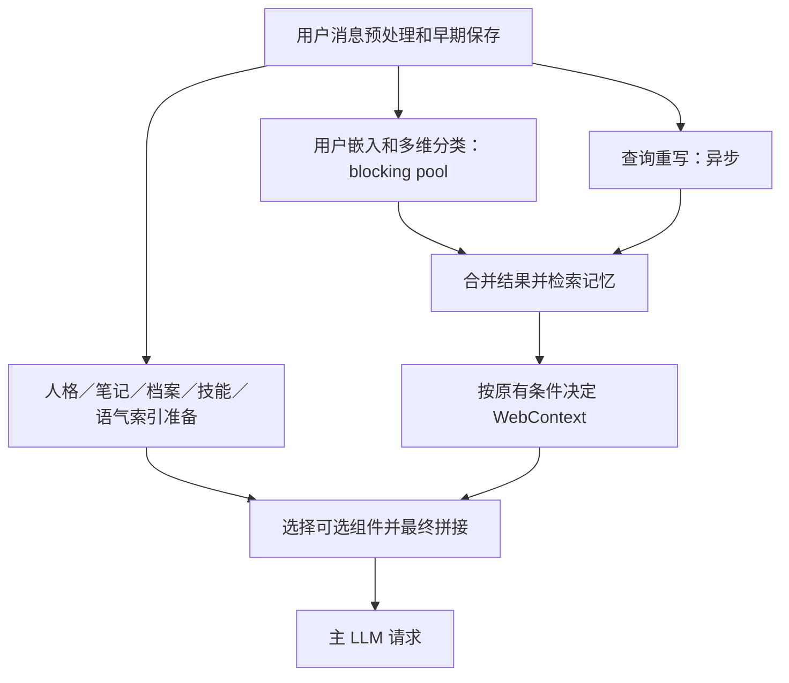

# 语义分类与动态提示词组装优化

日期：2026-09-30。保留工作区既有的情绪语料精简、模型提供者等修改，新增的是语义路由补充样本、共享查询向量、真实异步并行和提示词准备／选择两阶段。没有访问用户配置中的收费模型或嵌入端点。

## 新调用链

之前 `tokio::join!` 的语义分支直接执行同步 `analyzer.analyze`，其中可能包含同步远程嵌入调用。join 不会自动创建线程；一条分支不让出执行权时，同一异步线程无法继续轮询另一条分支。现在把整段分类移入 `spawn_blocking`，查询重写能够继续推进。

`PreparedPromptPipeline` 同时准备不依赖查询结果的候选内容：角色与关系阶段的人格渲染、示例、风格、长期笔记、用户事实档案、技能目录及语气场景索引。准备结果是本次调用内部的类型化快照，不放入全局缓存，也不随每个中间 PipelineState 重复序列化。它不会提前取走后台报告或推进 topic 计数。

最终阶段才读取当前分类、检索证据、用户模型、联网结果、认知状态和工具范围。文本工具列表与原生 FC 继续共用同一 ToolScope；尚未得到结果时不能提前发送最终 LLM 请求。提前读到的笔记和人格是本轮快照，期间发生的外部修改在下一轮重新读取。

## 一次查询向量，跨模块复用

FastSemanticAnalyzer 原先先调用情绪分类器的 `classify`，随后再次调用 provider.embed 分析其他维度。现在只生成一份用户查询向量，情绪、意图、话题、记忆重要度和关系信号共同使用；工具语义筛选继续复用它，语气场景匹配也新增复用入口。带发言者前缀的输入先还原当前发言，以免向量与匹配文本不一致。

情绪精确匹配／缓存仍保留，FastSemantic 的整结果 LRU 命中仍无需嵌入。共享向量检查维度与非有限值；跨角色来话和合成开场继续跳过用户分类。

这里减少的是重复的 provider.embed 入口。旧远程 provider 已有全局查询缓存，因此旧的两次 embed 不一定等于两次 HTTP，不能把这项改动宣传成远程网络调用必然减半。语料嵌入是预加载／首次初始化成本，不计入“每条消息一次查询向量”。

## 补充语料与组件选择

新增 `src-tauri/prompts/routing/semantic_seeds.tsv`，每行使用相同标签配套中／英／日样例，避免语言间遗漏。四个维度每语言的数量如下：

| 维度 | 原有 | 新增 | 合计 |
| --- | ---: | ---: | ---: |
| 意图 | 91 | 42 | 133 |
| 话题 | 97 | 32 | 129 |
| 记忆重要度 | 34 | 24 | 58 |
| 关系信号 | 40 | 40 | 80 |
| 合计 | 262 | 138 | 400 |

重点覆盖解释与实际执行的区别、技术与性能问题、明确求助、否定、引用、临时状态与长期偏好的区别。关系信号增加 16 条 `none` 反例；其余四类各有 16 条，普通消息不必总在亲近／索求关注／感谢／冷淡之间选一个。其他维度类别数最多相差 1 条。保留原有各语言 336 条情绪样本，没有恢复先前删掉的大量重复情绪语料。

语料列表和嵌入初始化使用同一个合并入口。磁盘向量缓存指纹来自实际语料文本，扩充后会自动重建相应缓存；后续再次启动可复用缓存。以 1024 维 float32 为例，选定语言的路由语料向量理论体积约增加 0.54 MiB／分析器，不包括情绪向量、分配器和其他缓存；初始化嵌入与逐轮比较也会增加相应工作量。扩充语料有成本，不能同时声称这项本身减少内存。

组件选择沿用现有 0.4 路由阈值，它是启发式评分而非校准过的概率：

- 明确任务、解释或工具请求不注入闲聊网络语境和随机回忆。
- 高置信度的难过、焦虑、生气、失落、挫败或疲惫，不插入这些闲聊附加内容。
- 随机回忆只在闲聊／分享且有记忆相关信号时作为候选，不用于抱怨场景。
- 高置信度 `none` 不注入可选关系日志，基础人格与关系上下文保留。
- 有分类但置信度低时，不新增闲聊表演线索；保留关系连续性和核心资料。分类缺失时保留既有短消息网络语境备用行为，但关闭随机回忆。

计划写入 `metadata.semantic_prompt_selection`，方便查看实际选择；不是根据短消息长度就认定用户一定在闲聊。

另修复 `merge_parallel_result` 未合入 epistemic_assessment／schedule_assessment 的问题。原先语义分支算出了这些值，合并后却丢失，导致知识需求与日程段落缺失。修复后它们会按既有 WebContext 和日程规则参与决策，可能恢复此前漏掉的联网／日程处理条件；没有新增一套自动执行规则。

## 测量与验证

本地计数 provider 验证：预加载完成后，一条未缓存消息的五维分析仅调用一次 query embed；重复消息命中分析缓存，新增调用为 0。语气场景提供共享向量后 query embed 为 0，旧备用入口仍能独立生成向量。

当前线程 Tokio 回归用受控阻塞 provider 验证两个条件：语义嵌入等待期间，兄弟分支可以继续运行并释放它；语气索引准备等待期间，检索／分类分支可以继续运行。最终 prompt 使用新检索材料和新语义 guidance，而不是准备阶段的空值；知识与日程评估经过并行合并后保留。

调度微基准在预加载后进行 7 轮交替测量，query 输入各不相同以避开结果缓存。嵌入用本地 80ms 延迟模拟，兄弟异步工作在嵌入开始后执行 80ms。阻塞版中位 177.22ms，offloaded 版 86.04ms。两版共享相同向量复用机制，因此该比较主要隔离异步线程阻塞，不把两个优化叠加计算。没有网络请求；不能用此结果估算真实服务延迟、整机 CPU 百分比或完整聊天提速比例。

基准入口：`cargo test --lib --offline benchmark_blocking_vs_offloaded_semantic_work -- --ignored --nocapture`。常规测试默认跳过这个人为延迟实验。

`prompt_preparation` 与语义／检索链存在时间重叠，`context_and_prompt` 是容器的总墙钟时间；不能把父容器和所有子步骤耗时相加。最终组装另有 `prompt_building` 时长，供实际配置下复测首字延迟。

结构与调度测试不能证明扩充后真实语义准确率提高。默认 hashing 只有词面／字符特征，不具备远程语义模型的同义理解能力。应在实际启用的 embedding 模型上用未进入语料的句子验证意图混淆、关系误触发、弃权率和组件选择，尤其覆盖“只是忙／不要调侃／引用别人的感谢／解释但不执行”；据此再调整阈值，不自动把用户消息写进训练语料。

最终检查：`cargo test --lib --offline --no-run` 和 `cargo check --lib --offline` 均通过。情绪、语义、并行调度、提示词选择、语气、主动行为、消息上下文与生成相关的 99 项常规回归全部通过；延迟微基准默认忽略，显式运行也通过。`git diff --check` 通过。编译仍报告已有的未使用代码警告。

同时修正两项与现有语料不一致的旧情绪测试：精确匹配样例改用语料内文本，目标归属测试改为验证语料的显式标注，移除只供测试使用的代词猜测函数。这没有改变运行时的目标归属策略。本轮未调用实际配置的远程模型，也未测量应用整机 CPU／RSS。
